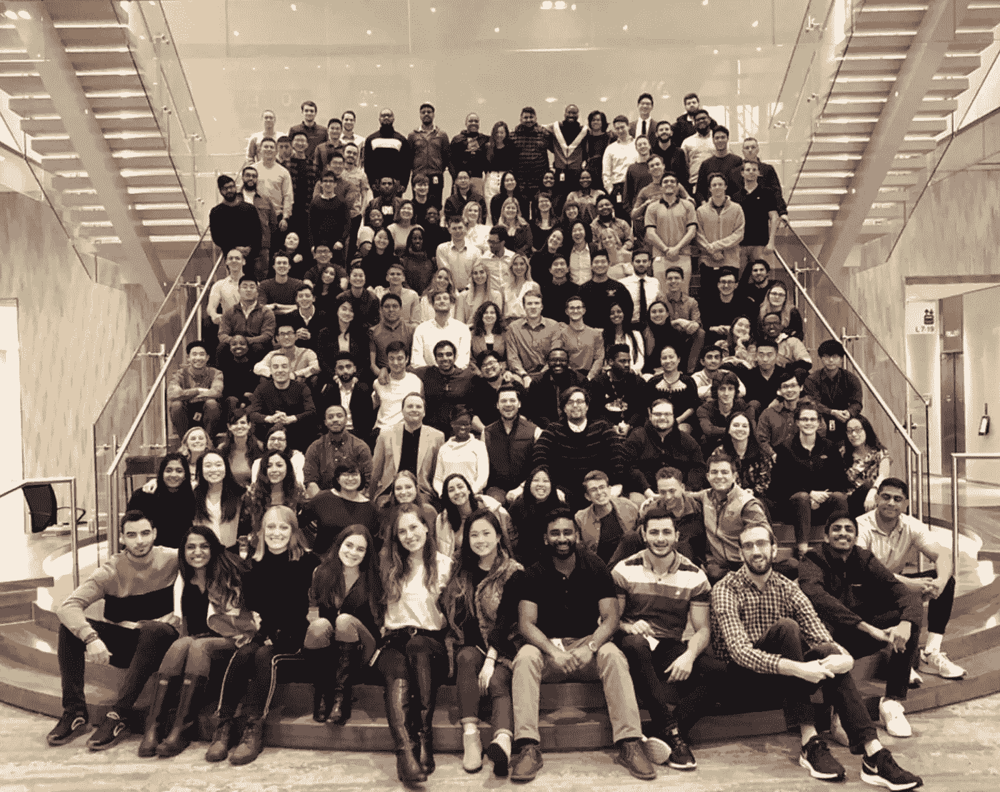

# 所以你想成为一名技术人员？

> 原文：<https://medium.com/capital-one-tech/so-you-want-to-be-a-techie-2a05df05ef57?source=collection_archive---------0----------------------->

## 没学过计算机专业？你还是可以闯进软件开发的！

***根据玛丽莎·马奇利斯和卡西迪·马希尔在 2021 年格蕾丝·赫柏庆典上的讲话改编。***

*希望自己能进入科技行业，但觉得自己的艺术史或环境研究学位可能会让你止步不前？你知道吗，作为一名软件开发人员，你可以利用你在人文学科或 STEM 领域的技能！没错，你独特的教育背景使你能够以不同的方式思考，并且通过正确的培训，将帮助你在你的技术职业生涯中推动新的解决方案。*

当你看到一份针对软件开发人员的工作描述，他们拥有计算机科学学士学位(或同等学历)，3 年以上的 5 种不同编码语言的经验，拥有 SDLC、敏捷、AWS 和微服务的经验，你会感到畏惧吗？现在，你是一名哲学或生物学专业的学生，想知道如果你选择编码会怎么样。

作为人文学科的毕业生，在科技领域开始自己的职业生涯，我们肯定有这种感觉！我们想让你知道，无论你拥有什么学位，开始你的科技职业生涯都不会太晚。您在其他领域的独特教育和经验可以为技术带来宝贵的多元化思维，并为您的职业生涯成功奠定基础。以下是方法。

# 拥有非传统教育背景的人开始接触科技

如果你是一个有着非传统教育背景的求职者，想要在科技领域起步，那你来对地方了。我们是你们的向导，卡西迪和玛丽莎，我们都是文科专业的学生，通过[首都一号开发者学院(CODA)](https://campus.capitalone.com/coda-program/) 开始了我们的科技职业生涯。

像 CODA 这样的软件培训项目或训练营是开始你科技之旅的好地方。这篇博客关注的是这些培训项目和学徒如何打破技术领域的门槛，培养出高素质的软件开发人员。我们将专注于工作和职业道路所需的总体技能:[分析技能、沟通技能、创造力、注重细节、人际交往技能和解决问题的技能](https://www.bls.gov/ooh/computer-and-information-technology/software-developers.htm#tab-4)。我们也将通过强调不同专业的人如何在这些领域贡献他们的专业知识来分解这些重要的技能。

> 如果你有 1000 名想法相同的工程师，而一名工程师想法不同，那么这位工程师就非常有价值，因为他们会带来不同的东西和独特的视角。虽然我可能没有最深厚的技术背景，但我带来的不同思维方式可能更有价值。——马修·卡皮诺斯——软件开发高级助理，生物系统工程专业，CODA 校友

# 技术世界需要你的技能

即使你没有在大学里学习计算机科学，作为一名软件开发人员，你不仅可以成功，还可以成为 T2。如果你认为自己是“科技新手”或“好奇”或“渴望学习”,知道你已经在正确的轨道上了。与任何新技能或职业道路一样，都有一个学习曲线，但你不是从零开始。作为一名软件开发人员，你拥有独特的技能、经验和视角，可以应用于你将面临的许多情况。

这里有一些软件开发和非计算机科学专业的学生需要的技能的例子。

## 分析技能

*数学专业*在完成习题集和写证明的同时磨练自己的分析能力。他们观察模式，运用逻辑技巧解决问题。

经济学专业的学生在数据集中寻找意义，进行研究，并根据数据模型分析他们的发现，以预测未来的结果。

## 通讯技能

*商科专业*通过案例比赛建立陈述技巧，在制作报告的同时学习简洁而信息量大的写作。

英语专业的学生学习很强的写作技能，这对于需要制作文档以及解析密集文字的软件开发人员来说很重要。

## 创造力

*建筑学专业*学习设计、艺术、几何思维。他们有很强的跨学科的重点，可以把不同的形状结合在一起，形成有凝聚力的结构设计。

*音乐专业*学习表演、即兴创作、作曲。即兴创作是创造性思维和反应之间的交汇点——音乐家必须非常有创造力，并且与他们的音乐合拍，以至于看起来他们甚至不像在思考。

## 注重细节

*历史专业*研究历史文本和文物，分析文献得出结论并建立来源之间的联系，密切关注历史细节可能如何影响我们的现在和未来。

艺术专业的学生培养对细节的敏锐眼光，磨练他们的空间感和定位感。他们用精细的细节创造艺术，也分析其他人的作品。他们还学习色彩理论、排版和其他对 UI/UX 特别有用的技能。

## 人际关系技巧

*教育专业*有很强的表达能力，学会与他人相处，并有以直截了当的方式解释复杂信息的经验。

*信息系统专业*通过在团队项目中解决问题来培养人际交往技能，并培养向非技术观众传达技术概念和发现的能力。

## 解决问题的技巧

*哲学专业*通过辩论哲学理论，从多个方面看待论点，以及学习形式逻辑来发展强大的逻辑技能。

工程专业的学生通过团队项目开发解决问题的能力，在团队项目中，他们开发新产品，并通过将复杂的问题分解成小部分来解决。

> *我在目前的职位上做了很多前端开发工作，和我们团队的 UI/UX 设计师一起工作很有趣，因为很多 UI/UX 概念都是基于心理学理论的。作为一名心理学专业的学生，我能理解某些设计决策的原因，并且在讨论中乐于发表自己的意见。——邓文迪——软件开发助理，心理学专业，CODA 校友*

如果这些技能引起了你的共鸣，要知道作为一名软件开发人员，这里有你的一席之地！

主修人文、科学和其他领域的人可以将这些技能和其他技能应用到软件开发中，以独特的方式解决工程问题。毕竟，像《哈佛商业评论》这样的出版物强调能够提出正确的问题来解决现实世界技术问题的重要性。

学习人文和科学教育学生在探索他们的研究领域时提出发人深省和创造性的问题。富有洞察力的问题具有尚未开发的潜力，可以改变我们做生意和设计技术产品的方式——例如，来自文科背景的人可能会问关于我们创建的算法背后的道德问题，或者可能会更关心通过关注可访问性使产品更适用于来自各种背景的人。

> 孩提时代和成年后，我都想成为一名宇航员。因此，我追求航空航天工程来实现这个梦想，并被招募到一个在航空航天行业开发软件的团队中。那段时间，我学会了热爱软件工程。如果那条路没有向我敞开，我无法想象我会错过什么。最好的技术专家——不管他们的教育背景如何——都是那些热爱学习的人，因为技术日新月异。很自然的，那些有心态、渴望和基本技能的人可以学习构建和运行好的软件所需的新技能，或者他们下定决心要做的任何事情。-梅勒妮·弗兰克，最有价值球员，技术

软件开发也非常强调[学会学习](/capital-one-tech/secret-to-succeeding-as-a-software-engineer-a0ac0cd6cd18)。由于技术发展如此之快，技术领域的人也必须快速适应。即使有经验的程序员也经常使用不熟悉的编码语言或库。只要你有学习的动力和资质，通过适当的培训，你可以成为一名优秀的软件开发人员。

当你学会阅读学术论文、进行研究、完善你在人文和科学领域的学习方法时，你也在培养有助于你学习编程语言和框架的技能。

# 软件培训项目如何帮助你进入技术领域

你有正确的心态。现在你所需要的是技术技能、工具和专业网络，从“对技术感兴趣”变成“准备贡献”对于不是计算机科学专业的应届大学毕业生来说，像 Capital One 的 CODA 这样的程序可以帮助你提高技能。对于其他人来说，训练营、在线培训和认证可以在你的道路上帮助你。

我们自己经历了一个培训项目，我们认为可以从专门针对非技术专业的教学项目中学到很多东西。由于分别主修法语和统计学，我们在进入软件培训项目时都有点紧张。但我们知道，如果我们坚持下去，我们可以成长，发展我们的技能，进入一个新的职业生涯。

## 什么是软件培训计划？

软件培训计划(您可能听说过称为编码训练营或开发学院)通常是一个为期 3-6 个月的强化计划，在该计划中，学生将接受各种技能的技术培训。

涵盖的技能从全栈 web 开发(构建用户界面以及后端 API 和数据库)到网络安全或数据管道。另一个值得注意的趣闻是——这些培训项目通常比计算机科学等专业的本科学位便宜得多，教给你实用的技能，对于那些可能没有上过四年制大学、正在寻找中年职业转换或只想学习建立自己的网站的人来说，是一个很好的选择。

## 我们在首都一号开发者学院的经历

*Our CODA graduation in February 2020*

软件培训项目只有有限的时间来教你很多东西！一种方法是对你职业生涯中可能用到的技术和程序做一个实际的概述。例如，在 Capital One 的项目中——[称为 Capital One 开发者学院或 CODA](https://campus.capitalone.com/coda-program/)——课程分为前端、后端和全栈开发单元。

CODA 项目为期六个月，学生们在以下几个方面打下了坚实的基础:

*   超文本标记语言
*   半铸钢ˌ钢性铸铁(Cast Semi-Steel)
*   前端 web 框架(例如 Angular、Vue、React)
*   Java Script 语言
*   SQL 数据库

除了特定的技术，你还会在团队合作、演示和沟通技巧以及项目管理方面获得发展机会。

当你在项目中工作时，你会应用你将在真实世界的技术团队中使用的相同的项目管理方法。例如，CODA 教你敏捷项目管理。你学习在“冲刺”中工作，这通常是两周的时间，并将工作分成更小、更明确的部分，称为“故事”——就像在现实世界的软件开发中一样。敏捷工作流的所有方面都包括在内——有人扮演产品所有者的角色，有人承担 scrum master 的职责。除了简单地编写代码之外，实践这些工作流和软件开发角色的各个方面会使向劳动力市场的过渡更加顺利，并减少您在熟悉新角色时可能会感到的一些初始压力。

在 CODA 计划结束时，参与者过渡到 [Capital One 的技术开发计划(TDP)](https://campus.capitalone.com/technology-program) ，这是一个为期两年的轮换计划，在该计划中，您将作为一名成熟的软件开发人员在 Capital One 的技术团队中工作。由于 TDP 是一个轮换计划，在计划结束时，您将在两个不同的技术团队中工作，并经历不同的方法、技术和特定于每个团队和角色的业务问题。这让你有机会探索多种兴趣，并找到适合你的技能和激情的软件开发角色。

但是你还能从软件培训项目中获得什么价值呢？

## 软件培训计划如何帮助支持系统和网络

当转换到任何新的角色时，有值得信赖的导师和同事是很重要的，你可以向他们求助。在整个 CODA 项目中有大量的导师，因为每个人都有一个伙伴和一个教练。

“伙伴”是该项目的毕业生，熟悉所教授的技术，可以帮助减轻你在完成该项目后进入技术队伍的任何担忧。“教练”是更有经验的第一资本合伙人，可以提供职业建议和观点。除了这些导师之外，还有一个强大而多样化的同伴团体与你一起体验这个项目。他们可以在你情绪低落的时候提供技术帮助，或者只是让你开心一笑。

你也可以在亲密团体中找到支持，这些团体通常基于性别、宗教背景或种族背景等共性。这些可能是雇主特定的，但也可能跨越整个行业。这些群体分享或支持你的部分身份，对你在工作和职业中感到舒适至关重要，并帮助你应对可能遇到的任何挑战。

我(卡西迪)个人在 Capital One 的女性科技(WIT)领域获得了很多支持，包括我所在的小公司以及整个公司。事实上，我最近通过我们的 WIT 小组找到了一个机会，与 400 多名对毕业后从事技术工作感兴趣的女大学生进行了交谈。作为一名大学生，我会喜欢这个活动的！我很自豪能够与填补我最近空缺的人分享我的科技成功故事，这都要归功于 Capital One 的女性科技亲和小组。

许多其他软件培训项目通过将您与同行以及公司中更资深、更有经验的成员配对来提供这些重要的关系和网络机会。你的导师可以提供一些技巧和窍门，帮助你安顿下来，获得成功，并朝着你的职业目标努力。在科技行业起步时所有重要的事情！

## 软件培训项目如何帮助对抗骗子综合症

你可能很熟悉这种感觉，你不属于你的新职位。重要的是要知道你周围的大多数人也有同样的感觉。研究表明，70%的人在一生中的某个时候都经历过冒名顶替综合症。

> *我认为来自一个没有计算机科学背景的人让我觉得我需要更加努力才能配得上一个有计算机科学背景的人。-Sara Tan-软件开发助理，经济学专业，CODA 校友*

就个人而言，我们必须时刻提醒自己，不仅仅是我们有这种感觉——大多数完全有资格做好本职工作的人，都会对自己所处的角色感到某种不适或不安。但是当你不是来自计算机科学背景时，你会特别容易觉得自己不属于软件开发。我们将讨论拥有像你这样思想丰富、经验丰富的人对于团队充分发挥潜力有多重要。

## 软件培训计划如何帮助支持多样性、归属感和包容性

> *多样化的团队是更强的团队。他们制造更好的产品，更好地为客户服务。然而，尽管有所改善，科技行业并不多样化。在 Capital One，我们不仅热衷于继续确保我们的文化是每个人都有归属感的文化，还致力于帮助改变更广泛的行业。我坚信，如果我们想要一个不同的结果，我们必须真正开始挑战我们过去的做事方式，这包括支持进入技术领域的替代职业道路。-梅勒妮·弗兰克，最有价值球员，技术*

从广泛的专业招聘人才可以促进工作场所的多样性，提升不同的观点，以及来自性别、社会经济地位和种族方面代表性不足的群体的声音。

我们的 CODA 队列中大约有 50%是女性，这在大多数公司的技术领域并不常见，因为只有 20%的软件开发毕业生是女性。此外，CODA 不仅仅是一个为期六个月的带薪训练营，它也是一份全职的软件开发工作。因为它是付费的，所以无论社会经济地位如何，它对刚毕业的大学生都适用，并且不需要承担额外的学生债务。

倡导员工的多元化鼓励创新，这将使公司的产品和计划更加全面，适合更多的受众。雇佣那些观点不同的人[降低了集体思维扼杀创造力和观点的风险](https://www.psychologytoday.com/us/basics/groupthink)。我们在 CODA 项目的整个过程中都看到了这一点。我们的同龄人之间的讨论总是很活跃，由于我们不同的背景，有许多不同的方法来解决每个问题。每个人的意见都得到了支持和重视，使整个团队更加强大，并促使我们每个人以新的方式处理问题。

[德勤(Deloitte)2013 年的一项研究](https://www2.deloitte.com/content/dam/Deloitte/au/Documents/human-capital/deloitte-au-hc-diversity-inclusion-soup-0513.pdf)证明了这一点，他们发现，当员工感到多元化和包容性在工作场所受到重视时，他们会报告敬业度提高，企业内部的创新增加了 83%。

# 像一些科技领域的顶级领导者一样

许多最有影响力的科技领袖在大学里都学习过文科，并通过自己的努力达到了顶峰。你可能是下一个！

几个例子:

*   斯图尔特·巴特菲尔德(Slack 的联合创始人):哲学
*   帕克·哈里斯(Salesforce 联合创始人):英语
*   苏珊·沃西基(YouTube 首席执行官):历史和文学
*   马云(阿里巴巴联合创始人):英语教育

帮助将非计算机科学专业的学生培养成顶尖程序员的项目可以帮助引领下一代伟大的科技领袖。这从 CODA 和其他编码训练营这样的项目开始，这些项目让学生们能够踏入原本对他们关闭的大门。改变可以从底层开始，像我们这样的人通过不同的问题解决方案、增加的多样性和对技术工作场所的新观点，对技术部门产生微小的影响。

消除进入壁垒将使更多的人能够进入科技行业，尤其是那些可能对科技行业产生巨大影响的人。

# 关于我们

经历了一个技术培训项目后，卡西迪和玛丽莎热衷于将这个机会带给其他人。

## 玛丽莎·马奇利斯

*软件工程师*

玛丽莎在圣路易斯华盛顿大学获得了法国文学学士学位。她第一次接触编程世界是在大学期间，当时她选修了一门逻辑课程，这促使她辅修了计算机科学。毕业后，她把目光放在了追求软件开发作为职业上，并想方设法获得成功。2019 年，她通过他们的 Capital One 开发者学院(CODA)计划加入了 Capital One，该计划针对非计算机科学专业的学生，旨在培养他们成为全栈开发者。Marisa 目前是 Capital One 卡技术部门(语音部门)的全栈开发人员。

## 卡西迪·马希尔

*软件工程师*

卡西迪在阿姆赫斯特学院获得统计学学士学位。当她通过为统计分析而构建的软件有限地接触到编码时，她对软件开发产生了兴趣。2019 年，她加入了首都一号开发者学院，这让她有机会通过更非传统的路线成为一名软件开发者。作为 Capital One 消费技术部门的一名开发人员，卡西迪目前每天都在编写令人惊叹的代码。

*披露声明:2021 首创一号。观点是作者个人的观点。除非本帖中另有说明，否则 Capital One 不隶属于所提及的任何公司，也不被这些公司认可。使用或展示的所有商标和其他知识产权是其各自所有者的财产。*

*原载于*[*https://www.capitalone.com*](https://www.capitalone.com/tech/culture/so-you-want-to-be-a-techie/)*。*