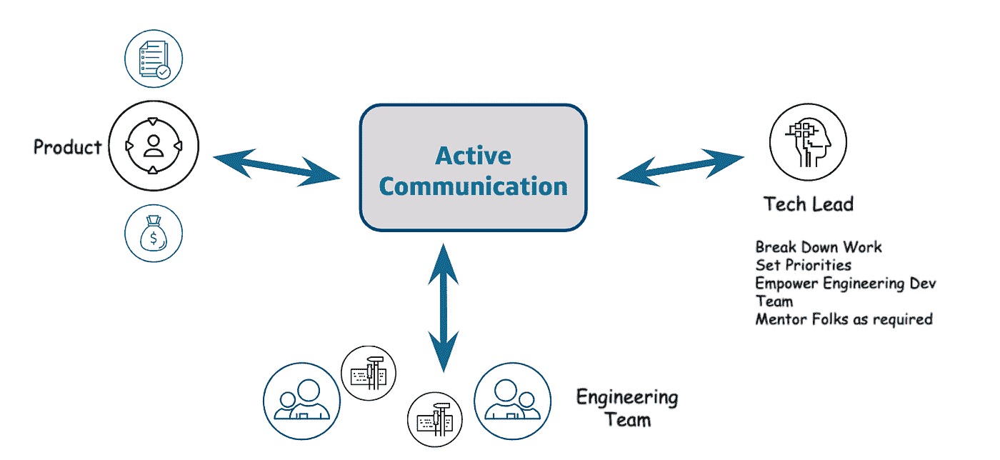

# 那么，你是一名开发人员，你的职业生涯下一步将走向何方？

> 原文：<https://medium.com/capital-one-tech/so-youre-a-developer-where-does-your-career-go-next-47c05114447b?source=collection_archive---------0----------------------->

## 一个选择是成为技术领导者

> *成为 Tech Lead 的第一步很简单:字母* ***I*** *需要换成单词* ***WE*** *。*

# 首先，什么是技术领先？

作为一名开发人员，我总是喜欢与我的业务和领导一起定义路线图。这一点，再加上扮演其他工程师导师角色的激情，促使我最终接受了技术领导的角色。现在，我参加系统设计会议，为团队工作和谈判，同时指导和辅导其他工程师，让这个角色真正令人满意。

一个技术领导者应该能够将一个大项目分解成几个部分。在这之后，一个领导和一个开发团队一起工作来完成这些小块。这是一个可以独立工作的开发人员和一个需要一直与团队合作的领导之间的关键区别。除了编写和评审高质量的代码，领导者必须学会理解他们的团队，解决冲突，并有效地处理大量的任务。

# 你应该做人事经理还是技术主管？

要理解这个答案，你需要诚实地面对你所热爱的事情。

是培养/指导团队的其他成员吗？it 部门是否正在与业务领导一起定义路线图，并就可以完成的工作进行协商？或者你宁愿花时间参与领导系统设计，并与团队密切合作开发关键的软件。

我个人开始是一名开发人员，但慢慢地意识到，除了软件开发，我真的很热衷于指导和培养员工，以及与利益相关者合作定义长期路线图。所以我决定扮演技术领导和人事经理的双重角色。在我的角色中，我与团队一起解决复杂的工程问题，并积极参与系统设计，同时指导和培养未来的领导者。这就是双重角色对我来说非常特别的原因。

那么，你如何判断这种角色是否适合你呢？

# 一个好的技术领导者有什么被证明的特质吗？(你有吗？)

> *不要在获得更多所有权之前等待指示或指导*

*   掌控能力:一个好的技术领导者必须对他们所承诺的一切负责；一个好的领导从不责怪别人。尝试找出潜在的问题，并在团队的帮助下解决它们。在危急情况下负责任并主动承担责任，为其他团队成员树立了一个向你看齐的好榜样。
*   **擅长指导**:作为一名技术主管，理解团队中不是每个人都能以同样的速度出类拔萃是非常重要的。根据具体情况为团队中的每个人设定正确的期望。导师工程师积极寻求反馈，以了解如何更好地履行当前职责，他们永远不应该拒绝反馈。如果需要引入不同的观点，也要在团队之外寻找导师。
*   **长期思考:**作为一名开发人员，最初很难思考过去两三个月的计划工作。举个例子，技术领导的主要职责之一是与利益相关者一起定义路线图，并确保团队有一个工作流程。这是一个关键的属性，它要求对项目管理有一个基本的理解，并允许工程师团队专注于可实现的成功。

# 做好准备，提前计划

> *永远不会有一个完美的时机来实现这一飞跃；你只需要挑一天开始行动。*

一旦你决定追求一个领导角色，就要做好准备，和你的经理谈谈，并采取一些小步骤:

*   在你的团队之外找出一位经历过这一过程的导师，以学习并获得建设性的反馈。
*   确定一个复杂的项目，并要求参与这样的任务。承担更多的设计和领导其他工程师的责任。

像这样的小步骤会让你感觉到转变是什么样子的。

一旦你正式进入领导角色，它也将为你的成功做好准备。当我进行转型时，我首先承担了一个延伸的角色，领导一个工程师团队设计并交付一个关键的复杂项目。在经历了几个月团队发展的起起落落后，我意识到我对成为一名人事经理也有着极大的热情。

# 在开始技术领先之旅之前，您应该知道的事情

第一次接手这个角色时，要预料到挑战和干扰。

我个人不得不根据团队的需求重新安排我的一天，并相应地为清单上的其他项目留出剩余时间。有了更好的时间管理和工具，我最终能够找到正确的平衡。

*   **能够克服干扰** 作为一名技术主管，你会不断被团队提出的多个问题打断。组织好你的一天，让你团队的需求成为你的第一要务。在参加任何会议之前，花 15 分钟计划你的一天。

几年来，我一直试图将两分钟规则融入其中。

> 2 分钟规则:第一部分——如果花的时间少于两分钟，那么现在就做

*   更少的实际开发和更多的高级设计对话
    您将有更少的时间进行实际开发，而有更多的时间与架构师进行高级系统设计讨论。这将确保你对你所领导的系统有一个高度的了解。
*   **成为你团队的积极倾听者** 作为领导者，鼓励你的团队成员采取开放政策，并成为一名积极倾听者，了解你团队的需求以及你可以如何帮助他们。整合团队成员对团队运作方式的反馈是作为领导者取得成功的关键。
*   **准备好授权给团队:授权是关键** 在领导角色中，你一天中会有多个请求。不感到不知所措的关键是将任务委派给团队成员，并授权他们完成手头的任务。

# 结论

成功的一个关键是不断学习，并期待艰难和不可预测的情况。一个让你不会感到不知所措的个人建议是理解以下内容:

> *领导力是关于人的，帮助他们成长。领导力不仅仅是指导或简化工作，而是创造更多的领导者。*

*以上观点为作者个人观点。除非本帖中另有说明，否则 Capital One 不隶属于所提及的任何公司，也不被其认可。使用或展示的所有商标和其他知识产权都是其各自所有者的所有权。本文为 2019 首都一。*