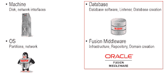
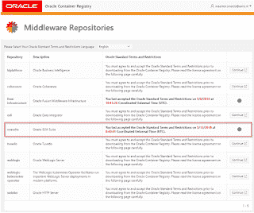
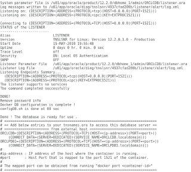
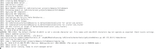
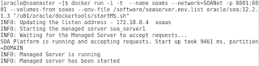
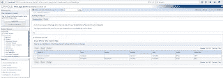
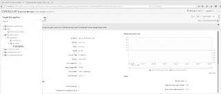

# Docker 容器中的 SOA 套件 12c。只有几个命令，没有安装程序，没有第三方脚本

> 原文：<https://medium.com/oracledevs/soa-suite-12c-in-docker-containers-b12263e36824?source=collection_archive---------0----------------------->

对于开发人员来说，安装一个成熟的本地 SOA 套件环境从来都不是他们的最爱(除了极少数人)。这很费时间，需要你一个接一个地下载并运行不同的安装程序。如果您想从头开始，但尚未在虚拟机中完成安装并创建快照，您可以从头开始。有一种简单的新方法可以启动并运行 SOA 套件环境，只需几个命令就可以不用下载任何安装程序，也不需要依赖除 Oracle 之外的任何一方提供的脚本。最终的环境是一个 Oracle 企业版数据库、一个管理服务器和一个受管服务器。它们都运行在单独的 Docker 容器中，其端口暴露给主机。这 3 个容器可以在一个 8Gb 虚拟机中一起运行。Oracle 在其容器注册表中为 SOA 套件映像提供的文档应该用作基础，但是由于如果您遵循它会遇到一些错误，您可以使用这篇博客文章来帮助您快速解决它们。



# 简短的历史

## 快速入门和不同的安装程序

在 11g 时代，如果开发人员想要运行本地环境，他需要安装数据库(通常是 XE)、WebLogic Server、SOA 基础设施、运行存储库创建实用程序(RCU)以及一个或多个 SOA、BPM、OSB。在 12c 中，引入了 SOA 套件快速入门。QuickStart 使用 Apache Derby 数据库而不是 Oracle 数据库，并且缺少 ESS、split Admin Server / Managed Server、NodeManager 等功能，这使得该环境无法与客户环境相提并论。如果您想安装一个独立版本，您仍然需要完成所有的手动步骤或者自己自动完成它们(使用安装程序的响应文件和域创建的 WLST 文件)。作为一种替代方案，在这段时间里，甲骨文非常友好地提供了预装了所有东西的 VirtualBox 映像([像这个](http://www.oracle.com/technetwork/middleware/soasuite/learnmore/soa-vm-2870913.html)或[这个](http://www.oracle.com/technetwork/middleware/soasuite/learnmore/prebuiltvm-soasuite122110-3070567.html))。对于更复杂的设置，Edwin Biemond / Lucas Jellema 提供了[流浪者文件和博客帖子](https://technology.amis.nl/2014/07/31/rapid-creation-of-virtual-machines-for-soa-suite-12-1-3-server-run-time-environment-leveraging-vagrant-puppet-and-biemond/)来快速创建一个 12c 环境。

在 Docker 容器中运行 SOA 套件的一个好处是软件被隔离在容器中。您可以快速删除和重新创建域。此外，一般来说，Docker 与 VMWare、VirtualBox 或 Oracle VM 相比资源效率更高，并且容器可以轻松地运送到其他环境/机器。

**Dockerfiles**

Docker 已经变得非常流行，并且已经有了一些在 Docker 容器中运行 SOA 套件的尝试。起初，这些工作是由创建自己的 docker 文件并使用安装程序和响应文件来创建映像的人来完成的。后来 Oracle 提供了他们自己的 Later 文件，但是您仍然需要来自 edelivery.oracle.com 的安装程序并首先构建映像。甲骨文官方提供的 Docker 文件可以在 GitHub [这里](https://github.com/oracle/docker-images)找到。

**集装箱登记处**

甲骨文最近(2017 年初)推出了其[容器注册表](https://container-registry.oracle.com/)。容器注册表是一个 Docker 注册表，它包含预构建的映像，因此只是 Docker 文件。Oracle 数据库出现，WebLogic 和 SOA 基础设施以及现在(2018 年 5 月)完整的 SOA 套件。



你如何使用这个？您将您的 OTN 帐户链接到[容器注册中心](https://container-registry.oracle.com/)。这只需要做一次。接下来，您可以接受您想要使用的图像的许可协议。容器注册表包含每个图像的有用描述，说明如何使用它以及可以配置什么。请记住，由于容器注册中心最近进行了重组，图像的名称已经更改，并且不是所有的手册都已经更新。这也是为什么您想要标记图像，以便您可以以一致的方式在本地访问它们。

# 下载并运行！

对于 SOA 套件，您需要接受企业版数据库和 SOA 套件的协议。你不需要 SOA 基础设施；它是 SOA 套件映像的一部分。

## 注册

```
docker login -u OTNusername -p OTNpassword container-registry.oracle.com
```

## 提取、标记、创建环境文件

提取图像可能需要一段时间…(在 Wifi 下可能需要几个小时)。用于拉取的命令与容器注册表中的图像文档中给出的示例略有不同，因为图像名称最近已经更改。为了一致的访问，标记它们。**数据库**

```
docker pull container-registry.oracle.com/database/enterprise:12.2.0.1docker tag container-registry.oracle.com/database/enterprise:12.2.0.1 oracle/database:12.2.0.1-ee
```

数据库需要一个配置文件。然而，从映像创建容器时执行的安装无法正确应用该文件中的设置。我已经更新了配置文件，以反映实际创建的内容:

```
db.env.list
ORACLE_SID=orclcdb
ORACLE_PDB=orclpdb1
ORACLE_PWD=Oradoc_db1
```

**SOA 套件**

```
docker pull container-registry.oracle.com/middleware/soasuite:12.2.1.3docker tag container-registry.oracle.com/middleware/soasuite:12.2.1.3 oracle/soa:12.2.1.3
```

管理服务器还需要一个配置文件:

```
adminserver.env.list
CONNECTION_STRING=soadb:1521/ORCLPDB1.localdomain
RCUPREFIX=SOA1
DB_PASSWORD=Oradoc_db1
DB_SCHEMA_PASSWORD=Welcome01
ADMIN_PASSWORD=Welcome01
MANAGED_SERVER=soa_server1
DOMAIN_TYPE=soa
```

如您所见，由于 RCU 前缀是可配置的，您可以对多个 SOA 架构使用同一个数据库。受控服务器还需要一个配置文件:

```
soaserver.env.list
MANAGED_SERVER=soa_server1
DOMAIN_TYPE=soa
ADMIN_HOST=soaas
ADMIN_PORT=7001 
```

确保管理服务器配置文件中提到的受管服务器与受管服务器配置文件中的受管服务器相匹配。管理服务器安装会为受控服务器创建 boot.properties。如果服务器名称不匹配，受控服务器将不会引导。

创建本地文件夹和网络

由于您可能不希望在删除容器并再次启动它时丢失域或数据库文件，因此您可以在主机上创建一个位置，在该位置将创建域，数据库可以存储其文件。对于以下命令，确保运行容器的用户拥有 userid/groupid 1000，以允许用户访问目录。以 root 用户身份运行以下命令。它们与手册略有不同，因为如果 SOAVolume/SOA 不存在，就会出现错误。

```
mkdir -p /scratch/DockerVolume/SOAVolume/SOA
chown 1000:1000 /scratch/DockerVolume/SOAVolume/
chmod -R 700 /scratch/DockerVolume/SOAVolume/ 
```

为数据库和 SOA 服务器创建网络:

```
docker network create -d bridge SOANet
```

# 奔跑

**启动数据库**

你首先需要数据库。您可以通过以下方式运行它:

```
#Start the database
docker run — name soadb — network=SOANet -p 1521:1521 -p 5500:5500 -v /scratch/DockerVolume/SOAVolume/DB:/opt/oracle/oradata — env-file /software/db.env.list oracle/database:12.2.0.1-ee
```

这将安装并启动数据库。上面描述的 db.env.list 在这种情况下应该在/software 中。



**SOA 套件**

在记录的示例中，表明您可以在单独的容器中运行管理服务器和受控服务器。你可以，他们会启动。但是，管理服务器无法管理受管服务器，并且 WebLogic 控制台/ EM 不显示受管服务器的状态。Docker 容器中的配置使用具有单一主机名的单个机器，并指示受管服务器和管理服务器都在那里运行。为了解决这个问题，我将建议两个简单的解决方法。

**港口转运。独立容器中的管理服务器和受控服务器**

您可以创建从管理服务器到受控服务器的端口转发。这允许 WebLogic Console / EM 和管理服务器访问端口 8001 上 Docker 容器中“localhost”处的受管服务器。

```
#This command starts an interactive shell which runs the Admin Server. Wait until it is up before continuing!
docker run -i -t — name soaas — network=SOANet -p 7001:7001 -v /scratch/DockerVolume/SOAVolume/SOA:/u01/oracle/user_projects — env-file /software/adminserver.env.list oracle/soa:12.2.1.3
```



```
#This command starts an interactive shell which runs the Managed Server.
docker run -i -t — name soams — network=SOANet -p 8001:8001 — volumes-from soaas — env-file /software/soaserver.env.list oracle/soa:12.2.1.3 “/u01/oracle/dockertools/startMS.sh”
```



#以下命令安装并运行 socat，进行从管理服务器端口 8001 到受控服务器端口 8001 的端口映射

```
docker exec -u root soaas yum -y install socat
docker exec -d -u root soaas “/usr/bin/socat” TCP4-LISTEN:8001,fork TCP4:soams:8001" 
```

容器非常有限。它不包含 ping、netstat、wget、ifconfig、iptables 和其他几种常用工具的可执行文件。socat 似乎是进行端口转发的一个简单的解决方案(比 iptables 或 SSH 隧道更简单),并且工作得很好。

**单一容器中的管理服务器和受控服务器**

另一种方法是在同一个容器中运行受控服务器和管理服务器。在这里，您用两个配置文件启动管理服务器，这样所有的环境变量都可用。一旦启动了管理服务器，就可以使用 docker exec 在单独的 shell 中启动受管服务器。

```
#Start Admin Server
docker run -i -t — name soaas — network=SOANet -p 7001:7001 -p 8001:8001 -v /scratch/DockerVolume/SOAVolume/SOA:/u01/oracle/user_projects — env-file /software/adminserver.env.list — env-file /software/soaserver.env.list oracle/soa:12.2.1.3

#Start Managed Server
docker exec -it soaas “/u01/oracle/dockertools/startMS.sh”
```

**启动节点管理器**

如果您愿意(但不是必须)，可以在两种设置中启动 NodeManager，如；

```
docker exec -d soaas "/u01/oracle/user_projects/domains/InfraDomain/bin/startNodeManager.sh"
```

节点管理器运行在端口 5658 上。

# 看起来怎么样？

一个正常运行的 SOA 环境。



*原载于 2018 年 6 月 1 日*[*【javaoraclesoa.blogspot.com】*](http://javaoraclesoa.blogspot.com/2018/05/soa-suite-12c-in-docker-containers-only.html)*。*