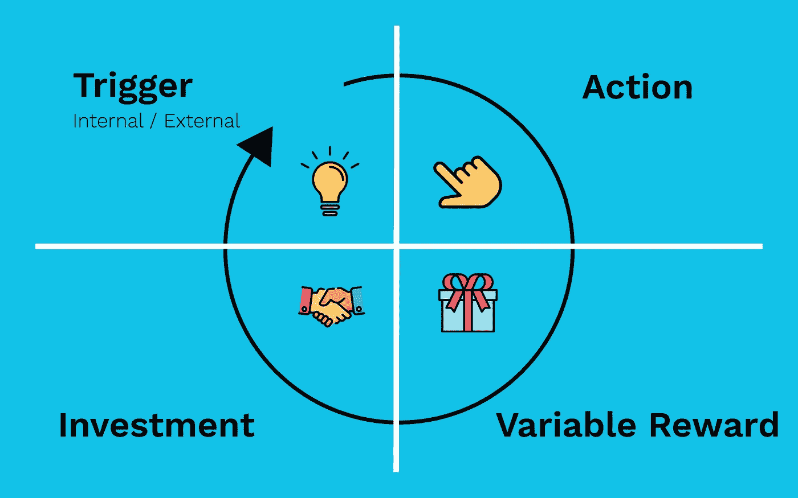
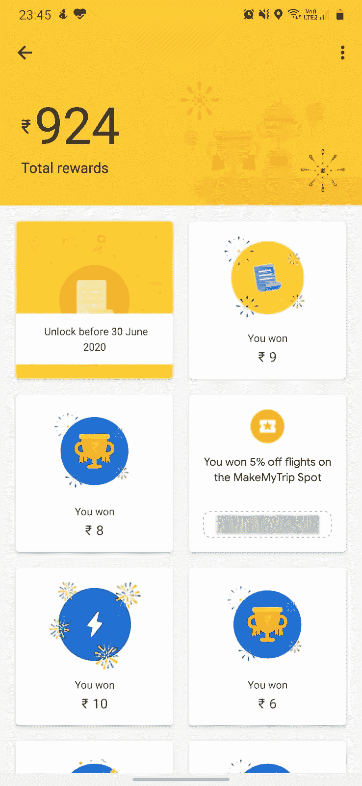

# 为什么社交媒体应用会让人上瘾？

> 原文：<https://medium.com/quick-code/social-media-apps-are-addictive-fa18cba0e68a?source=collection_archive---------1----------------------->

这就是为什么你被你的手机缠住了。

Photo by [Kerde Severin](https://www.pexels.com/@kseverin?utm_content=attributionCopyText&utm_medium=referral&utm_source=pexels) from [Pexels](https://www.pexels.com/photo/selective-focus-photography-of-person-using-iphone-x-1542252/?utm_content=attributionCopyText&utm_medium=referral&utm_source=pexels)

今天是星期三。你已经工作了几个小时了&时钟似乎已经停止转动了。你拿出手机，看一看。在 Reddit 或 Instagram 上呆几分钟应该会让事情活跃起来，对吧？不知不觉中，你已经花了将近 40 分钟浏览手机上的社交应用&你意识到是时候回去工作了。

或者，由于最近发生的事情&全球疫情局势，你在家工作&意识到没有人在看，所以你还是继续浏览。

这种情况发生过多少次了？你不是唯一的一个，几乎每个阅读这篇文章的人都经历过这种情况。

> 当你浏览社交媒体时，时间过得真快。✈️

值得注意的是，即使我们知道我们忘记了时间，但我们似乎并不介意这些应用和服务降低了我们的工作效率。

你可能还不知道，但你已经沉迷于手机和社交媒体。

你有没有想过脸书、Instagram、Twitter 或 Reddit 等公司是如何设法让你*被他们的应用*吸引&的？少数公司是如何影响你的想法的？我们使用这些应用程序是否有一定的模式？为什么有的 app 成功了，有的却失败了？

这就是 ***钩环*** 进入画面的地方。在***Hooked:How to Build habiting-Forming Products***， [Nir Eyal](https://www.nirandfar.com/) 中有完美的描述，这位美国作者讲述了心理学、技术&商业的交集。大约 24 个月前，我读了他的书，开始意识到社交媒体应用成功吸引我们注意力的不同方式。钩子循环完美地解释了为什么我们会被社交媒体钩住。

在开始之前，我们先了解一下什么是 ***习惯*** 。

> 习惯是我们潜意识里倾向于执行的一种日常行为。

一个习惯可能需要几天或几周才能形成，下面的视频就是一个很好的例子。这也进一步证明了习惯可以由任何人&任何事灌输给你。

Source: [The Office YouTube Channel](https://www.youtube.com/channel/UCw6sbdbTWFDnjC-9Vi4g1eg)

既然我们知道了什么是习惯&任何事情如何能够导致我们大脑中习惯的形成，让我们看看 Nir Eyal 描述的*。*

*挂钩周期由 4 部分组成:*

1.  *触发器*
2.  *行动*
3.  *可变奖励*
4.  *投资*

**

*The Hook Cycle*

*当一个人再次采取以上 4 个步骤时，一种习惯就形成了&再次没有潜意识的想法。*

*一旦你理解了钩子循环，你将能够识别和控制你的触发器，这将帮助你打破在社交媒体上无意识浏览的习惯。*

*让我们来详细看看每个步骤。*

## *触发器*

*触发器是一种推动，是你大脑中的一种机制，让你做一些事情。就像上面的视频一样，电脑的钟声成了可怜的德怀特的导火索。*

*触发器让你做事&它们有两种类型，内部的和外部的。*

***外部触发**更简单，比如一个应用程序的通知可能会说“*你的朋友刚刚发布了一张照片*或者“*有人给你发了一条消息*”。外部触发器被编程为使用应用程序的轻推将你带入应用程序。通知或电子邮件在用户使用应用程序的早期阶段最有效，它们让用户想要打开应用程序，看看发生了什么。*

*通过减少您订阅的通知数量，可以更轻松地应对外部触发因素。*

*另一方面，内部触发要险恶得多，也更难控制。它们针对你的情绪、心态，负责在应用程序和你的大脑之间建立令人上瘾的联系。*

*例如，当你感到孤独或无聊时，你可能会立即使用脸书或 Instagram 应用程序来让你感觉更好。内部触发器都是关于用户想要什么的。想想看，当你还是个孩子的时候，你可能沉迷于某种电子游戏。现在，每当你感到无聊的时候，你首先想到的是什么？*

> *如果我在玩那个电子游戏，我就不会无聊了。🤔*

***轰！这是你的内部触发器。游戏没有召唤你&试着把你带进来，你去游戏是为了化解你的无聊感。***

## *行动*

*这一切都是为了简单。当用户进入你的应用程序时，他们采取的行动有多简单？*

*动作越简单，用户就越有可能一次又一次地重复。*

*例如，考虑大多数社交媒体应用程序。操作就是打开应用程序&你会看到一个永无止境的卷轴，里面装满了你想看的东西。*

*打开一个应用程序这个最简单的动作肯定会给你带来迷因&你喜欢看的帖子。现在想象一下，如果你不得不在看到你想看的内容之前浏览几个标签，我可以肯定你不会很快使用那个应用或服务。*

## *可变奖励*

*奖励可能是也可能不是金钱利益，但它们对你的用户有巨大的价值。非金钱回报可能是一个让你的用户笑掉大牙的视频！这是真诚笑声的暂时回报，用户可能在接下来的几个滚动中得不到。*

*变量这个词在这里很重要。*

> *可变奖励是指每次你执行一项行动时，你可能会收到也可能不会收到的奖励。*

*可变奖励是你的用户继续使用你的应用的激励因素。想想 Google Pay 在印度的起步方式。他们首先向用户提供蓝色刮刮卡，交易金额超过₹150(2 美元)，这让你有机会在₹0-₹1000(约 13 美元)和₹500(7 美元)之间立即赢得橙色刮刮卡，这可以让你每周五获得一个巨大的₹100,000(约 1300 美元)。*

*很快，每个人都把钱转给他们的朋友和家人，期望得到一张刮刮卡并赢得一大笔钱。*

*根据 TechCrunch 8 个月前的一份报告, Google Pay 在印度积累了 6700 万月活跃用户，并在去年(2018-19 年)处理了价值 1100 亿美元的交易。*

*这是我的 Google Pay 奖励部分的截图。*

**

*You can see I haven’t had much luck over the last 3 years. ☹️*

*另一个有趣的可变奖励的例子是鸽子实验。*

*美国心理学家 B.F .斯金纳博士创造了一个小盒子，盒子里有一个小按钮，鸽子可以啄这个按钮，按钮下面还有一个开口，鸽子可以从这个开口得到食物。*

*在第一组实验中，每当鸽子啄食时，他就奖励鸽子。所以基本上每当鸽子饿了，它就会啄那个按钮，并定期得到食物奖励。*

*现在他决定做一个小小的调整。这一次，他根据奖励食物的数量和频率随机奖励鸽子。所以这次他把食物变得不一样，而不是常规的一啄和即时食物。所以鸽子的奖励不是立竿见影的，它在随机啄的间隔得到食物。*

*令他惊讶的是，他注意到一些不可思议的事情。与定期接受相同食物的鸽子不同，接受可变奖励的鸽子变得疯狂。*

*他们开始不由自主地不断啄按钮。他们沉迷于可变奖励，不停地按按钮！*

## *投资*

*你放入应用程序的小“作品”是你的投资。这项投资让你不会离开应用程序，因为你很可能会失去你在这里做的所有“工作”。*

*最简单的例子就是 Instagram。这些年来你做了很多工作，上传了你在海滩的完美照片，你的晚餐和你的生活时刻。你会全部删除，转而使用类似 Instagram 的其他应用吗？*

*公司利用这一点来创造一种社区感，这也导致了经济护城河。沃伦巴菲特倡导的经济护城河是公司相对于竞争对手的独特优势，有助于他们保持市场份额。你的 Instagram 档案拥有数千粉丝和数百条帖子，这是 Instagram 的经济护城河。它确保您不会转向竞争对手的应用程序。*

*当你完成了上面的 4 个步骤，你终于*被你似乎放不下的应用/服务&钩住了。**

**脸书、Instagram、Reddit、Twitter 等社交媒体应用都使用钩子循环让你每天无意识地使用它们的应用。它们通过转移你的注意力来帮助你逃避与老板会面时关于你在办公室大量使用电话的现实。**

**你看，这是一个恶性循环。**

**但是现在你已经理解了什么是钩子循环，以及公司如何利用你的情绪让你对他们的产品上瘾，你可以通过承认你已经上瘾并需要抽离的事实来反击。**

**作为一名软件开发人员，hook 周期给了我一个不同的视角来创建令人上瘾的应用和产品——以一种好的方式。**

**😃**