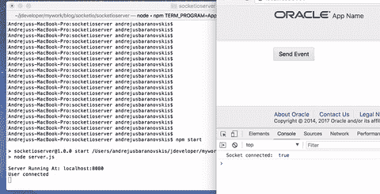
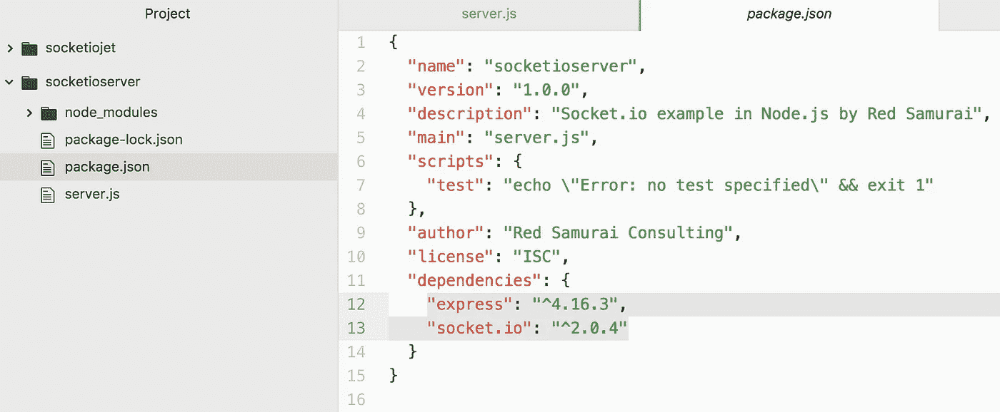
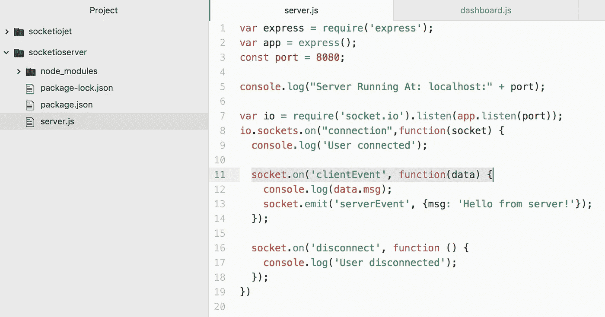
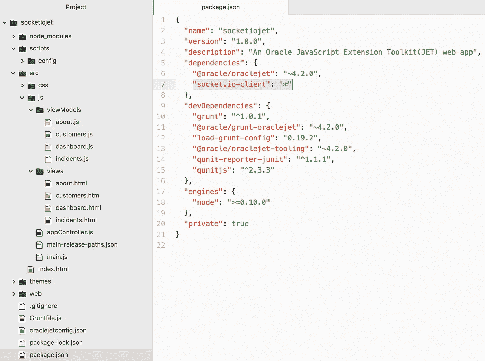
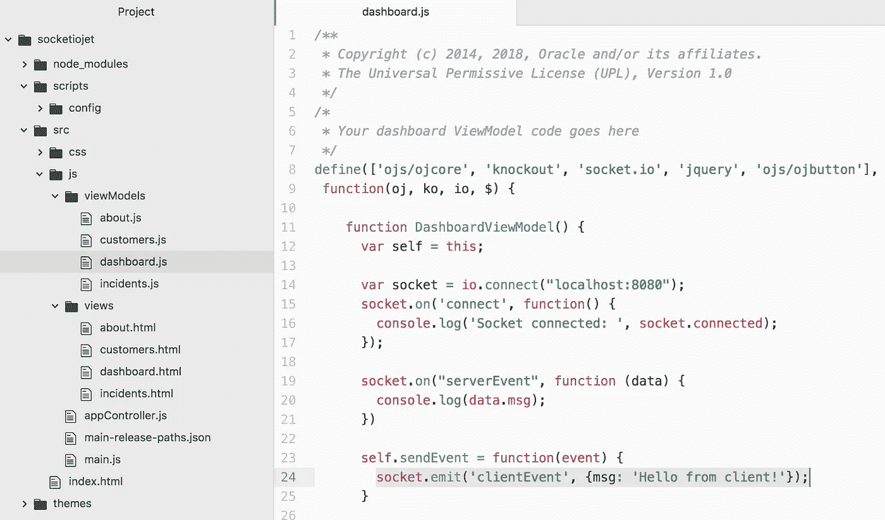

# 插座。与 Oracle JET 的 IO 集成

> 原文：<https://medium.com/oracledevs/socket-io-integration-with-oracle-jet-4afc964efc9a?source=collection_archive---------0----------------------->

插座。IO 是一个用于实时 web 应用程序的 JavaScript 库。它由两部分组成——在浏览器中运行的客户端库和 Node.js 的服务器端库。在本文中，我将带您了解与 Oracle JET 的完整集成场景。

在这里你可以看到它的作用。*从 JET 发送事件*按钮—通过套接字发送消息。到 Node.js 服务器端的 IO。在服务器端处理消息，并将响应发送回客户端(显示在浏览器控制台中):

带有 Socket.io 的服务器端部分在 Node.js 应用程序中实现，运行在 Express 上。要创建 Node.js 应用程序(开始时只是一个 json 文件)，运行命令:

**npm 初始化**

要添加 Express 和 Socket.io，请运行命令:

**npm 快速安装—保存**

**npm install socket.io — save** 在 Express 上启动 Node.js 应用程序，运行命令:

**国家预防机制启动**

仔细检查 package.json，它应该包含对 Express 和 Socket 的引用。IO:

这里是套接字的服务器端代码。IO(我手动创建了 server.js 文件)。当与客户端建立连接时，会打印消息。方法 *socket.on* 监听传入的消息。方法 *socket.emit* 向客户端发送消息。在这两种情况下，我们都可以使用 JSON 结构作为有效载荷变量。socket.emit 有一个 cheat sheet—[Socket。IO —发出备忘单](https://socket.io/docs/emit-cheatsheet/)。插座。IO 服务器端:

插座。IO 客户端可以通过 NPM 安装到 JET 应用程序中。Oracle JET 文档中有一个单独的章节，您可以在其中逐步阅读关于将第三方库安装到 Oracle JET 中的说明— [将第三方工具或库添加到您的 Oracle JET 应用程序中](https://docs.oracle.com/en/middleware/jet/4.2.0/develop/adding-third-party-libraries-your-oracle-jet-application.html#GUID-EC40DF3C-57FB-4919-A066-73E573D66B67)。我会建议手动包括插座。JET 中 package.json 的 IO 依赖项条目:

然后运行命令获取套接字。IO 库到 JET 应用程序节点模块中。接下来继续 Oracle JET guide 中的说明，并检查我的示例代码:

**国家预防机制更新**

建立套接字连接—导入套接字。IO 进入 JET 模块，使用 *io.connect* 建立插座连接。使用服务器端套接字连接到运行 Express 的端点。IO 监听器。客户端使用与服务器端相同的 *socket.on* 和 *socket.emit* API 方法:

从我的 [GitHub](https://github.com/abaranovskis-redsamurai/socketio) 库下载示例代码。

*原载于 2018 年 3 月 29 日*[*【andrejusb.blogspot.com】*](https://andrejusb.blogspot.lt/2018/03/socketio-integration-with-oracle-jet.html)*。*