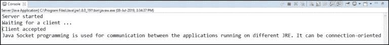

# 了解 Java 中的套接字编程

> 原文：<https://medium.com/edureka/socket-programming-in-java-f09b82facd0?source=collection_archive---------0----------------------->


Socket Programming in Java — Edureka

Java 中的套接字编程用于运行在不同 JRE 上的应用程序之间的通信。它可以是面向连接的，也可以是无连接的。总的来说，套接字是在客户机和服务器之间建立连接的一种方式。在这篇文章中，我将告诉你关于套接字编程的一切。

本文涵盖了以下主题:

*   Java 中的套接字编程是什么？
*   Java 中的套接字是什么？
*   客户端编程
*   服务器端编程

# Java 中的套接字编程是什么？

*套接字编程*是一种连接网络上两个节点相互通信的方式。一个 ***套接字*** (节点)监听一个 IP 上的特定端口，而另一个*套接字*向另一个套接字伸出以形成连接。


服务器形成监听器*套接字，而*客户端连接到服务器。套接字和服务器套接字类用于面向连接的套接字编程。

现在让我们来理解套接字编程的核心概念，即套接字。

# Java 中的套接字是什么？

Java 中的**套接字**是网络上运行的两个程序之间双向通信链路的一个端点。一个**套接字**被绑定到一个端口号，以便 TCP 层可以识别数据被发送到的应用。


端点是 IP 地址和端口号的组合。Java 平台中的包提供了一个类 Socket，它实现了 Java 程序和网络上另一个程序之间的双向连接的一端。该类位于平台相关的实现之上，对 Java 程序隐藏了任何特定系统的细节。通过使用类而不是依赖本机代码，您的 Java 程序可以以独立于平台的方式通过网络进行通信。

现在你知道了，什么是 Java 中的 Socket，让我们进一步了解客户端如何与服务器通信，以及服务器如何响应。

# 客户端编程

在客户端编程的情况下，客户端将首先等待服务器启动。一旦服务器启动并运行，它将向服务器发送请求。之后，客户端将等待服务器的响应。这就是客户端和服务器通信的全部逻辑。现在我们来详细了解一下客户端和服务器端的编程。

为了发起客户请求，您需要遵循下面提到的步骤:

## **1。建立连接**

第一步是建立套接字连接。套接字连接意味着两台机器拥有关于彼此网络位置(IP 地址)和 TCP 端口的信息。

您可以借助以下语句创建套接字:

插座插座=新插座(" 127.0.0.1 "，5000)

*   这里，第一个参数表示服务器的 **IP 地址。**
*   第二个参数代表了 **TCP 端口**。(它是一个数字，表示应该在服务器上运行哪个应用程序。)

## **2。通信**

为了通过套接字连接进行通信，流被用于输入和输出数据。建立连接并发送请求后，您需要关闭连接。

## **3。关闭连接**

一旦向服务器发送了消息，套接字连接就被显式关闭。

现在让我们看看如何编写一个 Java 程序来实现客户端的套接字连接。

```
// A Java program for a ClientSide
import java.net.*;
import java.io.*;
public class ClientProgram
{
// initialize socket and input output streams
private Socket socket = null;
private DataInputStream input = null;
private DataOutputStream out = null;
// constructor to put ip address and port
public Client(String address, int port)
{
// establish a connection
try
{
socket = new Socket(address, port);
System.out.println("Connected");
// takes input from terminal
input = new DataInputStream(System.in);
// sends output to the socket
out = new DataOutputStream(socket.getOutputStream());
}
catch(UnknownHostException u)
{
System.out.println(u);
}
catch(IOException i)
{
System.out.println(i);
}// string to read message from input
String line = "";
// keep reading until "Over" is input
while (!line.equals("Over"))
{
try
{
line = input.readLine();
out.writeUTF(line);
}
catch(IOException i)
{
System.out.println(i);
}
}
// close the connection
try
{
input.close();
out.close();
socket.close();
}
catch(IOException i)
{
System.out.println(i);
}
}
public static void main(String args[]) {
Client client = new Client("127.0.0.1", 5000);
}
}
```

现在，让我们实现服务器端编程，然后得到输出。

# 服务器端编程

基本上，服务器将实例化它的对象并等待客户机请求。一旦客户端发送了请求，服务器将通过响应进行通信。

为了编写服务器端应用程序，您需要两个套接字，如下所示:

*   一个**服务器套接字**，它等待客户端请求(当客户端创建一个新的套接字())
*   一个普通的老式**插座**用于与客户端通信。

在这之后，您需要用响应与客户机进行通信。

## **通信**

**getOutputStream()** 方法用于通过套接字发送输出。

## **关闭连接**

一旦一切都完成了，通过关闭套接字以及输入/输出流来关闭连接是很重要的。

现在让我们看看如何编写一个 Java 程序来实现服务器端的套接字连接。

```
// A Java program for a Serverside
import java.net.*;
import java.io.*;
public class ServerSide
{
//initialize socket and input stream
private Socket socket = null;
private ServerSocket server = null;
private DataInputStream in = null;
// constructor with port
public Server(int port)
{
// starts server and waits for a connection
try{
server = new ServerSocket(port);
System.out.println("Server started");
System.out.println("Waiting for a client ...");
socket = server.accept();
System.out.println("Client accepted");
// takes input from the client socket
in = new DataInputStream(
new BufferedInputStream(socket.getInputStream()));
String line = "";
// reads message from client until "Over" is sent
while (!line.equals("Over"))
{
try
{
line = in.readUTF();
System.out.println(line);

}
catch(IOException i)
{
System.out.println(i);
}
}
System.out.println("Closing connection");
// close connection
socket.close();
in.close();
}
catch(IOException i){
System.out.println(i);
}
}
public static void main(String args[]){
Server server = new Server(5000);
}
}
```

配置好客户端和服务器端之后，就可以先执行服务器端程序了。之后，您需要运行客户端程序并发送请求。客户端一发出请求，服务器就会响应。下面的快照表示相同。

1.当您运行服务器端脚本时，它将启动并等待客户端启动。


2.接下来，客户端将连接并以字符串的形式输入请求。


3.当客户端发送请求时，服务器会做出响应。



这就是你需要用 Java 执行一个 socket 程序的方式。您也可以在终端窗口或命令提示符下执行这些程序。但是，由于 Eclipse 的特性非常先进，您可以在一个控制台上简单地执行这两个程序。

这就把我们带到了关于 Java 套接字编程的文章的结尾。我希望我已经对你关于**套接字编程的知识有所启发。**

如果你想查看更多关于人工智能、DevOps、道德黑客等市场最热门技术的文章，你可以参考 Edureka 的官方网站。

请留意本系列中的其他文章，它们将解释 Java 的各个方面。

> 1.[面向对象编程](/edureka/object-oriented-programming-b29cfd50eca0)
> 
> 2.[Java 中的继承](/edureka/inheritance-in-java-f638d3ed559e)
> 
> 3.[Java 中的多态性](/edureka/polymorphism-in-java-9559e3641b9b)
> 
> 4.[Java 中的抽象](/edureka/java-abstraction-d2d790c09037)
> 
> 5. [Java 字符串](/edureka/java-string-68e5d0ca331f)
> 
> 6. [Java 数组](/edureka/java-array-tutorial-50299ef85e5)
> 
> 7. [Java 集合](/edureka/java-collections-6d50b013aef8)
> 
> 8. [Java 线程](/edureka/java-thread-bfb08e4eb691)
> 
> 9.[Java servlet 简介](/edureka/java-servlets-62f583d69c7e)
> 
> 10. [Servlet 和 JSP 教程](/edureka/servlet-and-jsp-tutorial-ef2e2ab9ee2a)
> 
> 11.[Java 中的异常处理](/edureka/java-exception-handling-7bd07435508c)
> 
> 12.[高级 Java 教程](/edureka/advanced-java-tutorial-f6ebac5175ec)
> 
> 13. [Java 面试问题](/edureka/java-interview-questions-1d59b9c53973)
> 
> 14. [Java 程序](/edureka/java-programs-1e3220df2e76)
> 
> 15. [Kotlin vs Java](/edureka/kotlin-vs-java-4f8653f38c04)
> 
> 16.[依赖注入使用 Spring Boot](/edureka/what-is-dependency-injection-5006b53af782)
> 
> 17.[Java 中的可比](/edureka/comparable-in-java-e9cfa7be7ff7)
> 
> 18.[十大 Java 框架](/edureka/java-frameworks-5d52f3211f39)
> 
> 19. [Java 反射 API](/edureka/java-reflection-api-d38f3f5513fc)
> 
> 20.[Java 中的前 30 个模式](/edureka/pattern-programs-in-java-f33186c711c8)
> 
> 21.[核心 Java 备忘单](/edureka/java-cheat-sheet-3ad4d174012c)
> 
> 22. [Java 教程](/edureka/java-tutorial-bbdd28a2acd7)
> 
> 23. [Java OOP 备忘单](/edureka/java-oop-cheat-sheet-9c6ebb5e1175)
> 
> 24.[Java 中的注释](/edureka/annotations-in-java-9847d531d2bb)
> 
> 25.[Java 中的图书馆管理系统项目](/edureka/library-management-system-project-in-java-b003acba7f17)
> 
> 26.[爪哇的树木](/edureka/java-binary-tree-caede8dfada5)
> 
> 27.[Java 中的机器学习](/edureka/machine-learning-in-java-db872998f368)
> 
> 28.[Java 中的顶级数据结构&算法](/edureka/data-structures-algorithms-in-java-d27e915db1c5)
> 
> 29. [Java 开发人员技能](/edureka/java-developer-skills-83983e3d3b92)
> 
> 30.[前 55 个 Servlet 面试问题](/edureka/servlet-interview-questions-266b8fbb4b2d)
> 
> 31. [](/edureka/java-exception-handling-7bd07435508c) [顶级 Java 项目](/edureka/java-projects-db51097281e3)
> 
> 32. [Java 字符串备忘单](/edureka/java-string-cheat-sheet-9a91a6b46540)
> 
> 33.[Java 中的嵌套类](/edureka/nested-classes-java-f1987805e7e3)
> 
> 34. [Java 集合面试问答](/edureka/java-collections-interview-questions-162c5d7ef078)
> 
> 35.[Java 中如何处理死锁？](/edureka/deadlock-in-java-5d1e4f0338d5)
> 
> 36.[你需要知道的 50 大 Java 集合面试问题](/edureka/java-collections-interview-questions-6d20f552773e)
> 
> 37.[Java 中的字符串池是什么概念？](/edureka/java-string-pool-5b5b3b327bdf)
> 
> 38.[C、C++和 Java 有什么区别？](/edureka/difference-between-c-cpp-and-java-625c4e91fb95)
> 
> 39.[Java 中的回文——如何检查一个数字或字符串？](/edureka/palindrome-in-java-5d116eb8755a)
> 
> 40.[你需要知道的顶级 MVC 面试问答](/edureka/mvc-interview-questions-cd568f6d7c2e)
> 
> 41.[Java 编程语言的十大应用](/edureka/applications-of-java-11e64f9588b0)
> 
> 42.[Java 中的死锁](/edureka/deadlock-in-java-5d1e4f0338d5)
> 
> 43.[Java 中的平方和平方根](/edureka/java-sqrt-method-59354a700571)
> 
> 44.[Java 中的类型转换](/edureka/type-casting-in-java-ac4cd7e0bbe1)
> 
> 45.[Java 中的运算符及其类型](/edureka/operators-in-java-fd05a7445c0a)
> 
> 46.[Java 中的析构函数](/edureka/destructor-in-java-21cc46ed48fc)
> 
> 47.[爪哇的二分搜索法](/edureka/binary-search-in-java-cf40e927a8d3)
> 
> 48.[Java 中的 MVC 架构](/edureka/mvc-architecture-in-java-a85952ae2684)
> 
> 49.[冬眠面试问答](/edureka/hibernate-interview-questions-78b45ec5cce8)

*原载于 2019 年 7 月 12 日*[*https://www.edureka.co*](https://www.edureka.co/blog/socket-programming-in-java/)*。*