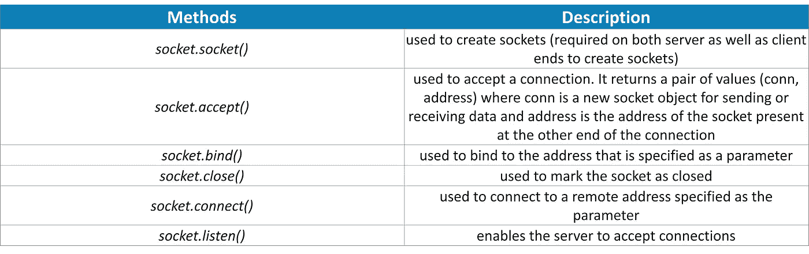
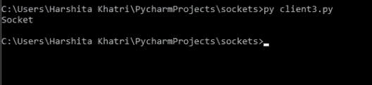

# Python 中的 Socket 编程是什么，如何掌握？

> 原文：<https://medium.com/edureka/socket-programming-python-bbac2d423bf9?source=collection_archive---------0----------------------->


Socket Programming in Python — Edureka

不可否认，互联网已经成为“存在的灵魂”，它的活动以“连接”或“网络”为特征。这些网络之所以成为可能，是因为使用了**套接字最重要的基础之一。**本文涵盖了 Python 中套接字编程的所有领域。套接字帮助您建立这些连接，而 Python 无疑使这变得很容易。

让我们快速浏览一下本文涉及的所有主题:

*   为什么要用插座？
*   Python 中的套接字是什么？
*   如何用 Python 实现 Socket 编程
*   什么是服务器？
*   什么是客户？
*   回显客户端-服务器
*   多重通信
*   传输 Python 对象

1.  Python pickle 模块
2.  如何使用 pickle 模块传输 python 对象

# 为什么要用插座？

套接字是网络的主干。它们使两个不同程序或设备之间的信息传输成为可能。例如，当您打开浏览器时，作为客户端的您正在创建一个到服务器的连接以传输信息。

在深入研究这种通信之前，让我们先弄清楚这些套接字到底是什么。

# 什么是插座？

一般来说，套接字是为发送和接收数据而构建的内部端点。单个网络将有两个套接字，每个套接字用于一个通信设备或程序。这些套接字是 IP 地址和端口的组合。根据正在使用的端口号，单个设备可以有“n”个插座。不同的端口适用于不同类型的协议。请看下图，了解一些常见端口号和相关协议的更多信息:


既然您已经清楚了套接字的概念，现在让我们来看看 Python 的套接字模块:

# 如何在 Python 中实现 Socket 编程:

要用 Python 实现套接字编程，你需要导入**套接字**模块或框架。该模块由创建套接字并帮助它们彼此关联所需的内置方法组成。

一些重要的方法如下:



既然您已经理解了套接字模块的重要性，那么让我们继续来看看它如何为 Python 中的套接字编程创建服务器和客户机。

# 什么是服务器？

服务器可以是一个程序、一台计算机或一个专门用于管理网络资源的设备。服务器可以在同一台设备或计算机上，也可以本地连接到其他设备和计算机，甚至远程连接。有各种类型的服务器，如数据库服务器、网络服务器、打印服务器等。

服务器通常使用 socket.socket()、socket.bind()、socket.listen()等方法来建立连接并绑定到客户端。现在让我们写一个程序来创建一个服务器。考虑下面的例子:

**举例:**

```
import socket
s=socket.socket(socket.AF_INET, socket.SOCK_STREAM)
s.bind((socket.gethostname(),1234))          
#port number can be anything between 0-65535(we usually specify non-previleged ports which are > 1023)
s.listen(5)

while True:
    clt,adr=s.accept()
    print(f"Connection to {adr}established")  
   #f string is literal string prefixed with f which 
   #contains python expressions inside braces
   #to send info to clientsocket
    clt.send(bytes("Socket Programming in Python","utf-8 "))
```

正如您所看到的，创建套接字的第一个必要条件是导入套接字模块。之后，socket.socket()方法用于创建服务器端套接字。

**注:**

AF_INET 指的是来自互联网的地址，它需要一对(host，port ),其中 host 可以是某个特定网站的 URL 或其地址，端口号是整数。SOCK_STREAM 用于创建 TCP 协议。

bind()方法接受两个参数作为一个元组(host，port)。但是，最好使用 4 位数的端口号，因为较低的端口号通常被占用。listen()方法允许服务器接受连接。这里，5 是同时出现的多个连接的队列。这里可以指定的最小值是 0(如果给定一个较小的值，它将被更改为 0)。如果没有指定参数，则采用默认的合适参数。

while 循环允许永远接受连接。“clt”和“adr”是客户端对象和地址。print 语句只是打印出客户机套接字的地址和端口号。最后，clt.send 用于以字节为单位发送数据。

现在我们的服务器已经设置好了，让我们继续向客户端前进。

# 什么是客户？

客户端是从服务器接收信息或服务的计算机或软件。在客户机-服务器模块中，客户机向服务器请求服务。最好的例子就是谷歌 Chrome、火狐等网络浏览器。这些网络浏览器按照用户的指示向网络服务器请求所需的网页和服务。其他例子包括在线游戏、在线聊天等。

现在让我们来看看如何用 Python 编程语言编写客户端程序:

**举例:**

```
import socket
s=socket.socket(socket.AF_INET, socket.SOCK_STREAM)
s.connect((socket.gethostname(), 2346))
msg=s.recv(1024)
print(msg.decode("utf-8"))
```

第一步是导入套接字模块，然后创建一个套接字，就像创建服务器时一样。然后，要创建客户机-服务器之间的连接，您需要通过指定(host，port)使用 connect()方法。

**注意:**当客户端和服务器在同一台计算机上时，使用 gethostname。(局域网—本地 ip /广域网—公共 ip)

这里，客户端希望从服务器接收一些信息，为此，您需要使用 recv()方法，信息存储在另一个变量 msg 中。请记住，传递的信息是以字节为单位的，在上述程序中，客户端在一次传输中最多可以接收 1024 个字节(缓冲区大小)。根据传输的信息量，它可以指定为任意数量。

最后，被传输的信息应该被解码并打印出来。

现在你已经知道了如何创建客户机-服务器程序，让我们继续看看它们需要如何执行。

# 回显客户端-服务器:

要执行这些程序，请打开命令提示符，进入创建客户端和服务器程序的文件夹，然后键入:

py server.py(这里 server.py 是服务器的文件名，也可以用 py -3.7 server.py)

完成后，服务器开始运行。要执行客户端，请打开另一个 cmd 窗口，并键入:

py client.py(这里 client.py 是客户端的文件名)

**输出(服务器):**


**(客户端)**


让我们通过将缓冲区大小减少到 7 来尝试相同的程序，看看我们得到什么输出:

**输出:**



如您所见，连接在传输 7 个字节后终止。但是这是一个问题，因为您没有收到完整的信息，并且连接已经关闭。让我们继续解决这个问题。

# 多重沟通:

为了使连接持续到客户端收到完整的信息，您可以使用 while 循环:

**举例:**

```
import socket
s=socket.socket(socket.AF_INET, socket.SOCK_STREAM)
s.connect((socket.gethostname(), 2346))
while True:
msg=s.recv(7)
print(msg.decode("utf-8"))
```

一旦你这样做了，完整的消息将在每次传输中以 7 个字节被接收。

但是这一次，如你所见，连接没有被终止，你永远不知道什么时候会发生。此外，如果您实际上不知道客户端将从服务器接收到多大的消息或信息，该怎么办呢？在这种情况下，您实际上可以在客户端使用以下代码:

**示例:**

```
complete_info=''
while True:
    msg = s.recv(7)  
    if len(msg)&amp;amp;amp;amp;amp;amp;lt;=0:
        break
    complete_info += msg.decode("utf-8")
print(complete_info)
```

在服务器端，使用 close()方法，如下所示:

```
clt.close()
```

**输出:**


上面的代码块所做的就是检查信息的大小，一次将它打印到两个字节的缓冲区中，并在完成后关闭
连接。

# 传输 Python 对象:

到这里为止，你只是掌握了转移字符串的诀窍。但是，Python 中的套接字编程也允许您传输 Python 对象。这些对象可以是集合、元组、字典等任何东西。要实现这一点，您需要导入 Python 的 pickle 模块。

## Python pickle 模块:

当你实际上在 Python 中序列化或反序列化对象时，Python pickle 模块就会出现。我们来看一个小例子，

**例子:**

```
import pickle

mylist=[1,2,'abc']
mymsg = pickle.dumps(mylist) 
print(mymsg)
```

**输出:**b ' x80x 03]qx00(kx 01k x02 x 03 x 00x 00 x 00 ABC qx 01 e。'

如您所见，在上面的程序中，使用 pickle 模块的 dumps()函数对‘my list’进行了序列化。还要注意，输出以“b”开头，这意味着它被转换为字节。在套接字编程中，可以实现这个模块在客户机和服务器之间传输 python 对象。

## 如何使用 pickle 模块传递 python 对象结构？

当你把 pickle 和 sockets 一起使用时，你绝对可以通过网络传输任何东西。让我们记下服务器端和客户端的对应方，以便将列表从服务器传输到客户端:

## 服务器端:

```
import socket
import pickle

a=10
s=socket.socket(socket.AF_INET, socket.SOCK_STREAM)
s.bind((socket.gethostname(), 2133))        #binding tuple
s.listen(5)
while True:
    clt , adr = s.accept()
    print(f"Connection to {adr}established")

    m={1:"Client", 2:"Server"}
    mymsg = pickle.dumps(m)  #the msg we want to print later
    mymsg = {len(mymsg):{a}}"utf-8") + mymsg
    clt.send(mymsg)
```

这里，m 是一个字典，它基本上是一个需要从服务器发送到客户机的 python 对象。这是通过首先使用 dumps()序列化对象，然后将其转换为字节来完成的。
现在让我们写下客户端的对应部分:

## 客户端:

```
import socket
import pickle
a=10
s=socket.socket(socket.AF_INET, socket.SOCK_STREAM)
s.connect((socket.gethostname(), 2133))

while True:
    complete_info = b''
    rec_msg = True
    while True:
        mymsg = s.recv(10)
       if rec_msg:
            print(f"The length of message = {mymsg[:a]}")
            x = int (mymsg[:a ] )
            rec_msg = False
            complete_info += mymsg
            if len(complete_info)-a == x:
            print("Recieved the complete info")
            print(complete_info[a:])
            m = pickle.loads(complete_info[a:])
            print(m)
            rec_msg = True
complete_info = b''
print(complete_info)
```

第一个 while 循环将帮助我们跟踪完整的消息(complete_info)以及使用缓冲区接收的消息(rec_msg)。然后，当消息被接收时，我所做的就是打印它的每一位，在一个大小为 10 的缓冲区中接收。这个尺寸可以是任何东西，取决于你的个人选择。

然后，如果收到的消息等于完整的消息，我只是将消息打印为 received complete info，之后我使用 loads()对消息进行了反序列化。

上述程序的输出如下:


这就把我们带到了这篇关于 Python 中套接字编程的文章的结尾。我希望你明白所有的概念。如果你想查看更多关于人工智能、DevOps、道德黑客等市场最热门技术的文章，那么你可以参考 [Edureka 的官方网站。](https://www.edureka.co/blog/?utm_source=medium&utm_medium=content-link&utm_campaign=socket-programming-python)

请留意本系列中的其他文章，它们将解释 Python 和数据科学的各个方面。

> 1. [Python 教程](/edureka/python-tutorial-be1b3d015745)
> 
> 2. [Python 编程语言](/edureka/python-programming-language-fc1015de7a6f)
> 
> 3. [Python 函数](/edureka/python-functions-f0cabca8c4a)
> 
> 4.[Python 中的文件处理](/edureka/file-handling-in-python-e0a6ff96ede9)
> 
> 5. [Python Numpy 教程](/edureka/python-numpy-tutorial-89fb8b642c7d)
> 
> 6. [Scikit 学习机器学习](/edureka/scikit-learn-machine-learning-7a2d92e4dd07)
> 
> 7. [Python 熊猫教程](/edureka/python-pandas-tutorial-c5055c61d12e)
> 
> 8. [Matplotlib 教程](/edureka/python-matplotlib-tutorial-15d148a7bfee)
> 
> 9. [Tkinter 教程](/edureka/tkinter-tutorial-f655d3f4c818)
> 
> 10.[请求教程](/edureka/python-requests-tutorial-30edabfa6a1c)
> 
> 11. [PyGame 教程](/edureka/pygame-tutorial-9874f7e5c0b4)
> 
> 12. [OpenCV 教程](/edureka/python-opencv-tutorial-5549bd4940e3)
> 
> 13.[用 Python 进行网页抓取](/edureka/web-scraping-with-python-d9e6506007bf)
> 
> 14. [PyCharm 教程](/edureka/pycharm-tutorial-d0ec9ce6fb60)
> 
> 15.[机器学习教程](/edureka/machine-learning-tutorial-f2883412fba1)
> 
> 16.[Python 中从头开始的线性回归算法](/edureka/linear-regression-in-python-e66f869cb6ce)
> 
> 17.[面向数据科学的 Python](/edureka/learn-python-for-data-science-1f9f407943d3)
> 
> 18.[Python 中的循环](/edureka/loops-in-python-fc5b42e2f313)
> 
> 19. [Python 正则表达式](/edureka/python-regex-regular-expression-tutorial-f2d17ffcf17e)
> 
> 20. [Python 项目](/edureka/python-projects-1f401a555ca0)
> 
> 21.[机器学习项目](/edureka/machine-learning-projects-cb0130d0606f)
> 
> 22.[Python 中的数组](/edureka/arrays-in-python-14aecabec16e)
> 
> 23.[在 Python 中设置](/edureka/sets-in-python-a16b410becf4)
> 
> 24.[Python 中的多线程](/edureka/what-is-mutithreading-19b6349dde0f)
> 
> 25. [Python 面试问题](/edureka/python-interview-questions-a22257bc309f)
> 
> 26. [Java vs Python](/edureka/java-vs-python-31d7433ed9d)
> 
> 27.[如何成为一名 Python 开发者？](/edureka/how-to-become-a-python-developer-462a0093f246)
> 
> 28. [Python Lambda 函数](/edureka/python-lambda-b84d68d449a0)
> 
> 29.[网飞如何使用 Python？](/edureka/how-netflix-uses-python-1e4deb2f8ca5)
> 
> 30. [Python 数据库连接](/edureka/python-database-connection-b4f9b301947c)
> 
> 31. [Golang vs Python](/edureka/golang-vs-python-5ac32e1ef2)
> 
> 32. [Python Seaborn 教程](/edureka/python-seaborn-tutorial-646fdddff322)
> 
> 33. [Python 职业机会](/edureka/python-career-opportunities-a2500ce158de)

*原载于 2019 年 6 月 28 日 https://www.edureka.co*[](https://www.edureka.co/blog/socket-programming-python/)**。**