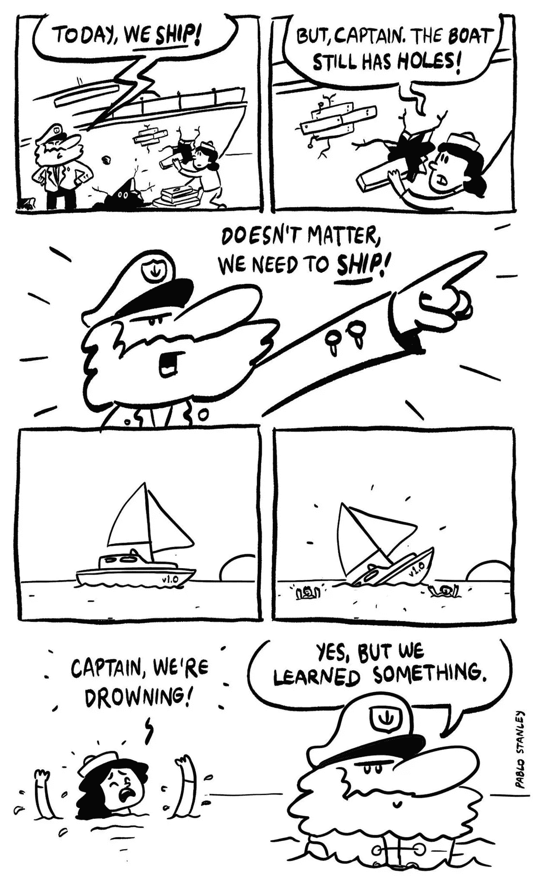
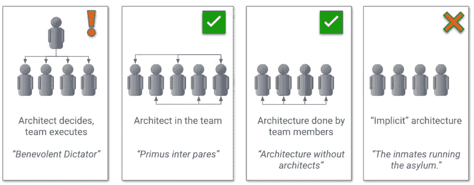

# Software Architect: Continuous and Endless Sailing on the Endless Sea

> 原文：<https://medium.easyread.co/software-architect-continuous-and-endless-sailing-on-the-endless-sea-22a25b24c2d6?source=collection_archive---------1----------------------->

## Finding solutions when no one can help!

Saya pernah ketemu satu komik lucu. Tentang sebuah kapten kapal yang nekat berlayar meski kapalnya sudah buruk. Berikut komiknya.

Comic by Pablo Stanley

Apakah komik ini relate dengan teman sekalian? Buat kamu yang bekerja di dunia startup, saya rasa hal ini cukup relate. Kondisi dimana pihak manajemen dan product yang ingin merilis fitur secepatnya tanpa melihat kondisi sistem dan tech-debt yang menumpuk.

Akan tetapi kondisi ini terkadang menjadi buah simalakama, terlambat rilis tentu saja dapat tersaingin oleh kompetitor. Sebaliknya jika terus-menerus rilis tetapi malah menambah tech-debt, nantinya malah akan menumpuk untuk diurus dikemudian hari.

Dan memang bukan rahasia lagi, bahwa hal seperti ini cukup lumrah di setiap perusahaan khususnya di Indonesia, atau setidaknya di beberapa perusahaan yang pernah saya ketahui kondisi di dalamnya dan saya pun mengalaminya.

Untuk itu terkait penanganan tech-debt, dibutuhkan kesepakatan antara tim engineer dan pihak management atau PM. Dibutuhkan beberapa orang yang bertugas menjembatani keadaan yang terjadi di engineering, dan memberikan solusi terbaik menurut kedua belah pihak antara Product dan Engineering.

Dan untuk itulah kenapa role Software Architect dibutuhkan. Di tempat saya bekerja saat ini ketika menulis ini, untuk mengatasi permasalahan antara *keeping best practice while release faster dan reduce tech-debt* maka dibentuklah satu group independent yang kita sebut Architects. Dimana orang-orang didalam akan di assign ke semua team dan bertanggung jawab terhadap menyelesaikan masalah teknis dan architecture yang ada pada tim tersebut.

# Apa Itu Software Architect?

Software Architect adalah orang yang bertanggung jawab terhadap permasalahan arsitektur yang terdapat dalam perusahaan, baik secara teknis atau pun bisnis. Software Architect bertanggung jawab menjadi penghubung antara kebutuhan bisnis dan ketersedian teknologi yang dapat dimanfaatkan guna mendukung kinerja bisnis.

Software Architect merupakan posisi/jabatan yang cukup ambigu secara general. Karena tidak semua perusahaan memiliki posisi ini. Berbeda dengan Software Engineer, Tech Lead, Engineering Manager, VP Engineering dsb. Posisi/jabatan tersebut memiliki job desc yang jelas, title yang jelas dan responsibilitynya pun sangat jelas. Saat bekerja di perusahaan X sebagai Tech Lead, maka saat pindah perusahaan pun, kita masih bisa menjabat sebagai Tech Lead.

Berbeda dengan Software Architect. Mungkin saat ini saya sedang bekerja di posisi Software Architect di X, namun jika semisalnya saya ingin pindah pekerjaan ke perusahaan lain, maka posisi Software Architect tidak selamanya ada. Mau tidak mau, saya mungkin harus menerima lowongan yang lain seperti sebagai Software Engineer, Tech Lead, Engineering Manager dsb.

Namun ke-ambiguan posisi/jabatan tersebut, bukan berarti role Software Architect tidak penting. Jabatan mungkin tidak ada secara umum, akan tetapi role/peran Software Architect masih harus dibutuhkan oleh perusahaan. Biasanya untuk perusahaan yang tidak memiliki posisi/title/jabatan Software Architect, maka role/peran Software Architect biasanya di pegang oleh para petinggi seperti Engineering Manager, VP Engineering, CTO atau bahkan dipegang oleh Software Engineer di perusahaan tersebut.

Dalam article [**“The Architect Elevator: Would you like architects with your architecture?”**](https://architectelevator.com/architecture/organizing-architecture/) **, Gregor Hohpe** menyebutkan tentang kombinasi posisi/peran architects yang ideal.

Organizing Architecture by Gregor Hohpe in The Architect Elevator

Terdapat 4 kombinasi yang biasanya terjadi di banyak perusahaan,

*   **Benevolent dictator:** tipe yang one-man show, dimana satu architect decide everything dan team follow the architect’s decision.
*   **Primus inter pares** : tipe yang one man role dalam satu tim, yang dimana sang architect terkadang masih ikut turun tangan secara implementasi. Namun biasanya fokusnya lebih ke roadmap dan architectural problem. Posisi ini mungkin cukup lumrah jika terdapat satu Principal Engineer (Staff Engineer) di dalam satu tim. Atau untuk komposisi yang umum lainnya seperti Techlead dalam satu tim yang juga bertanggung jawab terhadap architectural problem di tim tersebut.
*   **Architecture without architects** : tipe yang work as a team, dimana decission dari Software Architecutre di tentukan bareng bareng sesama orang yang terpilih di tim tersebut, biasanya 2 orang atau lebih. Semisal, Principal Engineer dan TL decide tentang Software Architecture, shared responsibility.
*   **Inmates running the asylum** : tipe terakhir yang adalah kondisi lebih dinamis, biasa orang sebut dengan agile flexible. Dimana semua ditentukan bareng, dan tidak ada orang yang focus untuk melakukan tugas tugas architect. Sehingga decision biasanya lebih lama terjadi. Namun untuk tim yang lebih mature dengan experts didalam, biasanya decission lebih cepat terjadi.

Sehingga dalam perusahaan, bisa saja jabatan “Software Architect” itu tidak ada sama sekali. Namun untuk peran “Software Architect” pastinya selalu ada hanya mungkin peran itu terselubung secara implisit di posisi-posisi yang ada pada perusahaan tersebut.

# Software Architect Expectations?

Lalu apa sajakah tugas dan tanggung jawab seorang Software Architect tersebut?

> Apa yang akan saya jelaskan berikut adalah menurut yang saya alami, dan saya pahami. Sehingga jika ternyata berbeda dengan yang terdapat pada perusahaan kamu, k̶i̶t̶a̶ ̶b̶i̶s̶a̶ ̶d̶i̶s̶k̶u̶s̶i̶k̶a̶n̶ ̶d̶i̶k̶o̶l̶o̶m̶ ̶k̶o̶m̶e̶n̶t̶a̶r̶ ̶s̶e̶h̶i̶n̶g̶g̶a̶ ̶s̶a̶y̶a̶ ̶b̶i̶s̶a̶ ̶m̶e̶n̶y̶a̶m̶a̶k̶a̶n̶ ̶e̶k̶s̶p̶e̶k̶t̶a̶s̶i̶ ̶j̶i̶k̶a̶ ̶s̶u̶a̶t̶u̶ ̶s̶a̶a̶t̶ ̶s̶a̶y̶a̶ ̶m̶e̶l̶a̶m̶a̶r̶ ̶k̶e̶t̶e̶m̶p̶a̶t̶ ̶a̶n̶d̶a̶ ̶*̶e̶h̶ sehingga dapat menambah data point tentang apa saja tugas dan tanggung jawab dari seorang Software Architect.

Mungkin terlihat abu-abu, berikut adalah point penting yang diharapkan oleh perusahaan saya bekerja terhadap role yang saya emban, diantaranya adalah sebagai berikut.

*   Architects connect the dots.
    Maksudnya adalah, para architects di harapkan mampu menyambungkan semua Lego block yang terdapat pada keseluruhan sistem. Semua sistem di dalam perusahaan sudah pasti di design independen dan berjalan dengan baik. Namun sebaik apapun keseluruhan sistem tersebut berjalan, masih belum cukup untuk membuat bisnis berjalan. Dan layaknya seperti Lego block, architect harus mampu menyambungkan semua itu menjadi satu kesatuan dan sejalan dengan bisnis.
*   Architects fight complexity
    Software Architecture sudah sangat kompleks, IT itu kompleks, bisnis kompleks. Maka sebagai architect diharapkan mampu mengurangi semua kompleksitas tersebut, dan menyederhanakan semua sebisa mungkin. Namun tidak harus menjadi over simplify, setidaknya menjadi mudah dipahami oleh para stakeholder dan tetap rasional.
*   Architects see trade-offs
    Architect ketika memberikan solusi, haruslah menyertakan kekurangan atau poin-poin yang perlu diperhatikan dari solusinya jika solusi tersebut dilakukan. Karna menurut saya, tidak ada solusi yang benar di dunia software architecture, namun solusi optimal lah yang harus kita cari. Dengan perbandingan benefit vs trade-offs, maka kita memilih yang paling optimal.
*   Architects look beyond products
    Architect tidak terpaku pada satu product fitur. Tetapi harus melihat secara general, untuk melihat opsi yang lebih baik terhadap suatu solusi. Looks on the abstraction level!
*   Architects articulate strategy
    Architect menerjemahkan strategy bisnis ke bahasa teknis. Sehingga bisa menjadi jembatan antara orang bisnis dengan engineer. Tujuan IT tentu saja menjadi enabler bussiness, mendukung strategy bisnis. Maka seorang architect diharapkan mampu menerjemahkan kebutuhan bisnis menjadi bahasa teknis yang dipahami oleh engineers.
*   Architects deliver
    Meski architect lebih sering berpikir high-level domain. Architect juga diharapkan mampu down to earth, dan mendengarkan feedbacks secara langsung dari implementasi project *~ a.k.a terjun kelapangan, gak nyuruh nyuruh aja, tanpa tahu bagaimana keadaan project di lapangan :D*

Namun in reality, apa yang saya alami adalah,

*   Menjadi unblocker, dan enabler para engineer.
    Saya harus aktif bertanya terhadap tim, apakah ada yang bisa saya bantu agar tidak terblock. Membuat tools, atau RFC yang diharapkan mampu meringankan pekerjaan para engineers.
*   Memberikan pilihan solusi, tetapi tidak menetapkan solusi.
    Ketika menyelesaikan satu masalah, saya biasanya sediakan beberapa solusi. Dimana nantinya saya kasih keputusan kepada tim untuk memilih. Atau terkadang tim malah memberikan solusi juga. Sehingga, bisa saja semua opsi yang saya berikan ditolak oleh tim. Dan saat itu terjadi, saya tetap akan harus mendukung solusi tersebut dan mengimplementasikannya bersama tim.
*   Lead by example
    Ya tentu saja, saya masih harus melakukan implementasi jika diharuskan. Saya tidak boleh cuap-cuap theory saja. Saya harus langsung turun, dan melihat tingkat kesusahan solusi yang saya tawarkan.

# Continuous and Endless Sailing on the Endless Sea

Saya masih sangat baru role ini, dan jujur saja, saya terkadang masih bingung untuk berpikir layaknya seorang Software Architect. Jika berbicara tentang zona nyaman, saya masih lebih memilih untuk tetap di Senior Software Engineer. Dimana seperti kata dari sesepuh The TechLead si Youtuber kondangan dengan opini-opini fenomenalnya. Salah satu opininya adalah:

> *Senior Software Engineer(SSE) itu adalah “Sweet spot” dari jenjang karir software engineering, dimana kita memiliki domain tersendiri, kebebasan tersendiri, dan memiliki outcome jelas dari Techlead, atau Staff level lainnya.*

Ya memang benar, karena di level SSE, ketika kita tidak tahu berbuat apa-apa, kita bisa bertanya ke yang lebih senior, Principal, Techlead, dsb. Berbeda dengan ketika menjadi Software Architect. Ketika diposisi ini, saya tidak tahu harus bertindak seperti apa, ketika saya bertanya kepada manager saya, yang beliau katakan adalah:

> *“Iman, seharusnya kamu datang kepada saya membawa topik masalah dan pilihan solusi, dan requirement atau resource yang kamu butuhkan, apakah engineer, infrastructure, etc. Dan kamu eksekusi solusi tersebut sendiri. Jadi saya hanya tinggal membantumu mencari orang/engineer yang bisa menemanimu meng-eksekusi solusimu”.*

Saya diharapkan menemukan masalah yang tidak pernah disadari orang, lalu menyelesaikan masalah tersebut.

Sehingga saya pun menggangap, berjalan di level Software Architect sama seperti berlayar tanpa henti di lautan luas. Harus peka terhadap lingkungan dan masalah yang tidak disadari orang lain. Harus cepat tanggap dan responsive, flexible dan manage ekspektasi semua stakeholder.

Sama seperti berlayar jauh dilautan luas, kita harus melihat apakah kapal baik-baik saja. Apakah tidak ada kebocoran, dan jika ada bocor, kita harus perbaiki sebelum kebocorannya makin melebar luas dan membuat kapal kita tenggelam. Kita tidak ada pedoman yang pasti, tidak ada yang bisa kita harapkan, hanya mencoba trial-error and looks the best answer.

# Conclusions

Software Architect bukan lah posisi/jabatan yang umum, tetapi peran Architect biasanya pasti dimiliki perusahaan baik secara implisit atau eksplisit, misal TechLead diharapkan mampu menyelesaikan architectural problems. Atau Principal Engineer bertanggung jawab terhadap architectural problems, dsb.

Berjalan di architect role sama seperti berlayar di lautan luas tanpa henti. Harus memiliki disiplin dan peka terhadap segala perubahan dan masalah yang orang lain tidak sadari.

Namun meskipun demikian, saya tentu saja harus tetap berjalan. Jika tidak seperti ini, sampai kapan saya akan berjalan di tempat, menunggu disuruh baru bisa bekerja? Meskipun saya masih hijau dan butuh banyak pengalaman, saya yakin saya akan diposisi dimana saya akan bangga dan di akui oleh orang-orang lain sebagai Software Architect seiring dengan waktu berjalan nantinya.

Reference:

*   [https://architectelevator.com/architecture/organizing-architecture/](https://architectelevator.com/architecture/organizing-architecture/)
*   Xendit’s Principle about Operating as an Architect

*This blog post was originally posted in:* [*https://notes.softwarearchitect.id/p/software-architect-intro*](https://www.softwarearchitect.id/p/software-architect-intro) *. Join Newsletter* [*SoftwareArchitect.ID*](https://www.softwarearchitect.id) *untuk update tentang kehidupan Software Architect dan topik sekitaran software architecture.*