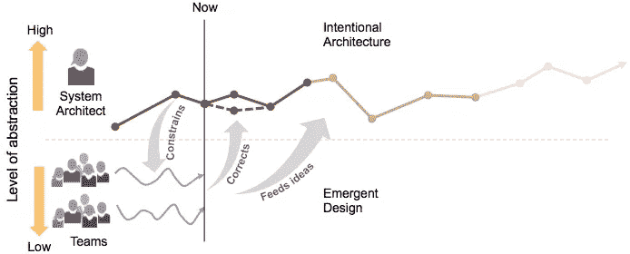
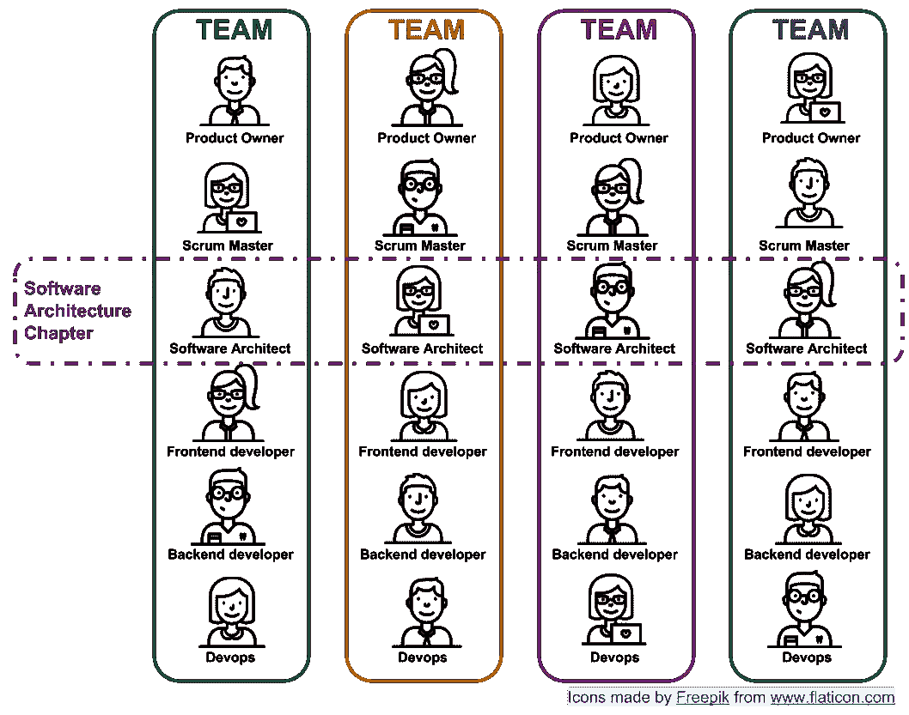

# 软件架构和敏捷。他们俩真的合得来吗？

> 原文：<https://medium.com/quick-code/software-architecture-and-agile-are-they-both-really-compatible-c1eef0afcbb1?source=collection_archive---------1----------------------->

Photo by [rawpixel](https://unsplash.com/photos/r6FbzziRN88?utm_source=unsplash&utm_medium=referral&utm_content=creditCopyText) on [Unsplash](https://unsplash.com/collections/2338982/titelbilder?utm_source=unsplash&utm_medium=referral&utm_content=creditCopyText)

在本文中，我们将讨论如何将软件架构和敏捷方法结合使用，以充分利用它们。

# 什么是软件架构？

有大量不同的定义来描述什么是软件架构。这个特别吸引我:

*“一组关于软件解决方案必须如何在给定边界(通常是一个企业)内构建的原则和约束条件”*

*原则和约束的一些例子有:*

*   *只有基于 JVM 的编程语言*
*   *通过 REST APIs 实现组件间的同步通信。每一个 API 规范都必须用 Swagger 来写。*
*   *使用公司消息代理(即:RabbitMQ)的异步通信*
*   *通过 ELK 进行跟踪(审计、日志)。每条消息都必须有特定的格式。*

理想情况下，这组原则和限制会受到它所支持的业务的影响。因此，为核电站开发软件可能与为营销公司开发软件有很大不同。

此外，与任何软件一样，质量属性(非功能需求)必须包括在内:

*   高可用性
*   安全性
*   表演
*   可变性
*   易测性
*   等等…

这些质量属性的平衡应该以构建解决方案所要求的方式来建立。构建一个供局域网内的两个用户查询数据的小型 web 应用程序，显然与管理病历的系统(安全性)或控制铁路交通的软件(性能、可用性、健壮性)不同。质量属性显然会有所不同。

因此，**架构设计**正在应用这些原则、功能性和非功能性需求来构建技术解决方案:组件、接口、关系、结构等等…

Martin Fowler 将软件架构描述为难以改变的决策。一句简单而精彩的引言。

# 为什么是软件架构？

随着软件解决方案数量的增长，这些解决方案之间需要一定程度的同质化。在大多数情况下，这一过程会产生经济影响。直接或间接节约成本。[学习软件设计&架构](https://blog.coursesity.com/best-software-design-architecture-tutorials/)网上有最好的课程&教程适合初学者到高级水平。

让我们回到上一部分，我们假设在一个企业(或其中的一个子集)中，只能使用 JVM 语言。是什么导致一群架构师(或任何人)做出这样的决定？为什么他们把软件开发限制在特定的语言上？此外，如果我们希望我们的组件通信通过 REST APIs 来完成，编程语言将不会成为障碍，因为服务 API 本身将抽象出与用于实现每个组件的语言的关系:高内聚和低耦合。

正如我们前面提到的，原因通常是经济上的。如果整个平台使用七种不同的语言构建，会发生什么？这样一个平台的开发者应该具备哪些技能？如果我们想为每种语言雇佣企业支持，会发生什么？这些东西在生产中是如何运行的:监控、升级、基础设施等等？如果我们想提供一个公司软件框架来开发不同的组件，会发生什么？我们必须用七种不同的语言来实现它吗？这些只是没有这种约束会出现的一些问题。因此，最初被认为是一种限制(仅使用一种编程语言)的东西，在将来会成为节省成本的一种方式。显然，这些种类的约束导致了必须考虑企业文化来分析的缺点。

因此，如果软件架构满足架构驱动因素(原则和约束)，为代码的其余部分提供必要的基础，并将作为解决底层业务问题的平台，那么它将是有价值的。

# 什么是敏捷？

本质上，敏捷是关于快速行动和拥抱变化。就是持续改进。敏捷就是在短时间内给出一个高质量的好解决方案。它是关于清除废物(所有不值得的东西)。

有不同的敏捷方法，比如基于自治和自组织团队的 Scrum。Scrum 依赖于迭代(循环重复，通常间隔很短)和增量(提供新功能)过程。

但是，这些自主和快节奏的团队如何与一组原则和限制相匹配来构建软件解决方案呢？“设计”解决方案的过程会延迟持续的价值交付吗？也许关键点是，在每次迭代中，我们要在“架构”上花费多少时间？

毫无疑问，这个问题没有简单而明确的答案。最明智的答案应该是“刚刚好”。满足构建解决方案的原则、愿景和约束的最小架构量。再问一次，多少才算“刚好够”？

这取决于要构建的项目/产品。如果我们在一个非常混乱的项目中，有很多变化，那么前期架构的数量可能会比更稳定的项目少，在更稳定的项目中，提前做一些设计会更容易。作为一个规则，建议在项目开始时做一些前期设计(Sprint Zero？)和第一次迭代之前。此外，我们应该在每个用户故事中包含一个“架构回顾”作为 DoD 定义的一部分。当然，在 Sprint 规划中，这一事实必须考虑在内。如果至少有一个团队成员(如果不是所有成员)负责确保产品开发和架构是一致的，这将是值得的。

如果我们只是希望软件架构简单地出现，我们可能会因为缺乏前期设计而陷入一系列的“重构冲刺”,特别是对于大型复杂的项目。正如 Martin Fowler 所说，架构是一组很难改变的相关决策。忽视这样的决策会导致延迟和巨大的技术债务，这与敏捷哲学相矛盾。

# 我们需要多少软件架构？

答案可能是这样的，满足原则、约束、功能和非功能需求以及提供构建解决方案的基础的最小量。

让我们看一些不同的场景。如果我们要构建一个解决方案来收集和查询与我们客户的临床历史相关的数据，那么软件架构可能会受到许多关于如何访问数据、模糊处理、证书、跟踪、协议等政策的强烈影响…

另一方面，如果我们因为系统不可维护且技术过时而重新构建系统，那么肯定会出现一些关于模块化、可测试性、新技术堆栈等的原则。

最后，由于产品本身的不确定性，当致力于一个新的实验产品时，轻量级架构将是必需的。

许多企业都有自己的框架来实现一些架构原则。当敏捷团队在构建解决方案时，恰当地使用它是非常值得的。要做到这一点，我们应该确保至少有一个团队成员能够深刻理解这样一个框架，从而确保效率、发现缺陷并帮助提高效率。

# 大型企业中的软件架构和敏捷方法

有人可能会问，自治的和自组织的团队如何充分利用软件架构？我们怎样才能让软件架构在不阻碍团队的情况下发展？

自治的和自组织的团队通常专注于整个企业中的特定领域，这很好。然而，这样一个团队很难有一个全球性的洞察力，让他们预测可能出现在其背景之外的问题。

很可能，他们不会理解整个系统，这一事实**可能会导致他们在企业的全球背景下构建冗余解决方案或异构设计**:可能其他团队以前处理过相同的问题。这就是让一个人或一个团队负责在高层次上照看软件架构的原因。

另一方面，**改进和优化参考软件架构**，创新过程本身**不应该是由一群人拥有的集中任务**，而是可以从整个组织内的任何团队中涌现出来的东西。显然，每个新出现的想法(容量、创新、组件等)都必须以集中的方式管理并包含在参考架构中。

在 [SAFe 框架](https://www.scaledagileframework.com)中有一个有趣的概念，试图利用这两种方法，称为[敏捷架构](https://www.scaledagileframework.com/agile-architecture/)。起点是一点软件架构(前期设计)，它是自治团队的紧急设计的反馈。

这样做我们得到两个好处:

*   拥有帮助我们构建解决方案的参考架构
*   让团队有一定程度的创新，与此同时，这将充实架构，并允许其他团队利用这一点。

# 我们如何让软件架构和敏捷团队保持一致？

当我们提到敏捷和自治团队时，我们也指多技能团队。这样的团队由 dev-ops、scrum master、产品负责人、前端开发人员、后端开发人员、QA、技术负责人等组成。这就是技术领导者发挥关键作用的地方。

技术领导或软件架构师将负责在团队中分享架构的愿景和路线图。他或她将负责解决技术问题，处理创新需求，并使其与参考架构同步。

当然，软件架构师不是权威，而是指导者，他教导并帮助提高敏捷团队与他们紧密合作的效率。此外，他或她必须对参考架构有深刻的理解，并且必须与其他团队的软件架构师保持联系。).

如果我们想拥有不会导致混乱的自主团队，沟通和原则的一致性将会起到关键作用。连贯性和一致性只能通过引入一定程度的控制来实现。

# 进一步阅读

*   [书:实践中的软件架构(软件工程中的 Sei 系列)](https://amzn.to/2S2jtPG)
*   [书:开发者的软件架构](http://bit.ly/2X8MRHV)
*   [书:可扩展的敏捷框架(安全)](https://amzn.to/2S6HvsW)

# 结论

敏捷方法和软件架构不是不兼容的，而是互补的。这样的架构不应该被认为是团队能力的限制因素，而是敏捷供应链中的增强因素。

非常感谢 Martin W .帮助我完成这篇文章:)