# 软件体系结构——追求“没有名字的质量”

> 原文：<https://medium.com/walmartglobaltech/software-architecture-quest-for-quality-without-a-name-92478f671fed?source=collection_archive---------1----------------------->

Photo Source: Smithsonian Magazine

什么是好的软件架构？

这是韦伯斯特的意思—

> **建筑** [**名词**](https://www.merriam-webster.com/dictionary/noun)
> 
> 1:建筑的艺术或科学
> 
> 特别是:设计和建造结构，尤其是可居住的结构的艺术或实践
> 
> 2:组织和集成计算机或计算机系统组件的方式//不同的程序*架构*

计算机软件架构已经发展了很多，并且仍在快速发展。我想了解处理建筑物和结构的体系结构与软件体系结构之间的关系，特别是软件模式运动。

在我职业生涯的早期，我偶然发现了设计模式，并拿起了一本当时最广为人知的模式著作——四人帮(GOF) [设计模式](https://en.wikipedia.org/wiki/Design_Patterns)一书，作者是 [Erich Gamma](https://en.wikipedia.org/wiki/Erich_Gamma) 、Richard Helm、 [Ralph Johnson](https://en.wikipedia.org/wiki/Ralph_Johnson_(computer_scientist)) 、 [John Vlissides](https://en.wikipedia.org/wiki/John_Vlissides) 。在学习模式运动和历史的过程中，我遇到了 [Christopher Alexander](https://en.wikipedia.org/wiki/Christopher_Alexander) 和他的开创性著作[The Timeless Way of Building(1979)](https://en.wikipedia.org/wiki/The_Timeless_Way_of_Building)，这本书对软件设计和架构产生了巨大的影响，但我当时没有意识到它的全部影响。很久以后，我最近又读了亚历山大的书，这简直令人大开眼界。

他的*模式语言*概念引发了[hill side Group](https://hillside.net/)中的软件模式运动，许多杰出的软件专业人士为软件模式的发展做出了贡献。它催生了旗舰模式会议，称为[模式语言会议](https://www.hillside.net/plop/2020/)，缩写为扑通。扑通一声从 1994 年开始在美国举行。

**没有名字的质量**

对亚历山大作品的短暂研究。

是什么让一个建筑变得好坏？为什么有些建筑是活泼的？在世界各地，有一些历史悠久的古代建筑是独特的，有一个字符。建筑、街区和城镇有着一些共同的特征，我们可以在它们身上看到一些重复的“模式”,尽管每个建筑都是独一无二的。这些建筑和街区有一些当地的地理和文化特征。有些还活着，充满活力，有些却没有。是什么让他们如此？在所有这些建筑中，让人“感觉”它是好是坏的核心是什么？

一个人、一个城镇、一座建筑或一片荒野都有一种核心品质，这是生命和精神的根本标准。这种品质是客观的、精确的，但无法命名。现在，我们知道，没有名字的品质，在感觉和性格上是什么样的。但到目前为止，具体地说，我们还没有在任何比一棵树，一个池塘，一条长凳更大的系统中看到这种品质。然而，它可以存在于任何事物中——建筑物、动物、植物、城市、街道、荒野——也可以存在于我们自己身上。只有当我们首先在自己身上理解它时，我们才能开始具体地理解它，在世界的所有这些更大的部分中。例如，这是吉普赛人在马路上跳舞时的狂笑。”—亚历山大

亚历山大认为，这种品质无法用一个词来描述，因为词太宽泛，品质太具体。他认为，各种各样的词，如活着，完整，舒适，自由，准确，无我，永恒等可能接近，但没有抓住这种品质的全部本质，因此它不能被命名！我们可以通过观察在那个地方发生的事件的某些*模式来开始理解它。*

一个模式的例子是“坐在门廊上看着世界走过”。门廊可以让人们坐下来，看着世界流逝。同样，“壁龛”在卧室的墙壁上给人一种舒适的感觉。“入口过渡”是另一种模式。建筑本质上变成了这些模式的集合，每个模式都是由那里发生的事件的模式定义的。这些模式集合形成了一种模式语言。

人们可以通过使用被称为*的语言来塑造建筑物。利用这些，人们可以创造出各种各样新颖独特的建筑。例如，农民用模型建造谷仓。这些模式被表达为经验法则，任何农民都可以通过使用模式语言来组合和重新组合，以制造无限种独特的谷仓。亚历山大在伯尔尼高地的一座农舍的模式语言概要示例:*

南北轴

斜坡下的西面入口

两层楼

行李架上的干草阁楼

前面的卧室

南面的花园

斜屋顶

朝向花园的阳台

雕刻饰品

每一种模式都以规则的形式表现出来，告诉农民该做什么。

当这些模式被一个社区或城镇共享时，你会看到相同的*质量，只是没有名字*出现在所有那些社区和城镇中。这就是它们获得独特性的方式。想想纽约或旧金山的住宅建筑。这些建筑有着重复的模式和特征，尽管每座建筑都有其独特之处。

模式是由三部分组成的规则，它表达了特定上下文、问题和解决方案之间的关系。

亚历山大认为模式本身除了对整体有所贡献之外一无是处。一个活的建筑不是任何人的想法或观点，而是它“感觉”很好，很自然，有一种没有名字的品质。当一座建筑拥有这种没有名字的品质时，它就与自然融为一体了。

**软件连接**

这些和软件架构有什么关系？

软件架构与建筑有许多相似之处。软件模式类似于建筑模式。模式运动在 20 世纪 90 年代早期支持这种关系，并产生了各种作品，如四人帮(GoF) **设计模式**，肯特·贝克的**实现模式**等等。还有很多其他模式，如断路器、调度模式等等。

问题依然存在— *什么是好的软件架构？在软件中有没有一种没有名字的质量？如果有，我们如何实现它？*

*亚历山大的模式语言带来了一种在建筑/街区没有名字的品质。以此类推，软件模式语言也可以对软件架构做同样的事情。本质上，软件的质量来自于所采用的模式。*

这些建筑具有直观和有形的优势，事实上，亚历山大认为，无论使用什么样的模式，建筑的活力必须被感受到。这不仅仅是某个人对架构的看法或想法。它通过它解决的*力系统*和它产生的*事件模式*而存在。

另一方面，软件架构不是有形的，只有用户界面是可见的。软件架构的质量取决于它满足业务和技术需求的程度。编写和维护代码的开发人员会感觉到*T21。它可以让企业更快、更有效地实现业务目标。在生产中参与运行它的操作&支架会*感觉到*。质量和安全团队感受到了它减少生产事故的方式。*

本质上，由软件模式生成的事件的*模式可以很好地衡量这种无形的、看不见的、难以捉摸的*质量，没有名字*。*

类似于亚历山大模式语言塑造的建筑，软件可以使用软件模式语言来构建。这样生产出来的软件具有那种质量，却没有一个让它变好的名字！当这些模式被软件社区共享时，会在其他软件中产生相同的*质量，但没有名字*。

**山姆会员店新电子商务平台(Ada)**

这让我们想到了艾达。当我们开始将我们的传统平台现代化为新的电子商务平台时，一个自然的问题出现了，即该架构的质量和功效。新架构如何为在山姆会员店购物的会员带来最佳体验？有没有可能感知到这个架构中的 ***品质*** ？

根据上面的软件连接推论，**检查 Ada 中没有名称的*质量的一种方式***是查看构建它时使用的*模式*。

首先，这是在 Ada 中要解决的力的系统

*   单一的思维模式来自一个单一的服务器，一个单一的代码库，有很多开发人员。
*   每月发布，所有功能每月同步。
*   每个人都可以修改任何东西，这就是昂贵的代码修改的原因。
*   有限的可扩展性和可用性；由于大量意外代码复杂性导致的生产事故而难以维护
*   从具有较高延迟/滞后的日志数据中推断出的指标。
*   部署在非工作时间进行，给所有人带来了负担
*   假期准备需要几个月的计划
*   ……

Ada 中使用了许多模式来对抗这些势力，但这里有一个*例子* **Ada 的模式语言** ( *仍在发展*):

微服务

领域驱动设计

CQRS[命令查询责任分离]

使用故障模式分析建立弹性

预计算

服务水平目标

[12 个因子应用](https://12factor.net/)

轮毂和辐条

独立于测井的遥测技术

可扩展的并发缓存

特高频噪声

每个版本单独部署

[断路器](https://martinfowler.com/bliki/CircuitBreaker.html)

[云原生](https://github.com/cncf/toc/blob/master/DEFINITION.md)

无服务器

下面详细介绍上面的一些重要模式和它生成的事件 的 ***模式，以及这些事件如何有利于业务评估 Ada 架构中没有名称的 ***质量——******

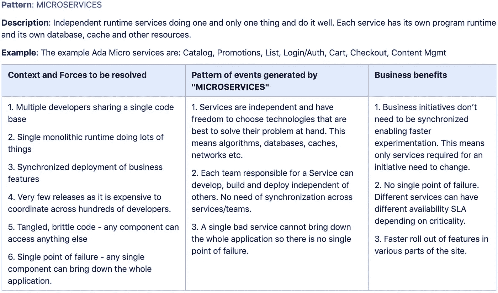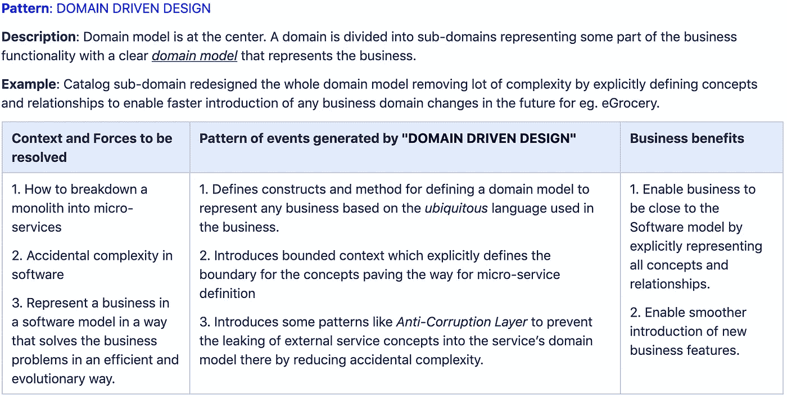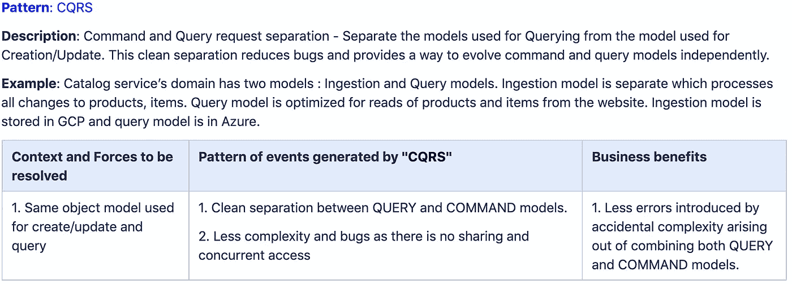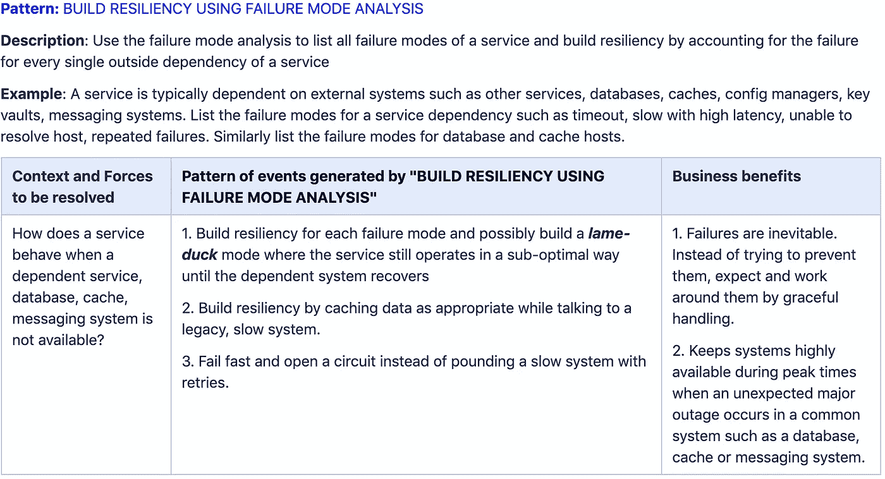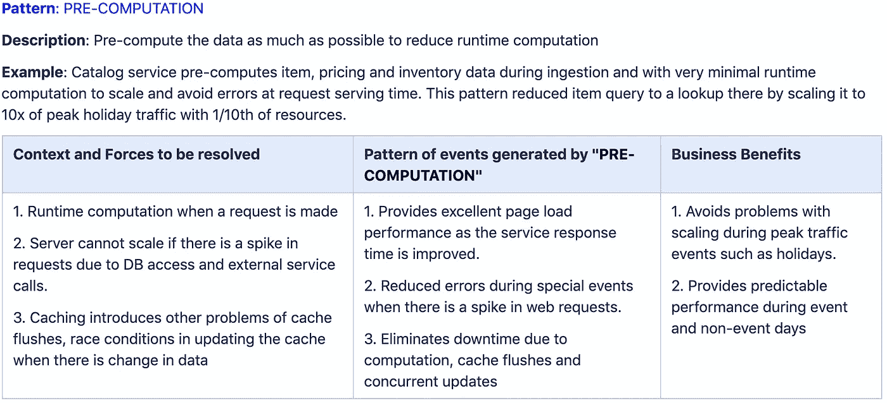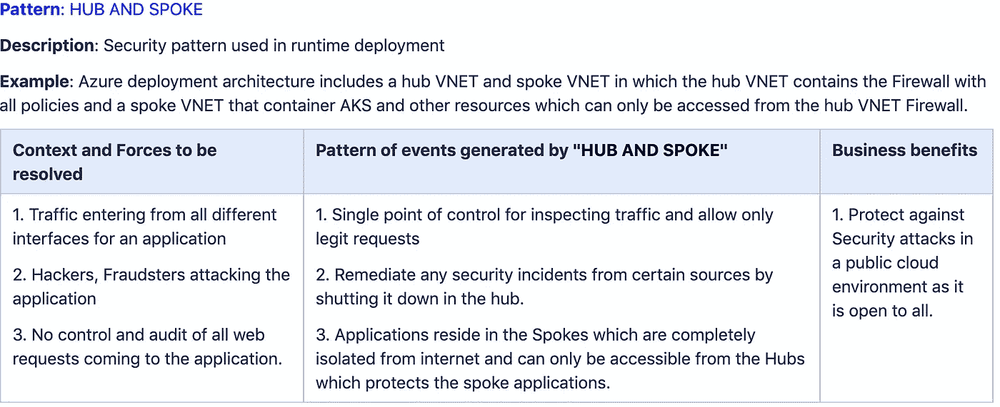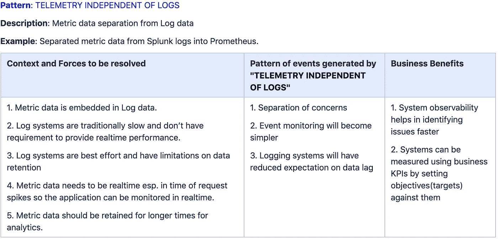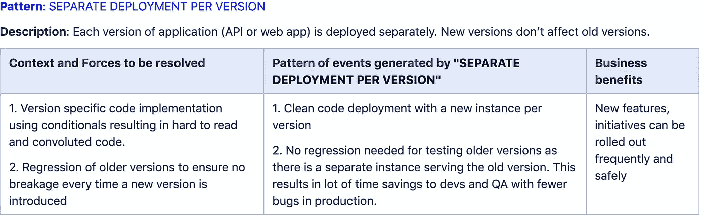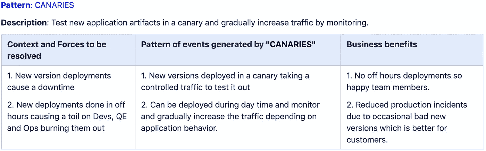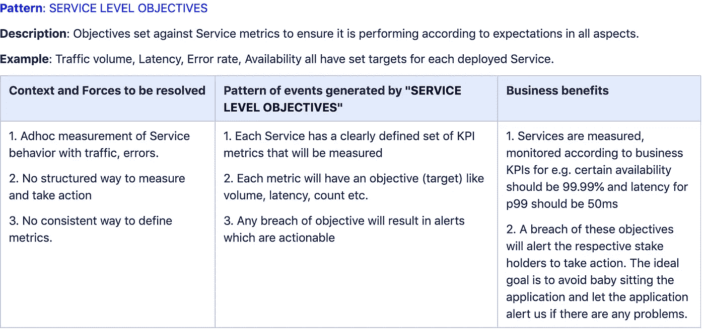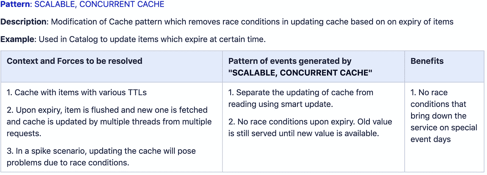

# 结论

以上每一种模式都有助于形成整体，类似于亚历山大式的“*卧室墙上的凹室”或*“*阳台朝向花园*”。上面的一些模式是行业标准的最佳实践，一些是特定于 Samsclub 的。架构的质量是由这些模式产生的事件模式决定的。

Alexanders 模式语言提供了一个框架，通过软件模式来实现软件体系结构中的“无名质量”,为我们提供了一种评估体系结构好坏的方法。