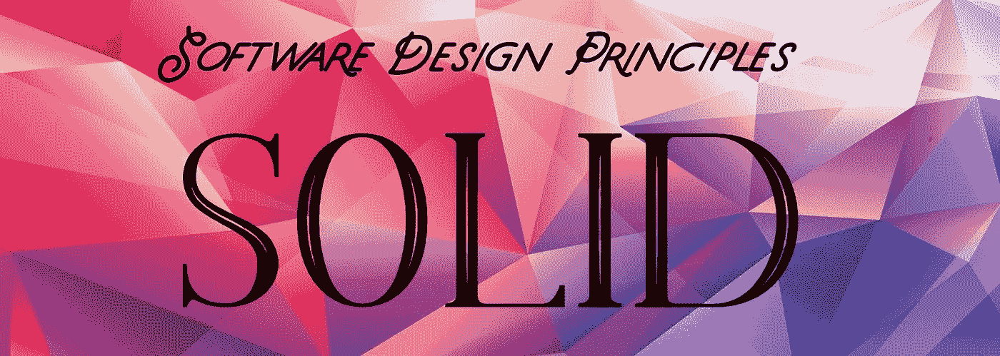

# 软件设计原则

> 原文：<https://medium.com/globant/software-design-principles-a481d850b5c1?source=collection_archive---------0----------------------->

## 成为一名神盾局程序员:(第二部分)



```
Be a S.O.L.I.D. Programmer: (Part 1) “[Characteristics of a Poor Software Design](/globant/characteristics-of-a-poor-software-design-de71e7b7a73c?source=your_stories_page-------------------------------------)” helps you understand basics of poor software design and how to identify them.
```

在我成为神盾局程序员的旅程中，第一步是要详细了解糟糕设计的特征，如刚性、脆弱性、不可移动性和粘性。在我意识到如何识别糟糕的设计后，我开始探索解决方案来摆脱这些特征，我在软件设计原则中找到了这些问题的解决方案。这些原则有助于保持设计的简单性、可维护性、对未来范围的灵活性，并使代码可重用。此外，由于代码是模块化的，所以独立测试每个组件更容易。

软件设计原则是做出好的系统设计的指导方针，使我们能够做出重要的决定。这些原则用于提供有效处理设计过程复杂性的方法。这些原则减少了引入设计错误的机会。

有 5 个最著名的设计原则。这些也被称为坚实的原则。S.O.L.I.D .就是通过使用抽象和继承来管理依赖关系。模块和类应该松散耦合。

*   **单一责任原则**
*   **开启关闭原理**
*   **利斯科夫的替代原理**
*   **界面偏析原理**
*   **依存倒置原则**

```
**Note:** For demonstration purpose, this article uses Java examples but the Software Design principles apply to any computer programming language.
```

S单一责任原则


当一个人或一个实体承担多重责任时，很难在所有人之间保持平衡。类似地，当在一个类中添加多个职责时，一个功能中的更改可能会在其他地方导致意外错误，从而使代码变得脆弱。这使得类非常复杂，很难维护。

单一责任原则指出:

> ***每个类应该只有一个改变实现的理由。如果有两个原因，功能应该分成两类。***

单一责任原则有助于降低应用程序的复杂性。这一原则的主要意图是脱钩和增强凝聚力。

让我们以类 *EmployeeStore* 为例，它实现了方法 *getEmployeeById* ()、 *addEmployee* ()和 *sendEmail* ()。一个类有两个职责，一个是处理员工对象，另一个是发送电子邮件。每当任何一个功能发生变化，都需要修改同一个 *EmployeeStore* 类。这可能会导致其他功能中不必要的错误。

```
public class Employee
{
    public Employee getEmployeeById(Long id){
    // get Employee
    }

    public void addEmployee(Employee employee){
    // add employee
    }

    public void sendEmail(Employee employee, String content){
    // send email
    }
}
/****************************************************************/
```

因此，如果代码被分成两个不同的类，比如类 *EmployeeStore* 和类 *EmailSender* ，那么每个类都只有一个改变的理由。

```
public interface IEmployee {
    public Employee getEmployeeById(Long id);
    public void addEmployee(Employee employee);
}
/****************************************************************/public class Employee implements IEmployee{
    private EmailSender emailSender; @Override
    public Employee getEmployeeById(Long id) {
    // Get Employee
    }@Override
    public void addEmployee(Employee employee) {
    // Add Employee
    }
}
/****************************************************************/public class EmailSender
{
    @Override
    public void sendEmail(Employee employee, String content) {
        //send Email
    }
}
/****************************************************************/
```

***优点*** :

*   它降低了复杂性，使代码更容易理解。
*   使代码模块化
*   使实施和测试新的增强功能变得容易，而不会影响其他功能

违反*单一责任原则* ***、*** *导致模块间*难以预见的传递依赖，导致代码中*脆弱*。

OO**笔关闭原理**


Image Credits : GIFsBOOM.net

在软件生命周期中，由于客户需求或未来的发展，将需要增强。

每当需要更改时，总是倾向于扩展原始功能，而不是更改原始代码。这些代码增强可能会在旧代码中引入错误，使代码变得脆弱，并且需要额外的测试工作。

在进行任何软件开发时，我们必须具有前瞻性并预测需求的变化，并且应该能够扩展现有的代码以引入新的功能。

在下面的计算器例子中，*加法*和*减法*是扩展*计算器运算*接口的两个类。类*计算器*根据类的实例执行特定的操作。每次有需要添加额外操作时，*计算器*类都要被修改。这意味着我们正在修改现有的代码，这可能会在代码中引入新的错误。

```
public interface ICalculatorOperation {
}
/****************************************************************/
public class Addition implements ICalculatorOperation {
    private double leftValue;
    private double rightValue;
    private double result = 0.0;

    public Addition(double leftValue, double rightValue) {
        this.leftValue = leftValue;
        this.rightValue = rightValue;
    }

    // getters and setters
}
/****************************************************************/public class Subtraction implements ICalculatorOperation {
    private double leftValue;
    private double rightValue;
    private double result = 0.0;

    public Subtraction(double leftValue, double rightValue) {
        this.leftValue = leftValue;
        this.rightValue = rightValue;
    }

// getters and setters
}
/****************************************************************/

public class Calculator {
    public void calculate(ICalculatorOperation operation) { if (operation == null) {
            throw new InvalidParameterException("Can not perform operation");
        }
        if (operation instanceof Addition) {
            Addition addition = (Addition) operation;
            addition.setResult(addition.getLeftValue() +         addition.getRightValue());
        } else if (operation instanceof Subtraction) {
            Subtraction subtraction = (Subtraction) operation;
            subtraction.setResult(subtraction.getLeftValue() - subtraction.getRightValue());
        }
    }
}
/****************************************************************/
```

上述代码违反了开闭原则。为了实现开放关闭原则，代码可以像下面提到的那样实现，这将使代码为增强而开放，为修改而关闭。在下面的例子中，如果假设将来需要添加新的运算*乘法*，现有代码不需要任何修改。开发人员必须创建新的类乘法来实现接口*icaculatoroperation*和实现方法 *performOperation* ()

```
public interface ICalculatorOperation {
    void performOperation();
}
/****************************************************************/public class Addition implements ICalculatorOperation{
private double firstValue;
private double secondValue;
private double result = 0.0;public Addition(double firstValue, double secondValue) {
this.firstValue = firstValue;
this.secondValue = secondValue;
}
//Setters and getters@Override
public void performOperation() {
result = firstValue + secondValue;
}
}
/****************************************************************/public class Substraction implements ICalculatorOperation{
private double firstValue;
private double secondValue;
private double result = 0.0;public Substraction(double firstValue, double secondValue) {
this.firstValue = firstValue;
this.secondValue = secondValue;
}
//Setters and getters@Override
public void performOperation() {
result = firstValue - secondValue;
}
}
/****************************************************************/public interface ICalculator {
void calculate(ICalculatorOperation operation);
}
/****************************************************************/public class Calculator implements ICalculator{@Override
public void calculate(ICalculatorOperation operation){
if(operation == null) {
throw new InvalidParameterException("InvalidParameterException");
}operation.performOperation();}
}
/****************************************************************/
```

这通过限制开发人员添加快捷方式修复和中断设计来避免代码的粘性。

***优点*** :

*   通过扩展核心功能，未来的增强更容易实现
*   消除了在现有功能中引入错误的可能性

违反*的开闭原则*导致在执行任何代码变更时相关模块的级联变更，这无非是在代码中引入*刚性*、脆弱和不动。

L伊斯科夫替代原理

里斯科夫替代原则是罗伯特·马丁的第三个坚实的设计原则。这最初是由芭芭拉·利斯科夫在 1987 年提出的。它扩展了开放封闭原则，能够在不破坏应用程序的情况下用子类的对象替换超类的对象。

子类型不能自动替换父类型。为了变得可替换，子类型必须表现为父类型。这避免了代码的脆弱性和不可移动性。

利斯科夫的替代原理指出:

> ***‘任何新的派生类都应该能够在代码没有任何变化的情况下替换基类。’***

下面的例子可以更深入地理解里斯科夫的替换。

我们有一个抽象类*成员*，它有两个抽象方法 *addToDatabase* ()和 *borrowBook* ()。我们有三个子类，*生命期成员*、*年度成员*、*查询*，它们是*成员*类的扩展。

```
public abstract class Member {
   public String name;
   public Date date;
   public String bookname;

   public Member(String name, Date date, String bookname) {
      super();
      this.name = name;
      this.date = date;
      this.bookname = bookname;
   }

   public abstract void addToDatabase();

   public abstract void borrowBook();
}
********************************************************************
public class LifeTimeMember extends Member {

   public LifeTimeMember(String name, Date date, String bookName) {
      super(name, date, bookName);
   }

   @Override
   public void addToDatabase() {
      System.out.println("LifeTimeMember added to Database");
   }

   public void memberOffer() {
      System.out.println("Special Offers for Lifetime member");
   }

   @Override
   public void borrowBook() {
      System.out.println(bookname + " is borrowed on Date " + date);

   }
}
********************************************************************
public class AnnualMember extends Member{

   public AnnualMember(String name, Date date, String bookName) {
      super(name, date, bookName);
   }

   @Override
   public void addToDatabase() {
      System.out.println("Annul member added to Database");

   }

   public void sendRenewalNotification(String endDate) {
      System.out.println("send Renewal Notification");
   }

   @Override
   public void borrowBook() {
      System.out.println(bookname +" is borrowed on Date "+date);

   }
}
********************************************************************
public class Enquiry extends Member {

   public Enquiry(String name, Date date, String bookName) {
      super(name, date, bookName);
   }

   @Override
   public void addToDatabase() {
      System.out.println("Enquiry request added to Database");
   }

   @Override
   public void borrowBook() {
      System.out.println("Not allowed to borrow book without membership");
   }
}********************************************************************public class Library {

   public static void main(String[] args) {
      List<Member> libraryVisitors = new ArrayList<Member>();

      libraryVisitors.add(new LifeTimeMember("member1", new Date(), "Book1"));
      libraryVisitors.add(new AnnualMember("member2", new Date(), "Book2"));
      libraryVisitors.add(new Enquiry("member3", new Date(), "Book3"));

      for (Member visitor : libraryVisitors) {
         visitor.addToDatabase();
         visitor.borrowBook();
      }
   }
}
********************************************************************
```

在这个例子中，所有的类都正确地使用了 *addTodatabase* ()方法，但是查询类没有完成*成员*类的所有操作，因为*查询*类用户不允许*借阅 Book()。*这就是为什么*查询*类不能替换*成员*类，违反了 Liskov 的替换原则。另一方面， *LifeTimeMember* 类和 *AnnualMember* 类可以执行*成员*类所需的所有操作，并且可以完美地替代父类*成员*。对于*生命期成员*类和*年度成员*类，利斯科夫的替换原则在这里得到了很好的实现。

有一些规则可以遵循并用于 Liskov 原则，以确保创建行为良好的子类型。它们是签名规则、属性规则和方法规则。

**签名规则:**
***方法参数类型*** —该规则声明被覆盖的子类型方法参数类型可以与父类型方法参数类型相同或比其更宽。
***返回类型*** —被覆盖的子类型方法的返回类型可以比超类型方法的返回类型窄。这被称为返回类型的协方差。协方差表示何时接受子类型代替超类型。Java 支持返回类型的协变性。
***异常*** —子类型方法可以抛出比超类型方法更少或更窄(但不是任何附加或更宽)的异常。

**属性规则:**
***类不变量*** —不变量规则声明所有子类型方法(继承的和新的)必须维护或加强超类型的类不变量。
***历史约束*** —历史约束声明子类方法(继承的或新的)不应该允许基类不允许的状态改变。

**方法规则:**
***前提条件*** —子类型可以削弱(但不能加强)它所覆盖的方法的前提条件。
***后置条件*** —子类型可以加强(但不能削弱)它所覆盖的方法的后置条件。当子类型加强后置条件时，它提供的不仅仅是超类型方法。

**优势**:

*   松散耦合且灵活的代码
*   易于处理不断变化的需求

I界面偏析原理

如果许多方法是在一个大的接口中编写的，那么实现该接口的类必须实现冗余的方法。相反，如果我们将接口分成多个更小的接口，使接口中的方法尽可能粒度化，就可以避免编写冗余代码。

界面分离原则规定:

> ***创建更小的接口，这样实现这些接口的类只有必需的方法，而不必强制实现接口拥有的不必要的方法。***

```
public interface RestaurantInterface {

    public void acceptOnlineOrder();
    public void acceptWalkinOrder();
    public void acceptOnlinePayment();
    public void PayInPerson();

}
/****************************************************************/public class WalkinCustomerImpl implements RestaurantInterface{
    //implement all the methods
}
/****************************************************************/public class OnlineCustomerImpl implements RestaurantInterface {
    // implement all the methods
}
/****************************************************************/
```

不是在一个界面中添加所有内容，而是可以根据需要进行分离，如下所示。它将避免重写不相关的方法。这使得代码可重用、解耦并实现可移动性。

```
public interface PaymentInterface {
    public void payforOrder();
}/****************************************************************/public class WalkinCustomerPaymentImpl implements PaymentInterface{
    public void payforOrder() {
     // Implement methods specific to payment
    }
}
/****************************************************************/public class OnlineCustomerPaymentImpl implements PaymentInterface{
    public void payforOrder() {
     // Implement methods specific to payment
    }
}
/****************************************************************/public interface OrderInterface {
    public void placeOrder();
}
/****************************************************************/public class WalkinCustomerOrderImpl implements OrderInterface{
    public void placeOrder() {
     // Implement methods specific to placing order
    }
}
/****************************************************************/public class OnlineCustomerOrderImpl implements OrderInterface{
    public void placeOrder() {
    // Implement methods specific to placing order
    }
}
/****************************************************************/
```

**优点:**

*   代码很容易理解
*   代码易于维护

D依赖反转原理

> 这个原则声明，高级模块应该基于抽象，而不是低级类的具体实现。

根据这一原则，可以很容易地实现松散耦合的代码，避免固定性和刚性。

通过这种方式，基类可以具有基本的功能，并且业务逻辑可以在派生类中实现。

因此，当实现开闭原则和 Liskov 的替换原则时，这些类遵循依赖倒置原则。

一、**开闭原则**保持代码开放以增强，关闭以修改

二。 **Liskov 的替换原则**在不影响功能的情况下，用超类轻松替换子类。

**优点:**

*   易于适应需求的变化，而不影响原始功能

希望这篇文章能帮助你理解软件设计原则，并使设计决策更简单。