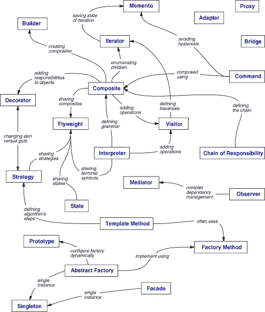

# 软件工程中设计模式的介绍

> 原文：<https://medium.easyread.co/software-development-with-design-pattern-in-ios-826a4506c63a?source=collection_archive---------3----------------------->

## 设计模式在软件工程中到底有多重要？

简而言之， ***设计模式*** 是开发人员使用的指导方针，作为构建一个软件的解决方案，该软件可以用于****重复系统*** 和 ***一般*** 问题。*

****供你参考*** ，当工程师不理解设计模式的原因时，设计模式是最有害的。设计模式不像是从魔法中学来的咒语，可以立刻解决。*

*设计模式的一个好的实现是当我们能够识别问题的场景时，哪些模式适合解决。设计模式鼓励关注点的分离，应用程序的每个部分都被分组到可以相互通信的模块中。*

*设计模式分为三个基本组:*

1.  ***行为模式***
2.  ***创作模式***
3.  ***结构模式***

# *行为模式*

****行为设计模式*** 被表示为对象之间**通信**的机制。通过这样做，这些模式增加了执行这种通信的灵活性。*

*这里的一些类型的**行为模式**是:*

*   ***观察者模式**:允许对象“发布改变”其状态的过程(事件监听器)。例子: [**观察者模式**](https://github.com/wliam06/design-patterns/tree/master/Behavioral%20Pattern/ObserverPattern)*
*   ***策略模式**:在类中“封装算法”的过程。例如:[**strategy pattern**](https://github.com/wliam06/design-patterns/tree/master/Behavioral%20Pattern/StrategyPattern)*

# *创造模式*

****创造设计模式*** 表现为**创造** an 对象的机制。使用创建模式，它通过控制对象创建来帮助我们解决创建对象的复杂性。*

*这里有一些类型的**创作模式**是:*

*   ***Singleton 模式:**一个类的流程实例到一个【单个*】*实例。例子:[**singleton pattern**](https://github.com/wliam06/design-patterns/tree/master/Creational%20Pattern/SingletonPattern)*
*   ***抽象模式:**不指定具体类而“创建相关”接口的过程。例子: [**抽象模式**](https://github.com/wliam06/design-patterns/tree/master/Creational%20Pattern/AbstractPattern)*

# *结构模式*

*结构设计模式被表示为**识别**对象和实体之间关系的机制。*

*这里的一些类型的**结构模式**是:*

*   ***适配器模式:**通过包装在两个原本不兼容的类型之间提供链接的过程。例如:[**adapter pattern**](https://github.com/wliam06/design-patterns/tree/master/Structural%20Pattern/AdapterPattern)*
*   ***装饰模式:**动态修改对象的过程。例子:[**decorator pattern**](https://github.com/wliam06/design-patterns/tree/master/Structural%20Pattern/DecoratorPattern)*

*在我们已经知道了上面的设计模式的类型之后，这个图将指导我们关于模式关系的问题:*

**

*Pattern Relationship*

# *结论*

*设计模式提供了一种解决开发相关问题的方法。他们隔离了系统需求中可能存在的可变性，使得整个系统更容易理解和维护。除此之外，设计模式使沟通变得更加有效。*

*但是在实现设计模式之前我们需要知道的事情是**理解我们需要什么**。否则，这将导致*超过工程*(过多的性能在*成本*、*尺寸*、*重量*、*复杂性*等方面给产品带来负担)。*

*在软件工程中，软件开发原则有 [**吻**](https://en.wikipedia.org/wiki/You_aren%27t_gonna_need_it) ( *保持简单愚蠢！*)、[**YAGNI**](https://en.wikipedia.org/wiki/You_aren%27t_gonna_need_it)**(*你不会需要它的*)、 [**干**](https://en.wikipedia.org/wiki/Don%27t_repeat_yourself) ( *不要重复自己* ) 还有很多。它帮助你提醒什么是软件工程师应该做的。***

***要了解更多关于**设计模式**和如何使用的细节，请查看这个:[https://github.com/wliam06/design-patterns](https://github.com/wliam06/design-patterns)***