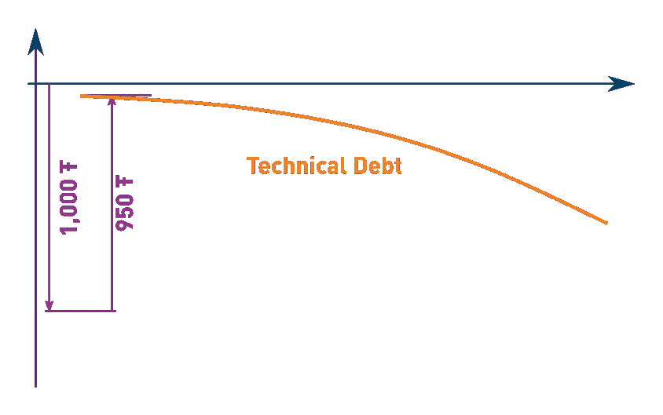
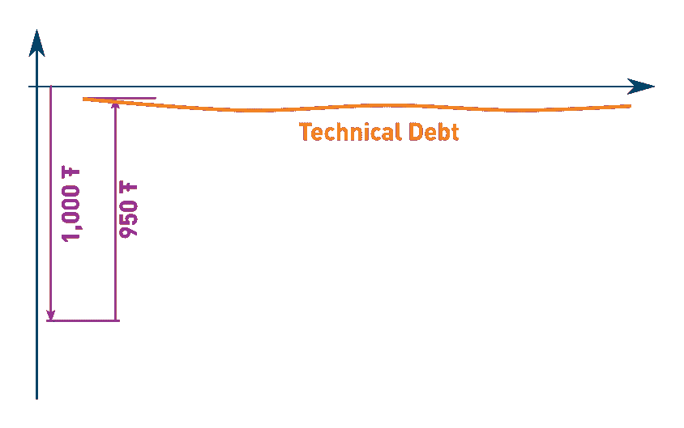
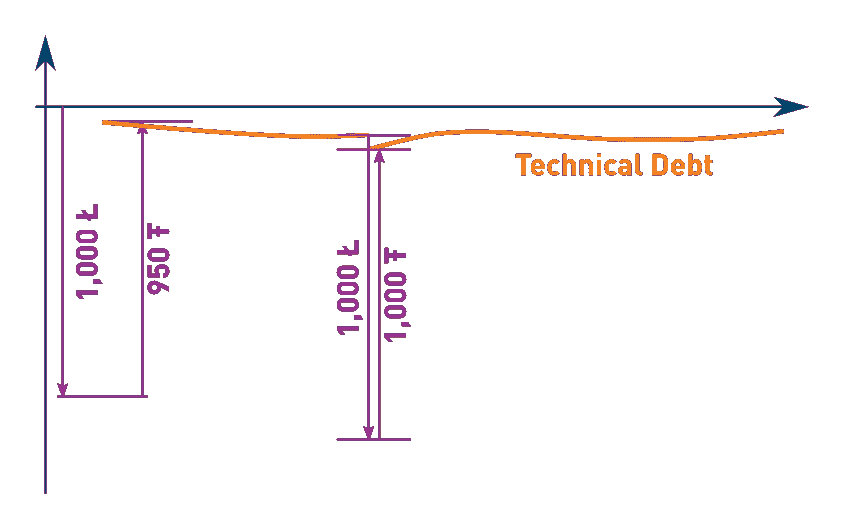
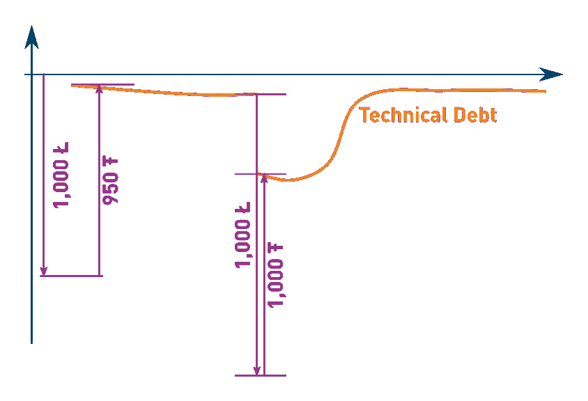

# 软件库:外币技术债务

> 原文：<https://medium.com/compendium/software-libraries-technical-debt-in-foreign-currencies-4be15eb9d7b3?source=collection_archive---------7----------------------->

术语“技术债务”是沃德·坎宁安在 1992 年创造的一个隐喻，试图解释为什么每个软件项目随着时间的推移都需要技术维护。关于代码如何“老化”有一些奇怪的事情:即使你尽了最大努力使一切正确可读，六个月后你的代码可能看起来漏洞百出，完全无法理解。那是怎么发生的？

技术债务的比喻非常有力，因为它解释了一个神秘的技术过程，用的是每个人都能理解并与之相关的东西:货币债务。请看下图，它对技术债务和货币债务同样适用。

想象一下，你想要建造一个软件组件，或者一栋房子，你必须投资 1000ŧ才能得到它(ŧ是一种虚拟的技术货币)。如果你曾经建造过一栋房子，或者一个软件组件，你可能会知道你将得到的产品的价值会比你必须投入的略低。在我们的例子中，产品的价值是 950 ŧ.你最终得到的是 50ŧ的技术性债务，这并不算多。然而，如果你不按月还款，你的债务会开始增加。

在现实世界中，货币债务可能会变得比你房子的价值还要大。我想对于一个软件项目来说，这也是有可能的，尤其是当你考虑到那些因为程序错误而停机的对你的业务至关重要的组件的时候。但是在大多数情况下，我猜想技术债务是相当有限的，不能变得比它更大，否则它会使你的项目一文不值。然而，关键的一点是，你应该努力控制项目中技术债务的数量，就像下面的图片一样，永远不要让它像上面的图片一样失控。

技术债务这个术语已经被使用了很多年。已经有一些工具试图测量技术债务，甚至用实际货币价值来表达。其他人用这个术语来解释软件项目中的其他现象。我不太喜欢那些主张故意承担技术债务是一件好事或明智之举的人，认为这是对一个项目的“投资”。他们说这就像去现实世界中的银行，但我一直不明白那个“技术银行”在哪里，以及它是如何分发钱的。

关于技术债务有一件奇怪的事情，我花了一些时间才明白。为什么有时技术债务会突然增加？尤其是如果你正在使用一个刚刚发布了新版本的库，你会突然发现自己背负了更多的技术债务。这几乎是一夜之间发生的。这个比喻也适用吗？

我想是的。使用软件库有点像用外币贷款。你的房子以本币计价，但你的债务以外币表示。如果另一个国家突然决定重估其货币，你就有问题了。

让我们看看下面的图表，说明如果升值幅度相对较小会发生什么。我们开始时贷款 1000 英镑，资产价值 950 ŧ.只要两种假想货币之间保持平价(1 = 1ŧ)，一切都好。但是如果外币的价值突然增加了 5 %会怎么样呢？当这种情况发生时，你的技术债务实际上增加了 50ŧ(1000 = 1050 ŧ).幸运的是，这并不多，所以你可以很快还清额外的技术债务。

上面的案例很像一个新发布的软件库的次要版本。当您尝试采用新版本时，大多数东西仍然可以工作，但可能会有一些东西需要调整。如果您为软件库中的一个小错误实现了一个变通办法，您可能必须删除它。也许有一种方法仍然受支持，但现在已被废弃，您希望清理它。诸如此类的事情。

当一个主要版本发布时，事情变得更加戏剧性。这就像下图一样，外币突然升值 40 %。最糟糕的是:它发生在你技术资金有点短缺的时候(例如，你正在进行用户验收测试)，所以你不得不推迟一段时间升级。这意味着您将不得不承担一些额外的技术债务，因为您添加到项目中的任何新代码都将基于旧版本的库，因此必须升级到。

当你这样看待技术债和软件库的时候，有一点就变得非常清楚了:当一个新的主要版本发布的时候，你真的想尽快升级。也许最好的时机是在下一个开发周期的开始。这样，您就有时间捕捉与升级相关的许多错误。如果您推迟升级，您项目中的技术债务将很快失控。最糟糕的事情是等待库的下一个主要版本。如果为一个主要版本升级您的项目已经太贵了，那么为什么您认为同时为两个或更多的主要版本升级会更容易或更便宜呢？