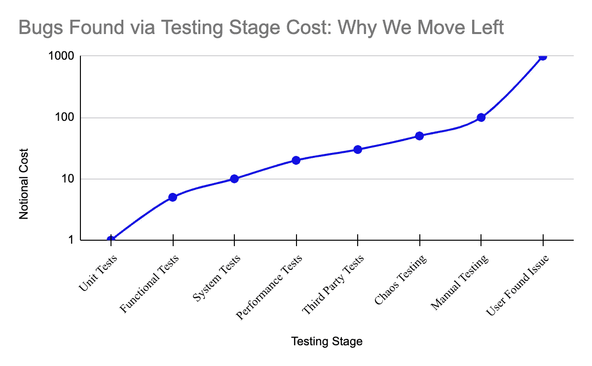

# 软件质量测试:创建质量过滤栈

> 原文：<https://medium.com/capital-one-tech/software-quality-testing-creating-quality-filtration-stacks-capital-one-b841afa6d70c?source=collection_archive---------0----------------------->

## 管理软件质量没有灵丹妙药

软件质量。这是一个在神奇过程的背景下谈论的术语，神奇过程承诺修复所有的事情，早上为你煮咖啡，晚上哄你上床睡觉。我从事软件开发已经超过 25 年了。我建立并领导团队构建任务关键型软件产品。这些年来，我和一些了不起的人一起工作，他们塑造了我关于如何思考软件质量以及如何作为一个一等公民来构建高质量软件的观点。在这篇文章中，我想传递一些我所获得的知识，并开始一场真正的关于关心软件质量管理意味着什么的讨论。

# 软件质量是建立在层次之上的

软件质量没有灵丹妙药。作为一个行业，在不同的层次上有不同的软件测试和不同的软件质量度量可以改进产品。将软件质量测试可视化为过滤器层帮助我和我的团队为每一层设计测试。

想象一个水过滤器:有几个基层，每一个都在不同的水平，每一个都被设计成从水中过滤出不同的颗粒。管理软件质量就是这样。软件质量栈的每一层都被设计来过滤不同种类的问题。对我来说，这是一个灵光乍现的时刻。通过分解测试策略，我们可以专注于对我们来说最关键的领域，更重要的是，对我们的客户来说。这种观点的形成不能归功于我:我的想法是通过与另一位软件工程领导者 Todd Stadelhofer 密切合作而形成的。

当我们将过滤方法应用于软件质量管理时，我们得到了质量过滤栈。这个概念提供了对软件质量测试覆盖范围的洞察，并且通过一个简单的交通灯颜色方案，您应该在哪里关注增加您的覆盖范围

为了使过滤层叠成功，对这些层有额外的要求。最成功的测试系统有以下六个共同点:

1.  很容易看到结果。
2.  易于获取日志/调试数据。
3.  测试结果的假阳性/假阴性率低。
4.  开发人员需要参与其中并拥有所有权。
5.  持续集成和部署到自动化测试和测试环境。
6.  反馈周期，以不断纳入结果。

开发人员在处理测试结果时经历的摩擦越多，开发人员就越不可能使用特定的软件质量管理框架。[强大的 DevOps 文化](/capital-one-tech/focusing-on-the-devops-pipeline-topo-pal-833d15edf0bd)促进所有权，这是 DevOps 作为一种思维方式如此成功的重要原因之一。[一个可靠的 CI/CD 过程](https://www.capitalone.com/tech/software-engineering/realigning-devops-practices-to-support-microservices/)对于拥有一个功能齐全的软件质量管理系统是至关重要的。

我认为每个软件开发团队都应该有基本的过滤器。当构建一个完整的框架来帮助构建高质量的软件时，这些过滤器是至关重要的。有了这些过滤器并不能保证软件没有错误，但是没有你的质量栈却能保证客户会发现你的应用程序有问题。你的过滤栈看起来会和另一个团队的过滤栈不一样，这才是重点。适用于内核开发人员的将与适用于云或移动工程团队的不同。

# 软件质量测试:堆栈的层次

软件质量测试过滤层，很像一个水过滤器，被设计来捕捉不同类型的问题。功能层捕捉基本需求，单元测试过滤器边界问题，系统测试过滤器交互，等等。让我们仔细看看每一层的过滤目的。

# 代码审查和单元测试

在堆栈的底部，我们有无处不在的单元测试和代码审查。提交工作应该需要代码评审。这一步改变了开发人员对他们签入的代码的看法。单元测试，不管是正面的还是负面的，对于理解软件交互是如何变化的都是至关重要的。

这里有一个亲身经历的例子。很久以前，我曾经将有限状态机编码为“状态事件矩阵”有很多州我都认为我们永远不会举办活动。根据单元测试的原则，每一个意外的状态/事件对都会导致一个打印出堆栈跟踪的函数，以及足够的调试信息来返回并修复问题。这也是我开玩笑的地方，“这个误差函数可以在所有状态下工作。甚至加拿大。”我想很明显我没有进行代码审查。

**功能测试
这些测试应该是自动化的、分组的，并且根据在分支上的构建，设置在不同的组中运行，这样我们就可以验证软件的需求得到了满足。**

验证软件满足需求是一个古老的问题。许多年前，我从事数据库工作，特别是在通信层。对于我的功能测试，我需要“达到物理速度”，这意味着我需要一种方法来定义我可以传输数据的速度。通过创建一个通信测试框架，我能够证明我的通信代码是快速的，并且我可以通过颜色编码的测试结果看到，我的更改是否导致通信速度增加、降低或保持不变。

**代码扫描
这一层捕捉通过代码审查和功能测试的错误:它可以向您指出需要关注的区域、潜在的死锁交互和代码路径，这些都是软件永远不应该失败的。在当今世界，工具比人类做得好得多。**

很久以前，我加入了一家公司，一些工程师坚持说他们没有内存泄漏，他们的代码是完美的。我要求他们通过自动化测试来证明这一点。他们搭建了测试平台，让我们大吃一惊！我们发现了很多内存问题。我们还发现了许多仍在积极维护中的死代码。这种洞察力使我们能够瞄准我们没有意识到的关键问题！

**系统测试/长寿测试** 系统是复杂的，生产是复杂的，它们交互的地方就是它们会崩溃的地方。一直都是。系统测试通常适合于特别的测试。事实上，当软件测试的主要方法是人工 QA 时，系统测试就是人工 QA 测试所涵盖的领域。要构建真正世界级的软件，您需要在这一层进行测试。然而，如果您只在这一层进行测试，您将会花费自己的钱，因为您将会在周期中发现太晚的问题，并且离编码问题太远而不能快速解决它。

当团队构建 MVP 时，长期测试往往会被忽视，这真的不应该。很多年前，我写了一些代码写到闪存，但是我弄乱了其中一个循环。闪存部分的额定写入次数超过 50，000 次，但我的错误在该部分不再工作之前将总写入次数减少到大约 5，000 次。因为我的导师坚持要我们建造一个测试平台，所以我们在发货前就发现了漏洞，为公司节省了数千万美元。不要跳过你的长期测试！

# 如何使用优质过滤组件

如果有一件事能让软件质量测试框架从复选框变成真正被使用和喜爱，那就是看到和信任结果的能力。如果有一件事你应该从这篇文章中学到的话，那就是:*无论你构建了什么质量的栈/框架，你都需要你的开发者信任、使用它，并为它的成长做出贡献。*

过滤栈是一个很好的方式来思考在您的测试基础设施中修复一个软件问题需要多少成本。下面的图表给出了一个粗略的视图，说明在堆栈早期捕获 bug 的成本比在堆栈后期捕获 bug 的成本要低得多。这是一个可操作的软件质量栈的另一个好处，您可以直观地表示修复一个问题的成本！

# 什么是可用的堆栈？

这对堆栈传递质量信息的方式有着深远的影响。测试结果应根据区域分组，结果应采用[颜色编码](https://venngage.com/blog/color-blind-friendly-palette/)(考虑到色盲！)这样故障就弹出来了。这使得开发人员可以快速浏览合流页面并点击进入问题区域。

当有人点击深入时，错误信息应该就在开发人员面前。应该很容易看到错误周围的日志消息，并且应该有附加日志、源代码等的链接。这样，试图诊断问题的人就可以轻而易举地获得对 bug 进行分类所需的大部分信息。

# 每个人的质量工程思维

和上面的许多层一样，可用性是必要的，但还不够！你可能会发现需要一个分诊员。这个人需要查看结果，对问题进行分类，并在出现太多错误结果时给出反馈。理想情况下，分类角色应该在团队中轮换，然而一些测试领域可能证明太难真正轮换每个人。

很有可能会有人专门负责过滤烟囱的某些区域。例如，您可能有一个专门的性能工程师来检查和解释性能数据。或者，您可能有一个人专门负责第三方扫描工具，因为许多第三方扫描工具会产生误报，需要具有工具知识的人来分析和理解结果。自动化是一种令人惊叹的能力，但它并不完美。

在以前的生活中，我们让自动化工程师构建一个没有开发参与的框架。目标总是让开发人员获得所有权并向框架中添加测试。这种模式从来没有对我奏效过。自动化工程师通常最终会拥有一切与测试相关的东西，包括分类(他们不会高兴的)。成功的方法是开发人员构建框架，并在每一层取得所有权。接受过程和工作是构建软件的最好方式。在以后的文章中，我会对软件过程有更多的了解。

功能堆栈需要 CI/CD。要让过滤层真正顺畅运行，CI/CD 管道是必要的第一步。过去，我曾让团队首先构建 CI/CD 管道，并采用测试驱动的开发模型，轻松映射到过滤堆栈的每一层，并取得了巨大成功。当与内核开发团队合作时，团队决定首先构建 CI/CD 管道。这导致了最初交付的时间成本，但是他们所有的其他工作都加快了，因为过滤栈(以及一般的软件交付)的最关键部分之一是首先构建的。时至今日，这些内核团队发布了市场上最稳定的产品之一。

# 为什么这很重要

当您想到软件开发生命周期移动得有多快，以及我们期望软件供应商修复问题和提供新功能的速度有多快时，这个问题就变得更大了。世界继续快速发展，而软件还没有完全跟上。构建 MVP 有助于软件应用程序在一段时间内保持同步，但是现在我们看到了这个过程的磨损。在我们深入探讨 MVP 过程需要如何改造自己之前，我们需要谈谈软件生命周期开发。我们将在下一篇文章中讨论这个问题。

实现堆栈中的软件质量层并不能保证您将拥有完美的软件。然而，它确实增加了制作更好软件的可能性。不创建质量层并不意味着您将发布低于质量标准的代码。

对于那些开发 MVP 的人来说，有多少次你把自动化测试留到最后？有多少次你把规模测试留到最后，因为你需要可以出货的东西？在一家初创公司，有人推动将数据库运出门外，在 MVP 启动之前不用担心任何类型的规模或性能测试。在这家公司，我的角色是分布式处理和同步。谢天谢地，在我开始开发之前，我确实写了一些关于伸缩性的测试。这使我能够对我的通信算法进行压力测试，从而防止我在最初的设计中犯下几个可怕的错误，如果这些错误继续下去，将会导致数年的延迟。另一个忽视数据库性能的人发现所有的查询都花了太长时间。这实际上导致了巨大的发货延迟，甚至在产品发货后，也没有好的测试来查明长时间运行的查询在哪里被卡住了。不用说，顾客不高兴了，那家公司也不存在了。

如果没有一个经过深思熟虑的质量堆栈，你会发现你的产品很难维护、更新和修复。你也会发现你的顾客少了很多。套用托尔斯泰、*的一句糟糕的话，用质量构建的软件都是一样的；没有质量的软件以其独特的方式失败了。*

*披露声明:2020 首创一号。观点是作者个人的观点。除非本帖中另有说明，否则 Capital One 不隶属于所提及的任何公司，也不被这些公司认可。使用或展示的所有商标和其他知识产权是其各自所有者的财产。*

*原载于*[*https://www.capitalone.com*](https://www.capitalone.com/tech/software-engineering/software-quality-testing/)*。*