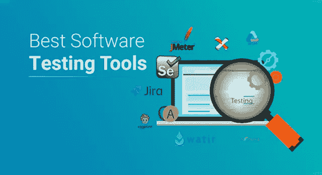
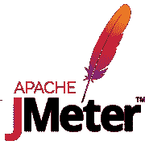
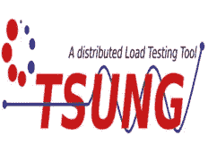
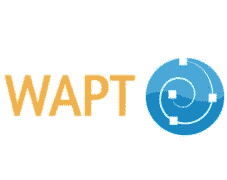
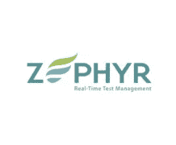
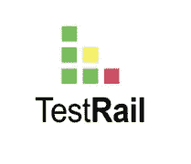

# 您应该开始使用的顶级软件测试工具

> 原文：<https://medium.com/edureka/software-testing-tools-ebd9ebac6f29?source=collection_archive---------0----------------------->

技术上无与伦比的指数变化影响了组织开发、验证、交付和操作软件的方式。因此，组织必须不断地寻找新的方法来交付高质量的软件。软件测试为开发团队提供了确定软件质量的方法和工具。

现在，有大量的软件测试工具可用。很难跟踪 100 多种软件测试工具。考虑到这一点，本文列出了各种类别中流行和著名的软件测试工具，如下所述:

*   *自动化测试工具*
*   *敏捷测试工具*
*   *移动测试工具*
*   *负载测试工具*
*   *测试管理工具*

开始了。

# 自动化测试工具

如今，自动化测试对于大多数软件项目来说是必不可少的，以确保关键功能的自动验证。还可以帮助团队在短时间内高效地运行大量测试。下面列出了一些帮助软件团队构建和执行自动化测试的工具:

## 硒

Selenium 是一个流行的测试框架，用于跨各种浏览器和平台(如 Windows、Mac 和 Linux)执行 web 应用程序测试。使用 selenium，您可以得到非常强大的、以浏览器为中心的自动化测试脚本，这些脚本可以跨不同的环境伸缩。它兼容几种编程语言和自动化测试框架。

## 瓦特尔

Watir，发音为 water，是一个由 Ruby 库组成的开源测试工具，用于自动化 web 应用程序测试。加载了 Ruby 库，它还支持用其他语言编写的应用程序。您可以将它与数据库链接，导出 XML 文件，读取文件、电子表格，并将代码同步为可重用的库。它是一个非常轻量级的开源工具。

## 雷诺克斯

Ranorex 是一款灵活的一体化 GUI 测试工具，使用它您可以在所有环境和设备中完美地执行自动化测试。与其他 GUI 测试工具相比，Ranorex 提供了超级智能的对象识别功能，可以自动检测用户界面中的任何变化，并保持测试继续进行。其他特性包括可重用的代码模块、早期缺陷发现以及与其他工具的集成。

## HPE 统一功能测试(UFT)

HPE 统一功能测试(UFT)软件，原名为*惠普快速测试专业版* (QTP)，是一款自动化功能 GUI 测试工具，允许用户在基于客户端的计算机应用上自动执行操作。它提供了对象识别、错误处理机制和自动化文档等功能。它还使用脚本语言来操作被测应用程序的对象和控件。

## 特里森蒂斯托斯卡

Tricentis Tosca 是一款非常流行的软件测试工具，用于自动化软件应用的端到端测试。这个工具为所有功能测试工件提供了一个单一的存储库，包括需求、用户故事、测试数据、虚拟化资产。Tosca 具有测试数据供应、服务虚拟化网络、测试移动应用和风险覆盖等功能。

# 敏捷测试工具

公司在他们的项目中采用敏捷软件开发方法，如 Scrum、极限编程(XP)。敏捷测试伴随着许多挑战，需要试验和尝试新的想法。下面列出了一些有益于从事敏捷项目的测试人员和开发人员的敏捷测试工具:

## JIRA

JIRA 是一个流行的敏捷测试和项目管理工具，由 Atlassian 开发，Atlassian 是一家为项目经理、软件开发人员等开发产品的软件公司。这个工具可以用来跟踪缺陷，计划，创建报告，以及管理所有敏捷软件开发项目。它支持敏捷方法，如 Scrum、看板。

## 索普伊

它是一个敏捷测试工具，是 SmartBear 开发的最先进的 REST 和面向服务的架构。SoapUI 主要用于 web 服务的功能测试，包括 web 服务开发、web 服务调用等。它是一个免费的开源工具，允许你创建和执行功能、回归和负载测试。允许您使用拖放界面创建测试用例。

## Selenium WebDriver

Selenium WebDriver 是另一个流行的敏捷自动化工具，广泛应用于整个软件行业。它仅用于自动化基于浏览器的应用程序，不支持基于桌面的应用程序。用户可以用多种编程语言编写自动化脚本，如 JAVA、C#、Python、Ruby、PHP。

# 移动测试工具

移动应用对企业来说已经变得越来越重要。因此，测试团队需要适应并准备好验证和评估移动应用，作为他们项目的一部分。有各种工具和在线资源可以帮助测试人员为您的移动设备构建测试，为移动应用和代码库记录和运行自动化 UI 和单元测试。下面列出了一些这样的工具:

## 茄子

茄子是由 TestPlant 构建的授权工具，主要用于移动设备中的应用程序测试和 GUI 测试。它是茄子功能和 eggOn 的结合，eggOn 是一个移动代理，可以在 iOS，Android，Windows Phone，BlackBerry 和任何其他移动设备上全面测试移动应用程序。与大多数测试自动化工具**中基于对象的方法不同，**茄子基于图像的方法工作。

## 参见测试

SeeTest 是 Experitest Ltd 开发的移动应用测试工具，适用于 iOS、Android、Blackberry 和 Windows Phone。它提供了可视化测试、功能测试，用于仿真器和真实设备。它利用自学算法和模块化的自我增强图像识别技术。其他一些可用的移动相关工具包括 SeeTest Cloud、SeeTest Network Virtualization 和 UFT 移动附加软件。

## 丝绸测试

Silk Test 是 Microfocus 的授权产品，提供功能和回归测试。您可以使用这个工具对所有移动应用程序类型进行回归、跨平台和本地化测试，比如移动 web、本地和混合应用程序。它具有跨浏览器的支持，并能实现高效、快速和高质量的自动化测试。Silk Test 还使得在 CI/CD 管道中集成功能测试变得容易。

# 负载测试工具

近来，网站、web 应用程序和 API 的使用变得越来越重要，重要的是要高效地设计和构建它们，以便它们能够处理大量的请求。因此，为了实际测试和验证服务在负载下的性能，开发人员可以执行负载和压力测试。下面列出了负载测试人员使用的一些工具:

## 阿帕奇 JMeter

它是一个为负载测试而设计的开源 Java 桌面应用程序。它的架构实际上是以插件为中心的，在插件的帮助下，JMeter 提供了许多开箱即用的特性。它支持不同类型的应用程序、服务器和协议，如 Web、SOAP、FTP、TCP、LDAP、SOAP、MOM、邮件协议、shell 脚本和 Java 对象。JMeter 的其他特性包括强大的测试 IDE、动态报告、命令行模式、可移植性和多线程。

## 宗

Tsung 是一个流行的开源多协议分布式负载测试工具。该工具的主要目的是帮助用户测试基于 IP 的客户机/服务器应用程序的可伸缩性和性能。它还可以用于在服务器上执行负载和压力测试。它可以用来检查 HTTP、WebDAV、SOAP、PostgreSQL、MySQL、LDAP、MQTT 和 Jabber/XMPP 服务器上的负载。

## WAPT

WAPT 是一个负载和压力测试工具，允许您通过图形用户界面构建、生成和监控负载测试。它提供了一种简单且经济高效的方法来专门测试业务应用程序网站、移动网站、门户网站等。它基于 AJAX 和 RIA 技术。WAPT 在数据驱动模式下从事安全 HTTPS 网站、动态内容和 RIA 应用的工作。

# 测试管理工具

软件开发团队可以从测试用例管理工具中获益。他们可以使用基于 web 的管理工具来管理他们的项目、测试资源、记录测试结果并生成报告，以帮助优化所有测试活动。有各种各样的测试管理工具可以满足不同的需求，下面列出了最流行的工具:

## 泽法

泽法是一个测试管理软件，为公司提供执行手动和自动测试的能力。它提供了与其他流行的测试平台，如 JIRA，Confluence，詹金斯，竹集成。借助泽法，您可以获得更快发布更好软件所需的灵活性、可见性和洞察力。这个产品通常有两个版本。

## 测量

QMetry 是为敏捷测试和开发团队设计的最全面的测试管理工具，用于更快地构建、管理和部署高质量的软件。借助该工具，测试管理、自动化和预测分析涵盖在单个平台中。它与 JIRA、Selenium、Appium、Bamboo、Jenkins、HP ALM、Rally 等平台集成。

## 测试轨道

TestRail 是一个现代的测试管理工具，既可用于您自己的服务器，也可用于云版本。这是唯一一款与 JIRA 插件完全集成的工具，包括 JIRA 云。TestRail 是管理、跟踪和协调测试工作的有用工具。这个工具帮助你在同一个地方管理、组织和跟踪所有的测试工作。它测试报告和度量自动化。

有很多针对不同类型测试的软件测试工具。这些工具有些是开源的，有些是许可的。但是，工具的选择总是取决于需求。这就把我们带到了这篇关于软件测试工具的文章的结尾。我希望你发现它信息丰富，并有助于增加你的知识价值。

如果你想查看更多关于 Python、DevOps、Ethical Hacking 等市场最热门技术的文章，你可以参考 Edureka 的官方网站。

请留意本系列中的其他文章，它们将解释软件测试的各个方面。

> 1.[移动应用测试](/edureka/mobile-application-testing-51140ebe4a87)
> 
> 2. [Appium 教程](/edureka/appium-tutorial-28e604aebeb)
> 
> 3. [Appium 工作室教程](/edureka/appium-studio-tutorial-8a13ee9662d6)
> 
> 4. [JMeter 教程](/edureka/jmeter-tutorial-774856163ee9)
> 
> 5.[使用 JMeter 进行负载测试](/edureka/load-testing-using-jmeter-3da837c11a02)
> 
> 6.[什么是功能测试？](/edureka/what-is-functional-testing-complete-guide-to-automation-tools-183e42ad517a)
> 
> 7.[自动化测试教程](/edureka/automation-testing-tutorial-157d269e60db)
> 
> 8.[功能测试与非功能测试](/edureka/functional-testing-vs-non-functional-testing-a08bc732fbdd)
> 
> 9. [JMeter vs LoadRunner](/edureka/jmeter-vs-loadrunner-c1ab63acd935)
> 
> 10.[回归测试](/edureka/regression-testing-b913b7064824)
> 
> 11.[性能测试生命周期](/edureka/performance-testing-life-cycle-d4242d39a5aa)
> 
> 12. [JMeter 插件](/edureka/jmeter-plugins-1bceec7f6226)
> 
> 13. [Appium 架构](/edureka/appium-architecture-505f70bf3484)
> 
> 14.[如何在网站上使用 JMeter 进行压力测试？](/edureka/stress-testing-using-jmeter-e6b3c64299d0)

*原载于 2019 年 2 月 22 日*[*www.edureka.co*](https://www.edureka.co/blog/software-testing-tools/)*。*