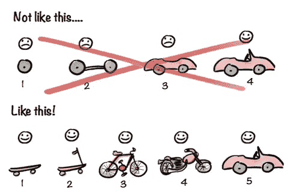

# 软件版本被破坏

> 原文：<https://medium.com/javascript-scene/software-versions-are-broken-3d2dc0da0783?source=collection_archive---------4----------------------->


A Broken Frame — Heiner Adams (CC BY 2.0)

我承认。像 Node 社区中的几乎每个人一样，我习惯于滥用 npm 的保存功能:

```
npm install --save lodash
```

问题是，它使用一个整洁的小插入符号 *`^`* 来表示你的软件应该自动使用不间断的修改。

但这可能很危险。我们都知道[约翰-大卫·道尔顿](https://medium.com/u/c9acea0bae6e?source=post_page-----3d2dc0da0783--------------------------------)是一个来自未来的不可阻挡的机器人。*查看自拍:*

什么？你不知道吗？他的名字是约翰。[巧合？我认为不是。](https://en.wikipedia.org/wiki/John_Connor)

如果他在秘密任务中通过在我们所有的代码中植入定时炸弹来阻止天网呢？总有一天，他会对 lodash 做一个突破性的改变，下一次你 *`npm install`* ， **BOOM！**

你的代码会崩溃。因为他不会递增主版本号……*(偷偷摸摸的机器人)*。

当然，如果你真的想保护自己，从 *`package.json`* 中删除所有的 *`^`* 符号，并将 *`save-exact=true`* 添加到你的【t22 `~/. npmrc ` .中，然后说服你的整个团队也这样做(将这个粘贴到 Slack 中):

```
echo "save-exact=true" >> ~/.npmrc
```

但实际上，只有 10 个人会去做。我们努力建立的美丽的天网注定要失败。

## 这是你的错

不过，洛达什并不是我们未来人造人类的最大威胁。你是。每次你庆祝一个新的 **1.0** 发布或者你惊人的、彻底改造的 **2.0** ，你都在增加问题。

但你不是一个孤独的超级恶棍。我所看到的每一个地方，都有项目将永远抛在脑后，将主要版本视为营销发布，而不是它们的真实面目:这是软件的一个迹象，表明即将发生重大变化。

我们未来的机器人霸主在这场迫在眉睫的灾难中幸存的可能性非常小:我们需要**将版本名称与版本号**分开，并对 [SemVer](http://semver.org/) 付出更多而不是口头上的支持。

而不是少校。Minor.Patch，think**breaking . feature . fix .**

忘记旧的。它从未存在过。只有 **Breaking.Feature.Fix.**

## 从 1.0.0 开始

但是如果要这样做，我们需要从 1.0.0 开始我们的模块。Semver 允许您在 0.x.x 版本上启动模块，并在不增加主版本号的情况下随时中断。但是这可能是有问题的，因为这样你就不容易判断一个改变是否破坏了现有的 API。从 1.0.0 开始，这个问题就解决了。

## WTF？

版本号是**唯一的**在那里传达变更的性质:**破坏。特征修复**。

交流，“嗨，大家好，我们有一个新版本！下面是新功能！”**使用版本名而不是版本号。**

## 为什么？

发布和版本应该是不同的概念，因为需要传达新发布和重要更新的消息(即*营销*)，以及需要通知像 **npm** 这样的系统关于(突破、新功能或修复/安全补丁)变化的*性质是两个**不同的关注点**，它们在**不同的时间表**上推进。*

**版本号**和**公开发布版本**的合并已经在软件开发社区中导致了一个大问题。开发人员倾向于打破语义版本编号，例如，抵制推进打破(主要)版本号的需求，因为他们还没有准备好向人们发布他们的下一个主要版本。

换句话说，我们需要两种不同的方法来跟踪变更:

*   一个用于人员和公告(**姓名**)。
*   一个用于软件&解决版本冲突问题(**号**)。

## 版本名称(又名代码名称)

我的主要版本都有代号，而不是版本号。当前版本由“最新”标签标识。第一个版本永远是“mvp”。然后我们选择一个主题，从 A 到 z 按字母表顺序排列。

当谈到发布版本时，我们不说“版本附庸风雅”，我们说“最新版本今天发布，代号为‘附庸风雅’”。之后，我们只是称之为“附庸风雅”或“最新版本”。更容易识别的代号例子包括“Windows Vista”或“OS X Yosemite”。

## 最有价值球员

MVP 代表“最小**有价值的**产品”(普通“最小可行产品”的更好版本)。使产品对用户有价值的最少功能。



# 版本号

版本号基本上都是[sever](http://semver.org/)，除了我对版本角色使用了语义名称，例如 **Breaking。修复**"而不是"专业。小调。补丁”。

## 打破。功能.修复

我们不能决定版本是什么。API 的变化决定了。版本号是给电脑用的，不是给人用的。发布名称是给人用的。

**断路**

任何重大变更，**无论多小**都会增加重大版本号。增加破坏性版本号与发布一个版本完全没有关系。

**特色**

当添加任何新功能时。这可能小到一个新的公共属性，也可能大到一个新的模块契约被公开。

**搞定**

当一个文档化的特性没有像文档化的那样运行时(并且很少或没有软件依赖于这种被破坏的行为)，或者当一个安全问题被发现并修复而没有改变文档化的行为时。

如果许多软件依赖于不完整的文档化行为，这是一个突破性的改变。相应增加**断开**。

# 例子

如果是时候写一篇博客来通知社区关于新的特性或重要的变化，找到你想要公布的版本，标记为“最新”，并给它一个**人类可读的名字**(例如，“MVP”、“Aardvark”等……)。

那个人类可读的版本名**并不能取代 SemVer** 。“MVP”可能对应于 v1.6.23 或 v 2 . 2 . 5——关键是，**编号版本与命名版本**无关。

有编号的版本是为了让 **npm** 和**开发者**能够分辨出一个新版本是否是一个**突破性的改变**，一个**增加的特性**，或者一个 **bug /安全补丁**。

现在开始为你的下一个公开版本设计酷的代号吧。

# [跟随埃里克·埃利奥特学习 JavaScript】](https://ericelliottjs.com/)

*   在线课程+定期网络广播
*   软件测试
*   JavaScript 的两大支柱(原型 OO +函数式编程)
*   通用 JavaScript
*   结节
*   反应

***埃里克·艾略特*** *著有* [*【编程 JavaScript 应用】*](http://pjabook.com) *(奥赖利)，以及* [*【学习 JavaScript 通用 App 开发用节点，ES6，&【React】*](https://leanpub.com/learn-javascript-react-nodejs-es6/)*。他为 Adobe Systems******尊巴健身*******华尔街日报*******【ESPN*******BBC****等顶级录音师贡献了软件经验******

**他大部分时间都在旧金山湾区和世界上最美丽的女人在一起。**