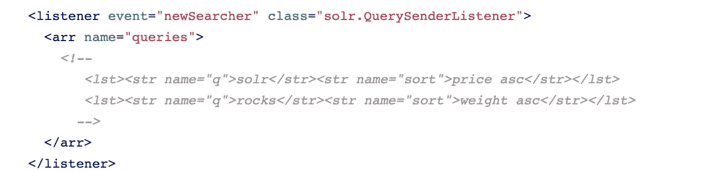

# Solr 反模式—第 2 部分

> 原文：<https://medium.com/walmartglobaltech/solr-anti-patterns-part2-ad6b15a6e991?source=collection_archive---------0----------------------->

一个 [**反模式**](https://en.wikipedia.org/wiki/Anti-pattern) 是对一个重复出现的问题的常见回应，这种回应通常是无效的，并且有可能产生非常不利的后果。

这是 [Solr 反模式的延续—第 1 部分](https://dineshkumarnaik.medium.com/anti-patterns-in-solr-9361a9ae04e7)。

Image by [David Zydd](https://pixabay.com/users/davidzydd-985081/?utm_source=link-attribution&utm_medium=referral&utm_campaign=image&utm_content=2502391) from [Pixabay](https://pixabay.com/?utm_source=link-attribution&utm_medium=referral&utm_campaign=image&utm_content=2502391)

常见的反模式有:

## 1.过度伐木

Solr 日志是了解系统中发生了什么的一个重要途径。有几种方法可以调整默认的[记录配置](https://solr.apache.org/guide/8_8/configuring-logging.html)。

尝试记录所有内容会对集群的性能产生影响，因为它需要更多的资源和线程来记录所有调试/信息日志。

解决方案:将日志级别设置为 warn/error，并启用[慢速查询日志](https://solr.apache.org/guide/8_8/configuring-logging.html#logging-slow-queries)来捕获运行时间超过指定时间的查询。

在调试任何问题时，您可以临时更改日志级别[并在捕获日志后将其恢复。](https://solr.apache.org/guide/8_8/configuring-logging.html#temporary-logging-settings)

## 2.过度缓存

为了获得最佳的查询性能，Solr 使用内存缓存来存储几条不同的信息。结果集、过滤器和文档字段都被缓存，以便可以快速处理后续的类似搜索。

**“大缓存”不过是“垃圾”的一个花哨词。**如果您让对象在缓存中累积，Java 虚拟机的垃圾收集器最终将不得不将其全部清除。拥有大量垃圾会增加垃圾收集的持续时间，并损害应用程序的响应能力。

解决方案:

1.  不要在筛选查询中保留提取大量记录集的子句/criteria，在主查询中使用包含大量记录集的子句来限制总体结果计数。
2.  不要在过滤标准中保留动态子句，这将导致无效的缓存。
3.  在带有匹配文档子集的过滤查询中使用静态子句，以获得更好的查询性能。

## 3.频繁提交

solr 中有两种类型的提交:

*   **硬提交:**这由 solrconfig.xml 中的<自动提交>选项或来自客户端的显式调用(通过浏览器、cURL 或类似的 SolrJ 或 HTTP)控制。硬提交会截断当前段，并在索引中打开一个新段。
*   **软提交:**一种比硬提交(openSearcher=true)开销更低的操作，也使文档对搜索可见。软提交不会截断事务日志。

软提交“更便宜”，但仍然不是免费的。您应该使软提交间隔尽可能长，以获得最佳性能！

解决方案:避免显式提交，并在 solrconfig.xml 中定义提交设置(`autoCommit and autoSoftCommit`)

## 4.繁重的暖化查询

*缓存预热查询*是一个预先配置的查询(在 *solrconfig.xml* 中)，它针对新的搜索者执行，以便填充新的搜索者的缓存。

拥有复杂的或很多的暖化查询会导致打开新搜索者的长时间延迟。点击阅读更多关于温暖搜索者[的内容。](https://solr.apache.org/guide/8_8/query-settings-in-solrconfig.html#maxwarmingsearchers)

解决方案:

仔细使用这个特性经过全面测试后，Solr 附带了 warming queries 部分的注释，如上例所示。最好保持这种状态。

预热查询应该是您的应用程序经常使用的查询，并且足够快，不会对新的搜索者造成任何延迟。

## 5.布尔查询

Solr 对布尔查询的术语数量有限制。你可以增加限制，如果你想，但它可以降低性能，由于大量的条款和得分开销。请阅读[此处](https://dineshkumarnaik.medium.com/maxbooleanclauses-behavior-in-solr-7-x-vs-8-x-a02f9ec0f5af)了解更多详情。

解决方案:如果您的布尔查询术语超过 1000，请使用[术语查询解析器](https://solr.apache.org/guide/8_8/other-parsers.html#terms-query-parser)。

## 6.带有嵌套文档的 DBQ

如果应用程序中有嵌套文档，应该避免 DBQ(通过查询删除)。

嵌套文档可以根据应用程序的需要，通过添加包含更多或更少文档的新文档来简单替换。除了 Solr 注意确保现有版本的所有相关子文档都被删除之外，这方面与更新任何普通文档没有什么不同。

不要**而不是**添加一个具有相同子文档 ID 的根文档。*这将违反 Solr 期望的完整性假设。*如果您尝试使用子文档的 ID，将不会发生任何事情，因为只考虑根文档 ID。

解决方案:要删除嵌套文档，可以通过根文档的 ID 来删除它。如果你使用 Solr 的查询删除 API，你**必须非常小心**以确保没有任何子文档被删除。*否则将违反 Solr 期望的完整性假设。*

## 7.多级旋转

Solr pivot 分面或决策树分面或子分面用于提供更详细的索引数据视图。您可以计算父方面的子方面，或者生成树状数据结构并在应用程序中显示，这有助于做出更好的决策。

在一些用户需要深入了解数据的分析应用程序中，为了满足这种类型的要求，您可以对两个或三个以上的字段使用 pivot faceting，但这并不是免费的，多级 pivot 需要更多的 CPU 和内存来进行计算。

解决方案:尝试限制 pivots、facet/pivot on docValue enabled 字段的结果集数量，并使用 [json facet API](https://solr.apache.org/guide/8_8/json-facet-api.html) 代替旧式的 faceting。

## 8.无模式模式

无模式模式消除了在使用搜索之前设计模式的需要。这有助于您更快地使用搜索，但是无模式模式比使用特意设计的模式效率更低。

这有可能索引每个字段(甚至是不可搜索的字段),从而导致性能下降。

**无模式**模式实际上是一种**猜测字段并添加到模式**模式。因此，当 Solr 看到一个新字段时，它会尝试猜测字段类型并将其添加到模式中。这种猜测通常不会针对每个字段进行优化。

解决方案:

坚持使用默认的非无模式模式。

使用动态字段/映射作为替代。

1.  动态字段允许 Solr 索引模式中没有明确定义的字段。
2.  当您忘记定义一个或多个字段时，请使用动态字段。
3.  添加动态字段，通过为可以添加到 Solr 的文档提供灵活性，使应用程序不那么脆弱。

## 9.对于写入量大的系统，没有节流

Solr 承担了其他数据库不具备的功能，比如二级索引、非结构化文本搜索、刻面、枢轴、聚合、流式查询、词汇化、短语搜索等。这不是免费的。

当数据进入集群时，必须维护和更改提供这些功能的索引。尤其是更新可能是一项开销很大的操作，给索引维护操作带来了额外的负担。因此，如果突发更新流量在接收前没有被抑制，Solr 很容易被阻塞。

解决方案:通过在接收到 Solr 之前添加消息队列来抑制接收，并尽量避免大批量。

## 10.高摄取期间的配置重新加载/上传

应避免在活动生产集群上进行配置上传或重新加载，因为副本可能会进入恢复阶段(根据索引大小恢复数据可能需要相当长的时间)。

解决方案:停止正在进行配置上载/重新加载的集合的写入，或者在写入流量较低时在非工作时间执行此活动。

# 结论

避免这些反模式有助于我们通过减少 CPU、内存、I/O 操作等资源的使用，高效地管理许多不同规模和用例的关键集群。通过实施这些解决方案，您不仅可以节省运营成本，还可以提高集群性能和稳定性。