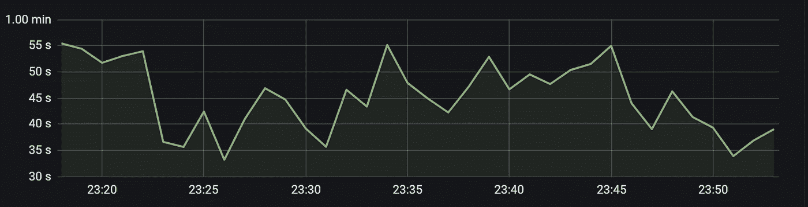
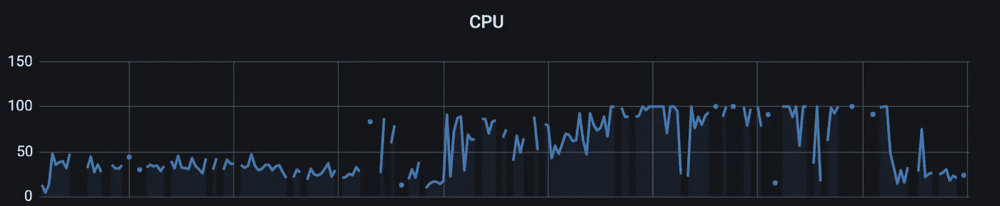

# Solr 性能调整

> 原文：<https://medium.com/walmartglobaltech/solr-performance-tuning-beb7d0d0f8d9?source=collection_archive---------0----------------------->


Photo by [Matt Bowden](https://unsplash.com/@mattj_bowden?utm_source=medium&utm_medium=referral) on [Unsplash](https://unsplash.com?utm_source=medium&utm_medium=referral)

我想在下面分享我和我的团队在为我们的用例提出最佳 Solr 设置时的过山车体验。对于我们的大多数测试来说，性能是如此之差，以至于我们最终优化了设置的几乎所有部分，包括配置、模式、环境、JVM 设置和查询。在这次练习中，我们学到了许多宝贵的经验，希望你也能学到。

# 问题是

*   我们有 4000 万个文档(平均。文档大小为 1 kb ),因此总索引大小约为 40 GB。虽然我们会有更多的更新，但文档数量将保持不变。
*   我们的查询有一个固定的模式，只有 5 或 6 个过滤查询(FQ)(没有查询搜索词，方面或排序)。
*   P99 读取延迟必须在 150 毫秒以内。
*   我们将限制每分钟更新 15 万个文档。
    机器大小固定为 28 GB RAM 和 8 核 CPU。
*   提交时间间隔设置为 15 分钟，这是我们的 SLA，用户可以看到任何更新。

我们想要优化的是在满足延迟 SLA 和写入吞吐量限制后的读取吞吐量。

# 初始设置

基于上述信息，然后阅读了很多关于 Solr 的文章(我将在下面链接，可能会很有帮助)，我们提出了我们的 5 个碎片的初始设置。

这是基于 40GB 索引/5 个碎片= 8GB/碎片的事实。我们知道您希望将索引缓存在操作系统文件缓存中。因此，我们将 JVM 堆大小保持在 16GB，这意味着我们为索引和一些缓冲区留出了将近 12GB。事实上，更多的碎片意味着你的写被分割，根据我们之前的测试，我们知道单个碎片每分钟可以处理大约 30K 的文档更新。

到目前为止，一切看起来都很好，我们没有理由怀疑设置不会工作。

# 测试

在这一点上，我们运行了我们的第一个性能测试，但结果出乎意料的可怕。我们勉强能够支持每个节点 1 个 QPS。系统 CPU 达到 100%，然后在几个小时的测试后崩溃(也是在禁止写入的情况下)。看看下面的指标-



P99 Latency at ~50sec



CPU reaching 100%

发布后，我们进行了多次测试，以了解并修复根本原因-
-我们的过滤器缓存命中率为 0.6，为了改善这一点，我们增加了过滤器缓存的大小。这并没有帮助，因为 JVM 堆的使用和 CPU 仍然达到 100%
—文档缓存的命中率为 0.5，但驱逐率非常高，这会导致更频繁的 GC 周期。所以我们减少了文档缓存的大小。虽然还是没有太大的改善。
—在重新访问我们的 schema.xml 时，我们发现很少有字段没有 indexed=true，我们正在对它们运行过滤查询。所以我们更新了模式。仍然没有运气。

尽管上述优化都没有对性能产生太大影响，但我们注意到的一点是，过滤器缓存预热时间约为 500 秒，这对我们的查询来说是非常大的。考虑到 CPU 和 JVM 堆的大小是我们测试中经常遇到的瓶颈，我们决定将我们的设置和测试转移到具有 128GB RAM 和 32 核 CPU 的高配置 XXL 机器上。

# 终于有了一些希望

在我们对 XXL 机器进行的第一次只读(无写入)测试中，在整个 4 小时测试期间，CPU 利用率达到了 60%。我们没有主要的 GC 运行，JVM 堆使用率最高为 70%。P99 下降到 111 毫秒，这在当时似乎是不可思议的。

对于下一个测试，我们引入了以 21K 文档更新/分钟的速度写入。但是在这个测试过程中，读取延迟发生了巨大的变化。P99 约为 37 秒，尽管 P95 仍约为 100 毫秒。P99 和 P95 潜伏期的巨大差异意味着我们需要更深入地了解正在发生的事情。

# 了解索尔的写作和表现

在 Solr 中，一旦引入写入，设置性能就会发生巨大变化。这可能主要是由于以下原因——

—所有缓存现在都将在每次提交后失效，必须再次预热。
(为了更好地管理这一点，Solr 将自动从早期缓存中为顶级查询预填充缓存。这种情况下所花费的时间称为缓存预热时间)
—写请求也将开始占用 CPU 周期
—随着时间的推移，段数的增加可以减少读取延迟
(为了应对这种情况，Solr 根据 [Solr 合并策略](https://lucene.apache.org/solr/guide/8_4/indexconfig-in-solrconfig.html#merging-index-segments)运行“优化”。尽管优化步骤在 CPU 和磁盘使用方面有很大的成本。所以最好将其配置为不频繁运行)
——如果没有足够的内存将写入数据缓存在[操作系统页面缓存](https://www.thomas-krenn.com/en/wiki/Linux_Page_Cache_Basics)中，磁盘 I/O 可能是硬提交期间的主要瓶颈

随着我们对写入对 Solr 设置的影响的了解越来越多，我们得出的结论是，对于我们来说，缓存失效会导致我们的一些查询需要花费大量的时间来处理。同样的查询必须负责我们在早期测试中观察到的非常大的缓存预热时间。

# 优化:查询

我们有一个 fq，在一个函数上有 [frange filter](https://lucene.apache.org/solr/guide/6_6/other-parsers.html#OtherParsers-FunctionRangeQueryParser) ，它根据每个文档的几个其他字段计算最高和最低价格。深入研究后，我们发现在 Solr 中，默认情况下所有的 FQ 都在整个索引上运行，然后对这些单独的结果进行交集运算。Solr 这样做是为了利用过滤器缓存，因为它可以独立地缓存这些结果，然后将它们用于所有未来的查询。但是当存在不频繁重复的 fq(例如范围滤波器)并且计算起来非常昂贵时，这种方法的问题就出现了。这样的 fq 将从根本上降低整体查询性能。

为了管理这种情况，Solr 提供了一种替代方法，在这种方法中，我们可以将 cost 参数添加到这样的 FQ 中，并且任何 cost>=100 的 FQ 都在查询的其余部分的结果集上运行，而不是在整个索引上运行。并且对于带有 **cache=false 的 frange 查询(在 SOLR 8 中)**默认为成本 100，如这个 [JIRA 票](https://issues.apache.org/jira/browse/SOLR-11641)中所解释的。这正是我们所做的。我们的-
— P99 从 37 秒减少到 130 秒。
—过滤器缓存预热时间从 500 秒减少到 20 秒

```
Example use case - 
Min price selected is 0 
Max price selected is 1500Original query - 
{!frange l=0.0 u=1500.0}Optimised query -
{!frange cache=false l=0.0 u=1500.0}
```

虽然这是朝着正确方向迈出的良好的第一步，但我们很高兴能够在最初的 XL 机器上再次运行我们的测试，该机器具有 28GB 内存和 8 核 CPU。XL 机器几乎是成本的三分之一，并且可以节省大量成本。

# 回到原始设置

对 XL 机器的下一次测试在早期运行的基础上有了显著的改进—
—CPU 和 JVM 堆的使用没有达到 100%
—P99 延迟开始于 150 毫秒左右，但逐渐增加，在 4 小时后达到大约 70 秒

这意味着在我们的设置中还有其他瓶颈。


Trying to do something new (Image source: [Medium](/@techindustan/best-technology-to-learn-for-future-a35f04cf3266))

# 找到瓶颈

**测试查询是否是瓶颈—**
我们已经优化了查询的一部分，并看到了非常好的改进。为了进一步研究我们的查询，我们运行了一个实验，在这个实验中，除了负责取回文档的术语过滤器之外，我们从查询中删除了所有的 FQ。

```
Sample simplified query — “q”: “*:*”,
”fq”: “{!terms f=item_id}2ZSZKDSO4X5T,2WCULXLPA0JO,6R9RIWPF50AL,2EQYBAO5L251,69HCJ07YYR6T,14WVKW7HK898,10KWB6Y3YQE9,4R8JZCRANJVO,26WMP7XFQ5XA,1ZV85IKWLSWU,5BPBP26KIBBO,2RIRBKGUEVO6”,
”wt”: “json”
```

即使这个简化的查询也没有带来任何性能改进。因此我们可以排除这种可能性。

**测试网络是否是瓶颈—**
我们知道 XL 机器上的网络带宽远低于 XXL 机器。鉴于这一事实，碎片间的通信可能是一个主要的瓶颈。为了测试这一点，我们使用 [shards 查询参数](https://lucene.apache.org/solr/guide/8_4/distributed-requests.html#limiting-which-shards-are-queried)将所有查询限制为仅从单个碎片获取数据。
由于我们没有看到任何性能提升，我们也排除了这种可能性。

**测试磁盘 I/O 是否是瓶颈—**
磁盘 I/O 可能是一个主要瓶颈，尤其是在 Solr 延迟方面。默认情况下，Linux 会自动将经常使用的文件缓存到 OS 页面缓存中(如果有空闲内存的话)。从内存中读取比从磁盘中读取要快得多(即使磁盘是 SSD ),如下面的示例所示。

```
**First run (file is being read from disk)**
[my_linux_machine]$ /usr/bin/time -p cat 20_GB_FILE > /dev/null
real 177.64
user 0.50
sys 21.5**Second run (file is now cached in memory by OS)**
[my_linux_machine]$ /usr/bin/time -p cat 20_GB_FILE > /dev/null
real 10.50
user 0.39
sys 10.10
```

正如您所看到的，一旦文件被缓存，读取它的时间从 177 秒下降到 10 秒。Solr 依靠这个系统行为来缓存它的索引文件以获得更好的性能。

您可以使用[**free-m**](https://www.thomas-krenn.com/en/wiki/Linux_Page_Cache_Basics)**监控可用内存，使用[**iostat/vmstat**](https://www.tecmint.com/linux-performance-monitoring-with-vmstat-and-iostat-commands/)监控磁盘 I/O。你也可以使用惊人的免费工具，如 [**vmtouch**](https://hoytech.com/vmtouch/) 来锁定你在操作系统页面缓存上的索引。**

# **优化:JVM 调优**

**为了优化磁盘 I/O，我们决定减小 JVM 堆的大小。除此之外，为了确保我们不会遇到堆空间的 OOM 问题，我们还将过滤器缓存大小减小到原始设置 T26，同时禁用了 fieldValueCache 和 documentCache，因为它们的驱逐率很高**

**我们在 JVM 堆设置为 8GB(最初为 16GB)的情况下进行了测试，瞧，我们得到了惊人的结果—
— P99 读取延迟从平均。30 秒到 137 毫秒。
— CPU 和 JVM 堆仍在限制范围内，没有观察到峰值**

# **最后一次优化(至少我们是这么认为的)**

**我们试图再做一次优化，即在开始测试之前将索引合并到一个单独的片段中，正如许多关于调整 Solr 的文章所建议的那样。尽管 Solr 使用[合并策略](https://lucene.apache.org/solr/guide/8_4/indexconfig-in-solrconfig.html#IndexConfiginSolrConfig-CustomizingMergePolicies)来“优化”索引，但是您仍然可以手动强制优化。**

```
To manually optimise (merge segments) - /update?optimize=true&maxSegments=1
```

**然而对我们来说，结果很差。P99 跳到了 79 秒。在我们的案例中，与一般准则相反，具有多个较小段的索引比具有较大单个段的索引表现得更好。**

# **决赛成绩**

**我们现在有了最终的设置。如果我们仔细想想，我们并没有在 Solr 中做任何复杂的改变来达到同样的效果。尽管它确实需要我们建立对底层 Solr 设计的正确理解，以评估和进行所需的优化。正如我们从这个练习中所看到的(下表列出了要点),通过适当的调优可以实现巨大的性能提升。**

**Initial setup vs Final setup**

# **经验教训**

**Solr 有很多相互影响的运动部件。因此，调整一个参数可能会对其他一些参数产生不良影响。因此，反复测试您的设置并在这些测试之间只做很少的更改是非常重要的，这样才能确信您正朝着正确的方向前进。**

*   **对于 Solr 硬件的规模，没有[明确的答案。反复调整和测试您的设置是唯一真正的方法。](https://lucidworks.com/post/sizing-hardware-in-the-abstract-why-we-dont-have-a-definitive-answer/)**
*   **监控您的磁盘 I/O。(除非延迟根本不是问题)**
*   **[仔细设置你的 Solr JVM 堆大小](https://lucene.apache.org/solr/guide/8_4/jvm-settings.html)。它应该能够容纳所有缓存和内部对象，同时留出足够的空间来避免频繁运行 GC，但又不至于大到不给 OS 页面缓存留出空间来缓存您的索引。**
*   **检查所有在查询中唯一的 FQ，并将它们标记为 cache=false。**
*   **Solr 缓存并不总是你的朋友。监控您的缓存命中率和驱逐率。无论是低命中率还是高驱逐率都不利于你的设置。我们完全禁用了文档缓存，没有发现延迟下降。**

# **进一步阅读**

**[](https://lucidworks.com/post/scaling-lucene-and-solr/) [## 扩展 Solr 的提示和技巧

### 虽然许多 Lucene/Solr 应用程序永远不会超越一台配置良好的机器，但事实是，越来越多的…

lucidworks.com](https://lucidworks.com/post/scaling-lucene-and-solr/)  [## 阿帕奇软件基金会

### 另请参阅:SolrPerformanceFactors、SolrPerformanceData、基准测试 Solr 本页将尝试回答以下问题

cwiki.apache.org](https://cwiki.apache.org/confluence/display/SOLR/SolrPerformanceProblems)**