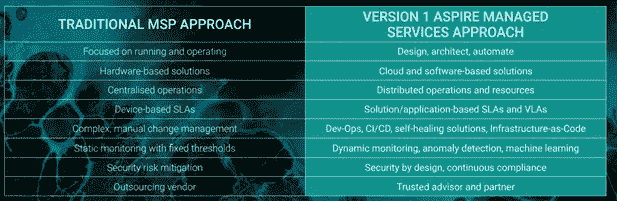

# 应对顾客不断变化的需求的一些技巧

> 原文：<https://medium.com/version-1/some-tips-on-reacting-to-our-customers-changing-needs-ee58557934ed?source=collection_archive---------5----------------------->

在第 1 版中，我们的客户与我们的员工分享同等的价值，分享我们组织的力量。这是我们多年来取得成功的基础，我们 98%的客户保持率证明了这一点。

众所周知，过去两年我们在个人层面和工作场所都感受到了挑战。从一个面向客户的角色，这意味着快速改变方法，让我们能够最好地支持我们的客户。在如何与客户互动方面，我们需要认真考虑一些问题。

***交付的格局变了。*** 随着我们适应远程、混合和现场工作，传统交付模式不复存在。其核心是，我们的客户是人，他们试图在自己的生活中应对我们面临的挑战。

版本 1 今年采取了一项战略举措，成为自然数字化。这是我们组织从“行动和思考”数字化向“思考和设计”数字化的转变，要求我们审查所有工作方式、人员实践和我们使用的技术。我们可以从中吸取经验，并与客户分享。我们的目标是与客户建立基于值得信赖的顾问精神的关系，在传统服务之外进行讨论是建立这种信任的关键。

从客户的角度来看，我们需要对他们的组织所面临的挑战做出反应。倾听客户是关键，有时他们对我们的要求在最初的问题中是看不到的，要将这转化为有效的回应，就意味着要理解他们为什么对我们提出这样的要求。

***我们向客户提出的建议。任何一个面对客户的人都知道，在 2020 年 2 月，一切都变了。被视为至关重要的项目被取消优先级，许多组织转向生存模式。对一些组织来说，影响是有限的，但对其他组织来说，这意味着他们不得不放弃他们的方法，并修改他们的战略。第 1 版是一个核心价值观驱动的组织，我们的核心价值观之一是诚信。当我们着手应对客户需求的变化时，诚信对于为客户提出正确的解决方案至关重要。***

牢记这一点，我们作为一家服务机构有责任积极主动地满足客户的需求。能够在战略层面上与我们的客户互动，无论是关于数字服务、企业架构、数据还是 ERP，这意味着第 1 版能够快速转变我们的对话，并围绕我们客户群不断变化的需求构建服务。拥有经过实践检验的方法的跟踪记录意味着您可以快速调整您的服务。然而，第 1 版发现最重要的是对客户的需求保持敏感并倾听，这样当有困难时，他们知道如何将他们与更广泛的业务联系起来。

在过去的几个月里，版本 1 推出了我们的 Aspire 托管服务方案。这脱离了传统的 MSP 方法，并将重点转移到包括业务结果和成果的度量，而不仅仅是服务水平。这意味着，在日益混乱的市场中，我们要主动寻找新的方法来满足客户不断变化的支持、维护和开发需求。

从根本上说，我们做事的方式已经改变，停滞不前不是一个选项。被动可能会让灯一直亮着，但主动才是真正的价值所在。这可能看起来像是确保你在客户需要一点洞察力时将你的摇滚明星放在他们面前，这可能是不总是专注于工作的一般签到，也可能是围绕如何让客户晚上睡得更好而设计的服务，但总是倾听他们在说什么和没有说什么，这不会让你误入歧途。

## **关于作者**

Claire Mullen 是一名业务开发经理。