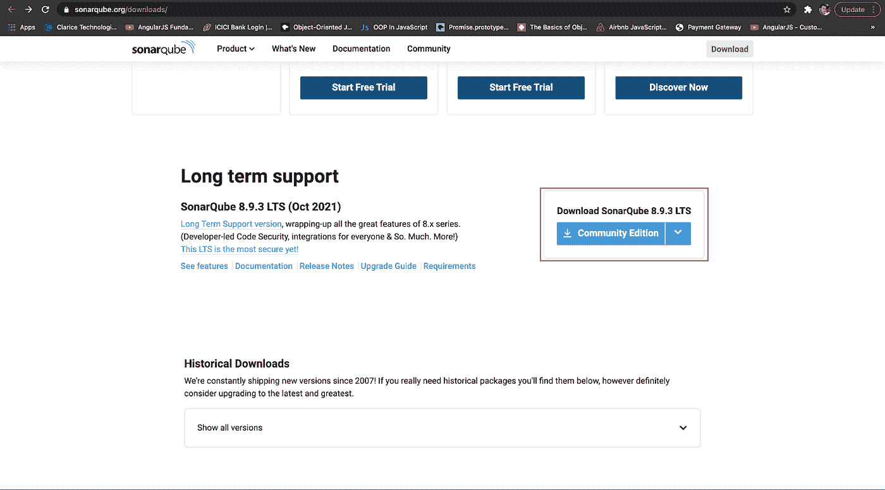
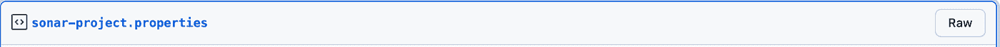
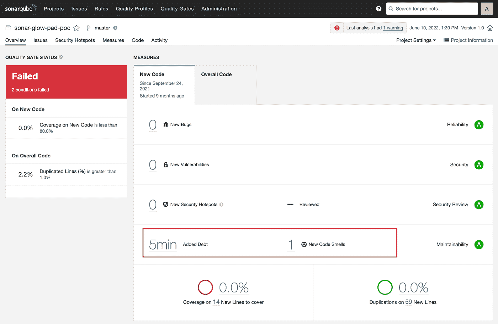
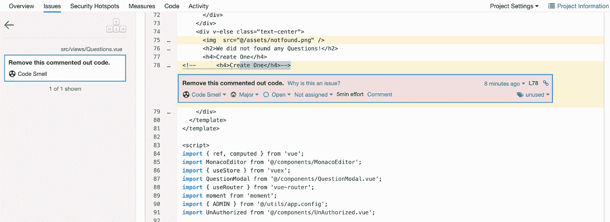
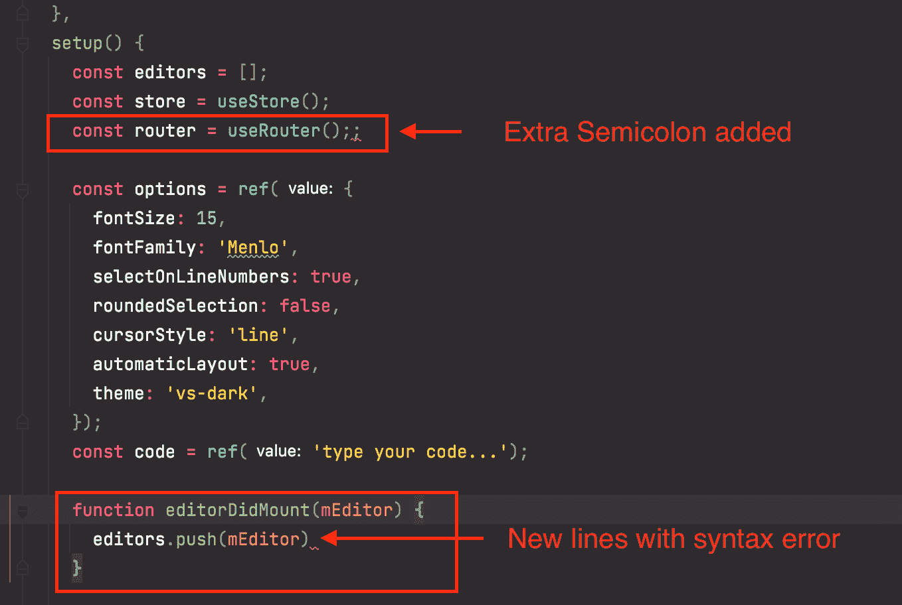
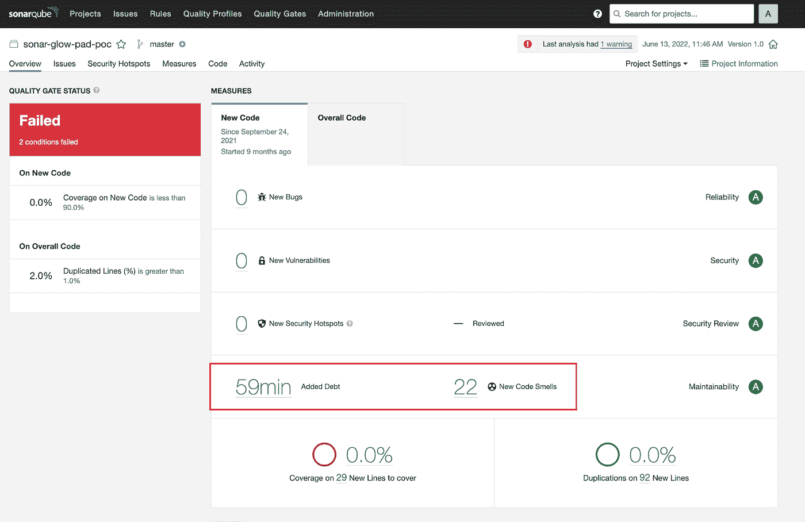
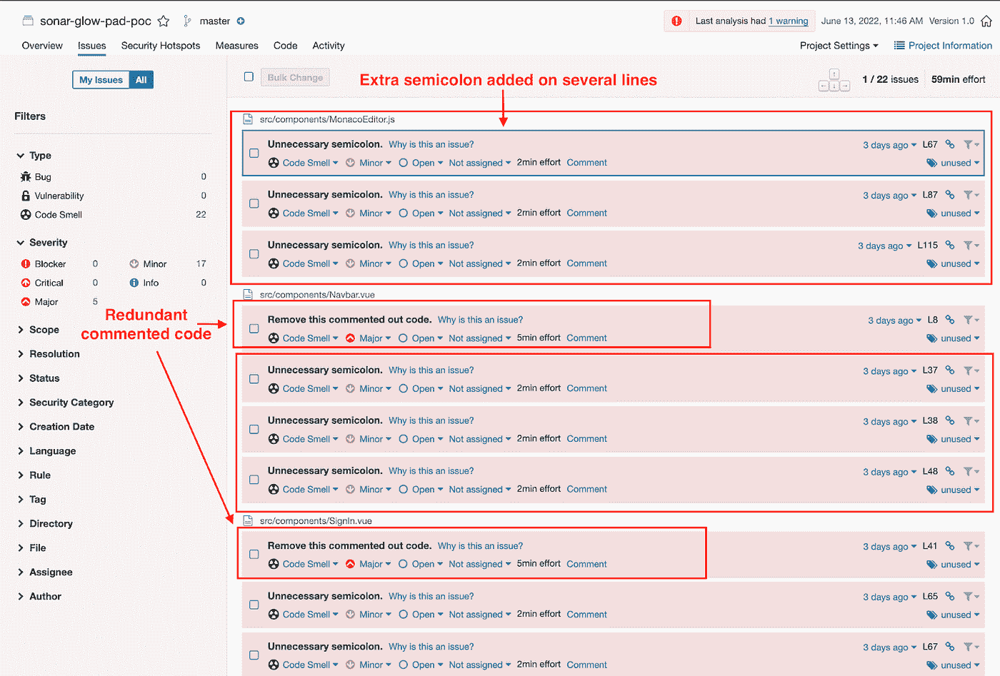
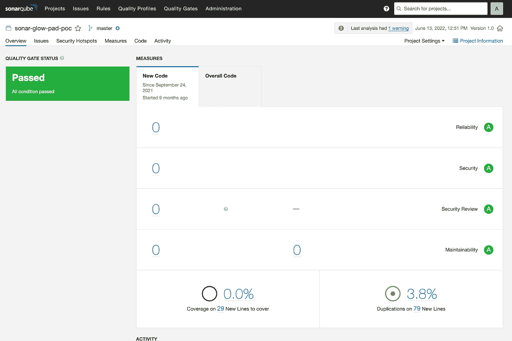

# SonarQube:重塑代码质量

> 原文：<https://medium.com/globant/sonarqube-reinventing-code-quality-81894ddc1d52?source=collection_archive---------0----------------------->

我最近遇到了一个问题，不得不花大量时间试图解决它。就在那时，我决定与大家分享。

我当时正在开发一个门户应用程序，它最初启动时运行得非常完美。过了一会儿，我们注意到应用程序出现了一些性能问题和速度变慢。我查看了代码和模块，以及构建和文件，但毫无用处。我似乎找不到任何东西。然后我学习并理解了如何使用一个叫做 SonarQube 的程序来帮助优化你的应用程序。

在我把它放入我的应用程序后，它向我展示了我正在手动寻找的确切疼痛位置。

最后，应用程序的代码质量和速度显著提高。让我们看看它是如何帮助我的。

**先来了解一下 SonarQube 是什么？**

SonarQube 是 SonarSource 创建的一个开源平台，用于持续的代码质量检查。它使用静态分析来发现用 20 多种编程语言编写的代码中的缺陷、代码味道和安全漏洞。

在本地运行声纳可能是有益的。这份文件将告诉你如何做。

Sonar 由两个主要组件组成:SonarQube，一个显示扫描结果的服务器(以及其他东西)，和 sonar-scanner，它执行实际的扫描。

**Mac 上的配置问题……**

我在 Mac 上设置 SonarQube 时遇到了很多问题。然后，我发现在 Mac 上配置 SonarQube 时，有一些事情需要记住。

# 先决条件

安装了 Java 版本 8 或更高版本。[https://java.com/en/download/apple.jsp](https://java.com/en/download/apple.jsp)

# 第一步。下载并安装 SonarQube

下载 SonarQube:[https://www.sonarqube.org/downloads/](https://www.sonarqube.org/downloads/)

**注:请下载 LTS 版本**

*   解压你刚刚下载的文件。
*   将下载的文件放在方便的位置。(我喜欢放在项目文件夹里。)
*   删除版本后缀，并将其重命名为 SonarQube。

# 第二步。使用您的项目配置 SonarQube

现在是时候将 Sonar 与 Angular 项目整合在一起了，这需要 Angular app 中的***Sonar-scanner****节点包。请使用下面概述的方法来包括这一点。*

*将 sonar-scanner 作为***dev dependency***包含在 package.json 中，然后运行下面的脚本。*

*`npm install sonar-scanner — save-dev`*

# *第三步。在项目中配置 SonarQube 属性文件*

*创建一个名为 sonar-project 的文件。属性，然后将下列属性添加到同一文件中。*

**

*`sonar.host.url = [http://localhost:9000](http://localhost:9000)`*

*`sonar.login=admin`*

*`sonar.password=admin`*

*`sonar.projectKey=demo-app`*

*`sonar.projectName=demo-app`*

*`sonar.projectVersion=1.0`*

*`sonar.sourceEncoding=UTF-8`*

*`sonar.sources=src`*

*`sonar.exclusions=**/node_modules/**`*

*`sonar.tests=src`*

*`sonar.test.inclusions=**/*.spec.ts`*

*`sonar.typescript.lcov.reportPaths=coverage/lcov.info`*

# *为什么是 SonarQube？*

*开发人员在紧张的时间表下工作，为客户提供所需的功能。这对开发人员来说非常重要，以至于他们经常忽略代码质量、潜在的错误、代码重复和不良的复杂性分布。*

*他们也习惯于留下不需要的变量、方法等等。在这种情况下，代码将按预期执行。*

*你认为这是交付功能的合适方法吗？*

*没有。*

*开发人员应该始终遵循良好的编码实践来避免代码中的这些错误。然而，由于各种原因，并不总是能够遵循标准并保持可接受的质量。*

*为了完成持续的代码集成和部署，开发人员需要一种工具，它不仅能检查并通知他们代码缺陷，还能跟踪和控制代码以确保持续的代码质量。SonarQube 可以满足所有这些要求。*

# *SonarQube 和编码问题…*

*当 SonarQube 运行分析时，如果一段代码违反了编码准则，就会出现问题。项目中每种语言的相关质量概要定义了编码规则集。*

***有三类问题**:*

1.  ***Bug** —运行时可能导致错误或意外行为的编程错误。*
2.  ***漏洞** —代码中可以被利用的开放位置。*
3.  ***代码味道** —一个可维护性的问题，使你的代码难以理解和维护。*

> ***每期都有** [**五种严重程度**](https://docs.sonarqube.org/latest/user-guide/issues/) 之一*

*让我们假设当声纳扫描仪分析在后台运行时，我们运行了项目测试。*

*导航到 SonarQube 概览仪表板以查看分析结果。*

*概览仪表板上显示以下数据:*

*   *漏洞和缺陷*
*   *你花在修复这些问题上的时间和代码的味道。*
*   *运行测试时你所覆盖的代码的平均值。*
*   *您的代码有一定比例的重复和许多重复的块。*
*   *我们的示例代码有一种代码味道，如下图所示，这将花费我们两分钟来解决。*

**

*要更深入地研究这种代码味道，请转到“问题”一节。您将在下一个屏幕上看到哪个文件受到了影响。要查看提供的解决方案，请单击警告消息。*

**

*尝试下面的测试，看看代码中是否有新的错误，以及如何修复它们。*

1.  *打开 **Questions.vue** 文件，将以下新错误添加到代码中:*

**

*2.再次运行声纳扫描命令。正如预期的那样，新的代码味道出现了，解决这些问题所需的时间增加了。*

*在屏幕右侧，会出现一个新区域(以黄色突出显示)。SonarQube 处理当前状态(白色)和最近的更改。如屏幕截图所示，上一次扫描中所做的更改导致添加了四种新的代码气味。SonarQube 根据各种因素为每个部分分配一个分数，其中“A”为最佳状态。它还指示新代码的质量是否低于以前的版本，以及增加了五行代码:*

**

> *要查看新错误的详细信息，请转到“问题”部分:*

**

*更正代码中的所有错误。运行新的分析来仔细检查项目。恭喜你！您的代码已经通过测试，并且没有新的代码气味:*

**

***#有不同的选择，我们为什么选择 SonarQube？***

*说到自动化编码审查平台，我们知道您有很多选择。虽然它不完美，但也不可怕。*

# *SonarQube 的好处？*

1.  ***可持续性** —降低应用程序复杂性、潜在漏洞和代码重复，延长应用程序寿命。*
2.  ***提高生产力** —降低应用程序的规模、维护成本和风险；因此，它消除了花费额外时间更新代码的需要。*
3.  *质量代码 —代码质量保证是软件开发过程中不可或缺的一部分。*
4.  ***检测错误** —检测代码中的错误，并通知开发人员在提交它们进行输出之前修复它们。*
5.  ***提高一致性**-确定何时违反了规范标准，并提高产品质量。*
6.  ***业务规模** —可以审查的项目数量没有限制。*
7.  ***提高开发人员技能** —开发人员可以通过定期收到质量问题的反馈来提高他们的编码技能。*

# *结论*

*SonarQube 的使命是增强开发者的能力，并培育一个关注代码质量和安全性的开放社区。希望你看完这篇文章后对 SonarQube 的功能有个基本的了解。*

**如果你同意，请留下评论以示支持。**