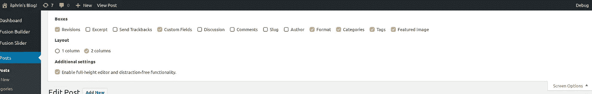

# 通过自定义日期字段对 Wordpress 文章进行排序

> 原文：<https://medium.com/quick-code/sort-wordpress-posts-by-a-custom-date-field-ffedc2b8236e?source=collection_archive---------0----------------------->

你可能已经设计了一个 Wordpress 主题，但是你可能需要创建一个“自定义字段”，一个包含文章、类别、标签或任何其他 Wordpress 实体相关信息的附加字段。您可以创建不同类型的自定义字段，今天您将看到的是与文章相关联的日期字段。

最重要的是如何用它来分类我们的文章。

# 自定义日期字段

自定义字段是与文章、页面等相关的元数据。您可以添加任意多的元数据，这些元数据可以包含非常广泛的信息:一个字符串、一个数字、一个日期、一个时间…

你可以通过向下滚动顶部的“屏幕选项”菜单来查看文章的自定义字段，然后选中“自定义字段”。你现在可以在文章底部看到文章的所有元数据，你也可以添加一个。



*Screen Options*

为了简化这篇文章，我使用了[高级定制字段专业版](https://www.advancedcustomfields.com/)专业版插件(非专业版对我们的情况也一样好)。这个插件允许你为每篇文章快速创建字段，而不必为每篇新文章添加元数据关键字。

# 用例—创建一个主题

情况是这样的:你为一个组织 X 管理一个 Wordpress 站点的创建。X 经常发布关于员工组织的 Meetup 活动的文章。这些事件都有发生的日期。因此，我们的目标是建立一个博客页面，列出所有的文章，并不是按照这些文章的写作日期，而是按照每篇文章所对应的事件的日期进行排序。

为此，我们必须从一个新的主题开始，因为这将需要写一些 PHP 代码。我不打算深入探讨一个主题的创作细节，这里有足够的[文学](https://codex.wordpress.org/Theme_Development) [上](https://webdesign.tutsplus.com/tutorials/building-a-wordpress-theme-in-60-seconds--cms-24315)[题材](https://blog.templatetoaster.com/create-wordpress-theme-scratch/)。

# WP_QUERY 进行查询

如果你在过去已经创建了一个主题，或者如果你刚刚访问了我刚才给你的一个链接，你通常会有一个主题文件夹，在根目录下有一个`functions.php`文件。这个文件可以包含一大堆在加载 wordpress 页面之前要保存的操作，添加 CSS 或 JavaScript 来加载到您的站点，或者在我们的例子中，修改对我们站点上数据库内容的请求。

Wordpress 有一个非常强大的处理所有查询的对象，叫做 [WP_QUERY](https://codex.wordpress.org/Class_Reference/WP_Query) 。通过直接修改这个对象，你将能够修改 Wordpress 请求检索你的文章的方式。

你有你的文章，它们很漂亮，写得很好，让你想去参加这些活动。您甚至花时间为每篇文章添加了一个包含活动日期的自定义字段。该字段具有关键字:“日期事件”。我们现在将添加一个[动作](https://codex.wordpress.org/Plugin_API/Action_Reference)，它将在检索项目之前执行:

```
add_action( 'pre_get_posts', 'get_post_by_event' ); function get_post_by_event( $query ) { if( $query->is_main_query() && !is_admin() && is_home() ) { $query->set( 'meta_key', 'date_event' ); $query->set( 'orderby', 'meta_value' ); $query->set( 'order', 'ASC' ); } }
```

让我们一步一步地看看这段代码做了什么:

1.  首先我们记录这个动作，这个动作叫做`pre_get_posts`，我们要求它在正确的时间启动`get_post_by_event`。
2.  `get_post_by_event`函数接受一个`$query`参数，它是 WP_QUERY 类的一个实例。该参数将用于对文章进行排序。
3.  这个条件可以验证我们处理了正确的请求，还可以检查我们在哪个页面上。这些功能是 Wordpress 的内部功能。
4.  我们使用 3 次`$query->set`方法来修改查询。第一个为查询确定一个元数据关键字，这里是“date_event”。第二次，我们通过`meta_value`改变物品的返回顺序，即根据每件物品的键值。

最后，我们改变顺序，使事件从最近的到最远的，但这不是必须的。

# WP _ 查询和操作

WP_QUERY 是一个相当复杂的要掌握的对象(我不假装完全掌握！)，但一旦你把手伸进去，你就会意识到它提供的许多可能性。据我所知，它是可定制的，就好像您可以直接编写 SQL 查询来检索文章一样。

通过将这个对象与 Wordpress 的动作相结合，可能性变得非常多，我只能邀请您阅读可能的动作列表的文档来给你一个想法！

*原载于 2018 年 3 月 12 日*[*ilphrin.com*](https://ilphrin.com/2018/03/12/sort-wordpress-posts-by-custom-date-field.html)*。*

如果你对这篇文章感兴趣，别忘了拍拍手，订阅我的邮件，在 https://ilphrin.com 的 [*获得最新的帖子和新闻！*](https://ilphrin.com)