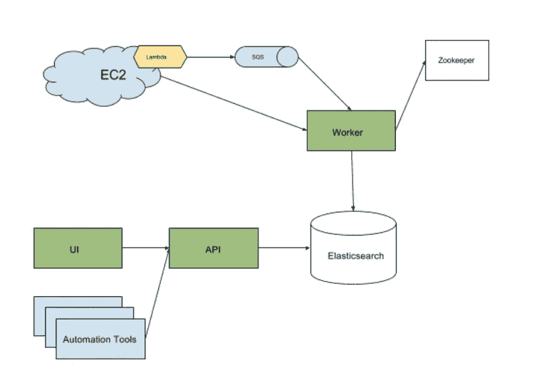

# 声波:一个开源的配置管理数据库

> 原文：<https://medium.com/pinterest-engineering/soundwave-an-open-source-configuration-management-database-df75b31b8f5a?source=collection_archive---------2----------------------->

Lida Li & Saurabh Joshi | Pinterest 工程师，云计算管理平台

Pinterest 在 AWS 上运行其基础设施。每天，由于[自动伸缩](/@Pinterest_Engineering/auto-scaling-pinterest-df1d2beb4d64)，以及新服务启动和集群轮换，数千个 EC2 实例被启动、停止和终止。为了作为主机级硬件和软件配置的单一事实来源，我们建立了声波，一个配置管理数据库(CMDB)。声波在支持资源管理、服务自动化、容量规划、安全、财务审计和即席查询方面发挥着关键作用。我们[开源了](https://github.com/pinterest/soundwave)名为声波的 CMDB 的核心组件，以帮助其他人自动跟踪当前和历史 EC2 实例及其元数据。在这里，我们将涵盖如何 CMDB 是有益的和声波的建筑。

**配置管理数据库**

配置管理数据库通常被查询来回答诸如“在我们的基础设施中有多少特定类型的实例在运行？”，“给定实例的 IAM 角色是什么？”以及“给定实例上使用的 OpenSSH 版本是什么？”。

我们将声波构建为内部数据存储，与 AWS 控制台和 EC2 API 一起工作，并帮助:

1.从自动化系统直接查询机器信息

2.保存已终止实例的元数据和实例信息，以跟踪这些已终止实例的使用历史和诊断问题。

3.将 EC2 模式和查询扩展到简单过滤之外。

其他优势包括:

1.在我们的 elasticsearch store 中专门跟踪 EC2 实例有助于我们获得比 EC2 API 更好的查询性能。这意味着在声波获得所有正在运行的实例的信息大约需要 5 秒钟，但是在 EC2 API 中需要一分多钟。

2.它为配置管理创建了一个与云无关的抽象层，使得支持混合云场景变得更加容易。

声波:引擎盖下

声波有三个主要组件，下图显示了其系统架构，包括:

*   一个基于 Java 的 worker 系统，它将实例数据与 EC2 同步，并将最新数据推送到 Elasticsearch 存储中。数据接收分两部分完成:

1.  AWS lambda 函数监听由实例状态变化触发的 CloudWatch 事件，并将通知推送到亚马逊 SQS 队列。订阅这个 SQS 队列的一队 Java 工作人员获取通知数据并写入 Elasticsearch 存储。
2.  后台协调作业定期运行，以确保 Elasticsearch 存储中的数据与 EC2 数据同步。这有助于捕获不会触发云观察事件的实例更改。

*   一个 RESTful API 层，通过搜索提供对实例数据的访问。
*   最终用户使用 Lucene 语法执行特定搜索查询的 UI 仪表板。

**EC2 API 的最终一致性**

EC2 API 有一个[最终一致性](http://docs.aws.amazon.com/AWSEC2/latest/APIReference/query-api-troubleshooting.html#eventual-consistency)模型。当一个新的实例启动时，JAVA 工作者会收到一个关于这个实例的通知。该工作线程调用一个 API——DescribeInstances——来获取关于新启动的实例的信息。很有可能许多实例属性目前还没有填充，但是几分钟后就可以使用了。如下所述，声波优雅地处理了这些问题:

1.  Java 工作者检查期望从 EC2 返回的关键属性。如果此时属性不可用，它会将实例通知放回 SQS 队列，并使用由消息可见性控制的指数补偿时间。一旦从 EC2 API 获得了所需的属性，该消息将被完全处理。
2.  对于其他非关键属性，工作线程会运行后台协调作业，以便在 EC2 中提供缺失的属性时填充这些属性。

**评价声波**

我们开源了[声波](https://github.com/pinterest/soundwave)，因为我们相信它会对其他在 AWS EC2 中运行服务的人有用。我们提供了 Terraform 文件来配置 AWS 和 Docker-Compose，以便在容器中快速运行整个声波堆栈。要开始使用，请查看 [GitHub 库](https://github.com/pinterest/soundwave)，了解设置和使用它的详细步骤。

如果这些是让你兴奋的项目，[加入我们](https://careers.pinterest.com/)。

*鸣谢:浩铭、苏曼·卡鲁莫里和杰姆·考克斯，感谢他们的原创设计讨论和基础设施支持 CMP 和 SRE 团队，感谢他们的使用反馈和错误报告。*