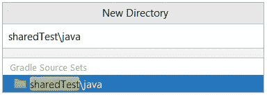
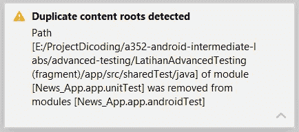
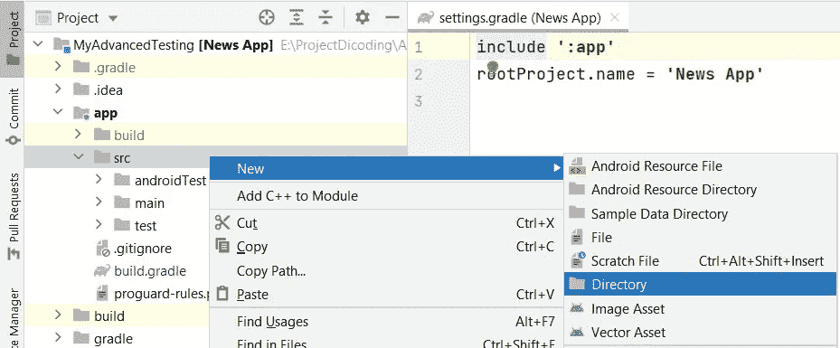
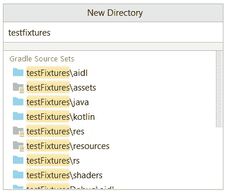

# SourceSet SharedTest 在 Android Studio 花栗鼠中不起作用？使用测试夹具作为解决方案

> 原文：<https://medium.easyread.co/sourceset-sharedtest-not-working-in-android-studio-chipmunk-use-testfixtures-as-solution-b3d150b41f08?source=collection_archive---------0----------------------->


当我们创建一个测试代码时，我们经常会发现本地测试(test)和仪器测试(androidTest)的重复代码。或者，我们可以创建一个公共的测试文件夹，我们可以在其中存储文件、类和函数，这些文件、类和函数将可用于本地和检测测试。通常，我们称之为[**shared test**](http://robolectric.org/blog/2021/10/06/sharedTest/)**模式。**

**为了实现该模式，我们需要在 build.gradle 中添加 sourceSet**

```
sourceSets **{** androidTest.java.srcDirs += **"src/sharedTest/java"** test.java.srcDirs += **"src/sharedTest/java"
}**
```

**然后我们可以通过在 src 文件夹中创建一个名为 **sharedTest\java** 的新目录来添加一个新的 sourceset**

****

**这是实施进展顺利，直到新的 Android 工作室发布。那是**花栗鼠**版本。**

**当我们现在执行这个实现时，它将显示一个警告弹出消息**“检测到重复的内容根”。模块[unitTest]的路径[sharedTest]已从模块[androidTest]** 中移除。**

****

**不仅仅是警告，主要问题是 **androidTest 无法访问 sharedTest** 中的代码，但是测试文件夹仍然可以。那么，如何解决这些问题呢？**

**检查出…**

**在我搜索了两天之后，我只在 StackOverflow 和 YouTrack 中找到了一些没有答案的问题。所以我认为有很多人有同样的问题。**

**似乎在新的 IDE 中，我们不能在同一个模块中有同一个文件夹。**

**然后我试着在这个 youtrack 问题中询问是否有这个问题的解决方案，**

 **[## 谷歌问题跟踪

### 编辑描述

issuetracker.google.com](https://issuetracker.google.com/issues/232007221)** 

**而且我得到了回复！他们说:**

> **源集不能再包含共享根，因为这不可能在 IDE 中表示。为了在 test 和 androidTest 之间共享源代码，你应该能够使用[测试夹具](https://developer.android.com/reference/tools/gradle-api/7.1/com/android/build/api/dsl/TestFixtures)。**

**很好。这意味着我们仍然有一个使用**测试夹具**的解决方案。但是文档还是不太清楚，所以我在这里解释一下。**

**首先，我们需要在 build.gradle (module: app)中启用测试夹具**

```
android { **...
    testFixtures{
        enable true
        androidResources true
    }** }
```

**注意:**

**在我写这篇博客之前，自动完成功能没有在 Android Studio 中显示。所以直接写或者复制粘贴上面的代码就可以了。**

**然后作为前一步。我们可以在 src 文件夹中创建一个新目录。**

****

**注意:将视图结构从 Android 更改为 Project，以便于使用。**

**然后给一个名字 **testFixtures\java** 。**

****

**注意:不要忘记创建一个与主源集同名的包。**

**现在，我们可以将代码从 sharedFolder 移动到 testFixture。之后，我们可以使用来自本地测试和插装测试的代码。霍拉艾..**

**然后，如果您需要 testFixture 中的特殊依赖，您可以使用这个 sintax 在 build.gradle 中添加。**

```
testFixturesImplementation **"androidx.lifecycle:lifecycle-livedata-ktx:2.4.1"**
```

**祝你尝试愉快！**

****更新 25 月 22 日:** test fixtures 的代码可以被正确调用，但是运行测试时失败，错误为“[未解析的引用](https://issuetracker.google.com/issues/219687418)”。任何人知道如何解决请填写评论。**

> **开始的最佳时间是昨天，其次是现在。—未知**