# 带跨度的文本样式

> 原文：<https://medium.com/androiddevelopers/spantastic-text-styling-with-spans-17b0c16b4568?source=collection_archive---------0----------------------->


Illustration by [Virginia Poltrack](https://twitter.com/VPoltrack)

要在 Android 中样式化文本，使用 spans！改变一些字符的颜色，使它们可点击，缩放文本的大小，甚至用跨度画自定义的项目符号。跨度可以改变`TextPaint`属性，在`Canvas`上绘图，甚至改变文本布局和影响行高等元素。跨度是可以附加到文本和从文本分离的标记对象；它们可以应用于整段或部分文本。

让我们看看如何使用跨度，开箱即用的跨度是什么，如何轻松创建自己的跨度，以及最后如何测试跨度:

[Android 中的样式文本](#b0e9)

[应用跨度](#d5d9)

[框架跨度](#149b)

*   [外观 vs 度量影响跨度](#f6db)
*   [字符 vs 段落影响跨度](#1861)

[创建自定义跨度](#7657)

[测试自定义跨度实现](#e345)

[测试跨度用途](#eef0)

# Android 中的文本样式

Android 提供了几种样式化文本的方法:

*   **单一样式** —该样式适用于文本视图显示的整个文本
*   **多样式**——在字符或段落级别，几种样式可以应用于一个文本

**单一样式**意味着使用 XML 属性或[样式和主题](https://developer.android.com/guide/topics/ui/look-and-feel/themes.html)对 TextView 的整个内容进行样式化。这种方法是一种简单的解决方案，可以从 XML 开始工作，但是不允许对部分文本进行样式化。比如通过设置`textStyle=”bold”`，整个文字会加粗；不能只定义特定的字符加粗。

```
<TextView
    android:layout_width="wrap_content"
    android:layout_height="wrap_content"
    **android:textSize="32sp"
    android:textStyle="bold"**/>
```

**多样式**意味着给同一文本添加几种样式。例如，将一个单词设为斜体，另一个单词设为粗体。多风格可以实现使用 HTML 标签，跨度或处理画布上的自定义文本绘制。

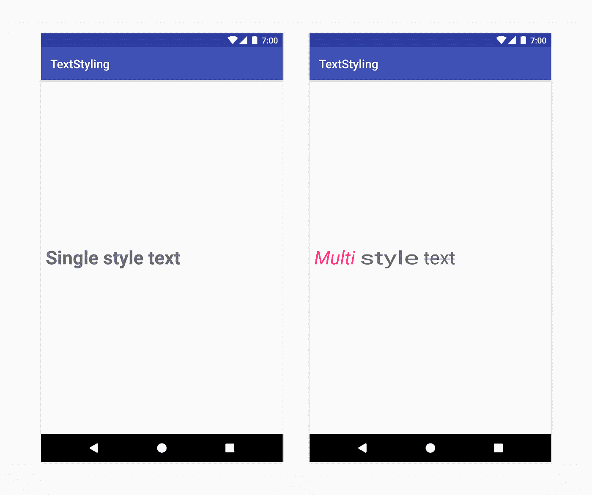

*Left: Single style text. TextView with textSize=”32sp” and textStyle=”bold”. Right: Multi style text. Text with* `*ForegroundColorSpan*`*, StyleSpan(ITALIC), ScaleXSpan(1.5f), StrikethroughSpan.*

HTML 标签是简单问题的简单解决方案，比如使文本加粗、倾斜，甚至显示项目符号。要样式化包含 HTML 标签的文本，调用`[Html.fromHtml](https://developer.android.com/reference/android/text/Html.html#fromHtml(java.lang.String,%20int))`方法。在引擎盖下，HTML 格式被转换成 spans。请注意，`Html`类并不支持所有的 HTML 标签和 css 样式，比如让项目符号变成另一种颜色。

```
val text = "My text <ul><li>bullet one</li><li>bullet two</li></ul>"
myTextView.text = **Html.fromHtml(text)**
```

当您有平台默认不支持的样式需求时，您可以手动地在画布上绘制文本，比如沿着弯曲的路径书写文本。

**Spans** 允许你实现多样式的文本和更精细的定制。例如，您可以通过应用`[BulletSpan](https://developer.android.com/reference/android/text/style/BulletSpan.html)`将文本段落定义为具有项目符号。您可以自定义文本边距和项目符号之间的间距以及项目符号的颜色。从 Android P 开始，你甚至可以[设置弹点的半径](https://developer.android.com/reference/android/text/style/BulletSpan.html#BulletSpan(int,%20int,%20int))。您还可以为 span 创建一个自定义实现。查看下面的“创建自定义跨度”部分，了解如何操作。

```
val spannable = SpannableString("My text \nbullet one\nbullet two")spannable.setSpan(
    BulletPointSpan(gapWidthPx, accentColor),
    /* start index */ 9, /* end index */ 18,
    Spannable.*SPAN_EXCLUSIVE_EXCLUSIVE*)spannable.setSpan(
     BulletPointSpan(gapWidthPx, accentColor),
     /* start index */ 20, /* end index */ spannable.length,
     Spannable.*SPAN_EXCLUSIVE_EXCLUSIVE*)myTextView.*text* = spannable
```

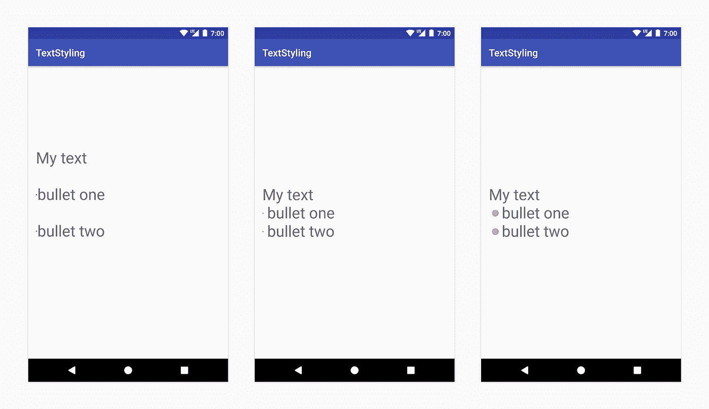

*Left: Using HTML tags. Center: Using BulletSpan with default bullet size. Right: Using BulletSpan on Android P or custom implementation.*

你可以结合单一风格和多种风格。您可以将应用于 TextView 的样式视为“基本”样式。跨度文字样式应用于基本样式的“顶部”,并将覆盖基本样式。例如，当将`textColor=”@color.blue”`属性设置为 TextView 并对文本的前 4 个字符应用`ForegroundColorSpan(Color.PINK)`时，前 4 个字符将使用 span 设置的粉色，文本的其余部分使用 TextView 属性设置的颜色。

```
<TextView
    android:layout_width="wrap_content"
    android:layout_height="wrap_content"
    **android:textColor="@color/blue"**/>val spannable = SpannableString(“Text styling”)
spannable.setSpan(
     **ForegroundColorSpan(Color.PINK)**, 
     0, 4, 
     Spannable.SPAN_EXCLUSIVE_EXCLUSIVE)myTextView.text = spannable
```

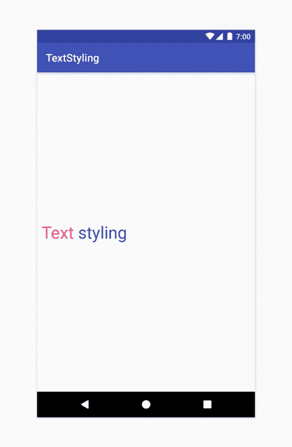

*Combining TextView with XML attributes and text with spans*

# 应用跨度

使用跨度时，您将使用以下类别之一:`[SpannedString](https://developer.android.com/reference/android/text/SpannedString.html)`、`[SpannableString](https://developer.android.com/reference/android/text/SpannableString.html)`或`[SpannableStringBuilder](https://developer.android.com/reference/android/text/SpannableStringBuilder.html)`。它们之间的区别在于文本或标记对象是可变的还是不可变的，以及它们使用的内部结构:`SpannedString`和`SpannableString`使用线性数组来记录增加的跨度，而`SpannableStringBuilder`使用[间隔树](https://en.wikipedia.org/wiki/Interval_tree)。

以下是如何决定使用哪一个:

*   仅**读取而不设置**文本或跨度？>-`SpannedString`
*   **设置文本和跨度**？- > `SpannableStringBuilder`
*   设置一个**小跨度数** ( < ~10)？- > `SpannableString`
*   设置一个**更大的跨距数**(>~ 10)——>-

例如，如果您正在处理一个不变的文本，但是您想要将范围附加到该文本，您应该使用`SpannableString`。

```
╔════════════════════════╦══════════════╦════════════════╗
║ **Class**                  ║ **Mutable Text** ║ **Mutable Markup** ║
╠════════════════════════╬══════════════╬════════════════╣
║ SpannedString          ║      no      ║       no       ║
║ SpannableString        ║      no      ║      yes       ║
║ SpannableStringBuilder ║     yes      ║      yes       ║
╚════════════════════════╩══════════════╩════════════════╝
```

所有这些类都扩展了`[Spanned](https://developer.android.com/reference/android/text/Spanned.html)`接口，但是具有可变标记的类(`SpannableString`和`SpannableStringBuilder`)也从`[Spannable](https://developer.android.com/reference/android/text/Spannable.html)`扩展而来。

`[Spanned](https://developer.android.com/reference/android/text/Spanned.html)` - >带有不可变标记的不可变文本

`[Spannable](https://developer.android.com/reference/android/text/Spannable.html)`(扩展`Spanned` )- >带有可变标记的不可变文本

通过调用`Spannable`对象上的`[setSpan(Object what, int start, int end, int flags)](https://developer.android.com/reference/android/text/Spannable.html#setSpan(java.lang.Object,%20int,%20int,%20int))`来应用跨度。`what`对象是文本中从开始到结束索引应用的标记。该标志标记该范围是否应该扩展以包含在其起点或终点插入的文本。不管设置了哪个标志，只要文本插入的位置大于起点但小于终点，范围就会自动扩展。

例如，设置一个`ForegroundColorSpan`可以这样做:

```
val spannable = SpannableStringBuilder(“Text is spantastic!”)spannable.setSpan(
     ForegroundColorSpan(Color.RED), 
     8, 12, 
     Spannable.SPAN_EXCLUSIVE_INCLUSIVE)
```

因为跨度是使用`[SPAN_EXCLUSIVE_**INCLUSIVE**](https://developer.android.com/reference/android/text/Spanned.html#SPAN_EXCLUSIVE_EXCLUSIVE)`标志设置的，所以当在跨度末尾插入文本时，它将被扩展以包括新的文本:

```
val spannable = SpannableStringBuilder(“Text is spantastic!”)spannable.setSpan(
     ForegroundColorSpan(Color.RED), 
     /* start index */ 8, **/* end index */ 12**, 
     Spannable.SPAN_EXCLUSIVE_**INCLUSIVE**)**spannable.insert(12, “(& fon)”)**
```

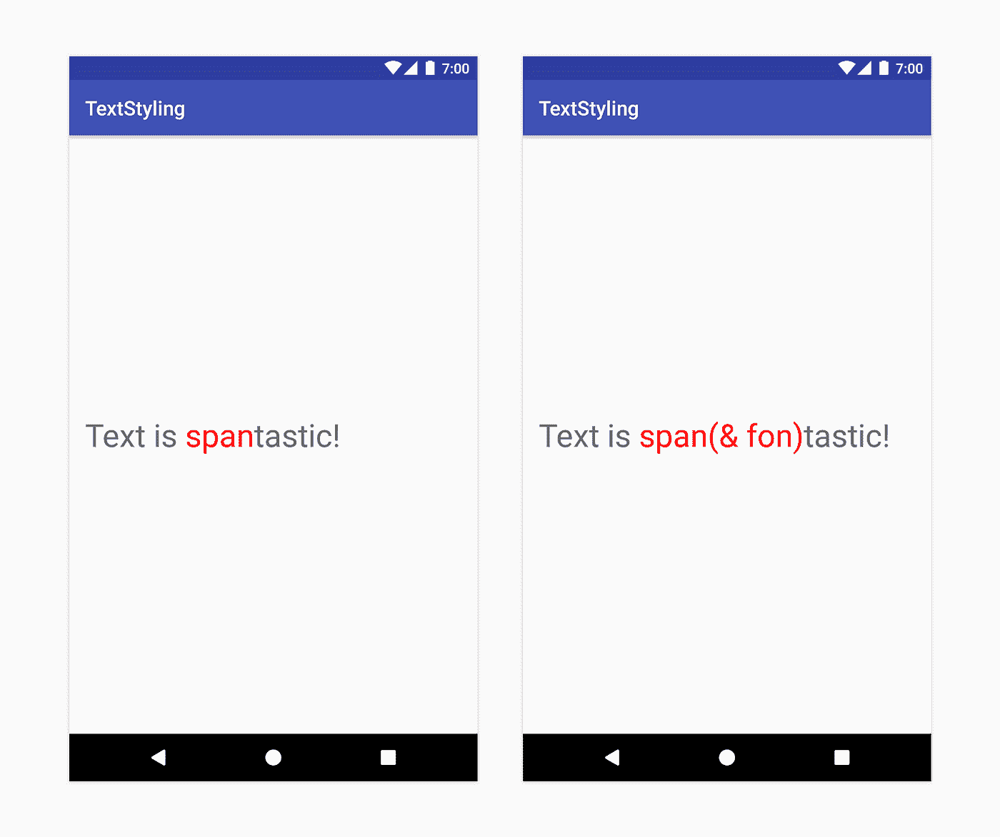

*Left: Text with ForegroundColorSpan. Right: Text with ForegroundColorSpan and Spannable.SPAN_EXCLUSIVE_INCLUSIVE*

如果 span 设置了`Spannable.SPAN_EXCLUSIVE_EXCLUSIVE`标志，在 span 末尾插入文本将不会修改 span 的结束索引。

可以将多个跨度组合并附加到同一个文本段。例如，粗体和红色的文本可以这样构造:

```
val spannable = SpannableString(“Text is spantastic!”)spannable.setSpan(
     ForegroundColorSpan(Color.RED), 
     8, 12, 
     Spannable.SPAN_EXCLUSIVE_EXCLUSIVE)spannable.setSpan(
     StyleSpan(BOLD), 
     8, spannable.length, 
     Spannable.SPAN_EXCLUSIVE_EXCLUSIVE)
```

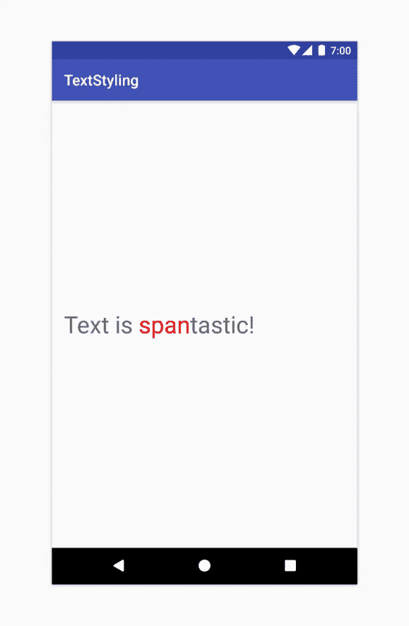

*Text with multiple spans: ForegroundColorSpan(Color.RED) and StyleSpan(BOLD)*

# 框架跨度

Android 框架定义了几个接口和抽象类，它们在测量和渲染时被检查。这些类拥有允许 span 访问像`TextPaint`或`Canvas`这样的对象的方法。

Android 框架在 [android.text.style](https://developer.android.com/reference/android/text/style/package-summary.html) 包中提供了 20+span，对主要接口和抽象类进行子类化。我们可以用几种方式对跨度进行分类:

*   基于 span 是仅改变外观还是也改变文本度量/布局
*   基于它们是在字符级还是在段落级影响文本

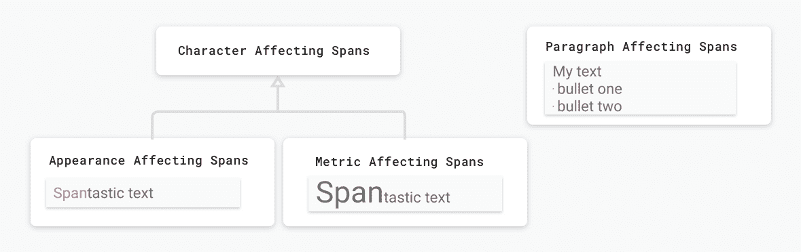

*Span categories: character vs paragraph, appearance vs metric*

## **外观 vs 度量影响跨度**

第一类影响字符级文本，改变它们的外观:文本或背景颜色、下划线、删除线等。，它触发重绘而不会导致文本的重新布局。这些跨度实现`[UpdateAppearance](https://developer.android.com/reference/android/text/style/UpdateAppearance.html)`并扩展`[CharacterStyle](https://developer.android.com/reference/android/text/style/CharacterStyle.html)`。`CharacterStyle`子类通过提供更新`TextPaint`的访问来定义如何绘制文本。

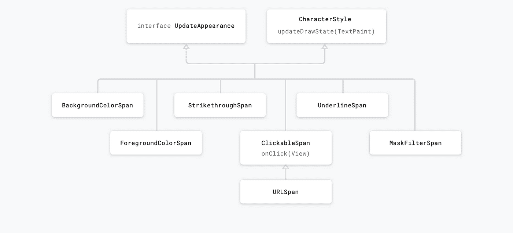

*Appearance affecting spans*

**度量影响**跨度修改文本度量和布局，因此观察跨度变化的对象将重新测量文本以获得正确的布局和渲染。

例如，影响文本大小的跨度将需要重新测量和布局，以及重新绘图。这些跨度通常扩展了`[MetricAffectingSpan](https://developer.android.com/reference/android/text/style/MetricAffectingSpan.html)`级。这个抽象类通过提供对`TextPaint`的访问，允许子类定义跨度如何影响文本测量。由于`MetricAffectingSpan`扩展了`CharacterSpan`，子类在字符级别影响文本的外观。

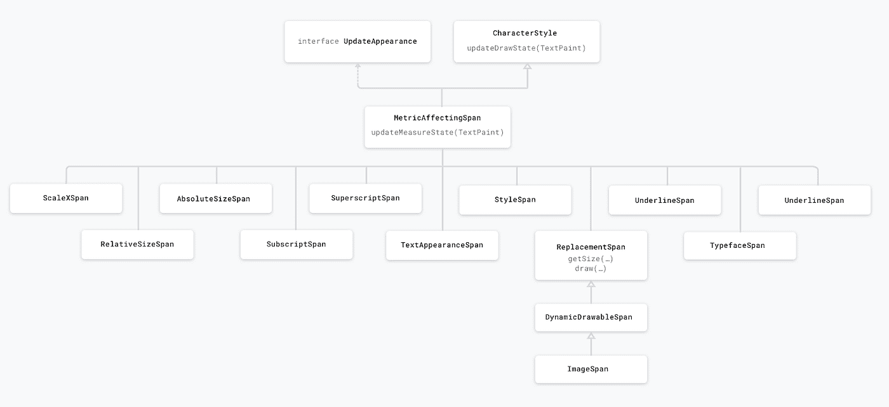

*Metric affecting spans*

您可能总是想用文本和标记重新创建`CharSequence`并调用`[TextView.setText(CharSequence)](https://developer.android.com/reference/android/widget/TextView.html#setText(java.lang.CharSequence))`。但是这几乎总是会触发重新测量和重新绘制布局以及创建额外的对象。为了减少性能影响，用`[TextView.setText(Spannable, BufferType.SPANNABLE)](https://developer.android.com/reference/android/widget/TextView.html#setText(int,%20android.widget.TextView.BufferType))`设置文本，然后当需要修改跨度时，通过将`TextView.getText()`转换为`Spannable`从 TextView 中检索`Spannable`对象。我们将在下一篇文章中更详细地介绍`TextView.setText`和不同的性能优化。

例如，考虑下面这样设置和检索的`Spannable`对象:

```
val spannableString = SpannableString(“Spantastic text”)// setting the text as a Spannable
**textView.setText(spannableString, BufferType.SPANNABLE)**// later getting the instance of the text object held 
// by the TextView
// this can can be cast to Spannable only because we set it as a
// BufferType.SPANNABLE before
val spannableText = **textView.text as Spannable**
```

现在，当我们在`spannableText`上设置跨度时，我们不需要再次调用`textView.setText`，因为我们直接修改了由`TextView`持有的`CharSequence`对象的实例。

当我们设置不同的跨度时，会发生以下情况:

**案例 1:外观影响跨度**

```
spannableText.setSpan(
     ForegroundColorSpan(colorAccent), 
     0, 4, 
     Spannable.SPAN_EXCLUSIVE_EXCLUSIVE)
```

由于我们附加了一个影响跨度的外观，`TextView.onDraw`被调用而不是`TextView.onLayout`。文本被重绘，但宽度和高度将保持不变。

**案例 2:影响跨度的度量**

```
spannableText.setSpan(
     RelativeSizeSpan(2f), 
     0, 4, 
     Spannable.SPAN_EXCLUSIVE_EXCLUSIVE)
```

因为`[RelativeSizeSpan](https://developer.android.com/reference/android/text/style/RelativeSizeSpan.html)`改变了文本的大小，所以文本的宽度和高度以及文本的布局都可以改变(例如，一个特定的单词现在可能会进入下一行，而`TextView`的大小不会改变)。`TextView`需要计算新的大小，因此调用`onMeasure`和`onLayout`。

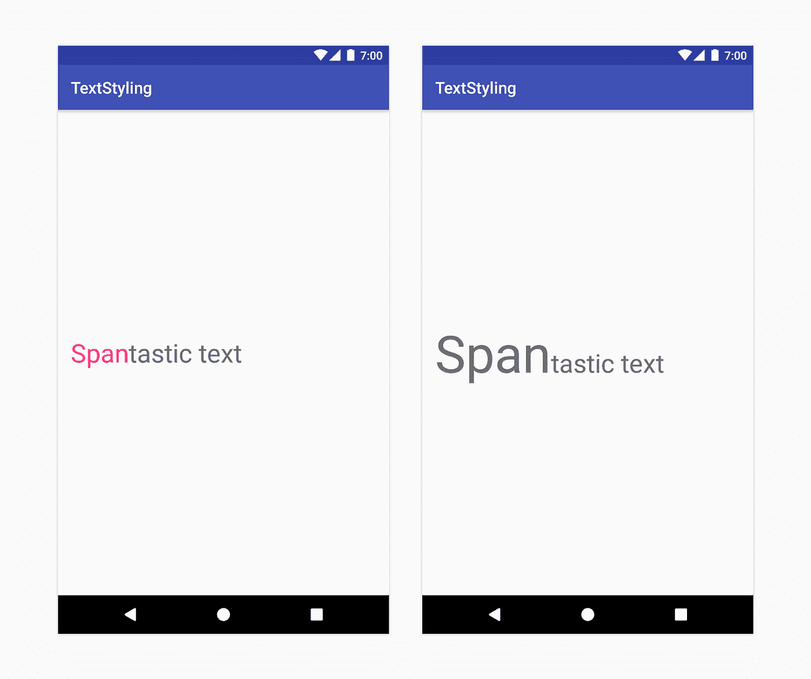

*Left: ForegroundColorSpan — appearance affecting span. Right: RelativeSizeSpan — metric affecting span*

## **字符 vs 段落影响跨度**

跨度可以在字符级别影响文本，更新背景颜色、样式或大小等元素，也可以在段落级别影响文本，改变整个文本块的对齐方式或边距。根据所需的样式，扳手可以延伸`[CharacterStyle](https://developer.android.com/reference/android/text/style/CharacterStyle.html)`或执行`[ParagraphStyle](https://developer.android.com/reference/android/text/style/ParagraphStyle.html)`。延伸`ParagraphStyle`的跨度必须从单个段落的第一个字符连接到最后一个字符，否则跨度将不会显示。在 Android 上，段落是基于新行(`\n`)字符定义的。

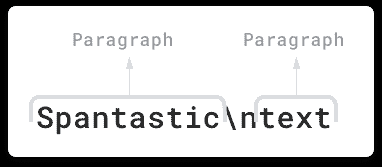

*On Android paragraphs are defined based on new line (‘\n’) character.*

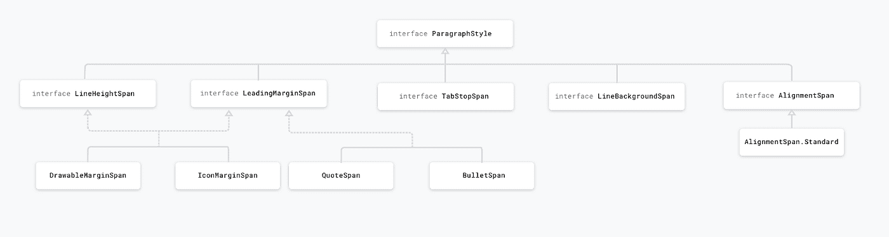

*Paragraph affecting spans*

例如，像`[BackgroundColorSpan](https://developer.android.com/reference/android/text/style/BackgroundColorSpan.html)`这样的`CharacterStyle`跨度可以附加到文本中的任何字符。在这里，我们将它从第 5 个字符附加到第 8 个字符:

```
val spannable = SpannableString(“Text is**\n**spantastic”)spannable.setSpan(
    BackgroundColorSpan(color),
    5, 8,
    Spannable.SPAN_EXCLUSIVE_EXCLUSIVE)
```

一个`ParagraphStyle`跨度，像`[QuoteSpan](https://developer.android.com/reference/android/text/style/QuoteSpan.html)`一样，只能从一个段落的开头开始附加，否则行和文本边距不会出现。例如，“*文本是****\ n****spantastic*”在文本的第 8 个字符上包含一个新行，因此我们可以将`QuoteSpan`附加到它上面，并且只对从那里开始的段落进行样式化。如果我们将 span 附加到 0 或 8 以外的任何位置，文本将根本不会被样式化。

```
spannable.setSpan(
    QuoteSpan(color), 
    8, text.length, 
    Spannable.SPAN_EXCLUSIVE_EXCLUSIVE)
```

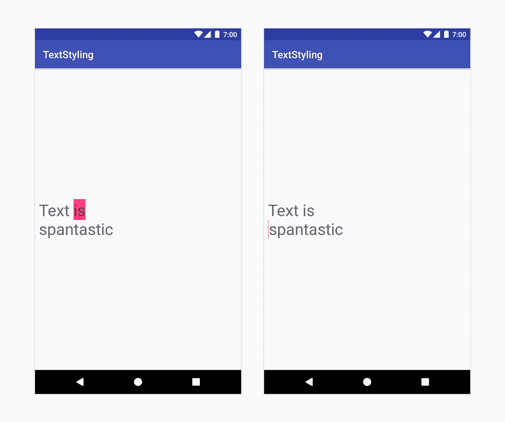

*Left: BackgroundColorSpan — character affecting span. Right: QuoteSpan — paragraph affecting span*

# 创建自定义跨度

当实现你自己的范围时，你将需要决定你的范围是否影响字符或段落级别的文本，以及它是否也影响布局或仅仅是文本的外观。但是，在从头开始编写您自己的实现之前，请检查您是否可以使用框架跨度中提供的功能。

*TL；博士:*

*   *影响文字处于* ***字符级*** *- >* `*CharacterStyle*`
*   *影响文字在* ***段落层次*** *- >* `*ParagraphStyle*`
*   *影响* ***文字外观*** *- >* `*UpdateAppearance*`
*   *影响* ***文字度量*** *- >* `*UpdateLayout*`

假设我们需要实现一个 span，允许以一定的比例增加文本的大小，比如`RelativeSizeSpan`，并设置文本的颜色，比如`ForegroundColorSpan`。为此，我们可以扩展`RelativeSizeSpan`，因为它为`updateDrawState`和`updateMeasureState`提供了回调，我们可以覆盖绘制状态回调并设置`TextPaint`的颜色。

```
class RelativeSizeColorSpan(
    @ColorInt private val color: Int,
    size: Float
) : RelativeSizeSpan(size) { **override fun updateDrawState(textPaint: TextPaint?)** {
         super.updateDrawState(ds)
         textPaint?.color = color
    }
}
```

注意:将`RelativeSizeSpan`和`ForegroundColorSpan`应用于同一文本可以达到相同的效果。

# 测试自定义跨度实现

测试跨度意味着检查 TextPaint 上是否确实进行了预期的修改，或者是否在画布上绘制了正确的元素。例如，考虑将指定大小和颜色的项目符号添加到段落的 span 的自定义实现，以及左边距和项目符号之间的间隙。参见 [android-text 示例](https://github.com/googlesamples/android-text/blob/master/TextStyling-Kotlin/app/src/main/java/com/android/example/text/styling/renderer/spans/BulletPointSpan.kt)中的实现。为了测试这个类，实现一个 AndroidJUnit 测试，检查:

*   在画布上画一个特定大小的圆
*   如果跨度没有附加到文本，则不会绘制任何内容
*   根据构造函数参数值设置正确的边距

测试画布交互可以通过模仿画布来完成，将模仿的对象传递给`drawLeadingMargin`方法，并验证是否使用正确的参数调用了正确的方法。

```
val canvas = mock(Canvas::class.*java*)
val paint = mock(Paint::class.*java*)
val text = SpannableString("text")

@Test fun drawLeadingMargin() {
    val x = 10
    val dir = 15
    val top = 5
    val bottom = 7
    val color = Color.*RED*// Given a span that is set on a text
    val span = BulletPointSpan(*GAP_WIDTH*, color)
    text.setSpan(span, 0, 2, Spanned.*SPAN_EXCLUSIVE_EXCLUSIVE*) // When the leading margin is drawn
    span.drawLeadingMargin(canvas, paint, x, dir, top, 0, bottom,
            text, 0, 0, true, mock(Layout::class.*java*)) // Check that the correct canvas and paint methods are called, 
    //in the correct order
    val inOrder = inOrder(canvas, paint) // bullet point paint color is the one we set
    inOrder.verify(paint).*color* = color
    inOrder.verify(paint).*style* = eq<Paint.Style>(Paint.Style.FILL) // a circle with the correct size is drawn 
    // at the correct location
    val xCoordinate = *GAP_WIDTH*.toFloat() + x.toFloat()
    +dir * BulletPointSpan.DEFAULT_BULLET_RADIUS
    val yCoord = (top + bottom) / 2f inOrder.verify(canvas)
           .drawCircle(
                eq(xCoordinate),
                eq(yCoord), 
                eq(BulletPointSpan.DEFAULT_BULLET_RADIUS), 
                eq(paint))
    verify(canvas, never()).save()
    verify(canvas, never()).translate(
               eq(xCoordinate), 
               eq(yCoordinate))
}
```

查看`[BulletPointSpanTest](https://github.com/googlesamples/android-text/blob/master/TextStyling-Kotlin/app/src/androidTest/java/com/android/example/text/styling/renderer/spans/BulletPointSpanTest.kt)`中的其余测试。

# 测试跨越使用

`[Spanned](https://developer.android.com/reference/android/text/Spanned.html)`接口允许从文本中设置和检索跨度。通过实施 Android JUnit 测试，检查是否在正确的位置添加了正确的跨度。在 [android 文本示例](https://github.com/googlesamples/android-text)中，我们将项目符号标记转换为项目符号。这是通过将`BulletPointSpans`附加到文本的正确位置来实现的。以下是测试方法:

```
@Test fun textWithBulletPoints() {
val result = builder.markdownToSpans(“Points\n* one\n+ two”)// check that the markup tags are removed
assertEquals(“Points\none\ntwo”, result.toString())// get all the spans attached to the SpannedString
val spans = result.getSpans<Any>(0, result.length, Any::class.java)assertEquals(2, spans.size.toLong())// check that the span is indeed a BulletPointSpan
val bulletSpan = spans[0] as BulletPointSpan// check that the start and end indexes are the expected ones
assertEquals(7, result.getSpanStart(bulletSpan).toLong())
assertEquals(11, result.getSpanEnd(bulletSpan).toLong())val bulletSpan2 = spans[1] as BulletPointSpan
assertEquals(11, result.getSpanStart(bulletSpan2).toLong())
assertEquals(14, result.getSpanEnd(bulletSpan2).toLong())
}
```

查看`[MarkdownBuilderTest](https://github.com/googlesamples/android-text/blob/master/TextStyling-Kotlin/app/src/androidTest/java/com/android/example/text/styling/renderer/MarkdownBuilderTest.kt)`获得更多测试示例。

> 注意:如果您需要迭代测试之外的跨度，请使用`[Spanned#nextSpanTransition](https://developer.android.com/reference/android/text/Spanned.html#nextSpanTransition(int,%20int,%20java.lang.Class))`而不是`[Spanned#getSpans](https://developer.android.com/reference/android/text/Spanned.html#getSpans(int,%20int,%20java.lang.Class%3CT%3E))`,因为这样性能更好。

跨度是一个强大的概念，深深嵌入在文本呈现功能中。他们可以访问像`TextPaint`和`Canvas`这样的组件，这些组件允许在 Android 上高度定制文本样式。在 Android P 中，我们在框架跨度中添加了大量的文档，所以在实现你自己的之前，先看看有什么可用的。

在以后的文章中，我们将会告诉你更多关于 spans 是如何工作的，以及如何以一种高性能的方式使用它们。例如，你需要使用`[textView.setText(CharSequence, BufferType)](https://developer.android.com/reference/android/widget/TextView.html#setText(java.lang.CharSequence,%20android.widget.TextView.BufferType))`或`[Spannable.Factory](https://developer.android.com/reference/android/text/Spannable.Factory.html)`。至于原因，敬请关注！

> 非常感谢 Siyamed Sinir、Clara Bayarri 和 Nick Butcher。