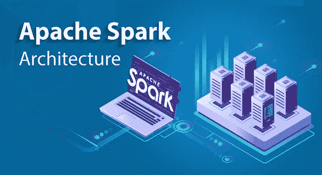
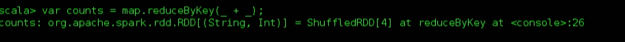

# Apache Spark 架构-分布式系统架构解释

> 原文：<https://medium.com/edureka/spark-architecture-4f06dcf27387?source=collection_archive---------0----------------------->



Apache Spark Architecture — Edureka

Apache Spark 是一个开源集群计算框架，它正在点燃大数据世界。与 Hadoop 相比，Spark 的内存性能快 100 倍，磁盘性能快 10 倍。在本文中，我将向您简要介绍 Spark 架构以及 Spark 架构的基础。

在这篇 Spark 架构文章中，我将讨论以下主题:

*   Spark 及其特点
*   Spark 架构概述
*   星火生态系统
*   弹性分布式数据集
*   星火建筑的运作
*   在 Spark Shell 中使用 Scala 的示例

# Spark 及其特点

Apache Spark 是一个用于实时数据处理的开源集群计算框架。Apache Spark 的主要特点是它的 ***内存集群计算*** 提高了应用程序的处理速度。Spark 提供了一个接口，通过隐式 ***数据并行和容错*** 对整个集群进行编程。它旨在涵盖广泛的工作负载，如批处理应用程序、迭代算法、交互式查询和流。

# Apache Spark 的特性:


> **速度:** Spark 运行速度比 Hadoop MapReduce 大规模数据处理快 100 倍。它还能够通过受控分区来实现这一速度。
> 
> **强大的缓存** 简单的编程层提供了强大的缓存和磁盘持久化能力。
> 
> **部署** 可以通过 ***Mesos，Hadoop via YARN，或者 Spark 自带的集群管理器进行部署。***
> 
> **实时**
> 由于 ***内存计算，它提供实时计算&低延迟。***
> 
> **Polyglot**
> Spark 提供 Java、Scala、Python、r 的高级 API，Spark 代码可以用这四种语言中的任意一种编写。它还提供了 Scala 和 Python 中的 shell。

# Spark 架构概述

Apache Spark 有一个定义良好的分层架构，其中所有 Spark 组件和层都是松散耦合的。该架构进一步与各种扩展和库集成。Apache Spark 架构基于两个主要的抽象概念:

*   *弹性分布式数据集(RDD)*
*   *有向无环图*


但是在深入 Spark 架构之前，让我解释一下 Spark 的几个基本概念，比如 Spark 生态系统和 RDD。这将有助于你获得更好的见解。

我先解释一下什么是星火生态系统。

# 星火生态系统

从下图可以看出，spark 生态系统由各种组件组成，如 Spark SQL、Spark Streaming、MLlib、GraphX 和核心 API 组件。


## **火花芯**

Spark 核心是大规模并行和分布式数据处理的基础引擎。此外，构建在核心之上的附加库允许流、SQL 和机器学习的不同工作负载。它负责内存管理和故障恢复、调度、分发和监控集群上的作业&与存储系统交互。

## **火花流**

Spark 流是 Spark 的组件，用于处理实时流数据。因此，它是对核心 Spark API 的有益补充。它支持实时数据流的高吞吐量和容错流处理。

## **Spark SQL**

Spark SQL 是 Spark 中的一个新模块，它将关系处理与 Spark 的函数式编程 API 集成在一起。它支持通过 SQL 或 Hive 查询语言查询数据。对于那些熟悉 RDBMS 的人来说，Spark SQL 将是从早期工具的简单过渡，在早期工具中，您可以扩展传统关系数据处理的边界。

## **GraphX**

GraphX 是用于图形和图形并行计算的 Spark API。因此，它用弹性分布式属性图扩展了火花 RDD。在高层次上，GraphX 通过引入弹性分布式属性图(每个顶点和边都有属性的有向多图)扩展了 Spark RDD 抽象。

## **MLlib(机器学习)**

MLlib 代表机器学习库。Spark MLlib 用于在 Apache Spark 中执行机器学习。

## ***火花***

它是一个提供分布式数据帧实现的 R 包。它还支持选择、过滤、聚合等操作，但是是在大型数据集上。

如您所见，Spark 附带了高级库，包括对 R、SQL、Python、Scala、Java 等的支持。这些标准库增加了复杂工作流程中的无缝集成。此外，它还允许各种服务与其集成，如 MLlib、GraphX、SQL +数据帧、流服务等。来增强它的能力。

现在，让我们讨论 Spark 的基本数据结构，即 RDD。

# 弹性分布式数据集(RDD)

rdd 是任何 Spark 应用程序的构建模块。RDDs 代表:

*   ***弹性:*** 容错，能够在发生故障时重建数据
*   ***分布式:*** 在一个集群中的多个节点之间分布数据
*   ***数据集:*** 带值的分区数据集合


它是分布式集合上的抽象数据层。它本质上是不可变的，并且遵循*惰性转换*。

现在你可能想知道它的工作原理。嗯，RDD 中的数据是根据一个键分割成块的。rdd 具有很高的弹性，也就是说，当相同的数据块在多个执行器节点上复制时，它们能够从任何问题中快速恢复。因此，即使一个执行器节点失败，另一个仍将处理数据。这允许您通过利用多个节点的能力，非常快速地对数据集执行函数计算。

此外，一旦你创建了一个 RDD，它就变成了不可变的*。我所说的不可变的意思是，一个对象的状态在它被创建后不能被修改，但是它们肯定可以被转换。*

*谈到分布式环境，RDD 的每个数据集都被划分成逻辑分区，这些分区可以在集群的不同节点上进行计算。因此，您可以并行地对完整的数据执行转换或操作。此外，您也不必担心分发问题，因为 Spark 会处理这些问题。*

**

*创建 rdd 有两种方法:在驱动程序中并行化现有集合，或者通过引用外部存储系统(如共享文件系统、HDFS、HBase 等)中的数据集。*

*使用 rdd，您可以执行两种类型的操作:*

1.  ****转换:*** 它们是应用于创建新 RDD 的操作。*
2.  ****动作:*** 应用在 RDD 上，指示 Apache Spark 应用计算，并将结果返回给驱动程序。*

*我希望你彻底理解了 RDD 的概念。现在，让我们进一步了解 Spark 架构的工作原理。*

# *星火建筑的运作*

*您已经看到了 Apache Spark 的基本架构概述，现在让我们更深入地研究它的工作原理。*

*在您的**主节点**中，您有*驱动程序*，它驱动您的应用程序。您正在编写的代码相当于一个驱动程序，或者如果您正在使用交互式 shell，shell 相当于驱动程序。*

**

*在驱动程序内部，你做的第一件事是，你*创建*一个 ***Spark 上下文。*** 假设 Spark 上下文是所有 Spark 功能的网关。它类似于您的数据库连接。您在数据库中执行的任何命令都要经过数据库连接。同样，你在 Spark 上做的任何事情都要经过 Spark 上下文。*

*现在，这个 Spark 上下文与 ***集群管理器*** 一起管理各种作业。驱动程序& Spark context 负责集群内的作业执行。一个作业被分成多个任务，分布在 worker 节点上。任何时候在 Spark 上下文中创建一个 RDD，它都可以分布在不同的节点上并缓存在那里。*

***W *工作节点*是工作主要是执行任务的从节点。然后，这些任务在 worker 节点中的分区 rdd 上执行，并将结果返回给 Spark 上下文。***

*Spark Context 接收作业，将作业分解成任务，并将它们分发到工作节点。这些任务在分区的 RDD 上工作，执行操作，收集结果并返回到主 Spark 上下文。*

*如果您增加工作线程的数量，那么您可以将作业分成更多的分区，并在多个系统上并行执行它们。会快很多。*

*随着工作线程数量的增加，内存大小也会增加&您可以缓存作业以更快地执行它。*

*要了解 Spark 架构的工作流程，可以看看下面的**信息图**:*

**

## ***第一步:***

*客户端提交 spark 用户应用程序代码。当提交应用程序代码时，驱动程序隐式地将包含转换和动作的用户代码转换成逻辑上*有向非循环图*，称为 ***DAG。*** 在这个阶段，它还执行流水线转换等优化。*

## ***第二步:***

*之后，它将名为 DAG 的逻辑图转换成具有多个阶段的物理执行计划。在转换成物理执行计划后，它在每个阶段下创建称为任务的物理执行单元。然后，任务被捆绑并发送到集群。*

## ***第三步:***

*现在，驱动程序与集群管理器对话并协商资源。集群管理器代表驱动程序启动工作节点中的执行器。此时，驱动程序将根据数据放置将任务发送给执行器。当执行者开始时，他们向司机注册。因此，驱动程序将有一个正在执行任务的执行器的完整视图。*

**

## ***第四步:***

*在任务执行的过程中，驱动程序将监控运行的执行器集合。驱动节点还基于数据放置来调度未来的任务。*

*这都是关于火花建筑。现在，让我们来了解一下火花壳的工作原理。*

# *在 Spark shell 中使用 Scala 的示例*

*首先，让我们通过假设 Hadoop 和 Spark 守护进程已经启动并运行来启动 Spark shell。***Web UI***Spark 的端口是 ***localhost:4040。****

**

*一旦您启动了 Spark shell，现在让我们看看如何执行字数统计示例:*

1.  *在本例中，我创建了一个简单的文本文件，并将其存储在 hdfs 目录中。您也可以使用其他大型数据文件。*

**

*2.一旦火花壳启动，让我们创建一个 RDD。为此，您必须指定输入文件路径并应用转换 **flatMap()** 。下面的代码说明了同样的情况:*

```
*scala> var map = sc.textFile("hdfs://localhost:9000/Example/sample.txt").flatMap(line => line.split(" ")).map(word => (word,1));*
```

*3.在执行这段代码时，将会创建一个 RDD，如图所示。*

**

*4.之后，您需要将动作 **reduceByKey()** 应用到创建的 RDD。*

```
*scala> var counts = map.reduceByKey(_+_);*
```

*应用操作后，执行开始，如下所示。*

**

*5.下一步是将输出保存在文本文件中，并指定存储输出的路径。*

**

*6.指定输出路径后，进入 *hdfs 网页浏览器* ***localhost:50040。*** 在这里你可以看到“零件”文件中的输出文本，如下所示。*

**

*7.下图显示了“零件”文件中的输出文本。*

**

*我希望您已经理解了如何创建 Spark 应用程序并获得输出。*

*现在，让我带您通过 Spark 的 web UI 来理解 DAG 可视化和已执行任务的分区。*

**

*   *单击您提交的任务，您可以查看已完成作业的有向无环图(DAG)。*

**

*   *此外，您还可以查看已执行任务的摘要指标，如执行任务所用的时间、作业 ID、已完成的阶段、主机 IP 地址等。*

*现在，让我们了解一下 rdd 中的分区和并行性。*

*   *一个 ***分区*** 是一个*逻辑* *组块*的一个*大型* *分布式* *数据* *集合。**
*   *默认情况下，Spark 试图从*节点*读取 *数据* *到***【RDD】*即*关闭* *到* *它。***

**现在，让我们看看如何在 shell 中执行并行任务。**

****

*   **下图显示了创建的 RDD 上的分区总数。**

****

*   **现在，让我向您展示 5 个不同任务是如何并行执行的。**

****

**这就把我们带到了 Apache Spark 架构博客的结尾。我希望这篇博客能给你提供信息，增加你的知识。**

**原来就是这样！我希望这篇博客能给你提供信息，增加你的知识。如果你想查看更多关于人工智能、DevOps、道德黑客等市场最热门技术的文章，你可以参考 Edureka 的官方网站。**

**请留意本系列中的其他文章，它们将解释 Spark 的各个方面。**

> ***1。* [*阿帕奇火花教程*](/edureka/spark-tutorial-2a036075a572)**
> 
> ***2。* [*火花串流教程*](/edureka/spark-streaming-92bdcb1d94c4)**
> 
> ***3。* [*火花 MLlib*](/edureka/spark-mllib-e87546ac268)**
> 
> ***4。* [*Spark SQL 教程*](/edureka/spark-sql-tutorial-6de1e241bf76)**
> 
> ***5。* [*Spark GraphX 教程*](/edureka/spark-graphx-f9bd805ac429)**
> 
> ***6。* [*Spark Java 教程*](/edureka/spark-java-tutorial-cb2f54991c2b)**

***原载于 2018 年 9 月 28 日 www.edureka.co**的* [*。*](https://www.edureka.co/blog/spark-architecture/)**