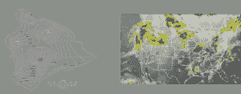
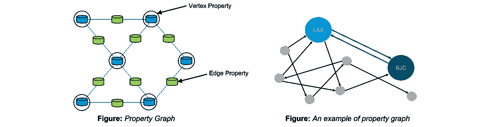
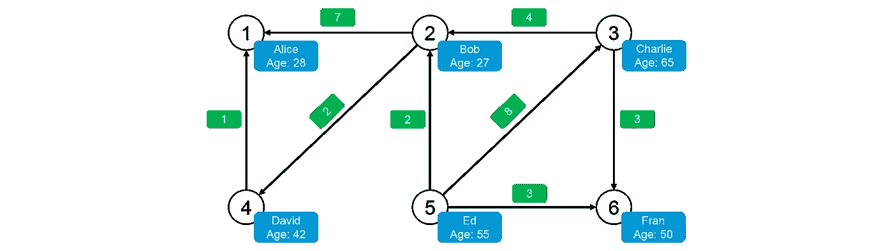
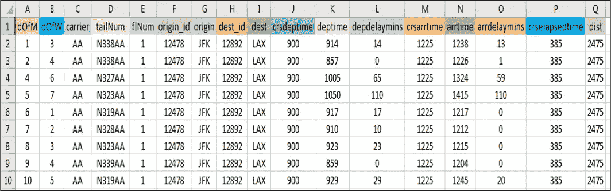
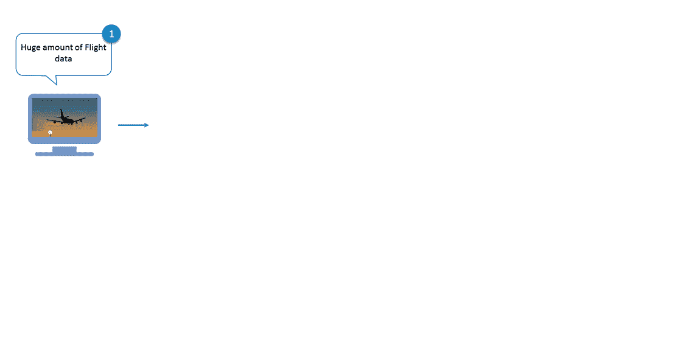
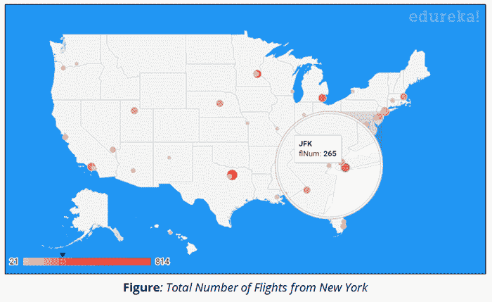

# 用火花图分析飞行数据

> 原文：<https://medium.com/edureka/spark-graphx-f9bd805ac429?source=collection_archive---------0----------------------->


Spark GraphX Tutorial — Edureka

GraphX 是 Apache Spark 的图形和图形并行计算 API。GraphX 在单个系统中统一了 ETL(提取、转换&加载)过程、探索性分析和迭代图计算。在脸书的朋友、LinkedIn 的连接、互联网的路由器、天体物理学中星系和恒星之间的关系以及谷歌地图中可以看到图表的用法。尽管图计算的概念似乎非常简单，但图的应用实际上是无限的，例如灾难检测、银行、股票市场、银行和地理系统等等。通过这篇博客，我们将通过示例了解 Spark GraphX 的概念、特性和组件，并浏览使用 GraphX 进行飞行数据分析的完整用例。

我们将在 Spark GraphX 博客中讨论以下主题:

1.  什么是图？
2.  图形计算的用例
3.  什么是 Spark GraphX？
4.  Spark GraphX 特性
5.  通过示例了解 GraphX
6.  使用案例——使用 GraphX 进行飞行数据分析

# 什么是图？

图是相当于一组对象的数学结构，其中一些对象对在某种意义上是相关的。这些关系可以用构成图形的边和顶点来表示。顶点代表对象，边显示这些对象之间的各种关系。


在计算机科学中，图是一种抽象数据类型，用于实现数学中的无向图和有向图概念，特别是在图论领域。图形数据结构还可以将一些*边值*与每个边相关联，例如符号标签或数字属性(成本、容量、长度等)。).

# 图形计算的用例

以下用例给出了图形计算的前景，以及使用图形实现其他解决方案的进一步范围。

## **灾难探测系统**


图表可以用来检测诸如飓风、地震、海啸、森林火灾和火山爆发等灾害，以便向人们发出警告。

## **页面排名**


页面排名可用于寻找任何网络中的影响者，如论文引用网络或社交媒体网络。

## **金融欺诈检测**


图表分析可用于监控金融交易，并检测参与金融欺诈和洗钱的人员。

## **经营分析**


图表在与机器学习结合使用时，有助于了解客户的购买趋势。如优步、麦当劳等。

## **地理信息系统**



图形广泛用于开发地理信息系统的功能，如流域划分和天气预报。

## **谷歌预凝胶**


Pregel 是 Google 的可扩展和容错平台，其 API 足够灵活，可以表达任意图形算法。

# 什么是 Spark GraphX？

GraphX 是用于图形和图形并行计算的 Spark API。它包含了越来越多的图形算法和构建器来简化图形分析任务。



GraphX 通过弹性分布式属性图扩展了 Spark RDD。属性图是一个有向多重图，它可以有多条平行边。每个边和顶点都有用户定义的相关属性。平行边允许相同顶点之间的多种关系。

# Spark GraphX 特性

以下是 Spark GraphX 的特性:

## **灵活性**:

Spark GraphX 可以处理图形和计算。GraphX 在单个系统中统一了 ETL(提取、转换和加载)、探索性分析和迭代图计算。我们可以将相同的数据视为图形和集合，使用 rdd 有效地转换和连接图形，并使用 Pregel API 编写定制的迭代图形算法。

## **速度**:

Spark GraphX 提供了与最快的专业图形处理系统相当的性能。它可以与最快的图形系统相媲美，同时保留了 Spark 的灵活性、容错性和易用性。

## **增长算法库**:

我们可以从 Spark GraphX 提供的不断增长的图形算法库中进行选择。一些流行的算法是页面排名、连通分量、标签传播、SVD++、强连通分量和三角形计数。

# 通过示例了解 GraphX

我们现在将通过一个例子来理解 Spark GraphX 的概念。让我们考虑一个简单的图表，如下图所示。



查看图表，我们可以提取关于人(顶点)和他们之间的关系(边)的信息。这里的图表代表了 Twitter 用户以及他们在 Twitter 上关注的人。例如，Bob 在 Twitter 上关注 Davide 和 Alice。

让我们使用 Apache Spark 实现同样的功能。首先，我们将为 GraphX 导入必要的类。

```
//Importing the necessary classes 
import org.apache.spark._
import org.apache.spark.rdd.RDD 
import org.apache.spark.util.IntParam 
import org.apache.spark.graphx._
import org.apache.spark.graphx.util.GraphGenerators
```

**显示顶点**:此外，我们现在将显示用户(顶点)的所有姓名和年龄。

```
val vertexRDD: RDD[(Long, (String, Int))] = sc.parallelize(vertexArray)
val edgeRDD: RDD[Edge[Int]] = sc.parallelize(edgeArray)
val graph: Graph[(String, Int), Int] = Graph(vertexRDD, edgeRDD)
graph.vertices.filter { case (id, (name, age)) => age > 30 }
.collect.foreach { case (id, (name, age)) => println(s"$name is $age")}
```

上述代码的输出如下所示:

```
David is 42 
Fran is 50 
Ed is 55 
Charlie is 65
```

**显示边缘**:让我们看看 Twitter 上哪个人喜欢谁。

```
for (triplet <- graph.triplets.collect)
{
println(s"${triplet.srcAttr._1} likes ${triplet.dstAttr._1}")
}
```

上述代码的输出如下所示:

```
Bob likes Alice 
Bob likes David 
Charlie likes Bob 
Charlie likes Fran 
David likes Alice 
Ed likes Bob 
Ed likes Charlie 
Ed likes Fran
```

现在我们已经了解了 GraphX 的基础知识，让我们更深入一点，并对其进行一些高级计算。

**关注者数量**:我们图表中的每个用户都有不同数量的关注者。让我们看看每个用户的所有追随者。

```
// Defining a class to more clearly model the user property
case class User(name: String, age: Int, inDeg: Int, outDeg: Int)
// Creating a user Graph
val initialUserGraph: Graph[User, Int] = graph.mapVertices{ case (id, (name, age)) => User(name, age, 0, 0) }

// Filling in the degree information
val userGraph = initialUserGraph.outerJoinVertices(initialUserGraph.inDegrees) {
case (id, u, inDegOpt) => User(u.name, u.age, inDegOpt.getOrElse(0), u.outDeg)
}.outerJoinVertices(initialUserGraph.outDegrees) {
case (id, u, outDegOpt) => User(u.name, u.age, u.inDeg, outDegOpt.getOrElse(0))
}
for ((id, property) <- userGraph.vertices.collect) {
println(s"User $id is called ${property.name} and is liked by ${property.inDeg} people.")
```

上述代码的输出如下所示:

```
User 1 is called Alice and is liked by 2 people.
User 2 is called Bob and is liked by 2 people.
User 3 is called Charlie and is liked by 1 people.
User 4 is called David and is liked by 1 people.
User 5 is called Ed and is liked by 0 people.
User 6 is called Fran and is liked by 2 people.
```

**最老的关注者**:我们也可以根据关注者的特征对他们进行分类。让我们按年龄找出每个用户最老的追随者。

```
// Finding the oldest follower for each user
val oldestFollower: VertexRDD[(String, Int)] = userGraph.mapReduceTriplets[(String, Int)](
// For each edge send a message to the destination vertex with the attribute of the source vertex
 edge => Iterator((edge.dstId, (edge.srcAttr.name, edge.srcAttr.age))),
 // To combine messages take the message for the older follower
 (a, b) => if (a._2 > b._2) a else b
 )
```

上述代码的输出如下所示:

```
David is the oldest follower of Alice.
Charlie is the oldest follower of Bob.
Ed is the oldest follower of Charlie.
Bob is the oldest follower of David.
Ed does not have any followers.
Charlie is the oldest follower of Fran.
```

# 用例:使用 Spark GraphX 进行飞行数据分析

现在我们已经理解了 Spark GraphX 的核心概念，让我们使用 GraphX 解决一个现实生活中的问题。这将有助于我们有信心在未来从事任何 Spark 项目。

## **问题陈述**:

*使用 Spark GraphX 分析实时飞行数据，提供接近实时的计算结果，并使用 Google Data Studio 可视化结果。*

## **用例——要完成的计算**:

1.  计算飞行路线的总数
2.  计算和排序最长的飞行路线
3.  显示顶点度数最高的机场
4.  根据 PageRank 列出最重要的机场
5.  请列出航班成本最低的路线

我们将使用 Spark GraphX 进行上述计算，并使用 Google Data Studio 可视化结果。

## **用例—数据集**:



## **用例—流程图**:

下图清楚地解释了飞行数据分析中涉及的所有步骤。



## **用例— Spark 实现**:

接下来，让我们使用 Eclipse IDE for Spark 来实现我们的项目。

找到下面的伪代码:

```
//Importing the necessary classes
import org.apache.spark._
...
import java.io.File

object airport {

 def main(args: Array[String]){

//Creating a Case Class Flight
case class Flight(dofM:String, dofW:String, ... ,dist:Int)

//Defining a Parse String function to parse input into Flight class
def parseFlight(str: String): Flight = {
val line = str.split(",")
Flight(line(0), line(1), ... , line(16).toInt)
}
val conf = new SparkConf().setAppName("airport").setMaster("local[2]")
val sc = new SparkContext(conf) 
//Load the data into a RDD 

val textRDD = sc.textFile("/home/edureka/usecases/airport/airportdataset.csv")

//Parse the RDD of CSV lines into an RDD of flight classes 
val flightsRDD = Map ParseFlight to Text RDD

//Create airports RDD with ID and Name
val airports = Map Flight OriginID and Origin
airports.take(1)

//Defining a default vertex called nowhere and mapping Airport ID for printlns
val nowhere = "nowhere"
val airportMap = Use Map Function .collect.toList.toMap

//Create routes RDD with sourceID, destinationID and distance
val routes = flightsRDD. Use Map Function .distinct
routes.take(2)

//Create edges RDD with sourceID, destinationID and distance
val edges = routes.map{( Map OriginID and DestinationID ) => Edge(org_id.toLong, dest_id.toLong, distance)}
edges.take(1)

//Define the graph and display some vertices and edges
val graph = Graph( Airports, Edges and Nowhere )
graph.vertices.take(2)
graph.edges.take(2)

//Query 1 - Find the total number of airports
val numairports = Vertices Number

//Query 2 - Calculate the total number of routes?
val numroutes = Number Of Edges

//Query 3 - Calculate those routes with distances more than 1000 miles
graph.edges.filter { Get the edge distance )=> distance > 1000}.take(3)

//Similarly write Scala code for the below queries
//Query 4 - Sort and print the longest routes
//Query 5 - Display highest degree vertices for incoming and outgoing flights of airports
//Query 6 - Get the airport name with IDs 10397 and 12478
//Query 7 - Find the airport with the highest incoming flights
//Query 8 - Find the airport with the highest outgoing flights
//Query 9 - Find the most important airports according to PageRank
//Query 10 - Sort the airports by ranking
//Query 11 - Display the most important airports
//Query 12 - Find the Routes with the lowest flight costs
//Query 13 - Find airports and their lowest flight costs
//Query 14 - Display airport codes along with sorted lowest flight costs
```

## **用例—可视化结果**:

我们将使用谷歌数据工作室来可视化我们的分析。谷歌数据工作室是谷歌分析 360 套件下的产品。我们将使用地理地图服务在美国地图上标出机场各自的位置，并显示度量数量。

1.  显示每个机场的航班总数
2.  显示从每个机场出发的目的地航线的公制总和
3.  显示每个机场所有航班的总延误时间



现在，Spark GraphX 博客到此结束。我希望你喜欢阅读它，并发现它的信息。

原来就是这样！我希望这篇博客能给你提供信息，增加你的知识。如果你想查看更多关于人工智能、DevOps、道德黑客等市场最热门技术的文章，你可以参考 Edureka 的官方网站。

请留意本系列中的其他文章，它们将解释 Spark 的各个方面。

> *1。* [*Apache Spark 架构*](/edureka/spark-architecture-4f06dcf27387)
> 
> *2。* [*火花串流教程*](/edureka/spark-streaming-92bdcb1d94c4)
> 
> *3。* [*火花 MLlib*](/edureka/spark-mllib-e87546ac268)
> 
> *4。* [*Spark SQL 教程*](/edureka/spark-sql-tutorial-6de1e241bf76)
> 
> *5。* [*阿帕奇星火教程*](/edureka/spark-tutorial-2a036075a572)
> 
> *6。* [*Spark Java 教程*](/edureka/spark-java-tutorial-cb2f54991c2b)

*原载于 2017 年 5 月 12 日*[*www.edureka.co*](https://www.edureka.co/blog/spark-graphx/)*。*