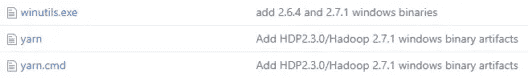
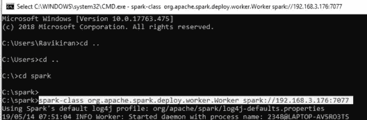

# Spark Java 教程——使用 Spark 分析学生的表现

> 原文：<https://medium.com/edureka/spark-java-tutorial-cb2f54991c2b?source=collection_archive---------0----------------------->


Spark Java Tutorial — Edureka

Java 是软件开发中一种有效的编程语言，Scala 是大数据开发中使用的主要编程语言。两者的合作可以产生一个强大的组合。在本文**、**中，我们将在 Java 环境中使用 Spark 程序。我已经把我们的主题列表如下。

*   什么是 Spark-Java？
*   对 Spark-Java 的需求
*   设置 Spark-Java 环境
*   Spark-Java 中的示例
*   学生在考试中的表现:用例

# 什么是 Spark-Java？


简单来说，Spark-Java 是一种解决**大数据**问题的组合编程方法。 **Spark** **Scala** 使用 JVM 编译用 Scala 编写的代码。Spark 支持许多编程语言，如 **Pig** 、 **Hive** 、Scala 等等。Scala 是为 Spark 应用程序构建的最杰出的编程语言之一。

# 对 Spark-Java 的需求


大多数软件开发人员在企业级使用 Java 感觉很舒服，他们很少喜欢 Scala 或任何其他类型的语言。Spark-Java 就是这样一种方法，软件开发人员可以在 Java 环境中轻松运行所有的 Scala 程序和应用程序。

现在我们对 Spark Java 有了一个简单的了解，让我们进入下一阶段，学习如何为 Spark Java 设置环境。我已经以步骤的形式排列了程序。

# 设置 Spark-Java 环境

## 第一步:

安装最新版本的[](https://www.oracle.com/technetwork/java/javase/downloads/jdk8-downloads-2133151.html)**和 [**JRE**](https://www.oracle.com/technetwork/java/javase/downloads/jre8-downloads-2133155.html) 。**

## **第二步:**

**安装最新版本的[**WinUtils.exe**](https://github.com/steveloughran/winutils/blob/master/hadoop-2.7.1/bin/winutils.exe)**

****

## **第三步:**

**安装最新版本的 [**阿帕奇 Spark。**](https://spark.apache.org/downloads.html)**

****

## ****第四步:****

**安装最新版本的 [**Apache Maven**](https://maven.apache.org/download.cgi) 。**

****

## **第五步:**

**安装最新版本的 [**Eclipse 安装程序**](https://www.eclipse.org/downloads/download.php?file=/oomph/epp/2019-03/R/eclipse-inst-win64.exe) 。**

****

## **第六步:**

**安装最新版本的 [**Scala IDE**](http://scala-ide.org/) 。**

****

****第七步:****

*   **为以下项目设置主目录和路径:**

1.  **Java 语言(一种计算机语言，尤用于创建网站)**
2.  **如下所示设置一个新的 Java_Home。**

****

**类似地，通过编辑路径变量来设置 Java Home 的路径**

****

****Hadoop****

*   **如下图所示设置一个新的 Hadoop_Home。**

****

*   **类似地，通过编辑路径变量来设置 Hadoop Home 的路径**

****

****火花****

*   **如下图设置一个新的 Spark_Home。**

****

*   **类似地，通过编辑路径变量来设置 Spark Home 的路径**

****

****美芬****

*   **如下所示设置一个新的 Maven_Home。**

****

*   **类似地，通过编辑路径变量为 Maven Home 设置路径**

****

****Scala****

*   **如下图设置一个新的 Scala_Home。**

****

*   **类似地，通过编辑路径变量来设置 Scala Home 的路径**

****

**现在，您已经具备了在 Java 上运行 Apache Spark 的所有要求。让我们用 Java 尝试一个 Spark 程序的例子。**

# ****Spark-Java 中的示例****

**在我们开始在 Java 环境中实际执行 Spark 示例程序之前，我们需要满足一些先决条件，我将在下面提到这些步骤，以便更好地理解这个过程。**

****第一步:****

*   **打开命令提示符，在命令提示符下作为主程序启动 Spark。**

****

****第二步:****

*   **打开一个新的命令提示符，在命令提示符下再次启动 Spark，这次是作为一个 Worker 使用主服务器的 IP 地址。**

****

*   **IP 地址可以在本地主机上找到:8080。**

****

**第三步:**

*   **打开一个新的命令提示符，现在您可以使用主机的 IP 地址启动 Spark shell 了。**

****

****第四步:****

*   **现在，您可以打开 Eclipse Enterprise IDE，设置您的工作场所并开始您的项目。**

****第五步:****

*   **在 Eclipse IDE 上设置 Scala nature 并创建一个新的 maven 项目。**
*   **首先，我们将从 POM 开始。可扩展标记语言**
*   **以下代码是 pom.xml 文件**

```
<project ae ly" href="http://maven.apache.org/POM/4.0.0" rel="noopener ugc nofollow" target="_blank">http://maven.apache.org/POM/4.0.0"
xmlns:xsi="[http://www.w3.org/2001/XMLSchema-instance](http://www.w3.org/2001/XMLSchema-instance)"
xsi:schemaLocation="[http://maven.apache.org/POM/4.0.0](http://maven.apache.org/POM/4.0.0) [http://maven.apache.org/xsd/maven-4.0.0.xsd](http://maven.apache.org/xsd/maven-4.0.0.xsd)">
<modelVersion>4.0.0</modelVersion>
<groupId>Edureka</groupId>
<artifactId>ScalaExample</artifactId>
<version>0.0.1-SNAPSHOT</version>
    <dependencies>
              <!-- [https://mvnrepository.com/artifact/org.apache.spark/spark-core](https://mvnrepository.com/artifact/org.apache.spark/spark-core) -->
              <dependency>
              <groupId>org.apache.spark</groupId>
              <artifactId>spark-core_2.12</artifactId>
              <version>2.4.2</version>
              </dependency>
    </dependencies>
</project>
```

****第六步:****

*   **从您的 Scala 应用程序开始。**
*   **下面的代码是针对 Scala 应用文件的。**

```
package ScalaExample

import org.apache.spark.SparkConf
import org.apache.spark.SparkContext
import org.apache.spark.SparkContext._
import org.apache.spark.sql.SparkSession
import org.apache.spark.sql.SQLContext
import org.apache.spark.sql._
import org.apache.spark.sql.types.{StructType, StructField, StringType, IntegerType};

object EdurekaApp {
    def main(args: Array[String]) {
         val logFile = "C:/spark/README.md" // Should be some file on your system
         val conf = new SparkConf().setAppName("EdurekaApp").setMaster("local[*]")
         val sc = new SparkContext(conf)
         val spark = SparkSession.builder.appName("Simple Application").getOrCreate()
         val logData = spark.read.textFile(logFile).cache()
         val numAs = logData.filter(line => line.contains("a")).count()
         val numBs = logData.filter(line => line.contains("b")).count()
         println(s"Lines with a: $numAs, Lines with b: $numBs")
    spark.stop()
   }
}
```

**输出:**

****a 线:62，b 线:31****

**现在我们已经对 Spark Java 有了一个简单的了解，让我们进入学生学习成绩的用例，以便更好地学习 Spark Java。**

# **学生在考试中的表现:用例**

**类似于我们之前的例子，让我们设置我们的先决条件，然后，我们将从我们的**用例**开始。我们的用例将讲述 [**学生在几门重要科目的考试中的表现**](https://www.kaggle.com/spscientist/students-performance-in-exams) 。**

****

**这就是我们的代码看起来的样子，现在让我们对我们的用例执行一个接一个的操作。**

*   **以下代码是 pom.xml 文件**

```
<project ae ly" href="http://maven.apache.org/POM/4.0.0" rel="noopener ugc nofollow" target="_blank">http://maven.apache.org/POM/4.0.0"
xmlns:xsi="[http://www.w3.org/2001/XMLSchema-instance](http://www.w3.org/2001/XMLSchema-instance)"
xsi:schemaLocation="[http://maven.apache.org/POM/4.0.0](http://maven.apache.org/POM/4.0.0) [http://maven.apache.org/xsd/maven-4.0.0.xsd](http://maven.apache.org/xsd/maven-4.0.0.xsd)">
<modelVersion>4.0.0</modelVersion>
<groupId>ScalaExample3</groupId>
<artifactId>Edureka3</artifactId>
<version>0.0.1-SNAPSHOT</version>
    <dependencies>
                 <!-- [https://mvnrepository.com/artifact/org.apache.spark/spark-core](https://mvnrepository.com/artifact/org.apache.spark/spark-core) -->
                 <dependency>
                          <groupId>org.apache.spark</groupId>
                          <artifactId>spark-core_2.12</artifactId>
                          <version>2.4.3</version>
                 </dependency>
                 <!-- [https://mvnrepository.com/artifact/org.apache.spark/spark-sql](https://mvnrepository.com/artifact/org.apache.spark/spark-sql) -->
                 <dependency>
                         <groupId>org.apache.spark</groupId>
                         <artifactId>spark-sql_2.12</artifactId>
                         <version>2.4.3</version>
                 </dependency>
                 <!-- [https://mvnrepository.com/artifact/com.databricks/spark-csv](https://mvnrepository.com/artifact/com.databricks/spark-csv) -->
                 <dependency>
                         <groupId>com.databricks</groupId>
                         <artifactId>spark-csv_2.11</artifactId>
                         <version>1.5.0</version>
                 </dependency>
      </dependencies>
</project>
```

*   **下面的代码是针对 Scala 应用文件的。**

```
package ScalaExample

import org.apache.spark.SparkConf
import org.apache.spark.SparkContext
import org.apache.spark.SparkContext._
import org.apache.spark.sql.SparkSession
import org.apache.spark.sql.SQLContext
import org.apache.spark.sql._
import org.apache.spark.sql.types.{StructType, StructField, StringType, IntegerType};

object EdurekaApp {
         def main(args: Array[String]) {
              val conf = new SparkConf().setAppName("EdurekaApp3").setMaster("local[*]")
              val sc = new SparkContext(conf)</pre>
              val sqlContext = new SQLContext(sc)
              val spark = SparkSession.builder.appName("Simple Application").getOrCreate()
              val customizedSchema = StructType(Array(StructField("gender", StringType, true),StructField("race", StringType, true),StructField("parentalLevelOfEducation", StringType, true),StructField("lunch", StringType, true),StructField("testPreparationCourse", StringType, true),StructField("mathScore", IntegerType, true),StructField("readingScore", IntegerType, true),StructField("writingScore", IntegerType, true)))
              val pathToFile = "C:/Users/Ravikiran/Downloads/students-performance-in-exams/StudentsPerformance.csv"
              val DF = sqlContext.read.format("com.databricks.spark.csv").option("header", "true").schema(customizedSchema).load(pathToFile)
              print("We are starting from here...!")
              DF.rdd.cache()
              DF.rdd.foreach(println)
              println(DF.printSchema)
              DF.registerTempTable("Student")
              sqlContext.sql("SELECT * FROM Student").show()
              sqlContext.sql("SELECT gender, race, parentalLevelOfEducation, mathScore FROM Student WHERE mathScore > 75").show()
              sqlContext.sql("SELECT race, count(race) FROM Student GROUP BY race").show()
              sqlContext.sql("SELECT gender, race, parentalLevelOfEducation, mathScore, readingScore FROM Student").filter("readingScore>90").show()
              sqlContext.sql("SELECT race, parentalLevelOfEducation FROM Student").distinct.show()
              sqlContext.sql("SELECT gender, race, parentalLevelOfEducation, mathScore, readingScore FROM Student WHERE mathScore> 75 and readingScore>90").show()
              sqlContext("SELECT gender, race, parentalLevelOfEducation, mathScore, readingScore").dropDuplicates()</span>
              println("We have finished here...!")
       spark.stop()
    }
}
```

**上面执行的 SparkSQL 语句的输出如下:**

*   **使用 println 函数打印数据。**

```
DF.rdd.foreach(println)
```

****

*   **打印我们为数据设计的模式。**

```
println(DF.printSchema)
```

****

*   **使用 select 命令打印我们的数据帧。**

```
sqlContext.sql("SELECT * FROM Student").show()
```

****

*   **应用函数打印数学 75 分以上学生的数据。**

```
sqlContext.sql("SELECT gender, race, parentalLevelOfEducation, mathScore FROM Student WHERE mathScore > 75").show()
```

****

*   **使用 Group By 和 Count 运算找出每组的学生人数。**

```
sqlContext.sql("SELECT race, count(race) FROM Student GROUP BY race").show()
```

*   **使用过滤操作找出在阅读方面被证明是最好的学生。**

```
sqlContext.sql("SELECT gender, race, parentalLevelOfEducation, mathScore, readingScore FROM Student").filter("readingScore>90").show()
```

****

*   **使用相异函数找出数据中的相异值。**

```
sqlContext.sql("SELECT race, parentalLevelOfEducation FROM Student").distinct.show()
```

****

*   **使用 And 函数比较多个实体。**

```
sqlContext.sql("SELECT gender, race, parentalLevelOfEducation, mathScore, readingScore FROM Student WHERE mathScore> 75 and readingScore>90").show()
```

****

*   **使用 DropDuplicates 函数删除重复条目。**

```
sqlContext("SELECT gender, race, parentalLevelOfEducation, mathScore, readingScore").dropDuplicates().show()
```

****

**至此，我们结束了这篇 Spark Java 教程文章。我希望您喜欢阅读这篇文章，并增强您对 Spark、Java 和 Eclipse 的了解。**

****

**至此，我们结束了这篇 Spark Java 教程文章。我希望我们对你关于 Spark、Java 和 Eclipse 的知识有所启发，它们的特性以及使用它们可以执行的各种类型的操作。**

**原来就是这样！我希望这篇博客能给你提供信息，增加你的知识。如果你想查看更多关于人工智能、DevOps、道德黑客等市场最热门技术的文章，你可以参考 Edureka 的官方网站。**

**请留意本系列中的其他文章，它们将解释 Spark 的各个方面。**

> ***1。* [*阿帕奇 Spark 架构*](/edureka/spark-architecture-4f06dcf27387)**
> 
> ***2。* [*火花串流教程*](/edureka/spark-streaming-92bdcb1d94c4)**
> 
> ***3。*[*Spark ml lib*](/edureka/spark-mllib-e87546ac268)**
> 
> ***4。* [*Spark SQL 教程*](/edureka/spark-sql-tutorial-6de1e241bf76)**
> 
> ***5。* [*Spark GraphX 教程*](/edureka/spark-graphx-f9bd805ac429)**
> 
> ***6。* [*阿帕奇 Spark 教程*](/edureka/spark-tutorial-2a036075a572)**

***原载于 2019 年 5 月 24 日*[*https://www.edureka.co*](https://www.edureka.co/blog/spark-java-tutorial/)*。***