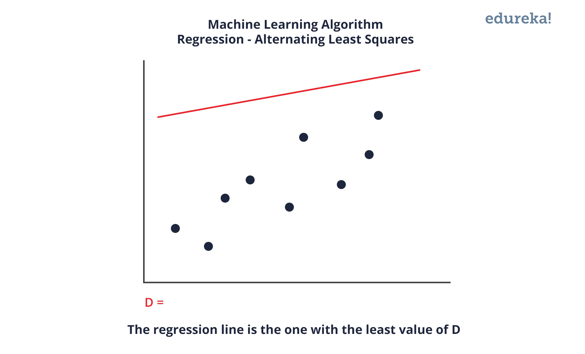
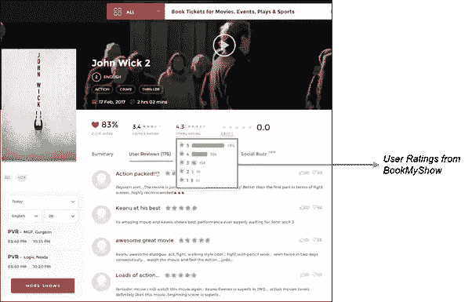
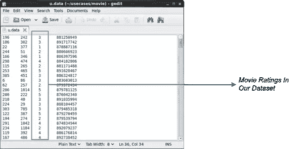
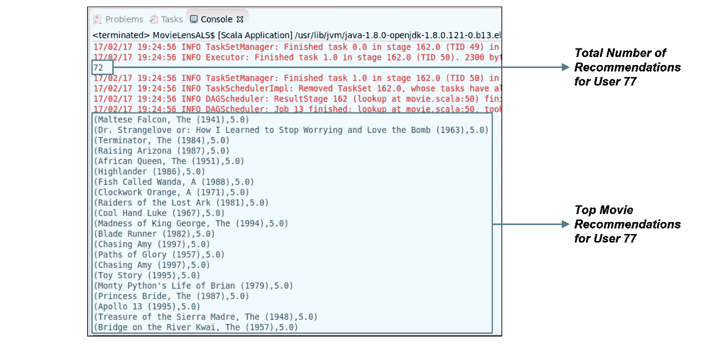

# 使用 Spark MLlib 的电影推荐系统

> 原文：<https://medium.com/edureka/spark-mllib-e87546ac268?source=collection_archive---------0----------------------->


Spark MLlib Tutorial — Edureka

*Spark MLlib* 是 Apache Spark 的机器学习组件。Spark 的主要吸引力之一是大规模扩展计算的能力，这正是机器学习算法所需要的。但局限性在于，所有的机器学习算法都不能有效并行化。每种算法对于并行化都有自己的挑战，无论是任务并行还是数据并行。

话虽如此，Spark 正在成为构建机器学习算法和应用程序的事实上的平台。从事 Spark MLlib 工作的开发人员正在 Spark 框架中以可扩展和简洁的方式实现越来越多的机器算法。通过这个博客，我们将学习机器学习的概念，Spark MLlib，它的实用程序，算法，以及电影推荐系统的完整用例。

本博客将涵盖以下主题:

1.  什么是机器学习？
2.  Spark MLlib 概述
3.  Spark MLlib 工具
4.  MLlib 算法
5.  用例—电影推荐系统

# 什么是机器学习？

机器学习是从人工智能中的模式识别和计算学习理论的研究中发展而来的，它探索了可以从数据中学习并对数据进行预测的算法的研究和构建——这种算法通过根据样本输入建立模型，进行数据驱动的预测或决策，从而克服了严格遵循静态程序指令的问题。


机器学习与计算统计学密切相关，计算统计学也专注于通过使用计算机进行预测。它与数学优化有着密切的联系，数学优化向该领域提供方法、理论和应用领域。在数据分析领域，机器学习是一种用于设计复杂模型和算法的方法，这些模型和算法有助于进行预测，在商业应用中称为预测分析。

有三类机器学习任务:

> **监督学习**:监督学习就是你有一个输入变量(x)和一个输出变量(Y)，你用一种算法来学习从输入到输出的映射函数。
> 
> **无监督学习**:无监督学习是一种机器学习算法，用于从没有标记响应的输入数据组成的数据集进行推断。
> 
> **强化学习**:计算机程序与一个动态环境交互，在这个环境中它必须执行某个目标(比如驾驶车辆或与对手进行游戏)。当程序在问题空间中导航时，它会得到奖惩方面的反馈。这个概念叫做强化学习。

# Spark MLlib 概述

Spark MLlib 用于在 Apache Spark 中执行机器学习。MLlib 由流行的算法和实用程序组成。

***MLlib 概述:***

*   *spark.mllib* 包含构建在 rdd 之上的原始 API。它目前处于维护模式。
*   spark.ml 提供了构建在数据框架之上的高级 API，用于构建 ml 管道。spark.ml 是目前 spark 的主要机器学习 API。

# Spark MLlib 工具

Spark MLlib 提供了以下工具:

> **ML 算法:** ML 算法构成了 MLlib 的核心。这些包括常见的学习算法，如分类、回归、聚类和协同过滤。
> 
> **特征化:**特征化包括特征提取、变换、降维、选择。
> 
> **管道:**管道提供了构建、评估和调优 ML 管道的工具。
> 
> **持久性:**持久性有助于保存和加载算法、模型和管道。
> 
> **实用程序:**用于线性代数、统计和数据处理的实用程序。

# MLlib 算法

Spark MLlib 中流行的算法和实用程序有:

1.  基本统计
2.  回归
3.  分类
4.  推荐系统
5.  使聚集
6.  降维
7.  特征抽出
8.  最佳化

让我们详细看看其中的一些。

## 基本统计

*基础统计学*包括最基础的机器学习技术。其中包括:

1.  **汇总统计**:示例包括均值、方差、计数、最大值、最小值和 numNonZeros。
2.  相关性:Spearman 和 Pearson 是找到相关性的一些方法。
3.  **分层抽样**:包括 sampleBykey 和 sampleByKeyExact。
4.  假设检验:皮尔森的卡方检验就是假设检验的一个例子。
5.  **随机数据生成** : RandomRDDs、Normal 和 Poisson 用于生成随机数据。

## 回归

*回归*分析是估计变量间关系的统计过程。当关注的焦点是因变量和一个或多个自变量之间的关系时，它包括许多建模和分析几个变量的技术。更具体地说，回归分析有助于理解当任何一个自变量变化，而其他自变量保持不变时，因变量的典型值是如何变化的。



回归分析广泛用于预测和预报，其使用与机器学习领域有大量重叠。回归分析还用于了解哪些自变量与因变量相关，并探索这些关系的形式。在有限的情况下，回归分析可以用来推断自变量和因变量之间的因果关系。

## 分类

*分类*是根据包含已知类别成员的观察值(或实例)的训练数据集，识别一个新观察值属于哪一组类别(子群体)的问题。这是模式识别的一个例子。

这里，一个例子是将给定的电子邮件分配到“垃圾邮件”或“非垃圾邮件”类别中，或者将诊断分配给给定的患者，如通过观察患者的特征(性别、血压、某些症状的存在或不存在等)所描述的。).

## 推荐系统

一个*推荐系统*是信息过滤系统的一个子类，它试图预测用户对一个项目的“评分”或“偏好”。近年来，推荐系统变得越来越流行，并且被用于各种领域，包括电影、音乐、新闻、书籍、研究文章、搜索查询、社交标签和一般产品。

推荐系统通常以两种方式之一产生推荐列表——通过协作和基于内容的过滤或者基于个性的方法。

1.  **协同过滤**通过用户过去的行为(之前购买或选择的物品和/或对这些物品的数字评级)以及其他用户做出的类似决定来建立模型。该模型然后被用于预测用户可能感兴趣的项目(或项目的评级)。
2.  **基于内容的过滤**方法利用一个项目的一系列离散特征来推荐具有相似属性的附加项目。

此外，这些方法通常被组合成混合推荐系统。

## 使聚集

*聚类*是对一组对象进行分组的任务，使同一组(称为一个聚类)中的对象比其他组(聚类)中的对象更相似(在某种意义上)。因此，它是探索性数据挖掘的主要任务，也是统计数据分析的常用技术，应用于许多领域，包括机器学习、模式识别、图像分析、信息检索、生物信息学、数据压缩和计算机图形学。

## 降维

*降维*是通过获得一组主变量来减少所考虑的随机变量数量的过程。可以分为特征选择和特征提取。

1.  **特征选择:**特征选择找到原始变量的一个子集(也叫特征或属性)。
2.  **特征提取:**将高维空间的数据转换到一个更少维的空间。数据转换可以是线性的，如在主成分分析(PCA)中，但是也存在许多非线性维度减少技术。

## 特征抽出

*特征提取*从一组初始测量数据开始，构建旨在提供信息且无冗余的衍生值(特征)，促进后续的学习和概括步骤，在某些情况下导致更好的人类解释。这和降维有关。

## 最佳化

*优化*是从一组可用选项中选择最佳元素(根据某种标准)。

在最简单的情况下，优化问题包括通过从允许的集合中系统地选择输入值并计算函数值来最大化或最小化实函数。最优化理论和技术向其他公式的推广构成了应用数学的一个很大的领域。更一般地，优化包括在给定定义的域(或输入)的情况下，找到一些目标函数的“最佳可用”值，包括各种不同类型的目标函数和不同类型的域。

# 用例—电影推荐系统

## **问题陈述:**

使用 Apache Spark 构建一个基于用户偏好推荐电影的电影推荐系统。

## 我们的要求:

因此，让我们评估一下构建电影推荐系统的要求:

1.  *处理海量数据*
2.  *来自多个来源的输入*
3.  *易于使用*
4.  *快速加工*

因为我们可以评估我们的需求，所以我们需要最好的大数据工具来在短时间内处理大数据。*因此，Apache Spark 是实现我们电影推荐系统的完美工具。*

现在让我们看看我们系统的流程图。


正如我们所看到的，下面使用来自 Spark Streaming 的流。我们可以实时传输或从 Hadoop HDFS 中读取数据。

## 获取数据集:

对于我们的电影推荐系统，我们可以从许多流行的网站如 IMDB，烂番茄和时代电影评级获得用户评级。该数据集有多种格式，如 CSV 文件、文本文件和数据库。我们可以从网站上实时传输数据，也可以下载并存储在我们的本地文件系统或 HDFS 中。

## 数据集:

下图显示了我们如何从热门网站收集数据集。



一旦我们将数据流式传输到 Spark，它看起来有点像这样。



## 机器学习:

整个推荐系统基于机器学习算法*交替最小二乘*。这里，ALS 是一种回归分析，其中使用回归在数据点之间画一条线，使得到每个数据点的距离的平方和最小化。因此，这条线然后被用来预测函数值，当它满足自变量的值。


图表中的蓝线是最佳拟合回归线。对于这条线，尺寸 D 的值最小。所有其他红线将始终远离整个数据集。

# Spark MLlib 实现:

1.  我们将使用协同过滤(CF)根据用户对其他电影的评分来预测用户对特定电影的评分。
2.  然后，我们将此与其他用户对该特定电影的评级进行协作。
3.  为了从我们的机器学习中获得以下结果，我们需要使用 Spark SQL 的数据帧、数据集和 SQL 服务。

以下是我们程序的伪代码:

```
import org.apache.spark.mllib.recommendation.ALS
import org.apache.spark.mllib.recommendation.Rating
import org.apache.spark.SparkConf
//Import other necessary packages

object Movie {
def main(args: Array[String]) {

val conf = new SparkConf().setAppName("Movie").setMaster("local[2]")
val sc = new SparkContext(conf)
val rawData = sc.textFile(" *Read Data from Movie CSV file* ")

//rawData.first()
val rawRatings = rawData.map( *Split rawData on tab delimiter* )
val ratings = rawRatings.map { *Map case array of User, Movie and Rating* }

//Training the data
val model = ALS.train(ratings, 50, 5, 0.01)
model.userFeatures
model.userFeatures.count
model.productFeatures.count
val predictedRating = *Predict for User 789 for movie 123*
val userId = *User 789*
val K = 10
val topKRecs = model.recommendProducts( *Recommend for User for the particular value of K* )
println(topKRecs.mkString("\n"))
val movies = sc.textFile(" *Read Movie List Data* ")
val titles = movies.map(line => line.split("\\|").take(2)).map(array => (array(0).toInt,array(1))).collectAsMap()
val titlesRDD = movies.map(line => line.split("\\|").take(2)).map(array => (array(0).toInt,array(1))).cache()
titles(123)
val moviesForUser = ratings.*Search for User 789*
val sqlContext= *Create SQL Context*
val moviesRecommended = sqlContext.*Make a DataFrame of recommended movies*
moviesRecommended.registerTempTable("moviesRecommendedTable")
sqlContext.sql("Select count(*) from moviesRecommendedTable").foreach(println)
moviesForUser. *Sort the ratings for User 789* .map( *Map the rating to movie title* ). *Print the rating*
val results = moviesForUser.sortBy(-_.rating).take(30).map(rating => (titles(rating.product), rating.rating))
 }
```

一旦我们生成了预测，我们就可以使用 Spark SQL 将结果存储到 RDBMS 系统中。此外，这可以显示在 web 应用程序上。

## 结果:



万岁！因此，我们使用 Apache Spark 成功地创建了一个电影推荐系统。至此，我们已经介绍了 Spark MLlib 提供的众多流行算法中的一种。

原来就是这样！我希望这篇博客能给你提供信息，增加你的知识。如果你想查看更多关于人工智能、DevOps、道德黑客等市场最热门技术的文章，你可以参考 Edureka 的官方网站[。](https://www.edureka.co/blog/?utm_source=medium&utm_medium=content-link&utm_campaign=spark-mllib)

请留意本系列中的其他文章，它们将解释 Spark 的各个方面。

> *1。* [*阿帕奇 Spark 架构*](/edureka/spark-architecture-4f06dcf27387)
> 
> *2。* [*火花分流教程*](/edureka/spark-streaming-92bdcb1d94c4)
> 
> *3。* [*阿帕奇星火教程*](/edureka/spark-tutorial-2a036075a572)
> 
> *4。* [*火花 SQL 教程*](/edureka/spark-sql-tutorial-6de1e241bf76)
> 
> *5。* [*Spark GraphX 教程*](/edureka/spark-graphx-f9bd805ac429)
> 
> *6。* [*Spark Java 教程*](/edureka/spark-java-tutorial-cb2f54991c2b)

*原载于 2017 年 5 月 10 日*[*【www.edureka.co】*](https://www.edureka.co/blog/spark-mllib/)*。*