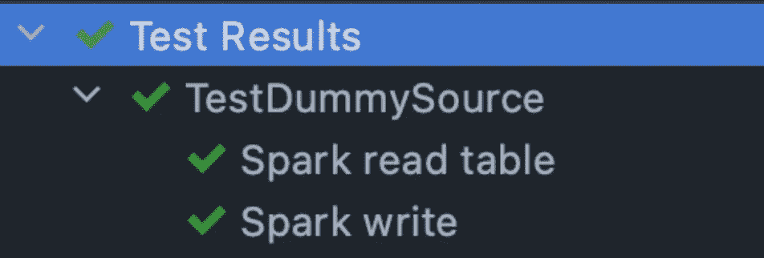

# Spark:模仿读、读流、写和写流

> 原文：<https://medium.com/walmartglobaltech/spark-mocking-read-readstream-write-and-writestream-b6fe70761242?source=collection_archive---------2----------------------->

spark 管道的低代码覆盖率是由于缺少源和汇的单元测试用例造成的。我们大多数 spark scala 管道的代码覆盖率低于 70%。我们希望它在 85–95%的范围内。

Spark 支持多个批处理和流源，像

1.  战斗支援车
2.  JSON
3.  镶木地板
4.  妖魔
5.  文本
6.  JDBC/ODBC 连接
7.  卡夫卡

为 spark 读写编写测试用例的限制降低了整体代码覆盖率，因此降低了流水线的整体质量分数。由于读取和写入是数据管道中无处不在的一部分，相应的代码行在所有代码行中占很大比例。

让我们来看看提高 spark scala 管道代码质量度量的分步指南。

下面是嘲讽概念的总结

**单元测试用例编写中的嘲讽**是测试编写代码的行为和逻辑

**模拟**用于行为验证，它完全控制对象及其方法

存根是用于保存本质上受限制的数据，并用于在单元测试用例期间返回

**Spy** 用于部分模仿，其中只有选择的行为需要被模仿，其余的需要是对象的原始行为

让我们进入火花细节

**基于 Maven 的依赖关系**

让我们用一个 spark 类的例子，其中源是**配置单元**和****接收器是 **JDBC。******

*****DummySource.scala* 从 Hive 中读取一个表，应用一个过滤器，然后写入一个 JDBC 表。****

> ****我们跳过应用其他逻辑的转换，因为可以使用**存根**进行测试****

****我们不需要编写代码连接到源或接收器的单元测试用例。所以这里我们想要模拟 spark 的读写行为。在我们研究解决方案之前，最好先熟悉一下 Spark DataFrameReader 和 DataFrameWriter****

****因为我们要模拟下面的两个类，所以了解所有的方法/行为是很重要的****

 ****[## spark 3 . 2 . 1 Scala doc-org . Apache . spark . SQL . data frame reader

### spark 3 . 2 . 1 Scala doc-org . Apache . spark . SQL . data frame reader

火花 3.2.1 斯卡拉多克-org.apache.spark.sql.DataFrameReaderspark.apache.org](https://spark.apache.org/docs/3.2.1/api/scala/org/apache/spark/sql/DataFrameReader.html)****  ****[## spark 3 . 2 . 1 Scala doc-org . Apache . spark . SQL . data frame writer

### spark 3 . 2 . 1 Scala doc-org . Apache . spark . SQL . data frame writer

火花 3.2.1 斯卡拉多克-org.apache.spark.sql.DataFrameWriterspark.apache.org](https://spark.apache.org/docs/3.2.1/api/scala/org/apache/spark/sql/DataFrameWriter.html)**** 

## ****嘲笑阅读****

****这里的目标是避免连接到源，并且仍然得到一个数据帧，以便我们的过滤器逻辑被单元测试。所以我们从嘲笑火花会议开始****

****SparkSession.read 返回*org . Apache . spark . SQL . DataFrameReader，*所以现在我们将模仿 data frame reader****

****我们拥有所有需要的模拟对象。是时候控制这些行为了。当 spark.read 被调用时，我们需要 *mockSpark* 返回 *mockDataFrameReader*****

****在调用 spark.read.table 时返回 DataFrame 的地方，还需要添加一个行为，为此我们创建了一个存根对象****

****现在让我们添加所需的行为****

****让我们通过添加断言来完成我们的测试。****

****我们已经通过模仿 spark 的 Hive read 完成了单元测试用例。****

****我们将在目前所学的基础上继续努力。从模仿开始****

****现在添加行为****

> ****doNothing 用于 void 方法****

## ****卡夫卡式的嘲讽****

****流媒体源需要一组不同的类来模拟，如*org . Apache . spark . SQL . streaming . datastreamreader*和*org . Apache . spark . SQL . streaming . datastreamwriter*****

****下面是使用上述步骤的示例测试用例****

1.  ****模拟的****
2.  ****行为****
3.  ****主张****

# ******结论******

****Mocking 帮助我们实现了超过 80%的代码覆盖率，并被推荐用于所有基于 JVM 的 spark 管道。****

> ****快乐学习****