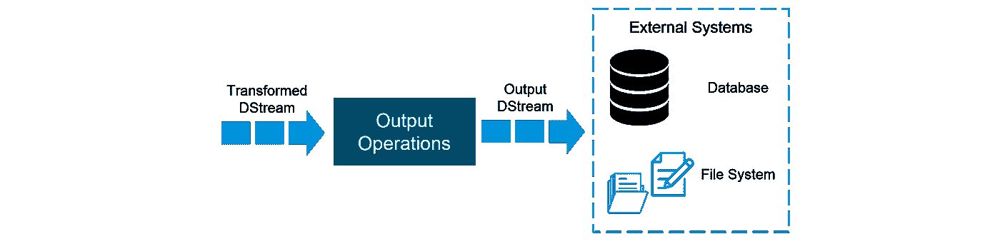

# Spark 流媒体教程——使用 Apache Spark 进行 Twitter 情感分析

> 原文：<https://medium.com/edureka/spark-streaming-92bdcb1d94c4?source=collection_archive---------1----------------------->


Spark Streaming Tutorial — Edureka

Spark Streaming 是核心 Spark API 的扩展，支持实时数据流的可伸缩、高吞吐量、容错流处理。Spark Streaming 可用于传输实时数据，处理可以实时进行。Spark Streaming 不断增长的用户群包括优步、网飞和 Pinterest 等家喻户晓的名字。

在实时数据分析方面，Spark Streaming 提供了一个单一平台来接收数据，以便在 Apache Spark 中进行快速实时处理。通过这篇文章，我将向您介绍 Spark Streaming 这一令人兴奋的新领域，我们将浏览一个完整的用例，使用 Spark Streaming 的 *Twitter 情感分析*。

以下是本博客将涵盖的主题:

1.  什么是流媒体？
2.  为什么是火花流？
3.  火花流概述
4.  火花流特征
5.  Spark 流基础知识
    5.1 流上下文
    5.2 数据流
    5.3 缓存/持久性
    5.4 累加器、广播变量和检查点
6.  用例— Twitter 情绪分析

# 什么是流媒体？

数据流是一种传输数据的技术，以便可以作为稳定和连续的流进行处理。随着互联网的发展，流媒体技术变得越来越重要。


# 为什么是火花流？

我们可以使用 Spark Streaming 从 Twitter、股票市场和地理系统等各种来源传输实时数据，并执行强大的分析来帮助企业。


# 火花流概述

*Spark Streaming* 用于处理实时流数据。它是对核心 Spark API 的有益补充。Spark Streaming 支持实时数据流的高吞吐量和容错流处理。


基本流单元是数据流，它基本上是一系列用于处理实时数据的 rdd。

# 火花流特征

> **扩展:** Spark Streaming 可以轻松扩展到数百个节点。
> 
> **速度:**实现低延迟。
> 
> **容错:** Spark 具有从故障中高效恢复的能力。
> 
> **集成:** Spark 集成了批处理和实时处理。
> 
> **业务分析:** Spark Streaming 用于跟踪客户的行为，可用于业务分析。

## **火花流工作流程**

Spark 流工作流有四个高级阶段。首先是从各种来源传输数据。这些源可以是流数据源，如 Akka、Kafka、Flume、AWS 或用于实时流的 Parquet。第二类来源包括 HBase、MySQL、PostgreSQL、Elastic Search、Mongo DB 和 Cassandra，用于静态/批处理流。一旦发生这种情况，Spark 可以通过其 MLlib API 对数据进行机器学习。此外，Spark SQL 用于对这些数据执行进一步的操作。最后，流式输出可以存储到各种数据存储系统中，如 HBase、Cassandra、MemSQL、Kafka、Elastic Search、HDFS 和本地文件系统。


# 火花流基础知识

1.  流式上下文
2.  数据流
3.  贮藏
4.  累加器、广播变量和检查点

## **流媒体环境**

*流上下文*在 Spark 中消耗数据流。它注册一个*输入数据流*以产生一个*接收器*对象。它是 Spark 功能的主要入口。Spark 提供了许多像 Twitter、Akka Actor 和 ZeroMQ 这样的源代码的默认实现，可以从上下文中访问它们。

可以从 SparkContext 对象创建 StreamingContext 对象。SparkContext 表示到 Spark 集群的连接，可用于在该集群上创建 rdd、累加器和广播变量。

```
import org.apache.spark._
import org.apache.spark.streaming._
var ssc = new StreamingContext(sc,Seconds(1))
```

## **数据流**

*离散化流* (DStream)是 Spark Streaming 提供的基本抽象。它是一个连续的数据流。它是从数据源或通过转换输入流生成的处理过的数据流接收的。


在内部，数据流由一系列连续的 RDD 表示，每个 RDD 包含某一区间的数据。

**输入数据流:** *输入数据流*是表示从流源接收的输入数据流的数据流。


每个输入数据流都与一个接收器对象相关联，该对象从数据源接收数据，并将其存储在 Spark 的内存中进行处理。

**数据流上的转换:**

应用于数据流的任何操作都将转化为对底层 rdd 的操作。转换允许来自输入数据流的数据像 RDDs 一样被修改。数据流支持普通 Spark RDDs 上可用的许多转换。


以下是一些常见的数据流转换:


## **输出数据流:**

输出操作允许将 DStream 的数据推出到外部系统，如数据库或文件系统。输出操作触发所有数据流转换的实际执行。



**缓存**

数据流允许开发者在内存中缓存/保存数据流的数据。如果数据流中的数据将被计算多次，这是很有用的。这可以使用 DStream 上的 *persist()* 方法来完成。


对于通过网络接收数据的输入流(如 Kafka、Flume、Sockets 等。)，默认的持久性级别设置为将数据复制到两个节点以实现容错。

# **累加器、广播变量和检查点**

## **累加器:**

*累加器*是仅通过关联和交换操作相加的变量。它们用于实现计数器或求和。在用户界面中跟踪累加器有助于了解运行阶段的进度。Spark 本身支持数字累加器。我们可以创建命名或未命名的累加器。

## **广播变量:**

*广播变量*允许程序员在每台机器上缓存一个只读变量，而不是随任务发送一个副本。它们可用于以高效的方式为每个节点提供大型输入数据集的副本。Spark 还尝试使用高效的广播算法来分发广播变量，以降低通信成本。

## **检查点:**

*关卡*类似于游戏中的关卡。它们使它 24/7 全天候运行，并使它对与应用程序逻辑无关的故障具有弹性。


# 用例— Twitter 情绪分析

现在我们已经理解了 Spark 流的核心概念，让我们使用 Spark 流解决一个现实生活中的问题。

## **问题陈述:**

设计一个 Twitter 情绪分析系统，我们在其中填充实时情绪，用于危机管理、服务调整和目标营销。

## **情感分析的应用:**

*   预测一部电影的成功
*   预测政治竞选的成功
*   决定是否投资某家公司
*   定向广告
*   审查产品和服务

## **火花流实现:**

找到下面的伪代码:

```
//Import the necessary packages into the Spark Program
import org.apache.spark.streaming.{Seconds, StreamingContext}
import org.apache.spark.SparkContext._
...
import java.io.File

object twitterSentiment {

def main(args: Array[String]) {
if (args.length < 4) {
System.err.println("Usage: TwitterPopularTags <consumer key> <consumer secret> " + "<access token> <access token secret> [<filters>]")
System.exit(1)
}

StreamingExamples.setStreamingLogLevels()
//Passing our Twitter keys and tokens as arguments for authorization
val Array(consumerKey, consumerSecret, accessToken, accessTokenSecret) = args.take(4)
val filters = args.takeRight(args.length - 4)

// Set the system properties so that Twitter4j library used by twitter stream
// Use them to generate OAuth credentials
System.setProperty("twitter4j.oauth.consumerKey", consumerKey)
...
System.setProperty("twitter4j.oauth.accessTokenSecret", accessTokenSecret)

val sparkConf = new SparkConf().setAppName("twitterSentiment").setMaster("local[2]")
val ssc = new Streaming Context
val stream = TwitterUtils.createStream(ssc, None, filters)

//Input DStream transformation using flatMap
val tags = stream.flatMap { status => Get Text From The Hashtags }

//RDD transformation using sortBy and then map function
tags.countByValue()
.foreachRDD { rdd =>
val now = Get current time of each Tweet
rdd
.sortBy(_._2)
.map(x => (x, now))
//Saving our output at ~/twitter/ directory
.saveAsTextFile(s"~/twitter/$now")
}

//DStream transformation using filter and map functions
val tweets = stream.filter {t =>
val tags = t. Split On Spaces .filter(_.startsWith("#")). Convert To Lower Case
tags.exists { x => true }
}

val data = tweets.map { status =>
val sentiment = SentimentAnalysisUtils.detectSentiment(status.getText)
val tagss = status.getHashtagEntities.map(_.getText.toLowerCase)
(status.getText, sentiment.toString, tagss.toString())
}

data.print()
//Saving our output at ~/ with filenames starting like twitters
data.saveAsTextFiles("~/twitters","20000")

ssc.start()
ssc.awaitTermination()
 }
}
```

## **结果:**

下面是运行 Twitter 情感流程序时 Eclipse IDE 中显示的结果。


在截图中我们可以看到，所有的推文都按照推文内容的情绪分为正面、中性和负面。

推文的情感输出根据它们被创建的时间被存储到文件夹和文件中。这个输出可以根据需要存储在本地文件系统或 HDFS 上。输出目录如下所示:


在这里，在 Twitter 目录中，我们可以找到 Twitter 用户的用户名以及每条推文的时间戳，如下所示:


现在我们已经获得了 Twitter 用户名和时间戳，让我们看看存储在主目录中的情感和推文。在这里，每条推文后面都跟着感悟情绪。存储的这种情绪被公司进一步用于分析大量的见解。


## **调整代码:**

现在，让我们稍微修改一下我们的代码，以获得特定标签(主题)的情感。目前，美国总统唐纳德·特朗普正在新闻频道和在线社交媒体上流行。让我们看看与关键字' ***Trump*** '相关的情绪。


正如我们从情感分析演示中看到的，我们可以提取特定主题的情感，就像我们对“特朗普”所做的那样。同样，情感分析可以被世界各地的公司用于危机管理、服务调整和目标营销。

使用 Spark Streaming 进行情感分析的公司采用了相同的方法来实现以下目标:

1.  增强客户体验
2.  获得竞争优势
3.  获取商业智能
4.  重振一个失败的品牌

至此， *Spark 流媒体教程*博客到此结束。到现在为止，你一定已经很好的理解了什么是火花流。

原来就是这样！我希望这篇博客能给你提供信息，增加你的知识。如果你想查看更多关于人工智能、DevOps、道德黑客等市场最热门技术的文章，你可以参考 Edureka 的官方网站。

请留意本系列中的其他文章，它们将解释 Spark 的各个方面。

> *1。* [*Apache Spark 架构*](/edureka/spark-architecture-4f06dcf27387)
> 
> *2。* [*Apache Spark 教程*](/edureka/spark-tutorial-2a036075a572)
> 
> *3。*[*Spark ml lib*](/edureka/spark-mllib-e87546ac268)
> 
> *4。* [*火花 SQL 教程*](/edureka/spark-sql-tutorial-6de1e241bf76)
> 
> *5。* [*Spark GraphX 教程*](/edureka/spark-graphx-f9bd805ac429)
> 
> *6。* [*Spark Java 教程*](/edureka/spark-java-tutorial-cb2f54991c2b)

*原载于 2017 年 5 月 8 日 www.edureka.co*[](https://www.edureka.co/blog/spark-streaming/)**。**