# 使用 Apache Spark 的地震检测系统

> 原文：<https://medium.com/edureka/spark-tutorial-2a036075a572?source=collection_archive---------0----------------------->


Spark Tutorial — Edureka

Apache Spark 是一个用于*实时处理*的*开源集群计算框架*。它是 Apache 软件基金会中最成功的项目之一。Spark 显然已经发展成为大数据处理的市场领导者。今天，Spark 正在被亚马逊、易贝和雅虎等主要公司采用。许多组织在具有数千个节点的集群上运行 Spark，在您的职业生涯中，成为 Spark 认证专家是一个巨大的机会。本文是即将推出的 Apache Spark 系列的第一篇文章，该系列将包括 Spark 流、Spark 面试问题、Spark MLlib 等。

谈到实时数据分析，Spark 是所有其他解决方案的首选工具。通过这篇文章，我将向您介绍 Apache Spark 这个令人兴奋的新领域，我们将浏览一个完整的用例，使用 Spark 的*地震检测*。

以下是这篇 Spark 教程博客中涉及的主题:

1.  实时分析
2.  Hadoop 已经存在，为什么还要 Spark？
3.  什么是阿帕奇火花？
4.  火花特征
5.  Spark 入门
6.  在 Hadoop 中使用 Spark
7.  火花部件
8.  用例:使用 Spark 进行地震检测

# 实时分析

在我们开始之前，让我们看看社交媒体领导者每分钟产生的数据量。

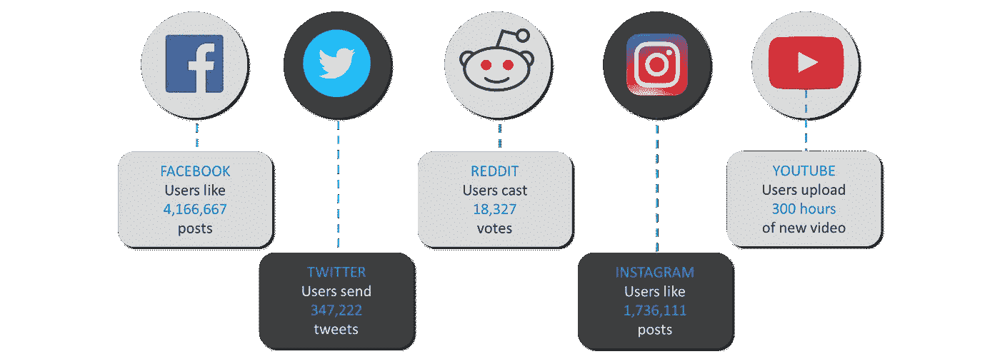

*Data Generated — Spark Tutorial*

正如我们所见，互联网世界需要在几秒钟内处理大量数据。我们将经历企业中处理大数据的所有阶段，并发现对名为 ***Apache Spark*** 的*实时处理框架*的需求。

首先，让我向您介绍一下当今世界使用实时分析的几个重要领域。


*Examples of Real-Time Analytics — Spark Tutorial*

我们可以看到，大数据的实时处理已经深入到我们生活的方方面面。从银行业的欺诈检测到政府的实时监控系统，从医疗保健领域的自动机器到股票市场的实时预测系统，我们周围的一切都围绕着近乎实时地处理大数据。

让我们来看看 ***实时分析*** 的一些使用案例:

> **医疗保健**:医疗保健领域使用实时分析持续检查危重患者的医疗状态。寻求血液和器官移植的医院需要在紧急情况下保持实时联系。及时就医对病人来说是生死攸关的问题。
> 
> **政府**:政府机构主要在国家安全领域执行实时分析。各国需要持续跟踪所有军事和警察机构，以了解有关安全威胁的最新情况。
> 
> **电信**:围绕电话、视频聊天和流媒体等服务的公司使用实时分析来减少客户流失，并在竞争中保持领先地位。他们还提取移动网络中抖动和延迟的测量值，以改善客户体验。
> 
> **银行业**:银行业处理着世界上几乎所有的货币。确保整个系统的容错事务变得非常重要。通过银行业的实时分析，欺诈检测成为可能。
> 
> **股票市场**:股票经纪人利用实时分析来预测股票组合的变动。公司在使用实时分析来分析市场对其品牌的需求后，会重新思考他们的商业模式。

# Hadoop 已经存在，为什么还要 Spark？

当谈到 Spark 时，每个人都会问的第一个问题是，“ ***我们已经有了 Hadoop，为什么还要 Spark？*** ”。

要回答这个问题，我们必须了解批处理和实时处理的概念。 ***Hadoop*** 基于*批处理*的概念，对已经存储了一段时间的数据块进行处理。当时，Hadoop 在 2005 年用革命性的 MapReduce 框架打破了所有的预期。***Hadoop MapReduce***是批量处理数据的最佳框架。

这种情况一直持续到 2014 年，直到 Spark 超越 Hadoop。Spark 的 USP 是它可以*实时*处理数据**并且在批量处理大型数据集时比 Hadoop MapReduce 快 100 倍左右。

下图详细解释了 Spark 和 Hadoop 中的处理差异。

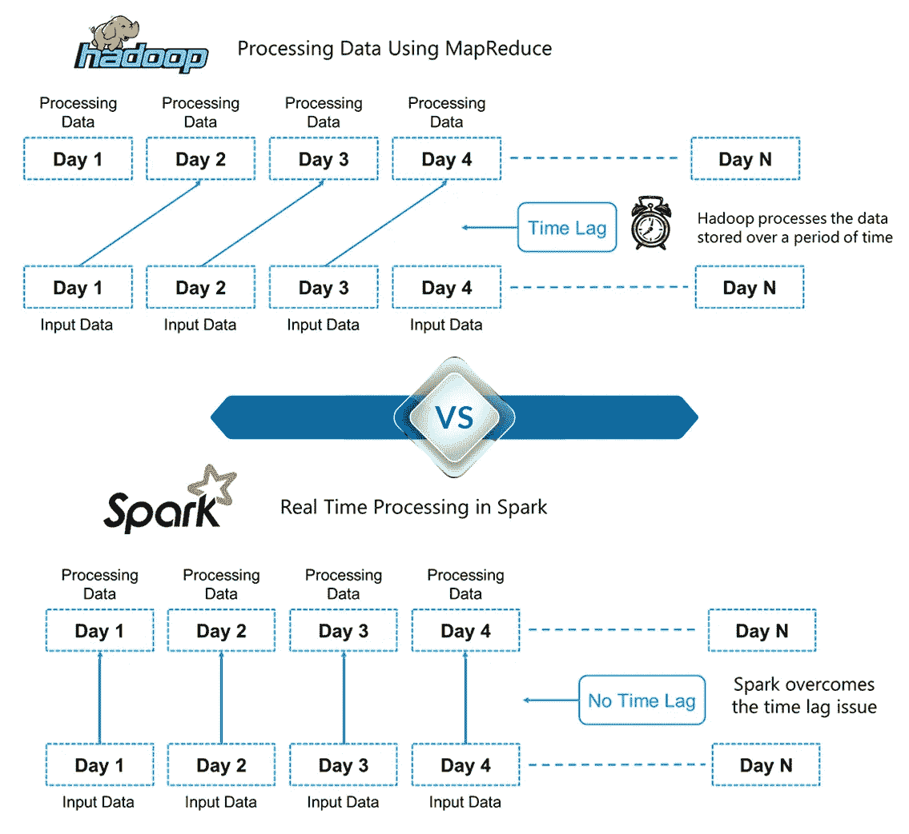

*Differences between Hadoop and Spark — Hadoop Tutorial*

这里，我们可以引出 Hadoop 和 Spark 之间的一个关键区别。Hadoop 是基于大数据的批量处理。这意味着数据会存储一段时间，然后使用 Hadoop 进行处理。而在 Spark 中，处理可以实时进行。Spark 中的这种实时处理能力帮助我们解决了我们在上一节中看到的实时分析用例。此外，Spark 的批处理速度比 Hadoop MapReduce(Apache Hadoop 中的处理框架)快 100 倍。 ***因此，Apache Spark 是业内大数据处理的必备工具。***

# 什么是阿帕奇火花？

Apache Spark 是用于*实时处理的*开源集群计算框架*。它有一个繁荣的开源社区，是目前最活跃的 Apache 项目。Spark 提供了一个接口，用于通过隐式数据并行和容错对整个集群进行编程。*


*Real-Time Processing in Apache Spark — Spark Tutorial*

它建立在 Hadoop MapReduce 之上，并扩展了 MapReduce 模型以有效地使用更多类型的计算。

# Apache Spark 的特性

Spark 有以下特点:

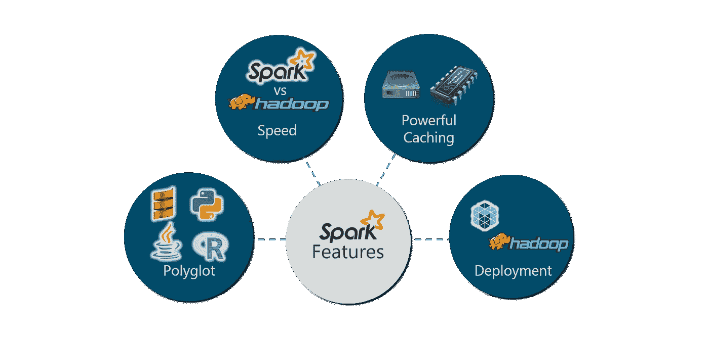

Features of Spark — Spark Tutorial

让我们详细看看这些功能:

## **多语言**:

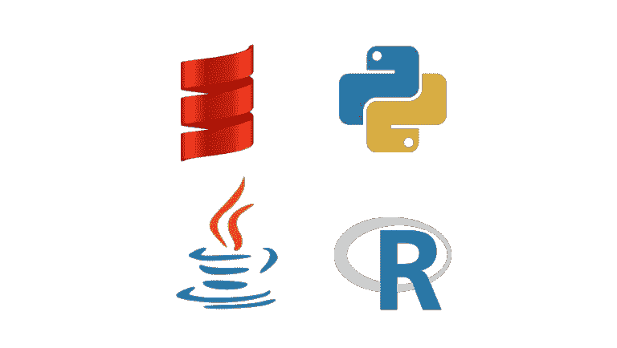

Spark 提供了 Java、Scala、Python 和 r 的高级 API，Spark 代码可以用这四种语言中的任何一种编写。它用 Scala 和 Python 提供了一个 shell。Scala shell 可以通过**访问。/bin/spark-shell** 和 Python shell 通过**。安装目录中的/bin/pyspark** 。

## **速度**:

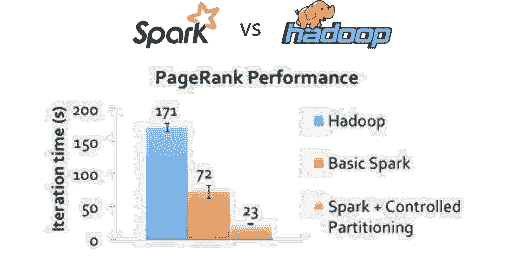

对于大规模数据处理，Spark 的运行速度比 Hadoop MapReduce 快 100 倍。Spark 能够通过受控分区实现这一速度。它使用分区管理数据，有助于以最小的网络流量并行处理分布式数据。

## **多种格式**:


Spark 支持多种数据源，如 Parquet、JSON、Hive 和 Cassandra，此外还有文本文件、CSV 和 RDBMS 表等常见格式。数据源 API 提供了通过 Spark SQL 访问结构化数据的可插拔机制。数据源不仅仅是简单的转换数据并将其导入 Spark 的管道。

## **懒评**:


Apache Spark 延迟其评估，直到绝对必要时。这是促成其速度的关键因素之一。对于转换，Spark 将它们添加到 DAG(有向无环图)计算中，只有当驱动程序请求一些数据时，DAG 才会真正执行。

## **实时计算**:


Spark 的计算是实时的，并且由于其内存计算而具有低延迟。Spark 旨在实现巨大的可扩展性，Spark 团队记录了运行具有数千个节点的生产集群的系统用户，并支持多种计算模型。

## **Hadoop 集成**:

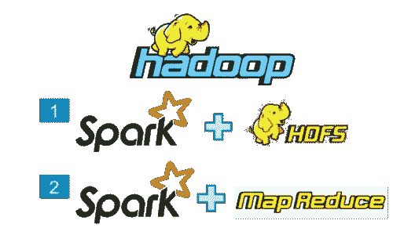

Apache Spark 提供了与 Hadoop 的平滑兼容性。这对所有以 Hadoop 开始职业生涯的大数据工程师来说都是福音。Spark 是 Hadoop MapReduce 功能的潜在替代品，而 Spark 能够在现有 Hadoop 集群之上运行，使用 YARN 进行资源调度。

## **机器学习**:


Spark 的 MLlib 是机器学习组件，在大数据处理方面非常方便。它消除了使用多个工具的需要，一个用于处理，一个用于机器学习。Spark 为数据工程师和数据科学家提供了一个强大的统一引擎，既快速又易于使用。

# 【Spark 入门

Spark 入门的第一步是安装。让我们在 Linux 系统上安装 Apache Spark 2.1.0(我使用的是 Ubuntu)。

## **安装:**

1.  安装 Spark 的先决条件是已经安装了 Java 和 Scala。
2.  如果没有安装 Java，请使用以下命令下载。

```
sudo apt-get install python-software-properties
sudo apt-add-repository ppa:webupd8team/java
sudo apt-get update
sudo apt-get install oracle-java8-installer
```

3.从 [Scala Lang 官方](http://www.scala-lang.org/)页面下载最新的 Scala 版本。安装完成后，在`~/.bashrc` 文件中设置 scala 路径，如下所示。

```
export SCALA_HOME=Path_Where_Scala_File_Is_Located
export PATH=$SCALA_HOME/bin:PATH
```

4.从 Apache Spark 下载页面下载 Spark 2.1.0。您也可以选择下载以前的版本。

5.使用下面的命令提取火花焦油。

```
tar -xvf spark-2.1.0-bin-hadoop2.7.tgz
```

6.在`~/.bashrc` 文件中设置 Spark_Path。

```
export SPARK_HOME=Path_Where_Spark_Is_Installed
export PATH=$PATH:$SPARK_HOME/bin
```

在我们继续之前，让我们在我们的系统上启动 Apache Spark，并习惯 Spark 的主要概念，如 Spark 会话、数据源、rdd、数据帧和其他库。

## **火花壳:**

Spark 的 shell 提供了一种简单的学习 API 的方法，以及一个强大的交互分析数据的工具。

## **火花时段:**

在 Spark 的早期版本中，Spark 上下文是 Spark 的入口点。对于其他 API，我们需要使用不同的上下文。对于流，我们需要 StreamingContext、SQL sqlContext 和 HiveContext。为了解决这个问题，SparkSession 应运而生。它本质上是 SQLContext、HiveContext 和 future StreamingContext 的组合。

## **数据来源:**

数据源 API 提供了通过 Spark SQL 访问结构化数据的可插拔机制。数据源 API 用于将结构化和半结构化数据读取和存储到 Spark SQL 中。数据源不仅仅是简单的转换数据并将其导入 Spark 的管道。

## **RDD:**

弹性分布式数据集(RDD)是 Spark 的基本数据结构。它是一个不可变的分布式对象集合。RDD 中的每个数据集都被划分为逻辑分区，这些分区可以在集群的不同节点上进行计算。rdd 可以包含任何类型的 Python、Java 或 Scala 对象，包括用户定义的类。

## **数据集:**

数据集是数据的分布式集合。数据集可以由 JVM 对象构建，然后使用函数转换(map、flatMap、filter 等)进行操作。).数据集 API 有 Scala 和 Java 两种版本。

## **数据帧:**

DataFrame 是组织成命名列的数据集。它在概念上相当于关系数据库中的一个表或 R/Python 中的一个数据框，但是在底层有更丰富的优化。数据帧可以从各种来源构建，如结构化数据文件、Hive 中的表、外部数据库或现有 rdd。

# 在 Hadoop 中使用 Spark

Spark 最好的部分是它与 Hadoop 的兼容性。因此，这是一个非常强大的技术组合。在这里，我们将了解 Spark 如何从 Hadoop 的优势中获益。

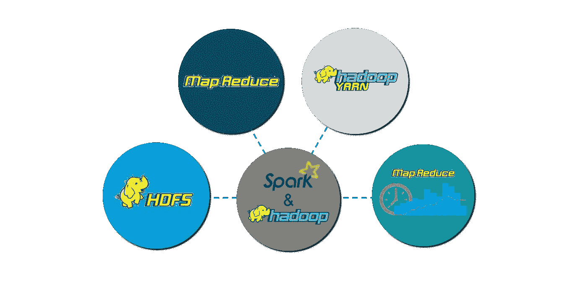

*Spark Features — Spark Tutorial*

Hadoop 组件可以通过以下方式与 Spark 一起使用:

> **HDFS** : Spark 可以运行在 HDFS 之上，以利用分布式复制存储。
> 
> **MapReduce** : Spark 可以在同一个 Hadoop 集群中与 MapReduce 一起使用，也可以单独作为一个处理框架使用。
> 
> **YARN** : Spark 应用可以在 YARN (Hadoop NextGen)上运行。
> 
> **批处理&实时处理** : MapReduce 和 Spark 一起使用，MapReduce 用于批处理，Spark 用于实时处理。

# 火花部件

Spark 组件使得 Apache Spark 快速可靠。很多 Spark 组件都是为了解决使用 Hadoop MapReduce 时出现的问题而构建的。Apache Spark 具有以下组件:

1.  **火花芯**
2.  **火花流**
3.  **Spark SQL**
4.  **GraphX**
5.  **MLlib(机器学习)**

# 火花核心

*Spark Core* 是大规模并行和分布式数据处理的基础引擎。核心是分布式执行引擎，Java、Scala 和 Python APIs 为分布式 ETL 应用程序开发提供了一个平台。此外，构建在核心之上的额外库允许流、SQL 和机器学习的不同工作负载。它负责:

1.  内存管理和故障恢复

2.在群集上调度、分发和监控作业

3.与存储系统交互

# 火花流

*Spark 流*是 Spark 的组件，用于处理实时流数据。因此，它是对核心 Spark API 的有益补充。它支持实时数据流的高吞吐量和容错流处理。基本流单元是数据流，它基本上是一系列用于处理实时数据的弹性分布式数据集。

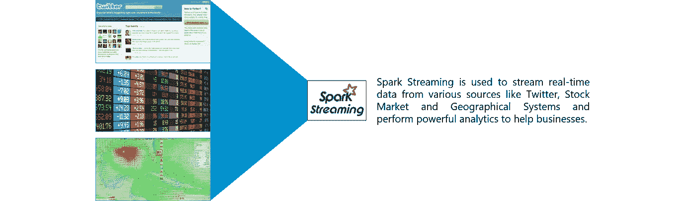

*Spark Streaming — Spark Tutorial*

# Spark SQL

*Spark SQL* 是 Spark 中的一个新模块，它将关系处理与 Spark 的函数式编程 API 集成在一起。它支持通过 SQL 或 Hive 查询语言查询数据。对于那些熟悉 RDBMS 的人来说，Spark SQL 将是从早期工具的简单过渡，在早期工具中，您可以扩展传统关系数据处理的边界。

Spark SQL 将关系处理与 Spark 的函数式编程集成在一起。此外，它提供了对各种数据源的支持，并使将 SQL 查询与代码转换结合起来成为可能，从而产生了一个非常强大的工具。

***以下是 Spark SQL 的四个库。***

1.  数据源 API
2.  数据框架 API
3.  解释器和优化器
4.  SQL 服务

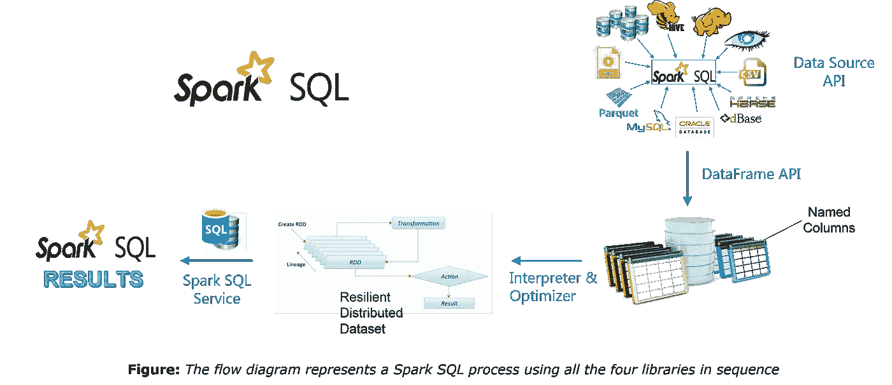

# GraphX

GraphX 是用于图形和图形并行计算的 Spark API。因此，它用弹性分布式属性图扩展了火花 RDD。

属性图是一个有向多重图，它可以有多条平行边。每个边和顶点都有用户定义的相关属性。这里，平行边允许相同顶点之间的多种关系。在高层次上，GraphX 通过引入弹性分布式属性图扩展了 Spark RDD 抽象:一个每个顶点和边都有属性的有向多图。

为了支持图形计算，GraphX 公开了一组基本操作符(例如，子图、joinVertices 和 mapReduceTriplets)以及 Pregel API 的优化变体。此外，GraphX 还包含了越来越多的图形算法和构建器来简化图形分析任务。

# 机器学习

*MLlib* 代表机器学习库。Spark MLlib 用于在 Apache Spark 中执行机器学习。

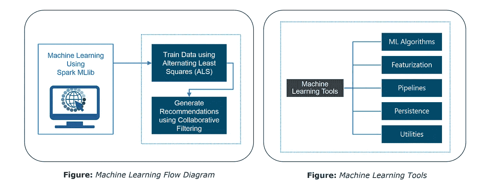

Machine Learning Flow Diagram — Spark Tools

# 使用火花的地震探测

现在我们已经理解了 Spark 的核心概念，让我们使用 Apache Spark 解决一个现实生活中的问题。这将有助于我们有信心在未来从事任何 Spark 项目。

## **问题陈述**:

*设计一个实时地震检测模型来发送救生警报，这应该可以改善其机器学习，以提供接近实时的计算结果。*

## **要求**:

1.  实时处理数据
2.  处理来自多个来源的输入
3.  易于使用的系统
4.  警报的批量传输

我们将使用 Apache Spark，它是满足我们需求的完美工具。

## **数据集**:

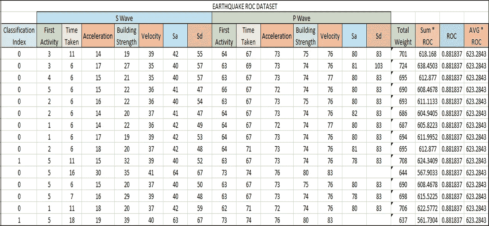

*Earthquake Dataset — Spark Tutorial*

在继续之前，有一个概念我们必须了解，我们将在我们的地震探测系统中使用，它被称为接收器工作特性(ROC)。ROC 曲线是图示二元分类器系统在其辨别阈值变化时的性能的图表。我们将使用数据集，通过 Apache Spark 中的机器学习来获得 ROC 值。

## **流程图**:

下图清楚地解释了我们的*地震探测系统*中涉及的所有步骤。

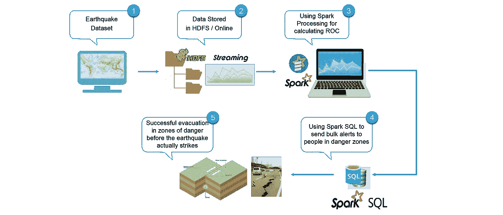

*Flow diagram of Earthquake Detection using Apache Spark — Spark Tutorial*

## **火花实现**:

接下来，让我们使用 Eclipse IDE for Spark 来实现我们的项目。

找到下面的伪代码:

```
//Importing the necessary classes
import org.apache.spark._
...
//Creating an Object earthquake
object earthquake {
 def main(args: Array[String]) {

//Creating a Spark Configuration and Spark Context
val sparkConf = new SparkConf().setAppName("earthquake").setMaster("local[2]")
val sc = new SparkContext(sparkConf)

//Loading the Earthquake ROC Dataset file as a LibSVM file
val data = MLUtils.loadLibSVMFile(sc, *Path to the Earthquake File* )

//Training the data for Machine Learning
val splits = data.randomSplit( *Splitting 60% to 40%* , seed = 11L)
val training = splits(0).cache()
val test = splits(1)

//Creating a model of the trained data
val numIterations = 100
val model = *Creating SVM Model with SGD* (  *Training Data* , *Number of Iterations* )

//Using map transformation of model RDD
val scoreAndLabels = *Map the model to predict features* 

//Using Binary Classification Metrics on scoreAndLabels
val metrics = * Use Binary Classification Metrics on scoreAndLabels *(scoreAndLabels)
val auROC = metrics. *Get the area under the ROC Curve*()

//Displaying the area under Receiver Operating Characteristic
println("Area under ROC = " + auROC)
 }
}
```

从我们的 Spark 程序中，我们得到 ROC 值为 0.088137。我们将转换该值，以获得 ROC 曲线下的面积。

## **可视化结果**:

我们将绘制 ROC 曲线，并与具体的地震点进行比较。当地震点超过 ROC 曲线时，这些点被视为大地震。根据我们计算 ROC 曲线下面积的算法，我们可以假设这些大地震都在里氏 6.0 级以上。

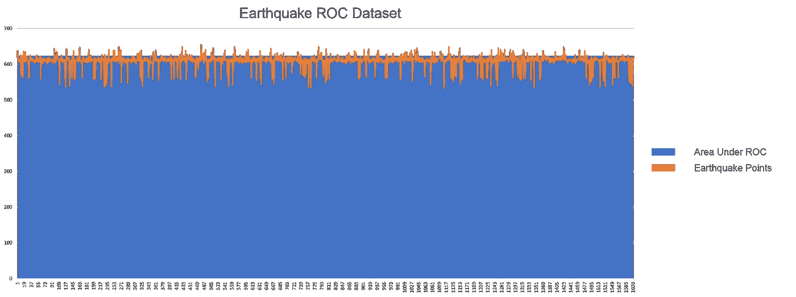

Earthquake ROC Curve — Spark Tutorial

上图以橙色显示了地震线。蓝色区域是我们从 Spark 项目中获得的 ROC 曲线。让我们把曲线放大，以便获得更好的图像。

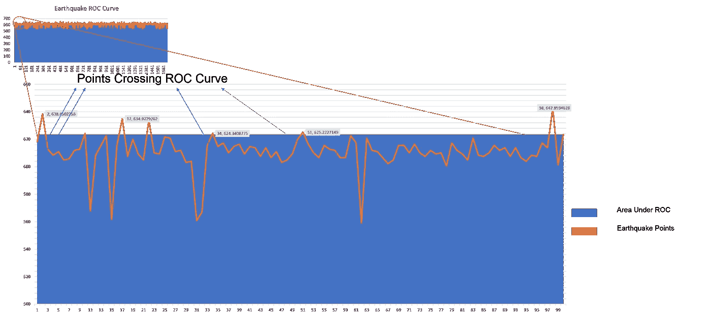

Visualizing Earthquake Points — Spark Tutorial

我们绘制了地震曲线和 ROC 曲线。在橙色曲线位于蓝色区域上方的点处，我们预测地震为大地震，即震级大于 6.0。因此，有了这些知识，我们可以使用 Spark SQL 并查询现有的 Hive 表来检索电子邮件地址，并向人们发送个性化的警告电子邮件。因此，我们再一次利用科技来拯救人类生命，让每个人的生活变得更好。

现在，Apache Spark 文章到此结束。我希望你喜欢阅读它，并发现它的信息。到目前为止，您一定已经很好地理解了 Apache Spark 是什么。实际操作的例子将为您在 Apache Spark 中遇到的任何未来项目提供所需的信心。

原来就是这样！我希望这篇博客能给你提供信息，增加你的知识。如果你想查看更多关于人工智能、DevOps、道德黑客等市场最热门技术的文章，你可以参考 Edureka 的官方网站。

请留意本系列中的其他文章，它们将解释 Spark 的各个方面。

> *1。* [*阿帕奇星火架构*](/edureka/spark-architecture-4f06dcf27387)
> 
> *2。* [*火花串流教程*](/edureka/spark-streaming-92bdcb1d94c4)
> 
> *3。*[*Spark ml lib*](/edureka/spark-mllib-e87546ac268)
> 
> *4。* [*Spark SQL 教程*](/edureka/spark-sql-tutorial-6de1e241bf76)
> 
> *5。* [*Spark GraphX 教程*](/edureka/spark-graphx-f9bd805ac429)
> 
> *6。* [*Spark Java 教程*](/edureka/spark-java-tutorial-cb2f54991c2b)

*原载于 2017 年 5 月 4 日 www.edureka.co**[*。*](https://www.edureka.co/blog/spark-tutorial/)*