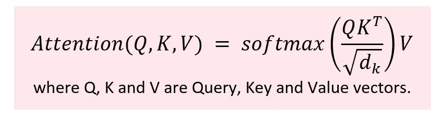
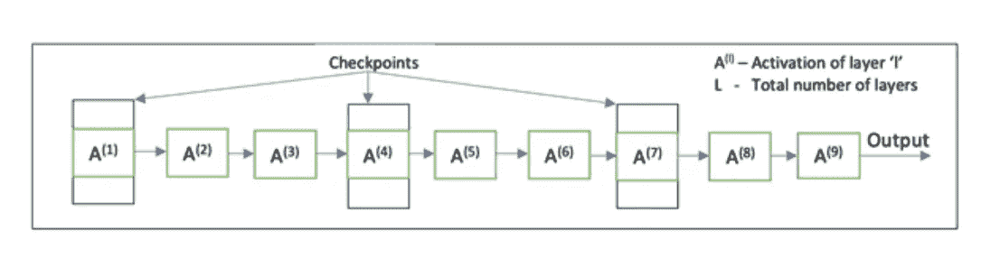

# 稀疏变压器和长变压器:变压器空间和时间优化综述(一)

> 原文：<https://medium.com/walmartglobaltech/sparse-transformers-and-longformers-a-comprehensive-summary-of-space-and-time-optimizations-on-4caa5c388693?source=collection_archive---------4----------------------->

注意:本文假设读者熟悉 transformer 架构和自然语言处理的基础知识。可以通过这篇[论文](https://arxiv.org/abs/1706.03762)或者[博客](https://jalammar.github.io/illustrated-transformer/)深入了解变形金刚。

转换模型带来了自然语言处理(NLP)领域的一场革命，它引入了自我注意作为一种强大的机制来捕获序列中的上下文和依赖关系。通过自我注意，一个序列中的每个单词都可以注意到所有其他的单词，从而确定任何两个单词在序列的上下文中的相关程度。这种能力使具有 transformer 架构的模型能够在各种生成性和区分性 NLP 任务中达到最先进的水平。

Figure 1 : Equation for scaled dot-product or self-attention operation in transformers

然而，随着更大的功率而来的是更大的̶r̶e̶s̶p̶o̶n̶s̶i̶b̶i̶l̶i̶t̶y̶计算复杂度和存储需求。对于长度为 n 的序列，自我注意中的 QKᵀ运算需要 O(n)时间，并产生 n*n 维的矩阵。随着序列长度的增加，这种二次时间和空间复杂度成为限制因素。

生成式预训练(GPT)和其他深度转换器模型使用大量文本来训练强大的语言模型，使用几种启发式方法和具有多个 GPU 的非常高带宽的机器来避免耗尽内存。训练具有非常大的序列的变压器的这种高计算的要求激励了对抗 O(n)复杂性的模型的开发。本文和后续文章将讨论其中的一些模型，以及它们是如何实现复杂度小于 O(n)的。我将在以下文章中讨论这些技术:

1.用稀疏变压器生成长序列
2。Longformer:长文档转换器
3。重整器:高效的变压器
4。反思表演者的注意力

这些模型将在两篇文章中讨论。在这篇文章(系列文章的第一篇)中，我将讨论稀疏转换器和长转换器中使用的优化。第二篇文章是关于改革者和执行者的。这些文章的动机是探索可以用来降低模型复杂性的不同技术，而不是学习具有最低复杂性的最新模型。因此，我将只讨论降低这些模型复杂性的主要优化。

值得注意的是，这些模型中的许多还在 transformer 架构中使用了一些启发和变化，并对自我关注进行了优化以降低复杂性。但是本文的范围仅仅涉及重要的优化。

在我们继续查看这些模型之前，让我们讨论一种称为梯度检查点的重要技术，它用于深度学习模型以降低内存需求。

# **梯度检查点**

通过反向传播来更新神经网络中的层“l”的权重需要激活存储器中连接到“l”的所有后续层。换句话说，只有当先前层中所有将使用 Q 的激活来更新它们的权重的节点都更新了它们的权重时，才可以从存储器中移除节点 Q 的激活。因此，反向传播所需的内存与层数成正比，并且对于更深的模型会显著增加。

梯度检查点通过在内存中只保留几个层的激活(标记为检查点)来应对这种内存限制。剩余层的激活可以使用检查点的激活来再次计算。如果检查点的选择是最佳的，那么这种方法会导致内存需求的显著减少，代价是只需要一次额外的前向传递。例如，如果每个 sqrt(L)ᵗʰ层的激活都存储在存储器中(l 是层的总数)，则反向传播的存储器复杂度变得与 O(√L)成比例，这远小于 O(L)。对于检查点之间的层中的节点，只需要一次正向传递来重新计算所有这些节点的激活。在下面的图 2 中，激活 A⁽ ⁾、A⁽⁴⁾、A⁽⁷⁾可以在内存中设置检查点，然后可以用于重新计算激活 A⁽ ⁻ ⁾、A⁽⁴⁻⁵⁾和 A⁽⁸⁻⁹⁾respectively.

Figure 2 : Checkpoints marked at every sqrt(L) layer (L=9 in this figure)

**变压器模型中的梯度检查点**:如前所述，单个自我关注矩阵占用 O(n)空间。对于非常大量的层，对于具有中等计算能力和存储器的系统来说，在存储器中具有每层的关注矩阵变得不可行。因此，深度注意对少数层的检查点自我注意矩阵建模，并从检查点重新计算其余层的矩阵。这显著地降低了存储器需求，但略微增加了一次额外的前向传递的时间复杂度。

现在让我们来理解我上面提到的前两篇论文所使用的技术。为了使这篇文章更容易理解，我将每篇论文的讨论分成三个部分:论文的可行性和动机，用于降低复杂性的方法和降低复杂性的推导或解释，以及每个模型的性能总结。在本文中，“n”指的是一个序列中的单词数。

# **用稀疏变压器生成长序列(OpenAI)**

**1。可行性和动机**:正如我们在上一节中看到的，梯度检查点可以大大减少变压器的内存需求。然而，对于非常长的序列，计算甚至单个注意矩阵变得不可行。
为了解决这个问题，作者提出了稀疏或因子化注意模式的概念。对不同层次的变形金刚学习到的注意力模式的分析表明，尽管很少几个层次具有全局注意力范围，但其余的层次主要关注非常少的固定数据点。这促使作者训练**稀疏**变压器，其中一个数据点只关注少数其他点，而不是关注序列中的所有其他单词，因此降低了 O(n)复杂度。

**2。降低复杂性的方法和解释**:作者介绍了两种分解注意力模式的方法来训练稀疏变压器。虽然每种方法可以有“p”个不同的核或注意头，每个位置依次参与，但本文为每种类型的注意模式提出了两个注意头。下面让我们来看看它们:

**a .跨步注意力**:在这种类型的注意力中，每个位置“我”大致都在关注自己所在行和列的其他位置。该论文提到以下两个核心，由 Aᵢ表示，以实现步进注意。

(一)。Aᵢ = {t，t+1，t+2，…，i}，其中 t=max(0，i-l)，' l '为步长。通过这个内核，每个位置‘I’关注它前面的‘l’个连续位置。
**复杂度**:步长选择接近 O(√n)，这样复杂度就降到 O(n√n)。

㈡。Aᵢ = {j: (i-j)%l =0}，其中“l”是步长。我们通过一个例子来了解一下这个内核。如果 i= 83，l= 8，那么位置‘I’处理所有这样的位置，其中 i-j 是 8 的倍数。因此，j={3+(0*8)，3+(1*8)，3+(2*8)，…，3+(9*8)}或 I 正在处理中间有“l”间隙的位置。
**复杂度:**每个位置‘I’的集合 Aᵢ中的元素数量将是⌊i/l⌋.因此，对于序列中的所有“n”个单词，∑⌊i/l⌋=(∑⌊i⌋)/l = n(n+1)/2l = o(n√n)。(求和的极限是从 1 到 n)。

**b .固定注意:**通过这种注意模式，每个位置‘我’依次注视特定的位置。让我们来理解为固定注意力提出的两个内核。

(一)。Aᵢ = {j: ⌊i/l⌋ = ⌊j/l⌋}，其中“l”是步长。让我们举个例子来理解这个内核。如果 i = 83，l= 8，那么代入⌊i/l⌋ = ⌊83/8⌋ = 10。所以，对于⌊j/l⌋ = 10，j={80，81，82，…，89}。在自回归模型的情况下，序列中的每个位置只能关注它之前的位置，i=83 时 j = {80，81，82，83}，i=87 时 j = {80，81，…，87}。通过这个内核，一个位置也关注它前面的相邻位置。
**复杂度:**每个位置‘I’的集合 Aᵢ中的元素数量将为最大⌊i/l⌋.这样，对于序列中的所有‘n’个单词[∑](https://en.wikipedia.org/wiki/%E2%88%91)⌊i/l⌋=([∑](https://en.wikipedia.org/wiki/%E2%88%91))⌊i⌋)/l = n(n+1)/2l = o(n√n)。(求和的极限是从 1 到 n)。

㈡。Aᵢ = {j: j%l ∈ t，t+1，…，l}，其中 t=l-c，' l '是步长，c 是超参数。通过这个核心，一个位置关注某些固定的位置，独立于它的是当前位置“I”(注意核心的等式中没有 I)。为了理解这一点，我们假设 i=130，l=128，c=8。然后，t=(l-c)=120，Aᵢ = {j: j%128 ∈ 120，121，…，128}或 Aᵢ={120,121,…,127，248，249，…，255，…}。自回归或偶然模型只关注前面的位置(按照我们的例子，“I”将只关注位置 120 到 128)。双向模型也可以关注未来的位置。
因此，一个位置关注顺序中不同位置的‘c’位置的连续块。这种形式的注意也被称为 [**放大滑动窗口注意**。](/p/4caa5c388693/#fcf2)
**复杂程度:**各岗位我兼顾⌊i/l⌋*c 岗位。于是，([∑](https://en.wikipedia.org/wiki/%E2%88%91)⌊i/l⌋* c)= c *(t17】∑⌊i/l⌋)= o(n√n)。(求和的极限是从 1 到 n)。

**3。性能和总结:**稀疏变压器在 [**密度估计任务**](/p/4caa5c388693/#4910) 上表现良好，并在 [CIFAR-10](https://www.cs.toronto.edu/~kriz/cifar.html) 、 [enwik8](https://deepai.org/dataset/enwik8) 和 ImageNet 64 数据集上实现了更低的 [**比特每维**](/p/4caa5c388693/#4a75) 和最先进的结果。该模型在这些数据集上分别报告了每字节 2.80、0.99 和 3.44 的 [**位，与 transformer 模型相当或更好。
该论文报告了比变压器模型更低的损耗，并且由于稀疏的连接模式，训练时间更短。该模型在图像生成和原始音频波形生成等任务中也表现良好，这表明该模型即使在注意力模式稀疏的情况下也能够学习接下来的内容。然而，该模型在生成非常高分辨率的图像和音频形式方面表现不佳，并激发了对注意力矩阵中更优稀疏模式的探索。**](/p/4caa5c388693/#4a75)

# **Longformer:长文档转换器(艾伦人工智能研究所)**

**1。可行性和动机:** Longformers 旨在引入全局注意力的概念，其中一个数据点依次关注所有其他数据点，此外还有稀疏变压器引入的局部和稀疏注意力。该论文提出，局部和整体注意力的结合可以作为变形金刚使用的完全自我注意力矩阵的“替代”。

**2。复杂度降低的方法与解释:**论文提出了以下注意机制，将复杂度降低到 O(n)。

**a .滑动窗口注意:**在这种机制中，序列中的每个数据点都要注意其两侧的‘w/2’个数据点，‘w’是窗口的大小。窗口的大小不会在所有层中保持不变，而是随着我们向网络深处移动而增加。层“l”的窗口大小为 l*w，允许它具有更广泛的局部关注。
**复杂度**:对于一个长度为‘n’的序列，滑动窗口注意复杂度为 O(n*l*w)，在‘n’中是线性的。

**b .扩大的滑动窗口注意:**为了在不增加复杂度的情况下增加每个数据点的注意广度，在每层的窗口中引入了大小为“d”的间隙。一个数据点仍然关注任一侧的 w/2 个标记，但是这些标记不再是连续的。它们之间有“d”的间隙。这显著增加了单词的注意广度，因为现在单词可以注意非常远的单词。对于每一层,“d”可以设置为不同的值。
**复杂度**:对于长度为‘n’的序列，扩张滑动窗口注意复杂度为 O(n*l*d*w)，在‘n’中是线性的。

**c .全局注意力:**长成形器仅对序列中的少数标记引入全局注意力，从而保持复杂度为线性，并利用少数重要单词关注序列中所有单词的好处。全局注意力的表征是根据任务的性质决定的。例如，对于问题回答任务，所讨论的标记被选择用于全局关注。类似地，在分类任务中，序列末尾的分类器(CLS)标记处理序列中的所有标记。为了提高性能，全局注意力操作是对称的，即，被选择用于全局注意力的标记关注序列中的所有标记，并且序列中的所有标记关注它们。
**复杂度:**因为很少的令牌被选择用于全局关注，所以该操作的复杂度在‘n’中保持恒定，并且总体复杂度在‘n’中保持线性。

**d .用于全局注意力的线性投影:**与使用单组 q、k 和 v 向量的变形金刚不同，长整型使用单独的线性投影组用于滑动窗口(Qₛ、Kₛ和 Vₛ)和全局(普遍)注意力(Qᵤ、Kᵤ和 Vᵤ).这有助于模型使用相同的网络学习不同类型的注意力模式，并导致其性能的改善。
**复杂度:**对于滑动和全局注意模式使用不同的线性投影集没有额外的复杂度。由于这种操作，复杂度在‘n’中仍然保持线性。

**3。性能和总结:** Longformers 通过分别实现 1.10 和 1 的测试 [BPC](#bitsPerDimension) ，为 text8 和 enwik8 数据集建立了最先进的状态。该模型优于 Transformer-XL 模型，与稀疏变换器的性能相匹配，并且其性能仅略低于或相当于具有大约两倍于长成形器的参数数量的其他语言模型。Longformers 还针对一些下游任务进行了微调，比如共指解析、文档分类等。在这些项目上也表现出色。

# 结尾注释

人们可能想知道这些模型的工作原理。在不计算全部注意力矩阵的情况下，它们如何能够比得上变形金刚？这两篇论文的作者都提到，他们关于局部和全局注意力的稀疏性或组合的假设用作模型的**感应偏差，这有助于他们在性能上与变压器相当或更好。**

**总的来说，这两个模型的性能与 transformers 相当或更好，同时减少了内存和空间需求。在下一篇文章中，我们将讨论另外两个模型，即改革者和执行者，并讨论他们使用的优化来抑制二次复杂度，同时确保同等或更好的性能。**

## ****附录****

**1.**扩大的滑动窗口注意:**当一个位置通过一个滑动窗口注意到其他位置，但滑动窗口之间引入了间隙，使每个位置可以注意到更远的位置，这种注意称为扩大的滑动窗口注意。**

**2.**密度估计或密度建模**:生成式建模或密度建模是指一类旨在学习底层数据分布的算法，即 p(x；θ)，其中θ是模型参数。**

**3.**每维比特数/比特像素(bpp) /比特字符(bpc) /每字节比特数**:每维比特数、每字节比特数、每像素比特数和每字符比特数是用于在密度估计任务中比较两个模型的评估指标。为了比较在图像数据集上训练的模型，我们通常使用每像素位数，为了评估在文本数据上训练的语言模型或密度模型，我们使用每字符位数。每字节位数或每维位数通常也可用于报告创成式模型的性能。
简单来说，每像素位数就是对离散输入图像进行编码所需的位数。例如，如果模型报告 bpp 为 0.99，这意味着至少需要 0.99 位来编码或表示输入图像中的每个像素。类似地，每个字符的位数可以理解为对输入的每个字符进行编码所需的平均位数。要详细了解这一概念以及这些指标与模型实现的损失之间的关系，请参考这篇[博客](https://thegradient.pub/understanding-evaluation-metrics-for-language-models/#:~:text=Traditionally%2C%20language%20model%20performance%20is,they%20perform%20on%20downstream%20tasks.)和这篇[论文](https://arxiv.org/pdf/1511.01844.pdf)。**

**4.**归纳偏差**:归纳偏差(Inductive Bias)是指模型为学习训练数据中的模式并对测试数据进行预测而做出的一组假设。更多关于电感偏置的信息，请点击阅读[。](https://en.wikipedia.org/wiki/Inductive_bias)**

## ****参考文献****

**1.用稀疏变压器产生长序列。 *arXiv 预印本 arXiv:1904.10509* (2019)。
2。贝尔塔吉、伊兹、马修·e·彼得斯和阿尔曼·科汉。" Longformer:长文档转换器."arXiv 预印本:2004.05150 (2020)。
3。泰斯、卢卡斯、阿伦·范·登奥尔德和马蒂亚斯·贝奇。"关于生成模型评估的一个注记." *arXiv 预印本 arXiv:1511.01844* (2015)。
4。陈，田琦等，〈用次线性记忆代价训练深度网络〉。 *arXiv 预印本 arXiv:1604.06174* (2016)。
5。你所需要的只是关注。*神经信息处理系统的进展*。2017.**

**注意:为了简洁起见，博客的链接在参考文献中没有重复。**