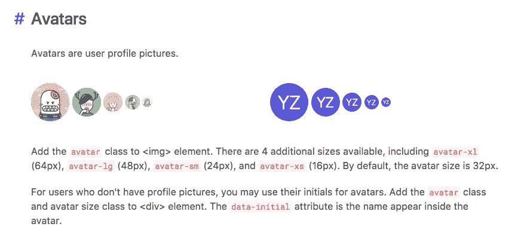
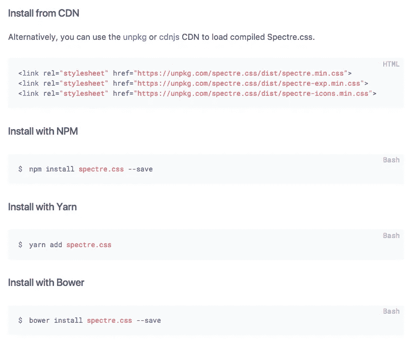
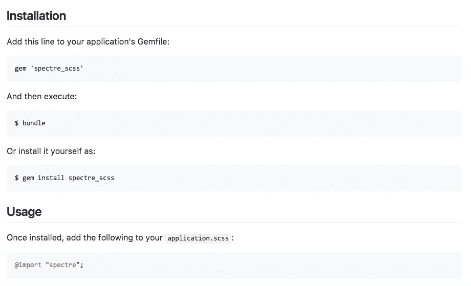
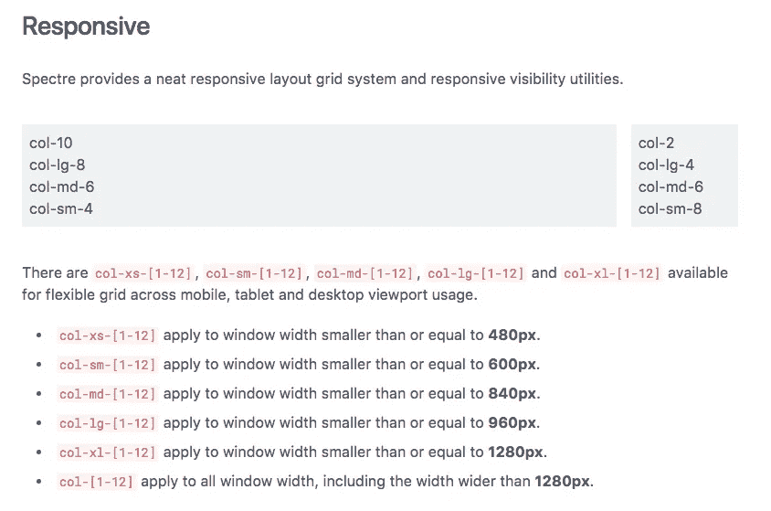
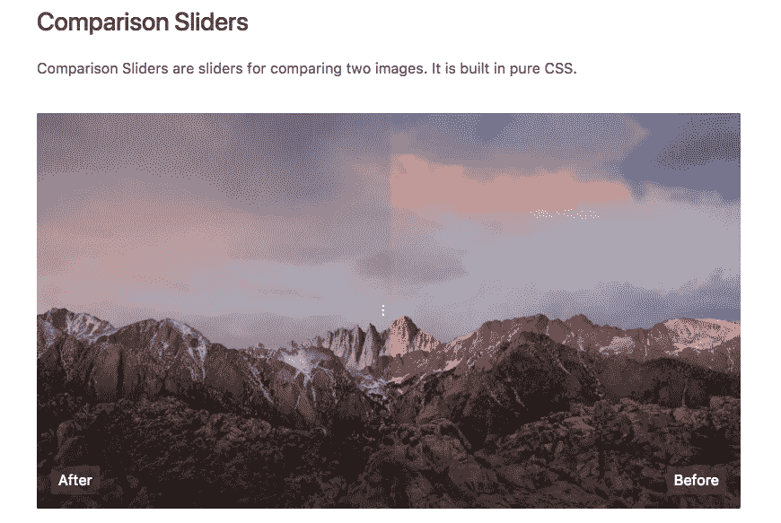

# Spectre:一个很酷的轻量级 CSS 框架

> 原文：<https://medium.com/quick-code/spectre-a-cool-lightweight-css-framework-c54d06a5aa84?source=collection_archive---------1----------------------->

虽然 Bootstrap 可能是最受欢迎的 CSS 框架，并且易于实现，但偶尔扩展并试验不同的 CSS 库/框架也不错，只是为了了解还有什么。

Bootstrap 有很多优点，但最终结果可能是加载时间变慢和电池耗尽，Bootstrap 的 Javascript 需要 jQuery，这是一个不小的依赖项。

这是我偶然发现的 [Spectre](https://picturepan2.github.io/spectre/) ，一个轻量级、易于实现的 CSS 框架(诚然，我偶然发现它更多是被迫的，而不是选择的，因为我在为一家需要 Spectre 的公司做项目……这让我谷歌了一下它到底是什么)。

Spectre 的一些优点:

1.  挺好看的……看看吧；你会明白的。
2.  容易实现。
3.  轻量级:没有 JavaScript(比 Bootstrap 小 100%)，使用较少的 CSS(比 Bootstrap gzipped 小 74%)。
4.  借助 Flexbox，采用现代方法的易用响应式设计。

如何安装:

可以直接下载缩小后的 [Spectre.css](https://github.com/picturepan2/spectre/tree/master/dist) 文件，从 CDN 安装，使用 npm，yarn，或者 bower 安装。

[https://picturepan2.github.io/spectre/getting-started.html#installation](https://picturepan2.github.io/spectre/getting-started.html#installation)

或者你可以用一个超级方便的[宝石](https://github.com/zokioki/spectre_scss)(一个朋友帮我找到了这个)把它添加到 Rails 上:

“There’s a gem for that.”

那么它能做什么呢？Spectre 涵盖了来自 Bootstrap 的所有基本 CSS 期望，如按钮、表单、图标等。它也有自己的响应式布局网格系统，以及 flexbox 网格和 navbar 布局。

它还有一个非常方便的列表，列出了其他很酷、很漂亮(就我而言，这是一个词)的设计组件、实用程序和“实验”，让你使用和实现起来非常容易，比如日历、时间线、比较滑块，所有这些都是由纯 CSS 制成的。

检查一下，尝试一下，让我知道你的想法，你发现的任何其他很酷的特性，或者如果你有任何你喜欢使用的 CSS 框架，比 Bootstrap 更轻便和更少为人知！

请点击👏按钮下面几下，以示支持！⬇⬇

谢谢！别忘了**跟着下面的**快速码。

> 找到关于各种编程语言的[快速代码](http://www.quickcode.co/)的免费课程。获取 [Messenger](https://www.messenger.com/t/1493528657352302) 的新更新。