# Mendix 中的语音转文本自定义 JavaScript 操作

> 原文：<https://medium.com/mendix/speech-to-text-custom-java-action-mendix-522f13d32312?source=collection_archive---------1----------------------->

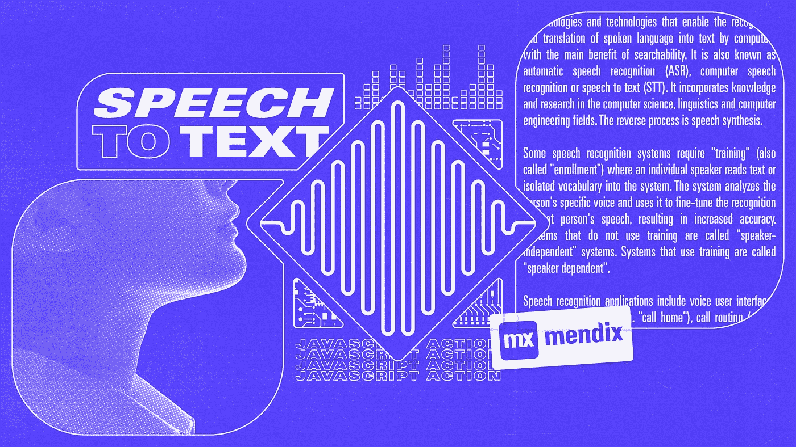

# 语音识别；虽然听起来很吸引人，但也很容易使用 Web Speech API 和 Mendix，通过定制的 JavaScript 操作来开发。

[Web Speech API](https://developer.mozilla.org/en-US/docs/Web/API/Web_Speech_API/Using_the_Web_Speech_API) 文档解释了它的工作原理，“它涉及到通过设备的麦克风接收语音，然后由语音识别服务根据词汇表进行检查，当一个单词或短语被成功识别时，它将作为文本字符串的结果(或结果列表)返回，并因此可以启动进一步的操作。”

我们将允许用户说话，并将在自定义 JavaScript 操作中利用 WebSpeech API 的 SpeechRecognition 对象；将语音转换为文本，并在 Mendix 应用程序的表单中显示该文本。

## **用例**:

让我们让写作变得更有趣、更轻松、更自由。我们将尝试只使用我们的声音和一个使用 Mendix Modeler 版本 8.18.15 的 Mendix 应用程序中的 Web Speech API 的基本实现来编写一个博客


[Voice recognition vector created by pch.vector](https://www.freepik.com/vectors/voice-recognition)

# 要遵循的步骤

**步骤 1** :在领域模型中创建一个名为 **Blog** 的实体，属性为**主题**、**作者**、**内容**。

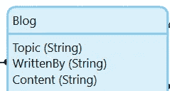

Blog Entity with basic attributes setup

**步骤 2:** 创建一个页面，添加一个新的 Blog 对象并显示 Blog 实体的输入字段。

**步骤 3:** 在数据视图中添加一个按钮，并调用一个 nanoflow，我们将使用它来调用我们的定制 JavaScript 动作。

**步骤 4:** 在博客页面上添加一个来自市场的 [HTML 代码片段部件](https://docs.mendix.com/appstore/widgets/html-javascript-snippet/)

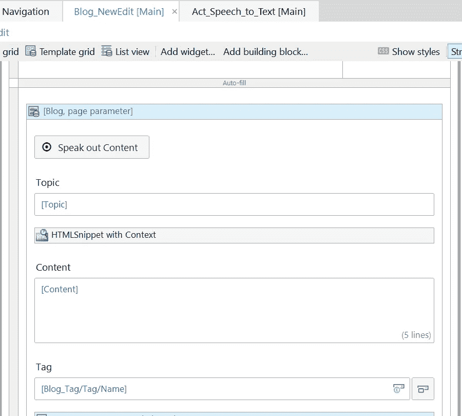

Blog page that covers Steps 2, 3 and 4

如下所示，在 textarea 中添加一个自定义类“content1 ”,该类将用于从我们的 JS 操作中引用该 textarea，如右图所示，我们添加了自定义 HTML 来指示用户在单击“朗读内容”按钮时进行朗读

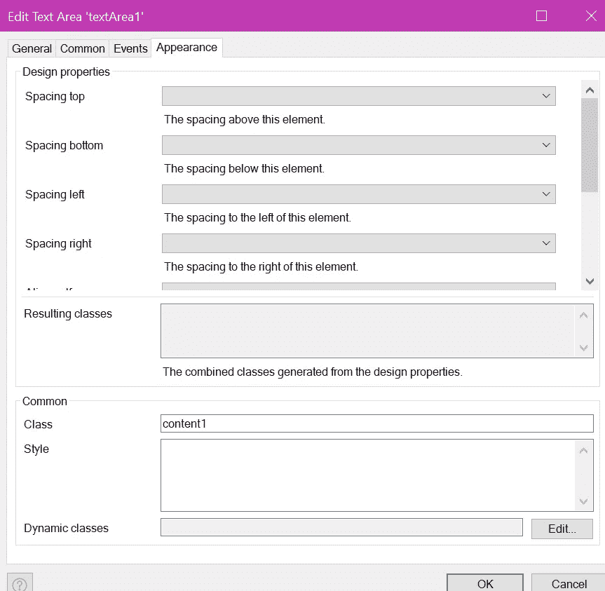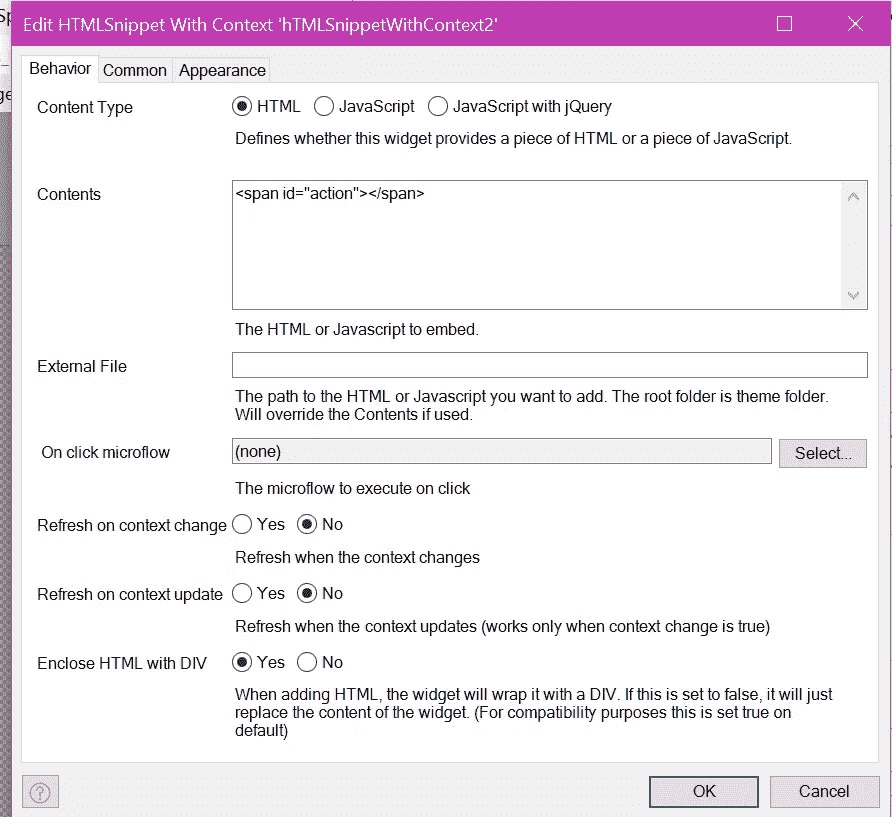

Configure the Blog page fields as shown above

**步骤 5:** 创建一个带有输入参数 Blog 的定制 JavaScript 动作，并在前面步骤中创建的 nanoflow 中调用它

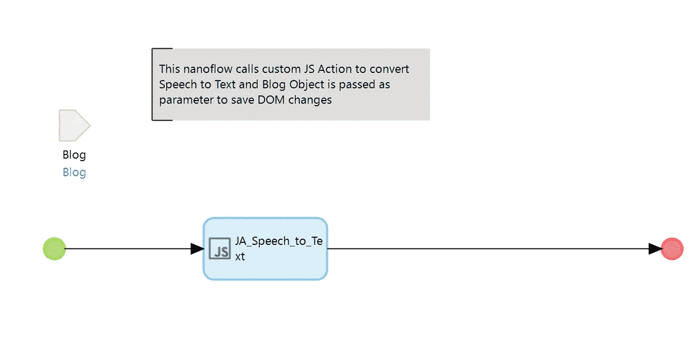

Nanoflow called on ‘Speak out Content’ button

**步骤 6** :打开 JavaScript 动作，导航到 code 选项卡，使用下面提到的 JavaScript 代码

```
//BEGIN EXTRA CODE
   function runSpeechRecognition(blog) {
         //get output div reference
         var output = document.getElementsByClassName("content1")[0].children[1];
         //get action element reference
         var action = document.getElementById("action");
         //new speech recognition object
         var SpeechRecognition = new SpeechRecognition || webkitSpeechRecognition;
         var recognition = new SpeechRecognition();//this runs on start of speech recognition service
         recognition.onstart = function() {
             action.innerHTML = "<p>Please Speak</p>";
         }; recognition.onspeechend = function(){
         action.innerHTML ="<p>stoped listening, press button again to start</p>";
          }
//This will run when speech recognition service returns result
          recognition.onresult = function(event){
             var transcript = event.results[0][0].transcript;
             output.value+=transcript;
           //Used the client API method set(attr, val} to ensure 
           //value gets sent to server when the user clicks save
           blog.set('Content',output.value);
         };
//Start the speechrecognition
        recognition.start();
    }//END EXTRA CODE//BEGIN USER CODE return runSpeechRecognition(blog);//END USER CODE
```

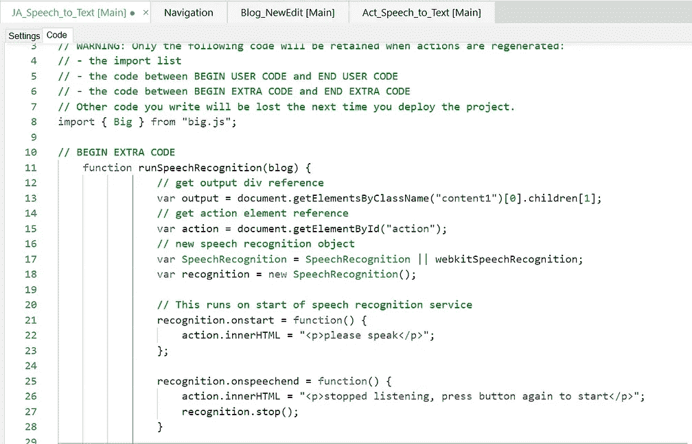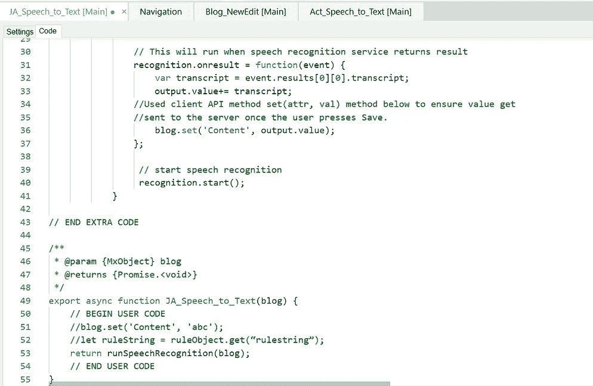

Follow JS action code from left to right

## **代码说明**

在上面的代码中，我们定义了**‘output’变量**来存储我们之前定义的 classname 为“ **Content1** ”的 Textarea 字段的引用。

然后我们定义**‘action’****变量**，它指向我们使用来自 Mendix Marketplace 的 **HTML 片段小部件**添加的 **HTML 内容**。

为了开始这个过程，我们**创建一个语音识别对象**，并且使用“Recognition . start()”**事件处理程序**来启动语音识别，如右边的屏幕截图所示。

一旦语音识别开始， **onstart 事件处理程序**用于**通过我们添加的自定义 HTML 通知用户**语音识别已经开始，**他们应该对着麦克风说话**。当用户结束讲话时， **onspeechend** 会向用户指示**听者已经停止**，我们调用语音识别的 **stop()方法**停止识别过程，在这个阶段 **onresult 事件处理程序**会有结果。

SpeechRecognition **的 result 属性返回一个 SpeechRecognitionResultList 对象**，它包含 SpeechRecognitionResult 对象。它有一个 getter，可以像访问数组一样访问**。第一个 **[0]** 返回最后一个位置的 SpeechRecognitionResult 结果。每个 SpeechRecognitionResult 对象都包含 SpeechRecognitionAlternative 对象，这些对象包含单个结果。这些也有 getters，所以它们可以像数组一样被访问。第二个**【0】**返回位置 **0** 的 SpeechRecognitionAlternative。然后**返回 SpeechRecognitionAlternative 对象的脚本属性**。**

**这个结果被添加到**文本区域的值中**，使用字符串处理将**， **+='** 添加到语句中，以便在每次用户说话时将结果添加到文本区域中

至此，我们已经在表单上显示了文本结果，但是还没有保存。要通过 JavaScript 将它发送到服务器，我们需要使用 Mendix 客户端 API 显式设置上下文对象的值。这就是我们将“Blog”对象作为参数传递给这个 JS 动作的原因。我们使用**客户端 API** 的**set(‘attr’，‘value’)**方法来设置‘Content’属性的值，当用户单击保存按钮时，该值将被传递给服务器。

## 测试一下！

运行应用程序并导航到添加新博客对象的页面，该对象是我们在步骤 1 中创建的。**按下“说出内容”按钮**,它将指示您开始讲话(第一次您的浏览器将请求访问您的麦克风，您必须同意才能继续)

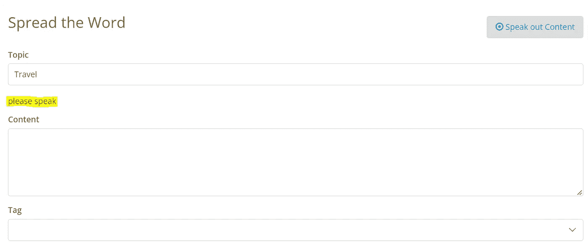

On click of button the custom HTML we added indicates the user to speak

尽情地写吧**讲**你的心声！它将在内容字段中添加文本，如果有任何错误，您也可以手动编辑。

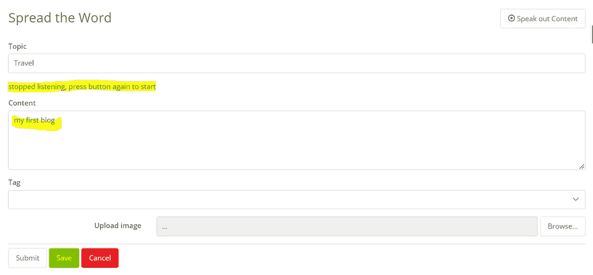

speech content gets added to our textarea we aimed for

你可以随时停止和开始。要添加更多文本，请再次按“朗读”按钮，您的文本将被追加到现有内容中。完成后保存更改。

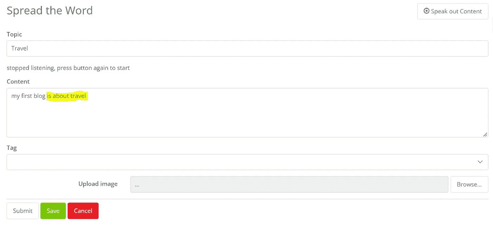

Appended text every time the user speaks

由于 Mendix 客户端 API，您可以看到保存的更改。

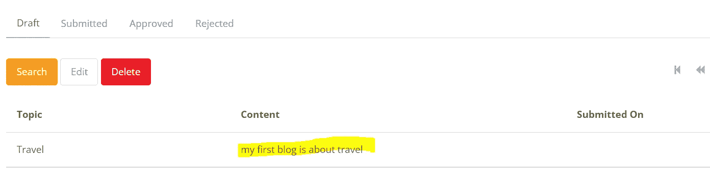

这就是将语音识别与 WebSpeech API、一点 HTML 和一个快速的 JavaScript 操作结合使用是多么简单，您可以通过不再需要手动填写数据来节省大量时间。

用例可以根据需求进一步定制，WebSpeech API 还有更多的功能可以用来即兴实现语音到文本的转换，直到下一次——开始吧！:)

## **阅读更多**

[](https://developer.mozilla.org/en-US/docs/Web/API/Web_Speech_API) [## Web 语音 API-Web API | MDN

### Web Speech API 使 Web 应用程序能够处理语音数据。这个 API 有两个组件:语音识别…

developer.mozilla.org](https://developer.mozilla.org/en-US/docs/Web/API/Web_Speech_API)  [## 主页

### 这是 Mendix 客户端 API 文档。本文档主要是为了帮助开发自定义…

apidocs.rnd.mendix.com](https://apidocs.rnd.mendix.com/8/client/index.html)  [## JavaScript 操作

### 本参考指南详细介绍了 JavaScript 操作扩展 Mendix 应用功能的方式。

docs.mendix.com](https://docs.mendix.com/refguide/javascript-actions/)  [## HTML/JavaScript 代码片段

### 描述 TML/JavaScript 代码片段小部件的配置和用法，该小部件可在 Mendix…

docs.mendix.com](https://docs.mendix.com/appstore/widgets/html-javascript-snippet/) 

*来自发布者-*

如果你喜欢这篇文章，你可以在我们的 [*中页*](https://medium.com/mendix) *找到更多类似的文章。对于精彩的视频和直播会话，您可以前往*[*MxLive*](https://www.mendix.com/live/)*或我们的社区*[*Youtube PAG*](https://www.youtube.com/c/MendixCommunity/community)*e .*

*希望入门的创客，可以注册一个* [*免费账号*](https://signup.mendix.com/link/signup/?source=direct) *，通过我们的* [*学苑*](https://academy.mendix.com/link/home) *获得即时学习。*

有兴趣更多地参与我们的社区吗？加入我们的 [*闲散社区频道*](https://join.slack.com/t/mendixcommunity/shared_invite/zt-hwhwkcxu-~59ywyjqHlUHXmrw5heqpQ) *。*