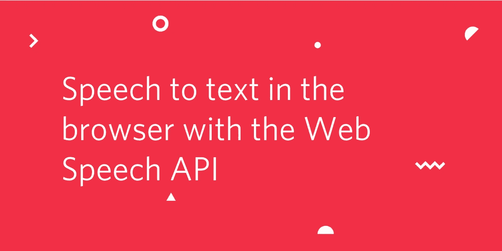

# 使用 Web 语音 API 在浏览器中进行语音到文本转换

> 原文：<https://medium.com/google-developer-experts/speech-to-text-in-the-browser-with-the-web-speech-api-9231aa211c67?source=collection_archive---------3----------------------->

[网络语音 API](https://developer.mozilla.org/en-US/docs/Web/API/Web_Speech_API) 有两个功能，[语音合成](https://developer.mozilla.org/en-US/docs/Web/API/SpeechSynthesis)，也称为文本到语音，以及[语音识别](https://developer.mozilla.org/en-US/docs/Web/API/SpeechRecognition)，或语音到文本。我们[之前研究了文本到语音的转换](https://www.twilio.com/blog/speech-to-text-browser-web-speech-api)，所以让我们来看看浏览器如何使用`SpeechRecognition` API 处理语音识别和转录。

能够接受用户的语音命令意味着您可以创建更加身临其境的…