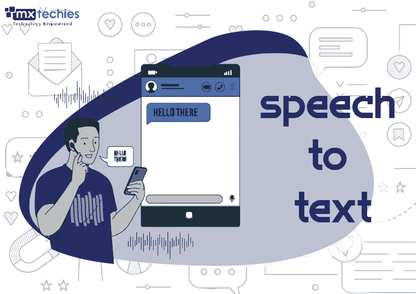
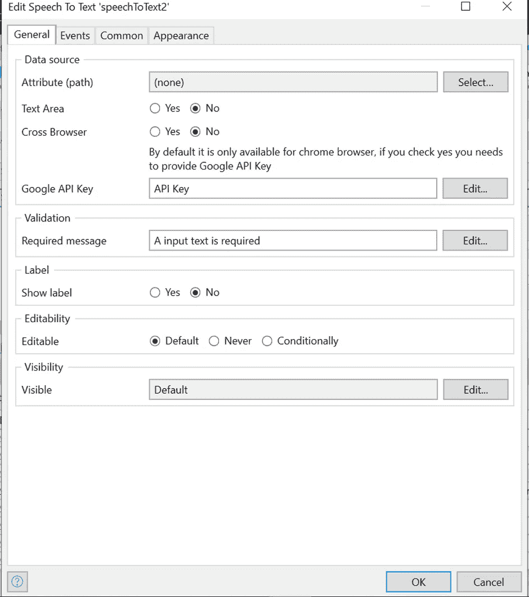
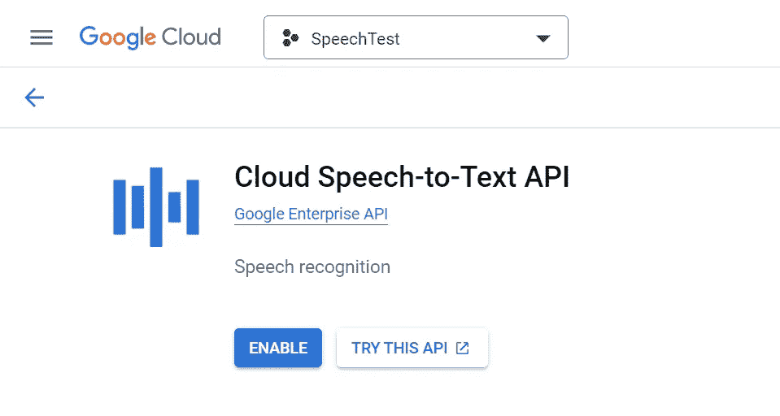

# 语音转文本小工具

> 原文：<https://medium.com/mendix/speech-to-text-widget-ca8ddcc30a61?source=collection_archive---------1----------------------->

## 写作不简单，尤其是每天必须打几千字的时候。打字越多，保持写作的有效性和质量就越困难。

但是当打字变得太累的时候，我就转向对着语音转文本程序说话。除了简单和容易之外，阅读一份文件让你有机会四处走动、躺下或伸展身体，而不会影响你的日常工作效率。事实上，我认为使用谷歌语音发送文本是比打字更好的选择，因为它可以帮助你想到更多原创的想法。

虽然谷歌很棒，也有许多其他语音到文本的提供商，但我决定创建自己的小工具，并将其发布到 Mendix 市场。

# 它是如何工作的

我用 **React 语音识别构建了这个小部件。**这是一个**反应挂钩**，它与**谷歌** **网络语音 API** 一起工作，将来自你设备麦克风的语音翻译成文本。然后，你的 Mendix 应用程序可以读取这些文本，并用于执行任务。

Speech to Text — Mx Techies

您可以在市场上阅读该小工具的完整详细信息:

[https://market place . mendix . com/link/component/202535/MX techies/语音转文本](https://marketplace.mendix.com/link/component/202535/MxTechies/Speech-to-Text)

# 配置小部件

这个小工具使用 SpeechRecognition API，目前**只有 Chrome 浏览器**支持，但是**不需要任何额外的设置或 API 键**，一切都是开箱即用的。

**您可以通过提供一个 API 键**在任何其他浏览器上使用这个小工具。为此，单击 yes 激活跨浏览器选项，然后在 Google API key 字段下方的空白处输入您的 API 密钥。现在任何浏览器都可以使用你的小工具将语音转换成文本。

通过选择文本区选项是/否，**你也可以从文本框变为文本区**。

# 如何获得您的 Google API 密钥

1.  **打开 GCP** 控制台[https://console.cloud.google.com/](https://console.cloud.google.com/)
2.  **选择或创建一个新项目**
3.  搜索“**云语音转文本 API** ”并启用
4.  搜索“**服务帐户**”并创建一个新的服务帐户
5.  **向服务账户**添加密钥，选择 **JSON 格式**，下载并安全**保存密钥文件**

# 结论

我希望这个小工具能让你的 Mendix 应用程序更容易将语音转换成文本。我希望你下载这个小工具并亲自试用，如果你下载了，我很乐意听听你的想法。请在评论中告诉我，或者请在市场页面上留下评论。

## 阅读更多

 [## Mendix 中的语音转文本自定义 JavaScript 操作

### 语音识别；听起来很吸引人，令人印象深刻，但也可以用定制的 JavaScript 简单开发…

medium.com](/mendix/speech-to-text-custom-java-action-mendix-522f13d32312)  [## 反应语音识别

### 一个 React 挂钩，将来自麦克风的语音转换为文本，并使其可用于您的 React 组件…

www.npmjs.com](https://www.npmjs.com/package/react-speech-recognition)  [## 使用语音转文本构建自动化聊天机器人——低代码实时构建

### 欢迎参加 Mendix World:2.0 版的下一次实时构建网络研讨会。这一次，瑞安·莫克和简·德弗里斯建立了一个…

video.mendix.com](https://video.mendix.com/watch/54J9PFfd9x5ZMfpnr12BUY) 

*来自发布者-*

*如果你喜欢这篇文章，你可以在我们的* [*中页*](https://medium.com/mendix) *找到更多喜欢的。对于精彩的视频和直播会话，您可以前往*[*MxLive*](https://www.mendix.com/live/)*或我们的社区*[*Youtube PAG*](https://www.youtube.com/c/MendixCommunity/community)*e .*

*希望入门的创客，可以注册一个* [*免费账号*](https://signup.mendix.com/link/signup/?source=direct) *，通过我们的* [*学苑*](https://academy.mendix.com/link/home) *获得即时学习。*

有兴趣加入我们的社区吗？加入我们的 [*松弛社区频道*](https://join.slack.com/t/mendixcommunity/shared_invite/zt-hwhwkcxu-~59ywyjqHlUHXmrw5heqpQ) *。*