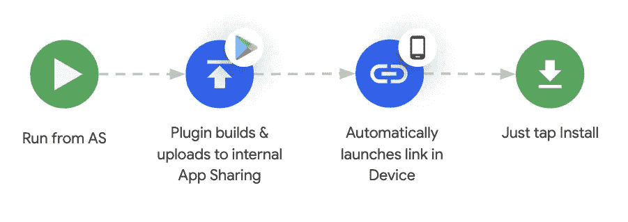
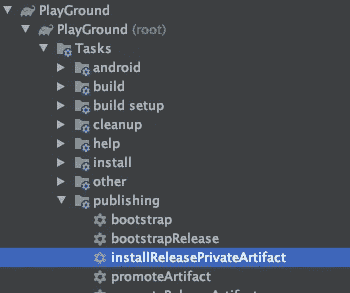

# 加速您的 Android 动态特性流测试

> 原文：<https://medium.com/androiddevelopers/speed-up-your-android-dynamic-features-flow-testing-d63986cd716a?source=collection_archive---------5----------------------->

## 使用 Gradle Play Publisher 插件


越来越多的 Android 应用程序正在将[动态功能](https://developer.android.com/studio/projects/dynamic-delivery)集成到他们的项目中，尽管你需要 Play Store 来提供这些功能，这使得测试真实的用户流变得很困难(即用户在点击某个地方后打开应用程序并安装一个模块)。

Android Studio 提供了一种在运行应用程序时选择包括哪些动态功能的方法，尽管它没有提供从 Play 测试动态功能模块安装的方法。

幸运的是，我们有 [Play 内部应用程序共享](https://play.google.com/apps/publish/internalappsharing/)，它允许开发者上传应用程序的版本，并快速轻松地与他人共享以供测试。

这意味着，要测试完整的流程，我们必须:构建一个捆绑包，上传到 Play Console 内部 app 共享，复制上传链接，在一个设备上打开，然后安装 App 试用。

# 有更好的方法。

有了新版本的 [Gradle Play Publisher](https://github.com/Triple-T/gradle-play-publisher) ，我们可以在一次点击/命令中实现上述流程的自动化。



# 怎么会？

首先，设置 Gradle Play Publisher:

1.  使用 [Google Play 控制台](https://play.google.com/apps/publish)上传您的应用包的第一个版本
2.  [创建 Google Play 服务帐户](https://github.com/Triple-T/gradle-play-publisher#service-account)
3.  [授权访问您的游戏控制台](https://play.google.com/apps/publish#ApiAccessPlace) **(只有帐户所有者可以这样做)**
4.  [使用有效的签名配置签署您的发布版本](https://developer.android.com/studio/publish/app-signing#gradle-sign)(发布版本所必需的)

接下来，[将插件](https://github.com/Triple-T/gradle-play-publisher#installation)添加并应用到根和基础/应用模块 build.gradle:

**build.gradle →**

```
repositories **{** google()
    jcenter()
    maven **{** url "https://plugins.gradle.org/m2/" **}
}** dependencies **{
    ...** classpath "com.github.triplet.gradle:play-publisher:2.6.1"
}
```

**app/build.gradle →**

```
apply plugin: 'com.github.triplet.play'/* ... */play {
   serviceAccountCredentials = file("service-account-key.json")
   defaultToAppBundles = true
}
```

**service account credentials**应该指向 Json 文件，该文件包含您在[步骤 2](https://github.com/Triple-T/gradle-play-publisher#service-account) 中设置的服务帐户的密钥。

**defaultToAppBundles** 设置这个标志为真，告诉插件默认创建应用包(动态特性需要)

就是这样。可以从控制台或者直接从 Android Studio 运行***【installReleasePrivateArtifact】***(从 *app >发布*下的 Gradle tasks 中选择)。



这些任务将构建一个应用捆绑包，将其上传到 Play 内部应用共享，并启动 Play Store 内部应用共享页面，将所有**连接的设备指向新上传的版本。**

你仍然需要手动点击更新按钮并启动应用程序。

# 使用调试或其他变体版本

还没有上传调试或其他变体版本的任务 [(#619](https://github.com/Triple-T/gradle-play-publisher/issues/619) )，因此如果你想使用调试或任何其他变体版本，你必须稍微不同地配置插件。

您必须设置 ***artifactDir*** 并使任务依赖于 *bundle${Variant}* 任务。

```
play **{** serviceAccountCredentials = file(“service-account-key.json”)
    defaultToAppBundles = true // Defines the path to Debug bundles
    artifactDir = file(“build/outputs/bundle/debug”)
**}**afterEvaluate **{** tasks.named(“uploadReleasePrivateBundle”).configure **{** dependsOn(“bundleDebug”)
    **}
}**
```

使用此设置，当运行***" installReleasePrivateArtifact "***时，它将始终使用调试变量。

# 演示

在下面的视频中，你可以看到它的工作。我们启动任务，因为自上次上传以来没有任何变化(为了缩短视频)，插件会自动启动最后一个内部应用程序共享 URL 到连接的设备。

希望你喜欢阅读。更多信息，你可以在 twitter @ marxallski 关注我

[](https://twitter.com/marxallski) [## 🇸🇬的马塞尔

### 来自🇸🇬的 Marcel 的最新推文(@ marxallski)。开发商代言人🥑给这个绿色的小机器人🤖在@Google…

twitter.com](https://twitter.com/marxallski)