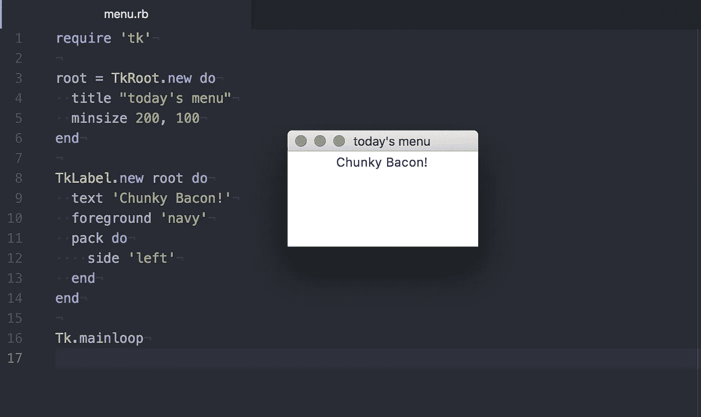
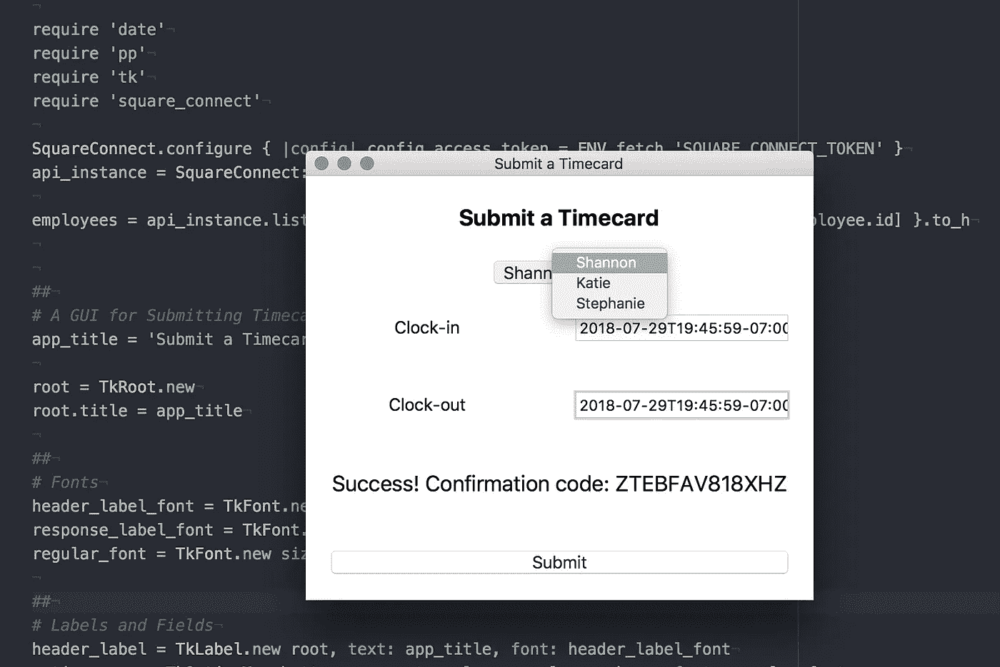

# 推出一个 GUI 员工时钟

> 原文：<https://medium.com/square-corner-blog/spiking-out-a-gui-employee-time-clock-914a50e465b6?source=collection_archive---------4----------------------->

## 使用 Square 的 Ruby SDK 支持的 Tk


> 注意，我们已经行动了！如果您想继续了解 Square 的最新技术内容，请访问我们在 https://developer.squareup.com/blog[的新家](https://developer.squareup.com/blog)

随着小公司变得越来越大，他们有时会决定开始使用时钟来跟踪员工的工作时间。利益相关者经常要求工程部门提供易于使用的解决方案。作为 ruby 爱好者，我们通常创建命令行应用或 web 应用，但有时我们会被要求为移动或桌面开发一些东西。下面我将用 [Ruby](https://www.ruby-lang.org/en/) 和 [Tk 图形用户界面工具包](https://www.tcl.tk/)启动一个桌面 GUI 员工时钟应用程序，由 [Square 的 API](https://docs.connect.squareup.com/) 支持，以跟踪细节。


# 首先安装 Ruby 和一些 Gems

我将在 macOS 上展示这些例子，所以我们将使用 use [brew](https://brew.sh/) 首先安装最新版本的 Ruby。(如果你已经安装了 Ruby，跳过这一步。)

```
brew install ruby
```

Tk 之前与 Ruby 一起发布，但随着 2016 年 Ruby 2.4 的发布，它被切割成宝石，并从标准库中删除。所以首先我们需要安装 Tk 和 Square SDK gems。

```
gem install tk && gem install square_connect
```

接下来，我们可以使用 Ruby 附带的 IRB REPL 来检查 SDK 中的当前员工，并确保到目前为止一切正常。


为了能够看到我们的员工，此时我们需要一个 API 令牌。为了获得令牌，[注册一个 Square 开发者账户](https://squareup.com/signup)。出于这些示例的目的，将您的 API 令牌设置为您将要使用的终端上的环境变量。

```
export SQUARE_CONNECT_TOKEN="*YOUR ACCESS TOKEN HERE*"
```

现在，您可以使用 irb 来检查是否还没有任何雇员。首先在命令行中键入`irb`,然后在 IRB 终端中输入以下代码。

接下来，我们可以[在您的浏览器](https://squareup.com/dashboard/employees/permissions/employees/new)中创建一个员工，并重新运行`list_employees`以查看在 REPL 新创建的员工。

```
api_instance.list_employees
#=> [#<SquareConnect::V1Employee:...>]
```

好了，SDK 起作用了！让我们继续讨论 GUI 应用程序。

# 推出一个 Tk GUI 应用程序

我喜欢命令行应用程序。如果你所有的员工都是工程师，也许你可以做一个命令行员工考勤卡应用程序。今天，我们用 Tk 来启动一个图形界面 app。Ruby Tk gem 包装了这个工具包，并用 Ruby 为我们提供了一个很好的 DSL。

这是我第一次使用 Tk，所以让我们尽可能地看一些例子。首先，让我们创建一个 Hello World 类型的小应用程序，向我们显示今天的菜单。我们只需要两个 Tk 类来开始，`TkRoot`和`TkLabel`。

那还不算太糟！现在我们有了一个小窗口。如果我们将这个代码片段保存在一个名为`menu.rb`的文件中，我们可以用`ruby menu.rb`从命令行运行它。



让我们继续，尝试将 GUI 与我们的员工时间表 SDK 集成。

首先，我们需要来自 Ruby 标准库以及 Tk 和 Square SDK gems 的日期和漂亮的印刷字体。

```
require 'date'
require 'pp'
require 'tk'
require 'square_connect'
```

然后，我们准备获取员工列表，并提取我们关心的部分——员工姓名和 id。

接下来，我们有一些应用程序范围的设置，如标题和字体。

此时，我们已经准备好定义将在界面中显示的标签和字段。

样板文件到此为止。现在我们来了解一下应用程序的核心——当你按下“提交”按钮时发生的一切。

上面的代码从相关的输入字段获取值，然后使用 Square 的 API 创建一个时间卡。

最后，我们需要为我们的窗口选择一个布局。我选择了网格，因为这似乎是最简单的开始。

好吧，这是一个很大的 Tk DSL…但它的工作！我们可以将[代码](https://gist.github.com/havenwood/329523c98faea3c9eb8ac9652b1b05f8)保存为`time_card.rb`，当我们用`ruby time_card.rb`运行它时，GUI 应用程序就会出现。



现在我们有了一个工作的 GUI 应用程序，让我们添加一个 shebang，使文件可执行并删除`.rb`扩展名，这样它就可以直接运行了。首先，将以下代码添加到`time_card.rb`文件的第一行。

```
#!/usr/bin/env ruby
```

接下来，让我们重命名该文件以删除`.rb`扩展名，并使其可执行。

```
mv time_card.rb time_card
chmod +x time_card
```

现在我们可以直接从控制台运行我们的应用程序。

`./time_card`

我们现在准备在我们非常基本的 GUI 应用程序中添加一个图标！添加图标的步骤是依赖于平台的，所以我把它留给读者做练习。

# 结论

这个界面离完美还很远，但是我很满意它作为用 Tk 创建 GUI 的一部分。使用 Tk 给我的第一印象是，对于简单的项目来说，它相当容易使用。我期待尝试更复杂的东西。接下来，添加一个更好的日期选择器和更多的功能会很有趣，比如添加员工和管理考勤卡。

如果你是一个 Rubyist，但对你的想象力来说这是太多的样板了，你可能会想考虑用[鞋](http://shoesrb.com/)作为 Tk 的替代品。Shoes 是由 _why 创建的，作为一种用 Ruby 制作 GUI 的超级简单的方法。如今，Ruby 有各种各样的鞋子，但[的鞋子](https://github.com/shoes/shoes4#shoes-4-)是一双很好的现代鞋，可以搭配[的 JRuby](http://jruby.org/) 。

*我们在 Square 使用 Ruby 做很多事情——包括我们的*[*Square Connect Ruby SDK*](https://github.com/square/connect-ruby-sdk#readme)*和* [*开源 Ruby 项目*](https://github.com/square?language=ruby) *。我们热切期待 Ruby 2.6 的发布！*


The Ruby logo is Copyright © 2006, Yukihiro Matsumoto, distributed under [CC BY-SA 2.5](https://creativecommons.org/licenses/by-sa/2.5).

想要更多吗？ [*注册*](https://www.workwithsquare.com/developer-newsletter.html?channel=Online%20Social&sqmethod=Blog) *为你的每月开发者简讯或* [*顺道拜访*](https://squ.re/2Hks3YE) *方 dev Slack 频道并说声“嗨！”*