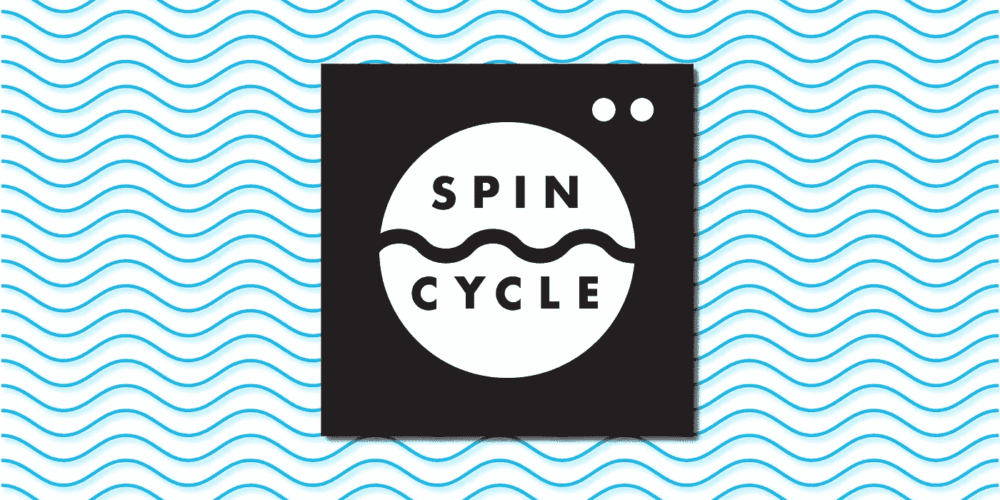

# 旋转周期—自动化繁琐的工作

> 原文：<https://medium.com/square-corner-blog/spin-cycle-automating-the-tedious-3f569106fd3c?source=collection_archive---------1----------------------->

## 自动化一切的编排框架

> 注意，我们已经行动了！如果您想继续了解 Square 的最新技术内容，请访问我们的新家[https://developer.squareup.com/blog](https://developer.squareup.com/blog)

Spin Cycle 使复杂的基础设施任务自动化变得容易。Square 的数据库团队将它用于我们的大多数日常操作——配置新集群和淘汰旧集群、升级 MySQL 和 Docker、停止和启动数据库主机等等。我们已经开发和使用 Spin Cycle 两年多了，今天我们很高兴地宣布它正式发布。

# 脚本不可伸缩

在 Spin Cycle 之前，Square 的数据库是手工管理的。这是可行的，但并不理想。例如，我们有一个脚本来提供一个新的数据库集群。这个脚本已经使用了几年，并且在很大程度上达到了它的目的。最初编写它的工程师设计得非常好——它是一个完全成熟的程序，有函数、类和单元测试。

当其他工程师需要更新该脚本时，它就成了一个问题。在不熟悉所有代码的情况下，很难添加新的测试，因此不可避免地会产生大量未测试的变更。当脚本崩溃时，很难修复，甚至更难确保您的修复没有破坏任何未测试的部分。这个脚本很慢，串行运行它的步骤而不是并发运行，因为这样更容易开发和调试。随着时间的推移，一个重要的业务流程嵌入了这个混乱的代码球。配置新数据库不再是一系列有序的步骤。

即使我们的脚本是完美的——测试每一个新的变化，每一个步骤完全封装——我们也会有问题。为了供应 10 个数据库，您必须在 10 个窗口中运行该脚本 10 次——希望错误不会被淹没。您看不到其他人传入的参数和他们得到的输出，更不用说查看过去的运行了。一个人运行这个脚本会失败，另一个人运行它会成功——但是他们真的传递相同的参数，在相同的环境中运行相同的版本吗？结果不可重复，因为实际上不可能确保所有的起始条件都相同。

脚本不可伸缩。它们很难维护和协作。它们批量运行是一种痛苦。它们不能用于服务到服务的自动化，也不能向无法访问运行它们的主机的工程师公开功能。我们需要一种新的方法来自动化我们的数据库管理任务，而 Spin Cycle 就是我们的解决方案。

# 规格和旋转

在 Spin Cycle 中，这些脚本被请求取代，每个请求由一系列作业组成。每个任务都很小，只做一件事(想想关闭主机，或者启动 MySQL 实例)，但是当按顺序执行时，它们会完成一项大任务。

作业是由你提供的，用 Go 编写，实现一个小的、定义良好的接口——一个作业可以做任何你可以编码它去做的事情。在 YAML，请求是用简单的语法来描述的。一旦你给了 Spin Cycle 它的工作和请求，它就准备好了。

# 不仅仅是另一个作业调度程序

旋转周期有很多优点:

## 没有黑暗角落

端到端状态功能是 Spin Cycle 的一个重要组成部分。您可以看到正在运行的请求中每个作业的实时状态。而且，您可以在任何时候回顾一个请求，并准确地告诉它运行时发生了什么，因为 Spin Cycle 为每个已完成的作业保存一个日志条目。

## 可重复使用的作业

当开始使用 Spin Cycle 时，您将从头开始编写新请求中的所有作业。这可能是一个很大的前期承诺，尤其是如果您已经有了一个做同样事情的脚本。然而，当您将来编写新的请求时，您将能够重用您已经编写的所有作业——不需要复制粘贴。这使得以后创建更多的请求更快，并且很容易使所有请求保持最新。这也是为什么让作业成为不同的工作单元很重要——你可以重用一个让 MySQL 成为只读的作业，但是重用一个让它成为只读的，并且一下子断开所有客户端并关闭它的作业就比较困难了。

## 运行时的请求

Spin Cycle 在您运行它时，而不是在您编写它时，将请求解析成它的实际作业序列。可以根据运行时的条件改变请求中的作业，所以您可以提前编写一个请求，而不需要知道如何使用它的所有细节。对我们来说，这意味着编写一个可以升级任何 MySQL 集群的请求，而不管集群中有多少节点。

## 完全由 API 驱动

Spin Cycle 被设计为更大的自动化系统的一部分，因此它与其他服务配合得很好。一切都是通过 API 完成的——启动和停止请求、检查进度、查看日志。甚至 CLI 实际上也只是 API 客户端的包装。这意味着很容易启动一个新的请求或检查一个从其他代码运行的请求的状态。

## 高度可用+可扩展

当 Spin Cycle 关闭时，它会自动将正在进行的请求移动到其他实例。这意味着您可以在不停机的情况下升级版本和部署新的作业和请求，并根据需要添加和删除旋转周期实例，以扩展您的请求容量。

# 开始吧！

如果你有想要自动化的东西，查看[脱水循环文档](https://square.github.io/spincycle/)以获得关于它如何工作的更详细的概述。我们已经在 [Github repo](https://github.com/square/spincycle) 中提供了现成的 Docker 容器，因此您可以在一个开发环境中使用一个命令来测试 Spin Cycle，这个命令就是[到这里获取指令](https://square.github.io/spincycle/v1.0/develop/dev-env.html)。