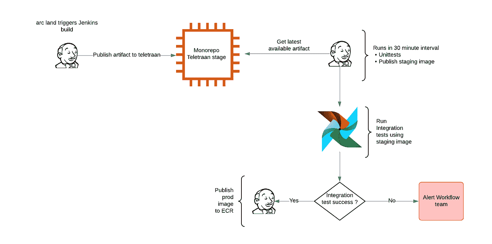

# Spinner:向 Pinterest 新工作流平台的大规模迁移

> 原文：<https://medium.com/pinterest-engineering/spinner-the-mass-migration-to-pinterests-new-workflow-platform-997d9243f56a?source=collection_archive---------1----------------------->

Ace Haidrey |软件工程师，工作流；Ashim Shrestha |现场可靠性工程师，工作流程；鼎航宇|软件工程师，工作流；Euccas Chen |软件工程师，工作流程；Evan Li |工程经理，工作流程；Hannah Chen |产品经理，工作流程；雷宇李|软件工程师，工作流程

*本文转贴自作者原账号* [*此处*](/@acehaidrey/spinner-the-mass-migration-1d4ee601215c) *。*

在我们的[上一篇博文](/pinterest-engineering/spinner-pinterests-workflow-platform-c5bbe190ba5)中，我们讨论了我们是如何做出决策并采取行动从我们的遗留系统 [Pinball](/@Pinterest_Engineering/pinball-building-workflow-management-88a044c9b9e3) 迁移到我们的新系统 Spinner 的，该系统构建在 Apache Airflow 项目之上。作为一个提醒，这是基于一个自定义分支，从气流版本 1.10 分支-稳定与一些功能樱桃采摘来的主分支。

在本帖中，我们将解释我们如何处理和设计迁移，确定需求，并与我们所有的工程师团队协调，以无缝地将 3000 多个工作流迁移到 Airflow。我们将深入探讨所做的权衡，但在此之前，我们想给出我们的经验。

按照我们的标准，成功迁移过程的关键是:

*   了解并填补我们之前拥有的气流和内部工作流程系统之间的差距。我们确定功能差距、安全性差异和用户熟悉的术语。
*   提供迁移工具，以低成本的方式同时大规模迁移多个工作流，并提供验证方法。
*   拥有清晰、持续的用户沟通和入职材料，如维基、培训课程、积极的用户支持和公告。
*   启用无状态 UI 调度程序分区，并启用 kubernetes 集成来提供定制的和可伸缩的解决方案。
*   拥有清晰的 CI/CD 管道，使系统一致、可靠、高效地维护多个基础设施分支。
*   严格测试——单元测试和与试运行环境的集成测试，以防止重大变更，并采取谨慎的部署方法。
*   维护运行状况检查和综合指标，并在负载增加时发出警报进行微调。

需要避免的最大问题包括:

*   确保计划在迁移前后保持一致。由于定义调度程序的方式不同，以前系统和 Spinner 系统的调度间隔并不总是一致的(旧系统并不完全基于 cron)。因此，要防止漏运行和超运行。
*   为每个任务提供内存设置等资源，以防止任务在启动前失败。
*   Kubernetes 吊舱预热费用不是我们预期的。pod 启动延迟确实有一个非平凡的成本，对于您的团队用例来说，这个成本总体上是可以接受的。
*   Kubernetes pod 冗余侧车会增加网络问题的延迟，并会增加工作流的计划延迟。
*   对用户教育和支持的投资可能很高。
*   维护旧 DSL 和新气流 DSL 的混合解决方案增加的成本开销并不常见。

现在，让我们探索是什么帮助我们应对这些挑战。

# 方法和要求

我们的平台将我们的迁移要求定义为:

1.  只需对用户代码进行最少的更改
2.  迁移时生产工作流的不间断执行
3.  为遗留系统设置折旧日期并完成折旧

有鉴于此，我们可以通过两种主要方式进行迁移:

1.  请求工作流所有者在气流 DSL 中重写他们的旧工作流，并在此过渡过程中为他们提供支持
2.  平台提供了直接进行 DSL 翻译的工具

有了方法 1，它将减少我们和用户的技术债务，并且平台将不必维护额外的基础设施，但是由于所有定制的用户逻辑和依赖都被放入传统的弹球任务中，因此存在一些重大挑战。即使没有这些挑战，我们也没有得到客户的认可，因为每个团队的成本都是太多的工程时间。最后，这可能会推迟对遗留系统的折旧，因为我们需要依赖我们的客户来完成工作，这使得它不可行。

因此，我们的方法更接近于方法 2 —我们在气流调度器中构建了一个迁移层，在动态分析 dag 文件的过程中，它将传统工作流系统中的工作流定义转换为气流有向无环图(DAG)。这意味着将不会有用户代码的改变，用户的参与将会最小化，为用户提供透明的迁移体验。遗留工作流中的每个作业都被转换为一种包装运算符类型，这种类型是专门为支持工作流迁移用例而实现的。在执行过程中，操作员启动一个新的 k8s pod，使用遗留系统的映像启动遗留作业的实际逻辑。这样，我们可以为翻译的任务模仿遗留系统的执行环境。

## 迁移层

重申一下，这个项目的目标是用最少的用户努力来促进透明的工作流迁移。通过下面的图表，我们展示了便于调度迁移的工作流的端到端经验，我们将更深入地研究各个组件。


*Pinterest migration schedulers and components side by side to a native scheduler and its components.*

左侧组件是 Pinterest 迁移计划程序。这是建立在原生气流调度器之上的，利用了我们之前编写的多分区调度器。

## **Pinterest tdagbag**

当调度程序在迁移模式下启动时，它使用一个名为 PinterestdagBag 的自定义 DagBag 类来解析来自**迁移元数据文件**的 Dag，而不是来自 python dag 文件的 Dag。为了更好地理解这一点，我们需要描述一下之前的系统[弹球](/@Pinterest_Engineering/pinball-building-workflow-management-88a044c9b9e3)是如何工作的。

弹球有一个令牌的概念:当弹球工作流准备运行时，弹球工作流解析器将把工作流定义翻译成令牌，令牌存储所有需要的运行时信息。PinterestDagBag 从遗留系统的工作流解析器中检索工作流定义(也称为令牌),该解析器位于一个名为令牌获取器的容器中。然后，它将传统工作流定义转换为本地气流 Dag 和运行中的任务(即操作员或传感器)。

这种不需要 dag 文件的抽象和转换实际上非常简单。dag 文件本质上只是一个或多个 Dag 的标识符。对于 native airflow，dag 文件碰巧带有工作流定义，但是完全可以以不直接包含工作流定义而是指向定义所在的源的方式来构成 dag 文件。我们编写一个“dag 文件”,表示遗留工作流定义所在的位置，并确保自定义 PinterestdagBag 模块能够解析其中的 Dag 对象。示例迁移元数据文件如下所示:

```
{
    “cluster_name”: “core001”,
    “workflow_name”: “test_workflow”,
    “migration_date”: “2020–01–01 00:00:00”
}
```

元数据是在工作流的迁移启动时生成的(我们将在后面详细描述)，并且调度程序可以发现它。每个迁移元数据文件表示如何在令牌获取器容器的帮助下定位遗留工作流的定义，这将在下一节中讨论。

## 令牌提取器

一旦迁移调度程序发现了元数据，令牌获取器容器就开始发挥作用。令牌获取器容器托管遗留系统的解析器，并与迁移调度程序一起运行。它公开 API 来检索遗留工作流的规范以及解析作业。传统工作流中的每个作业都被解析为一个作业令牌数据结构，该结构包含规范，最重要的是包含作业执行命令，如下所示:

```
python data_job_runner.py — job_full_class=reporter.examples.ExampleSparkJob — executor=prod_011 — job_args=”end_date=2021–12–30"
```

通过这个令牌获取器容器，PinterestDagBag 模块可以调用相应的 API 来根据迁移元数据文件检索工作流规范和作业令牌。


*Diagram shows the interactions between components parsing a migrated file.*

## 插接板 on k8s 操作员

在研究这个特殊的操作符之前，我们想回顾一下什么是插接板。如果你读了我们的第一篇博文，你会记得它是 Pinterest 上包含 python 代码的 monorepository。在以前的系统中，所有的工作流和作业都是在这个项目中定义的。

一旦我们有了来自令牌的数据，我们就使用一个定制的操作符来包装遗留的作业令牌抽象，它是 PinboardOnK8sOperator。每个作业令牌都被转换成该操作符的一个实例，该实例存储来自检索到的令牌的执行命令。在其执行过程中，它启动一个 k8s pod 来执行命令，以模拟遗留系统的作业执行环境。这也防止了对 Airflow 运行时环境的任何干扰。

来自 Airflow 的序列化 dag 功能用于序列化转换后的 dag 和任务，这将有助于减少 dag 解析开销。当工作流的序列化 dag 不存在时，PinterestDagBag 只调用令牌获取器来检索作业令牌并进行翻译。此外，当要计划迁移的 dag 的 dagrun 时，dagFileProcessor 会再次调用令牌提取器来检索最新的作业令牌并刷新序列化的 Dag。这个序列化的 dag 也用于 UI 呈现，所以不需要与 web 服务器一起启动令牌获取器容器。此外，由于执行 PinboardOnK8sOperator 所需的属性都是可序列化的，所以我们在执行迁移的任务时也使用了序列化的 dag 特性。

## 迁移工具

为了简化工作流迁移过程，我们为用户构建了一个 UI 工具，用于将他们现有的工作流迁移到 Airflow。只需几次点击，就可以从旧系统中取消工作流计划，并在新的 Spinner 集群上进行计划。一旦工作流被迁移，它的迁移元数据文件将被上传到 s3，并且可以被我们的迁移调度程序发现。该工具还支持迁移回遗留系统、高级迁移报告以及帮助用户管理其迁移记录的管理员角色。

我们还将迁移 API 暴露给其他系统的下游服务，这些服务利用以编程方式创建的工作流。


*UI of the migration tool that prepares migrated workflows to run on Spinner clusters.*


*Migration tool UI to show different stages of migration.*

这个工具减轻了用户的负担，因为迁移工作流的活动时间是几分钟，而不是我们要求用户重写代码的几个小时。用户进入 UI，选择他们的工作流，安排它在 Spinner 中运行，验证输出是有效的(这是一个手工步骤)，最后通过关闭迁移记录结束。这个工具是平台和用户的一个重大胜利——没有它，我们不可能在一年内完成迁移。

## 动态 Dag

气流中缺少但我们的迁移需要的一个主要功能是动态 Dag。这是为了支持动态生成 dag 布局的用例，并且可能因调度程序处理而异。例如，如果 dag 布局是基于某些外部服务或数据的状态生成的，则从 dag 文件加载的布局可能会有所不同，并且取决于分析 dag 文件的时间。期望在计划新的 dagRun 时确定 Dag 的布局。计算出的布局将被保存，并且这个 dagRun 的执行将坚持保存的 Dag 布局。工作人员可以从此保存的布局加载任务，并且不需要再次进行 dag 解析，这可能会导致不同的 dag 布局。

此功能不受“现成气流”的支持，对于本机实现，当工作人员尝试从 dagrun 执行任务时，会出现上述的潜在问题，但它从 dag 文件中检索的 dag 布局与创建 dagrun 时的布局不同。在这种情况下，工作人员无法从 dag 获取特定任务。

我们在气流的基础上构建了这个特性，并在此基础上设计了一种称为 DynamicDAG 的新型 dag。DynamicDAG 公开了一个 compute_layout 方法。任务实例化逻辑封装在 compute_layout 方法中，而不是在 dag 文件的顶层定义任务。此方法仅在创建新的 dagRun 以在给定时间生成 Dag 布局时调用。此布局快照将被保存并绑定到此 dagRun，因此当需要来自特定 dagrun 的任务时，系统将能够从保存的 dag 布局中检索它，而不是从 Dag 文件中加载它。下面的代码片段显示了如何使用 dynamic dag 接口编写动态 dag。

```
dag = DynamicDAG(
dag_id=”dynamic_test”,
compute_layout=compute_layout,
skip_early_layout_compute=True,….)def compute_layout(dynamic_dag: DynamicDAG, execution_date: datetime = None, dagrun_conf: dict = None) -> None:*“””**Compute layout for dynamic DAG**“””*# Use random intrand_int = random.randint(1, 3)for i in range(rand_int):python_task_1 = dynamic_dag.add_task_into_dynamic_dag(operator_class=PythonOperator,task_id=f’python_task_{i}’,python_callable=python_callable,op_kwargs={‘task_id’: f’python_task_{i}’,‘execution_date’: execution_date})python_task_2 = dynamic_dag.add_task_into_dynamic_dag(operator_class=PythonOperator,task_id=f’python_task_{i}_v2',python_callable=python_callable,op_kwargs={‘task_id’: f’python_task_{i}’,‘execution_date’: execution_date})python_task_1 >> python_task_2
```

请注意，虽然我们创建这个类是为了帮助迁移，但它也适用于本机工作流，它可以将这个类用于业务逻辑。

我们修改了气流中的主要组件，如调度器、网络服务器和执行器处理，以支持 dag 版本控制功能，下面的流程图将显示有/无 dag 版本控制功能时调度器处理逻辑的差异。在新设计中，调度程序模块有两个主要变化:

1.  dag 布局将在 dagrun 创建期间重新生成，并将被序列化，因此新创建的 dagrun 将始终绑定到特定的 dag 布局。
2.  每当在调度器处理中需要特定版本的 dag 布局时，例如为了验证 dag 完整性或调度任务实例，系统将加载并反序列化 dag 布局。这样，我们可以确保 dag 的正确版本始终用于调度和执行


*Diagram shows the current way a normal Dag runs vs a Dynamic Dag run.*

# Kubernetes for Migration

## 概观

我们的基础设施层利用了我们内部的 Kubernetes 集群，以实现“无限”的可扩展性、与其他任务的隔离、易于维护和升级以及改进的安全性。


*Diagram shows how the Spinner and Pinterest Kubernetes Clusters interact via DB.*

在上图中，我们可以看到迁移的任务用例经历了两次迭代。迁移的任务案例有一个 worker pod，即 Airflow worker pod，它随后启动一个迁移的任务 pod 来加载调用和运行命令所需的环境。这种 pod over pod 的情况增加了额外的 2-4 分钟启动时间，这对用户工作来说是一个沉重的成本。稍后，我们介绍了增强的迁移任务用例。这样，我们就能够在原来的 worker pod 中运行迁移的 pod 逻辑，从而节省了启动第二个 pod 的成本。增强的迁移任务工作窗格在执行时的生命周期如下所示。

## 迁移的任务工作窗格


*Migrated task worker pod interaction to run logic and complete execution*

气流工启动气流任务命令。该任务生成一个迁移的任务命令，该命令将被发送到插接板容器，该容器只是一个可以调用旧的 DSL 逻辑并返回输出状态的容器。气流工作容器只是监视插接板容器的活动性，并等待其退出状态返回状态更新。从用户的角度来看，当 UI 试图获取实时任务日志时，它是一个单独的进程，使用 kubernetes API 从主机获取日志。airflow worker 对状态的轮询会循环进行，直到我们能够完成任务。

## 荚果世代

最后但同样重要的是，我们还想提一下 Worker pod 的生成方式。


*End to end flow for spinning up a pod to run Kubernetes execution*

上图给出了更详细的解释。解释了帮助为容器生成规范 yaml 的不同组件及其各自的任务操作。在 Kubernetes Executor 中，当一个任务被调度运行时，它将生成 Airflow worker pod 规范。因为这是一个迁移的任务，所以它还会生成插接板容器规范，并将其合并到迁移的 Airflow worker pod 规范中。最终，该规范将被提交给 kubernetes 集群，以启动一个包含 worker 容器和 pinboard 容器的气流 worker pod。

从序列图中，您可能还会注意到一些资源分配步骤。在 kubernetes env 中，我们需要预定义 pod 的资源使用情况。因此，我们还利用一些历史数据和托管数据，这些数据可以直接从 UI 更新为配置，以帮助我们为每个迁移的任务进行智能资源分配。我们在内部创建了一个流程来跟踪任务单元的资源使用情况，以更好地了解它们的行为并最大限度地节约成本。

# 部署



*Decision tree on how our system sees to kick off a new build*

如前所述，在执行迁移的任务期间，将启动一个单独的 k8s pod/container，使用遗留系统的映像(即插接板映像)来运行任务的实际业务逻辑。这种方法是为了确保迁移后任务的执行行为保持不变。因此，构建了一个专用的 CI/CD 管道来生成、验证和发布该映像。

迁移后插接板映像的部署生命周期遵循以下步骤:

1.  一个 Jenkins 作业被调度并为 pinboard (Pinterest mono-repo)映像构建最新的提交。这由我们的 [Teletraan](https://github.com/pinterest/teletraan) 管理工具按照预定的节奏完成，或者手动触发。
2.  工件被发布，然后另一个 Jenkins 作业查看是否有任何变更被发布。如果是，它将运行我们的 dag 验证单元测试，并发布一个暂存映像。
3.  然后，我们在 canary 环境中的验证工作流会定期提取发布的暂存映像。如果发布了新的暂存映像，它将运行一组触发作业，这些作业会触发其他 canary 工作流来验证暂存映像，并轮询那些使用 ExternalTaskSensors 的工作流的状态。这些 canary 工作流用于测试旧系统中的常见作业类型，因此我们涵盖了最常用的操作员。canary 工作流套件还包括用户贡献的工作流，以保护他们的关键工作流免受可能破坏其管道的坏映像推送的影响。一旦所有传感器任务都收到成功状态，我们就发布一个生产映像，供 web 服务器、调度程序和工作人员在生产中使用。如果在 canary 验证测试期间出现故障，工作流团队会自动收到通知，并需要手动检查问题以纠正和部署。


*This canary workflow kicks off many workflows to run checks on them and then do a kick off of a new build*

该部署管道还允许热修复程序发布，以保护所有用户在数小时后免于完全部署，而是只发布特定的提交。mono 存储库有时会有复杂的导入，并且会由于依赖路径上的错误导入而导致许多意想不到的任务失败。这个 canary 验证管道允许我们在任何更改影响生产环境之前捕捉潜在的问题。

## Dag 文件同步

正如在迁移工具一节中提到的，Spinner 自动迁移工具生成一个发布到 s3 的迁移元数据文件。该文件是调度程序的标识符，用于为迁移的工作流查找工作流和作业令牌。有一个同步服务与 Airflow 服务器和调度程序一起运行，它将主机上的迁移元数据文件与 s3 中的 dag 文件同步。这同样基于调度器层和分区号。正如在第一篇博文中提到的，我们为迁移和本机情况运行了多个调度程序，但是一个调度程序只能处理本机 Dag 或迁移的 Dag，而不能同时处理两者。任何新的迁移元数据文件都会在八秒钟内同步到调度程序，然后由 PinterestDagBag 模块进行处理。以下是我们现有的迁移计划程序分区。


*Image shows the different migration clusters available*

# 韵律学

在工作流迁移项目开始时，我们系统上运行的大多数工作流都是从遗留系统迁移过来的工作流。为了衡量系统的健康状况，他们需要在这些工作流上加重负担。正如在第一篇博文中提到的，我们的系统级 SLO 是我们的系统跨多个集群托管的所有调度程序的聚合加权平均值。因此，迁移的调度程序具有更高的权重，因为它们包含更多的工作流和更高层的工作流。SLO 是通过为每个调度程序以 15 分钟的时间间隔运行调度的 Dag 来测量的，调度程序发出一个 stat，我们收集这个 stat。如果任何指标缺少一个点，加权平均值将会下降，我们测量该指标总体上不会低于 98%的正常运行时间。尽管如果任何指标确实错过了数据点，我们仍然会被通知到工作流团队，但它不会通知所有用户，除非我们的比率低于阈值，因为这意味着更大的问题。


*Diagram displays a graph for a metric tracking the SLO health of the system*

# 结束语

我们的发现将与其他气流爱好者分享，他们希望探索如何改变主要组件来定制他们的业务需求。我们采用了基础气流系统，并进行定制修改，以允许它与我们的翻译层一起工作，并协调客户工作流。

我们希望这篇关于我们如何支持 Pinterest 从旧系统迁移到 Airflow 的文章对你有所帮助。我们很乐意回答任何问题或评论。谢谢大家！

特别感谢 Evan Li 对本项目的管理和领导，以及 Ashim Shreshta、Dinghang Yu、Euccas Chen、Hannah Chen 和 Li 对本项目的贡献。

*要在 Pinterest 了解更多关于工程的知识，请查看我们的* [*工程博客*](https://medium.com/pinterest-engineering) *，并访问我们的*[*Pinterest Labs*](https://www.pinterestlabs.com/?utm_source=medium&utm_medium=blog-article-link&utm_campaign=haidrey-et-al-february-22-2022)*网站。要查看和申请空缺职位，请访问我们的* [*职业*](https://www.pinterestcareers.com/?utm_source=medium&utm_medium=blog-article-link&utm_campaign=haidrey-et-al-february-22-2022) *页面。*