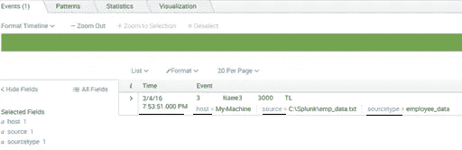
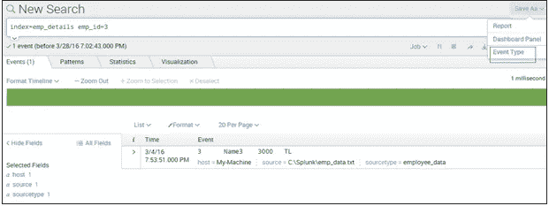
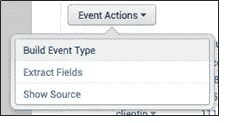
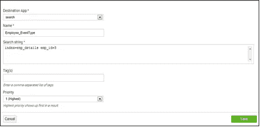
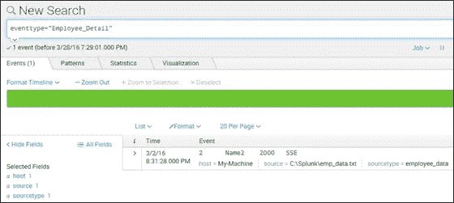
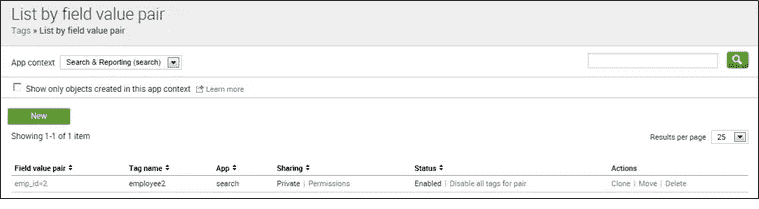
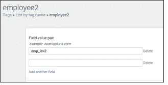
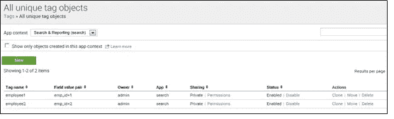

# 知识对象:Splunk 事件、事件类型和标记

> 原文：<https://medium.com/edureka/splunk-events-event-types-and-tags-686244b447b5?source=collection_archive---------6----------------------->

Splunk Knowledge Objects — Edureka

在本文中，我将解释 Splunk 事件、事件类型和 Splunk 标签。这些知识对象有助于丰富您的数据，使其更易于搜索和报告。

那么，让我们从 Splunk 事件开始吧。

# Splunk 事件

事件指的是任何单独的数据。已经转发到 Splunk 服务器的自定义数据称为 Splunk 事件。这些数据可以是任何格式，例如，字符串、数字或 JSON 对象。

让我向您展示 Splunk 中的事件:

正如您在上面的屏幕截图中所看到的，有一些默认字段(主机、源、源类型和时间)是在索引后添加的。让我们了解这些默认字段:

1.  **主机:**主机是数据来源的机器或设备的 IP 地址名称。在上面的截图中，我的机器是主机。
2.  **Source:** Source 是主机数据的来源。它是机器中的完整路径名或文件或目录。
    例如:C:\Splunk\emp_data.txt
3.  **Sourcetype:** Sourcetype 标识数据的格式，是日志文件、XML、CSV 还是线程字段。它包含事件的数据结构。
    例如:员工 _ 数据
4.  **索引:**是原始数据被索引的索引的名称。如果您没有指定任何内容，它将进入默认索引。
5.  **时间:**该字段显示事件发生的时间。每个事件都有条形码标记，不能更改。您可以在一段时间内对其进行重命名或切片，以更改其显示方式。
    例如 3/4/16 7:53:51 表示特定事件的时间戳。

现在，让我们了解 Splunk 事件类型如何帮助您对类似事件进行分组。

# Splunk 事件类型

假设您有一个包含雇员姓名和雇员 ID 的字符串，并且您希望使用单个搜索查询来搜索该字符串，而不是分别搜索它们。Splunk 事件类型可以帮助您。它们将这两个独立的 Splunk 事件分组，您可以将该字符串保存为单个事件类型(Employee_Detail)。

*   Splunk 事件类型是指有助于根据共同特征对事件进行分类的数据集合。
*   这是一个用户定义的字段，它扫描大量数据，并以控制面板的形式返回搜索结果。您还可以根据搜索结果创建通知。

请注意，在定义事件类型时，不能使用管道字符或子搜索。但是，您可以将一个或多个标签与事件类型相关联。

现在，让我们了解一下这些 Splunk 事件类型是如何创建的。创建事件类型有多种方法:

1.  使用搜索
2.  使用构建事件类型实用工具
3.  使用 Splunk Web
4.  配置文件(eventtypes.conf)

让我们更详细地理解它:

## 1.**使用搜索:**

我们可以通过编写简单的搜索查询来创建事件类型。
通过以下步骤创建一个:
>使用搜索字符串
运行搜索，例如:index = EMP _ details EMP _ id = 3；
>点击另存为，选择事件类型。
你可以参考下面的截图来更好的理解:

## 2.**使用构建事件类型实用程序:**

构建事件类型实用程序使您能够根据搜索返回的 Splunk 事件动态创建事件类型。该实用程序还允许您为事件类型指定特定的颜色。

您可以在搜索结果中找到这个工具。让我们完成以下步骤:

**步骤 1:** 打开下拉事件菜单
**步骤 2:** 找到事件时间戳旁边的向下箭头
**步骤 3:** 单击构建事件类型
单击上面截图中显示的“构建事件类型”后，它将返回基于特定搜索的选定事件集。

## 3.**使用 Splunk Web:**

这是创建事件类型最简单的方法。为此，您可以遵循以下步骤:转到设置

导航到 Ev

输入类型
点击新建

为了简单起见，让我举一个同样的员工例子。
在这种情况下，搜索查询将是相同的:
index=emp_details emp_id=3

请参考下面的截图，以便更好地理解:

## 4.**配置文件(eventtypes.conf):**

您可以通过直接编辑＄SPLUNK _ HOME/etc/system/local
中的 eventtypes.conf 配置文件来创建事件类型，例如:" Employee_Detail"
请参考下面的截图以更好地理解:

到目前为止，您应该已经理解了事件类型是如何创建和显示的。接下来，让我们了解如何使用 Splunk 标签，以及它们如何让您的数据更加清晰。

## **Splunk 标签**

你必须意识到标签的一般含义。我们大多数人都使用脸书的标签功能来给帖子或照片中的朋友添加标签。即使在 Splunk 中，标记也以类似的方式工作。我们用一个例子来理解这个。Splunk 索引有一个 emp_id 字段。现在，您想为 emp_id=2 字段/值对提供一个标记(Employee2)。我们可以为 emp_id=2 创建一个标签，现在可以使用 Employee2 对其进行搜索。

*   Splunk 标记用于为特定字段和值组合指定名称。
*   这是在搜索时成对获得结果的最简单的方法。任何事件类型都可以有多个标签来快速获得结果。
*   它有助于更有效地搜索事件数据组。
*   标记是在键-值对上完成的，这有助于获得与特定事件相关的信息，而事件类型提供与其相关的所有 Splunk 事件的信息。
*   您也可以将多个标签分配给一个值。

转到设置->标签

现在，您可能已经理解了标签是如何创建的。现在让我们了解一下 Splunk 标签是如何管理的。设置下标签页有三个视图:
1。按字段值对
2 列出。按标签名称列出
3。所有唯一标记对象

让我们深入了解更多细节，理解管理和快速访问标记和字段/值对之间的关联的不同方式。

1.  **按字段值对列出:**这有助于您查看或定义字段/值对的一组标签。您可以看到特定标签的这种配对列表。
    参考下面的截图，以便更好地理解:

2.**按标签名称列出:**它帮助您查看和编辑字段/值对的集合。您可以转到“按标签名称列出”视图，然后单击标签名称，找到特定标签的字段/值配对列表。这会将您带到标签的详细页面。
示例:打开雇员 2 标签的详细信息页面。
请参考下面的截图，以便更好地理解:

3.**所有唯一标签对象:**它帮助您提供系统中所有唯一标签名称和字段/值配对。您可以搜索特定的标签，以快速查看与其相关联的所有字段/值对。您可以轻松地维护权限，以启用或禁用特定的标签。

请参考下面的截图，以便更好地理解:

现在，有两种方法可以搜索标签:

*   如果我们需要搜索与任何字段中的值相关联的标记，我们可以使用:
    tag= < tagname >
    在上面的例子中，它是:tag=employee2
*   如果我们正在寻找与指定字段中的值相关联的标记，我们可以使用:
    标记::<字段> = <标记名>
    在上面的例子中，它将是:tag::emp_id=employee2

在本文中，我解释了三个知识对象(Splunk 事件、事件类型和标签),它们有助于简化您的搜索。我希望你发现这篇文章信息丰富。如果你想查看更多关于人工智能、DevOps、道德黑客等市场最热门技术的文章，那么你可以参考 [Edureka 的官方网站。](https://www.edureka.co/blog/?utm_source=medium&utm_medium=content-link&utm_campaign=splunk-events-event-types-and-tags)

请留意本系列中解释 Splunk 其他各方面的其他文章。

> 1.[什么是 Splunk？](/edureka/what-is-splunk-26b3cccab039)
> 
> 2. [Splunk 教程](/edureka/splunk-tutorial-3e1b5a22e6fe)
> 
> 3. [Splunk vs. ELK vs. Sumo 逻辑](/edureka/splunk-vs-elk-vs-sumologic-58138f6cb7f)
> 
> 4. [Splunk 用例:多米诺的成功故事](/edureka/splunk-use-case-da8ac0340f13)
> 
> 5. [Splunk 架构](/edureka/splunk-architecture-c9910b34c745)
> 
> 6. [Splunk 查找和字段](/edureka/splunk-lookup-and-fields-6751930ce7b3)

*原载于 2016 年 12 月 26 日*[*www.edureka.co*](https://www.edureka.co/blog/splunk-events-event-types-and-tags/)*。*