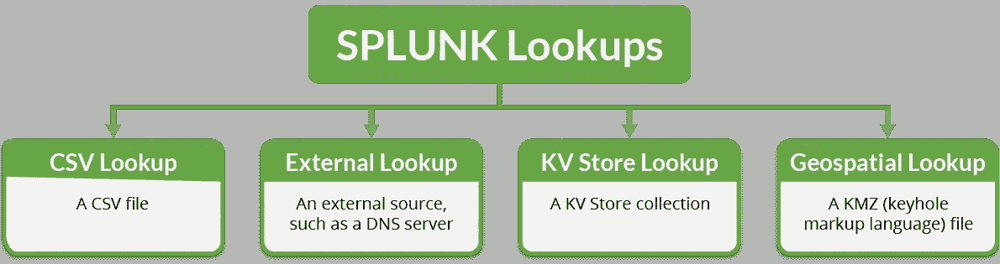
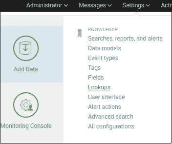
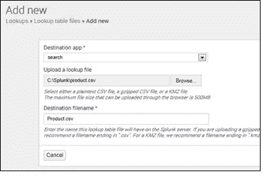
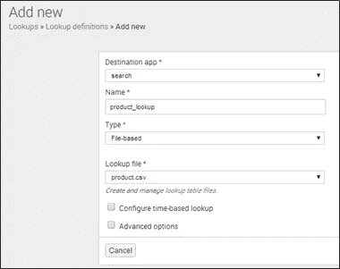
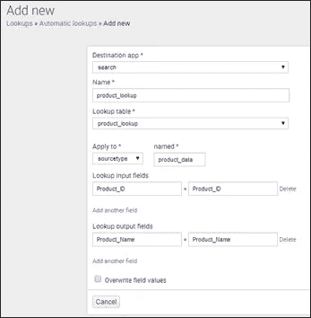
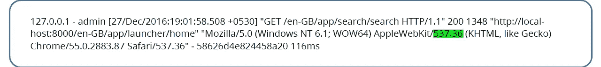
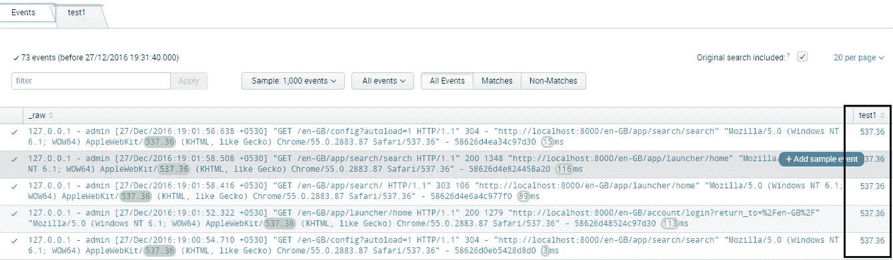
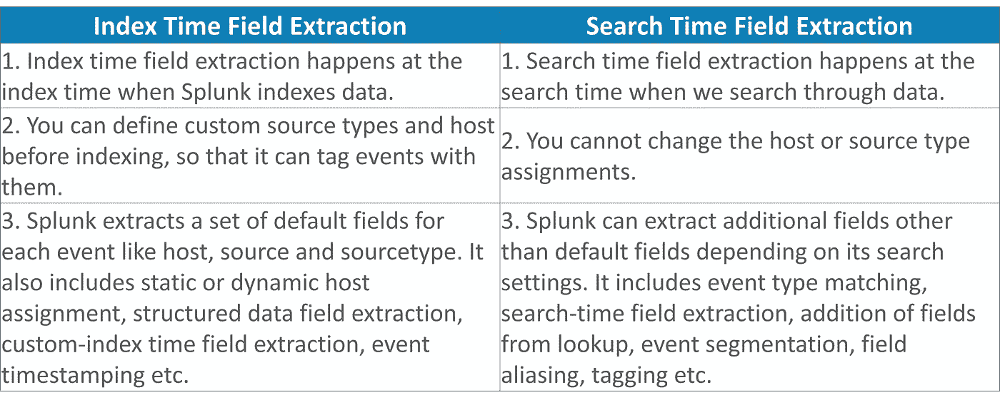
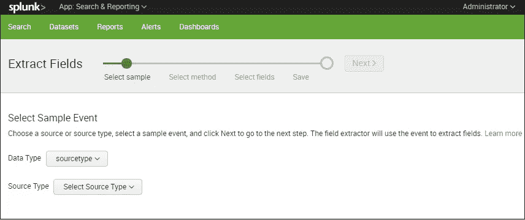
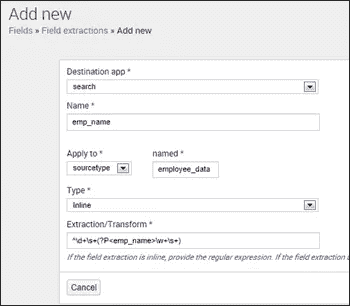

# 知识对象:Splunk 查找和 Splunk 字段

> 原文：<https://medium.com/edureka/splunk-lookup-and-fields-6751930ce7b3?source=collection_archive---------2----------------------->

Splunk Knowledge Objects — Edureka

在本文中，我将解释以下概念— Splunk 查找、字段和字段提取。我将讨论为什么查找很重要，以及如何通过匹配惟一键值来关联来自外部数据源的数据。另一方面，Splunk 字段通过为事件提供特定值来帮助丰富您的数据。我还解释了如何以不同的方式提取这些字段。

那么，我们开始 Splunk 查找吧。

# Splunk 查找

您可能熟悉 Excel 中的查找。Splunk 查找以类似方式工作。例如，您有一个 product_id 值，它与另一个文件(比如 CSV 文件)中的定义相匹配。查找可以帮助您在新的字段中映射产品的详细信息。假设您的 product_id=2，并且产品的名称存在于不同的文件中，则 Splunk 查找将创建一个新字段“product_name ”,该字段具有与之相关联的“product_id”。

*   查找表是键和值的映射。
*   Splunk 查找帮助您根据与事件数据中的字段相匹配的值从外部源添加字段。
*   它丰富了数据，同时比较不同的事件字段。
*   Splunk 查找命令可以接受多个事件字段和目标字段。
*   它可以在搜索时将字段转换成更有意义的信息。

如果您看到下图，这些是不同类型的 Splunk 查找，我将在下面详细解释。

1.  **CSV 查找**:顾名思义，CSV 查找从 CSV 文件中提取数据。它用字段填充事件数据，并在静态数据表中表示它。因此，它也被称为“静态查找”。必须至少有两列表示具有一组值的字段。它们可以有相同值的多个实例。
2.  **外部查找**:在这种类型的查找中，它从外部来源，比如说 DNS 服务器，填充您的事件数据。它可以使用 Python 脚本或二进制可执行文件从外部源获取字段值。因此，它也被称为“脚本查找”。
3.  **KV Store Lookup** :在这种类型的查找中，它使用从应用程序键值存储(KV Store)集合中提取的字段来填充您的事件数据。该查找将事件中的字段与 KV 存储中的字段进行匹配。
4.  **地理空间查找:**在这种类型的查找中，数据源是一个 KMZ(压缩锁眼标记语言)文件，用于定义地图区域的边界，如美国各州和美国各县。它匹配 KMZ 文件中的事件，并将字段输出到以 KMZ 编码的事件，如国家、州或县的名称。

您可以通过以下方式配置 Splunk 查找:

设置->查找

单击“查找”后，将显示一个新页面，上面写着“创建和配置查找”。

您可以创建新代码或编辑现有代码。

创建和配置 Splunk 查找有三种方式:

1.  查找表文件
2.  查找定义
3.  自动查找

让我们深入了解更多细节，并理解这些不同的方式:

**1。查找表文件**:在查找表文件中，您可以简单地上传一个新文件。
当您单击“添加新项”视图时，您可以上传 CSV 文件以在您的字段查找中使用。

要创建查找表文件，您需要遵循以下步骤:
进入查找页面
打开查找表文件
点击新增
上传查找文件，浏览要上传的 CSV 文件(product.csv)。
在目标文件名下，将文件命名为 product.csv

参考下面的截图，以获得更好的理解。

**2。查找定义:**查找定义帮助编辑现有的查找定义或定义一个新的基于文件的查找。定义查找时，可以重复使用同一个文件，并在以后自动运行该查找。

要创建查找定义，您需要遵循以下步骤:
转到查找页面
打开查找定义
单击“添加新项”
将打开一个新框来添加字段定义
提供查找的名称
将类型设置为“基于文件”
选择查找文件的名称(product.csv)

参考下面的截图，以获得更好的理解。

**3。自动查找:**自动查找有助于配置自动运行的新查找或编辑现有查找。

要创建自动查找，您可以执行以下步骤:
转到查找页面
打开自动查找
单击添加新项
将打开一个新框来添加自动查找
提供自动查找的名称
在查找表下，选择产品 _ 查找
选择查找输入和输出字段。

参考下面截图更好理解。

创建 Splunk 查找有两个重要的搜索命令—输入和输出查找。这些解释如下。

**输入查找** : Inputlookup 命令从指定的静态查找表中加载搜索结果。它扫描由文件名或表名指定的查找表。如果“append”设置为 true，查找文件中的数据将被追加到当前的结果集。例如:读取 product.csv 查找文件。

|输入查找产品. csv

**output lookup**:output lookup 命令将搜索结果写入指定的静态查找表。它将结果保存到由文件名或表名指定的查找表中。如果“createinapp”选项设置为 false 或者没有当前应用程序，则 Splunk 会在系统查找目录中创建文件。例如:写入 product.csv 查找文件。

| outputlookup product.csv

到目前为止，您应该已经了解 Splunk 查找是如何创建的。接下来，我将解释 Splunk 字段以及如何提取这些字段来丰富您的数据。

# Splunk 字段

假设您有一家公司的大量数据，您需要一种简单的方法来访问 key=value 对中的信息。假设您想要识别特定员工的姓名，或者想要查找员工 ID。为此，我们可以声明一个 Splunk 字段，如 Emp_name 或 Emp_ID，并为其关联一个值。例如:Emp_name= "Jack "或 Emp_ID= '00124 '

*   字段是事件数据中可搜索的名称。
*   字段通过向字段提供特定值来过滤事件数据。
*   字段是 Splunk 搜索、报告和数据模型的构建块。
*   一个字段可以有多个值。它可以出现多次，每次都有不同的值。
*   字段名称区分大小写。

现在让我们了解如何提取字段。

**Splunk 字段提取:**从事件中提取字段的过程称为 Splunk 字段提取。有些字段是默认提取的，例如:主机、源、源类型和时间戳。
我将用一个简单的例子来解释，以便正确理解这个过程。

正如您在上面的例子中看到的，它显示了事件数据。在本例中，我采用了任何示例事件，并将源类型保持为“splunk_web_access”。现在，Splunk Enterprise 将根据 sourcetype 收集的数据提取字段。
在上面的例子中，我选择了正则表达式，这有助于匹配样本事件中突出显示的值。现在，我已经提取了值‘537.36’，并将字段名设为‘test’。这将显示一组值和提取的值。
让我们看看这些提取的值是如何显示的。

现在，根据 Splunk 提取字段的时间，有两种类型的字段提取:

1.  索引时间字段提取(对于默认字段)
2.  搜索时间字段提取(在搜索字段的情况下)

让我们更详细地理解它:

接下来，Splunk 中有 3 种方法可以实现字段提取。

1.  使用字段提取器实用程序
2.  使用 Splunk 网站中的字段提取页面
3.  在中直接使用字段提取。会议文件

下面详细解释了这三个问题:

**1。使用字段提取器实用程序**:您可以使用字段提取器实用程序创建新字段，它还用于在您的 Splunk 实例中动态创建自定义字段。

*   字段提取器使您能够通过选择样本事件并突出显示要从该事件中提取的字段来定义字段提取。
*   它提供了两种提取字段的方法——正则表达式和分隔符。正则表达式方法最适用于非结构化事件数据，而分隔符是为结构化事件数据设计的。
*   如果您不熟悉正则表达式的语法和用法，字段提取器实用程序会很有用，因为它会生成提取字段的正则表达式，并允许您对其进行测试。

参考下面的截图，以获得更好的理解。

**2。使用 Splunk Web** 中的字段提取页面:我们可以使用“字段提取页面”来管理搜索时的字段提取。
字段提取页面使我们能够:

*   查看整个搜索时间提取集。
*   创建新的搜索时间字段提取。
*   更新字段提取的权限。
*   删除字段提取

让我们看看如何访问 Splunk Web 中的字段提取页面:
进入设置- >字段- >字段提取

在上面的截图中，我已经解释了如何从 employee_data sourcetype 中提取雇员姓名字段。可以使用下面的正则表达式提取 emp_name 字段:
^\d+\s+(？P < emp_name > \w+\s+)

**3。在中直接使用字段提取。conf 文件:**也可以通过直接编辑 props.conf 和 transforms.conf 文件来提取字段。您可以在$SPLUNK_HOME/etc/system/local/中找到它们

注意:不要编辑$ SPLUNK _ HOME/etc/System/default/中的文件，因为它包含系统设置、身份验证和授权信息、索引映射和各种其他重要设置。

这就是 Splunk 知识对象。我希望这些博客能帮助您了解不同的知识对象，以及它在为您的企业带来运营效率方面所扮演的角色。查看下一篇[教程博客](https://www.edureka.co/blog/splunk-tutorial)，其中解释了每个 Splunk 管理员都必须熟知的三个概念——许可、数据老化和配置文件。

如果你想查看更多关于人工智能、DevOps、道德黑客等市场最热门技术的文章，那么你可以参考 [Edureka 的官方网站。](https://www.edureka.co/blog/?utm_source=medium&utm_medium=content-link&utm_campaign=splunk-lookup-and-fields)

请留意本系列中解释 Splunk 其他各方面的其他文章。

> 1.[什么是 Splunk？](/edureka/what-is-splunk-26b3cccab039)
> 
> 2. [Splunk 教程](/edureka/splunk-tutorial-3e1b5a22e6fe)
> 
> 3. [Splunk vs. ELK vs. Sumo 逻辑](/edureka/splunk-vs-elk-vs-sumologic-58138f6cb7f)
> 
> 4. [Splunk 用例:多米诺的成功故事](/edureka/splunk-use-case-da8ac0340f13)
> 
> 5. [Splunk 架构](/edureka/splunk-architecture-c9910b34c745)
> 
> 6. [Splunk 知识对象](/edureka/splunk-events-event-types-and-tags-686244b447b5)

*原载于 2017 年 1 月 2 日*[*【www.edureka.co】*](https://www.edureka.co/blog/splunk-lookup-and-fields/)*。*