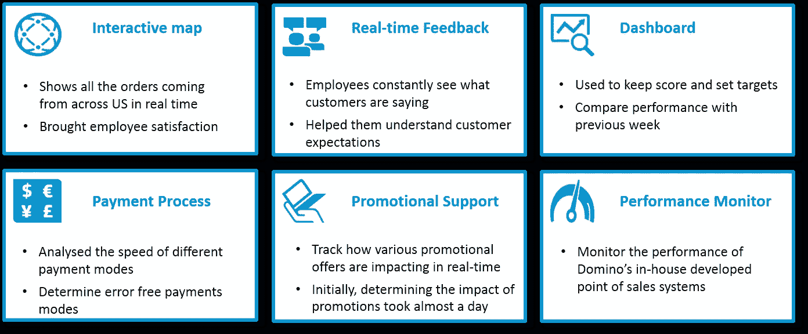

# Splunk 用例:Domino 的成功故事

> 原文：<https://medium.com/edureka/splunk-use-case-da8ac0340f13?source=collection_archive---------1----------------------->

Splunk Use- Case — Edureka

虽然许多公司和组织使用 Splunk 来提高运营效率，但在这篇博文中，我将讨论 Domino's Pizza 如何使用 Splunk 来分析消费者行为，以构建数据驱动的业务战略。此 Splunk 使用案例展示了 Splunk 如何广泛应用于任何领域。

# Splunk 用例:达美乐比萨

您可能知道达美乐比萨是一家电子商务兼快餐巨头，但您可能不知道他们面临的大数据挑战。他们希望了解客户的需求，并通过使用[大数据](https://www.edureka.co/blog/big-data-tutorial?utm_source=medium&utm_medium=content-link&utm_campaign=splunk-use-case)更有效地满足他们的需求。这就是 Splunk 出手相救的地方。

请看下图，该图描绘了导致达美乐大数据问题的环境。

***大量非结构化数据的产生是因为:***

*   他们通过全渠道来推动销售
*   他们有庞大的客户群
*   他们有几个客户服务联络点
*   他们提供多种交付系统:店内订餐、电话订餐、网站订餐和跨平台移动应用程序订餐
*   他们用一个新工具升级了他们的移动应用程序，以支持“语音订购”并能够跟踪他们的订单

***生成的多余数据引发了以下问题:***

*   手动搜索繁琐且容易出错
*   对客户需求/偏好变化的了解较少
*   毫无准备，因此以被动的方式解决任何问题

Domino 认为这些问题的解决方案在于一种能够轻松处理数据的工具。那时他们实施了 Splunk。

> “在实施 Splunk 之前，管理公司的应用程序和平台数据是一件令人头疼的事情，因为它的许多日志文件都乱七八糟”
> 
> *–根据他们的现场可靠性&工程经理 Russell Turner*

Turner 提到，使用 Splunk 实现运营智能而不是传统的 APM 工具帮助他降低了成本，更快地搜索数据，监控性能，并更好地了解客户与 Domino 的交互方式。如果您查看下图，您会发现通过实施 Splunk 设置的不同应用程序。

*   交互式地图，用于实时显示来自美国各地的订单。这给员工带来了满足感和动力
*   实时反馈，让员工不断看到客户在说什么，了解他们的期望
*   仪表板用于记录分数和设定目标，将他们的绩效与前几周/前几个月以及其他商店的绩效进行比较
*   支付过程，用于分析不同支付模式的速度，并识别无误的支付模式
*   促销支持，用于实时识别各种促销优惠的影响。在实施 Splunk 之前，同样的任务通常需要一整天
*   性能监控，监控 Domino 内部开发的销售点系统的性能

事实证明，Splunk 对 Domino 非常有益，IT 部门以外的团队开始探索使用 Splunk 从他们的数据中获得洞察力的可能性。

# Splunk 用于促销数据洞察

*我将展示一个假设的 Splunk 用例场景，帮助您了解 Splunk 的工作原理。这个场景展示了 Domino's Pizza 如何使用促销数据来更好地了解不同地区、订单收入规模和其他变量的最佳优惠/优惠券*。

**注:所使用的促销数据示例具有代表性，现有数据可能不准确。**

***达美乐不清楚哪种优惠最有效——根据:***

*   优惠类型(他们的客户喜欢 10%的折扣还是固定的 2 美元折扣？)
*   地区层面的文化差异(文化差异在报价选择中起作用吗？)
*   用于购买产品的设备(用于订购的设备在产品选择中起作用吗？)
*   购买时间(订单生效的最佳时间是什么时候？)
*   订单收入(是否会根据订单收入规模提供回应变更？)

从下图中可以看出，促销数据是从移动设备、网站和达美乐比萨的各个门店(使用 Splunk Forwarders)收集的，并被发送到一个中心位置(Splunk 索引器)。

Splunk forwarders 会发送实时生成的促销数据。这些数据包含了客户在获得优惠时如何反应的信息，以及其他变量，如人口统计数据、时间戳、订单收入规模和使用的设备。

客户被分为两组进行 A/B 测试。每套都有不同的报价:10%的折扣和 2 美元的统一报价。对他们的回答进行分析，以确定客户更喜欢哪种报价。

该数据还包含了顾客做出回应的时间，以及他们是更喜欢在店内购买还是更喜欢在线订购。如果他们是在网上完成的，那么他们用来购物的设备也包括在内。最重要的是，它包含订单收入数据，以了解报价响应是否随订单收入大小而变化。

转发原始数据后，Splunk 索引器被配置为提取相关信息并将其存储在本地。相关信息是对优惠做出响应的顾客、他们做出响应的时间以及用于兑换优惠券/优惠的设备。

***通常存储以下信息:***

*   基于客户反应的订单收入
*   购买产品的时间
*   客户下订单的首选设备
*   使用的优惠券/优惠
*   基于地理位置的销售数字

为了对索引数据执行各种操作，使用了搜索头。该组件提供了一个图形界面，用于搜索、分析和可视化索引器中存储的数据。通过使用搜索头提供的可视化仪表板，达美乐比萨获得了以下见解:

*   在美国和欧洲，顾客更喜欢 10%的折扣，而不是 2 美元的优惠。而在印度，顾客更倾向于 2 美元的统一报价
*   当订单收入规模较大时，10%折扣优惠券使用较多，而当订单收入规模较小时，固定 2 美元优惠券使用较多。
*   移动应用程序是晚上点餐的首选设备，来自网站的订单在中午最多。而店内订单量在上午最高

Domino's Pizza 整理了这些结果，以便根据特定地理位置的客户的订单收入规模定制优惠/优惠券。他们还确定了提供优惠/优惠券的最佳时机，并根据客户使用的设备来锁定客户。

还有其他几个 Splunk 使用案例，展示了各种公司如何受益和发展业务、提高生产力和安全性。你可以在这里阅读更多这样的故事[。](https://www.splunk.com/en_us/customers.html?CustomerVideos)

如果你想查看更多关于人工智能、DevOps、道德黑客等市场最热门技术的文章，那么你可以参考 [Edureka 的官方网站。](https://www.edureka.co/blog/?utm_source=medium&utm_medium=content-link&utm_campaign=splunk-use-case)

请留意本系列中解释 Splunk 其他各方面的其他文章。

> 1.[什么是 Splunk？](/edureka/what-is-splunk-26b3cccab039)
> 
> 2. [Splunk 教程](/edureka/splunk-tutorial-3e1b5a22e6fe)
> 
> 3. [Splunk vs. ELK vs. Sumo 逻辑](/edureka/splunk-vs-elk-vs-sumologic-58138f6cb7f)
> 
> 4. [Splunk 架构](/edureka/splunk-architecture-c9910b34c745)
> 
> 5. [Splunk 知识对象](/edureka/splunk-events-event-types-and-tags-686244b447b5)
> 
> 6. [Splunk 查找和字段](/edureka/splunk-lookup-and-fields-6751930ce7b3)

*原载于 2016 年 10 月 25 日*[*www.edureka.co*](https://www.edureka.co/blog/splunk-use-case)*。*