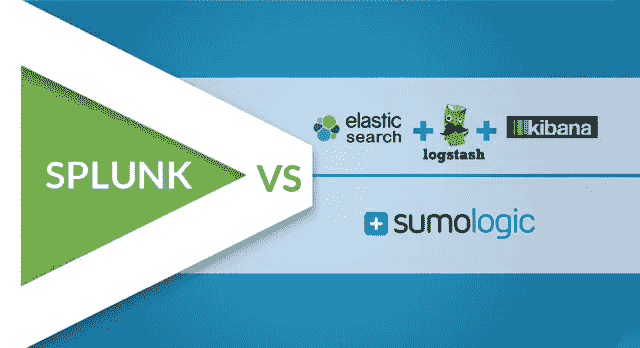
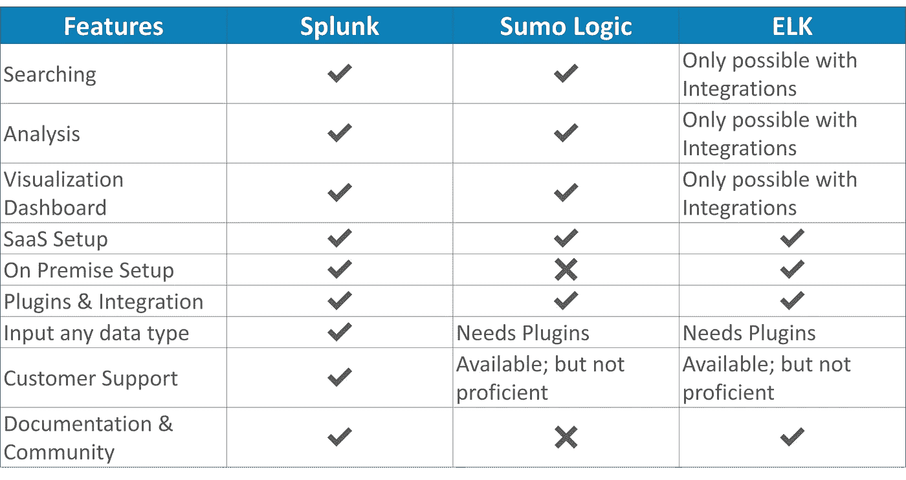

# Splunk vs. ELK vs. Sumo 逻辑:哪个最适合你

> 原文：<https://medium.com/edureka/splunk-vs-elk-vs-sumologic-58138f6cb7f?source=collection_archive---------2----------------------->

Splunk vs ELK vs Sumo Logic — Edureka

现在市场上有很多工具可以用来存储和处理机器数据，但是如何选择合适的工具呢？您知道 Splunk、ELK 和 Sumo 逻辑中哪一个是处理您的机器生成的数据的最佳选择吗？

我写这篇文章是为了让您了解这些工具的优缺点，之后您将能够专注于最适合您组织需求的工具。当我为我的项目做研究时，我了解到了这些工具之间的差异，在我的项目中，异常的系统状态和欺诈需要被实时警告。那时我才知道有专门的工具通过处理机器数据来监控系统。所以我发表了这篇文章来分享我所学到的:

*   Splunk 与 ELK 和 Sumo 逻辑的区别
*   如何选择合适的工具？

Splunk、ELK 和 Sumo Logic 是市场上使用最广泛的工具，它们很好地代表了不同类型的可用工具。其他流行的工具有 Loggly、Graylog 和 PaperTrails。

您可以浏览下表，以获得这三个工具支持的特性的概述。

# Splunk vs ELK vs Sumo 逻辑

## 专有/开源

[**Splunk**](https://www.edureka.co/blog/what-is-splunk?utm_source=medium&utm_medium=content-link&utm_campaign=splunk-vs-elk-vs-sumologic) 是一款专有工具，提供内部部署和云设置。内部部署和云设置的区别在于您存储数据的位置。如果您要进行内部安装，您可以选择 Splunk Enterprise 或 Splunk Light。如果您更喜欢云设置，那么您可以选择 Splunk 云，这是 Splunk Enterprise 的 SaaS 版本。

**相扑逻辑**也是一个专有工具，但它只提供云设置。这意味着你所有的数据都存储在云中。

**ELK** 另一方面是三个开源工具的组合(Elastic Search-Logstash-Kibana)。与 Splunk 类似，ELK 可以安装在内部，也可以设置在云上。他们的云平台叫弹性云。如果你是 AWS 用户，那么你还有另外一个选择:AWS 弹性搜索。去年 10 月， [AWS](https://www.edureka.co/blog/amazon-aws-tutorial?utm_source=medium&utm_medium=content-link&utm_campaign=splunk-vs-elk-vs-sumologic) 发布了这个作为 ELK 的托管解决方案。

**底线:** Splunk 和 Sumo Logic 是专有软件，您需要为大量功能付费。而 ELK 是开源的，更便宜。因此，如果你为一家中小型公司工作，专有软件可能不是最好的选择，因为你可能要为一大堆你可能用不到的功能付费。

## 搜索、分析和可视化

有了 **Splunk** 和 **Sumo Logic** ，你就拥有了一个完整的数据管理包。导入数据后，您可以搜索和调查该数据。你可以通过分析获得洞察力，并据此制定商业策略。您甚至可以使用可视化仪表板以可视化形式展示您的发现。

由于 **ELK** 是三个工具的组合，搜索、分析&可视化只有在 ELK 堆栈建立之后才有可能。Elastic Search 进行数据存储并作为分析引擎工作，Logstash 是数据收集和传输代理，Kibana 用于可视化数据。这三个工具合起来称为 ELK stack(弹性搜索— Logstash — Kibana)。

**底线:**搜索、分析&这三种工具都可以实现可视化，但是它们在不同的工具中以不同的方式实现。

## 数据类型

我对这些工具接受的不同数据类型做了一些研究，了解了一些关于 Splunk 和 Sumo 逻辑的有趣事实。Splunk 声称他们的工具可以接受任何格式的数据，例如。csv 或 json 或任何其他日志格式。甚至 Sumo Logic 声称他们的工具可以“从几乎任何系统以几乎任何格式收集日志”。

在 **ELK** 的情况下，Logstash 负责数据的上传。尽管 Logstash 在默认情况下不支持所有的数据类型，但是可以为不同的数据类型设置插件。但是 Logstash 的缺点是启动时间长，而且调试错误很困难，因为它使用了非标准的配置语言。

这里要考虑的另一个细节是数据解析方式的不同。我注意到，在 ELK 和 Sumo 逻辑中，数据字段必须首先被识别，然后在发布之前进行配置。但有了 Splunk，我可以在数据进入系统后再做。通过分离运输和现场标签，这使得数据更容易上传。

## 集成和插件

我发现 **Splunk** 非常适合设置与其他工具的集成。它有大约 600 个用于 It 运营、安全和其他需求的插件。虽然 **ELK** 看到了可用插件数量的增加，但它不像 Splunk 那样支持那么多的集成。Logstash 负责 ELK 中的数据加载，目前只有大约 160 个插件，更多的集成工作正在进行中。

## 客户支持和文档

Splunk 拥有庞大的客户群，因此是一个非常强大的社区。我发现 Splunk 社区很有帮助，我的许多问题都在那里得到了回答。这就是为什么我觉得 Splunk 会比 Sumo Logic 和 ELK 提供更好的支持。

我还发现 Splunk 的知识库中有关于设置集群和插件的准确文档，但是对于 Sumo Logic，我发现这些文档不如我预期的好，并且我很难浏览这些文档。

## 结论

所有这三种工具都有各自的优势和类别，在这些优势和类别中，它们优于其他工具。我在这里的唯一意图是帮助你做决定。所以，你有必要选择适合你需求的工具。

我发现 Splunk 是这些工具中最舒适的，因为它非常易于使用，并且是满足我需求的一站式解决方案。它让我可以在同一个平台上进行搜索、分析和可视化，并在我需要时为我提供良好的支持。你可能有不同的看法，欢迎在下面的评论框中发表你的观点。

我希望你发现这篇文章信息丰富。如果你想查看更多关于人工智能、DevOps、道德黑客等市场最热门技术的文章，你可以参考 Edureka 的官方网站。

请留意本系列中解释 Splunk 其他各方面的其他文章。

> 1.[什么是 Splunk？](/edureka/what-is-splunk-26b3cccab039)
> 
> 2. [Splunk 教程](/edureka/splunk-tutorial-3e1b5a22e6fe)
> 
> 3. [Splunk 用例:多米诺的成功故事](/edureka/splunk-use-case-da8ac0340f13)
> 
> 4. [Splunk 架构](/edureka/splunk-architecture-c9910b34c745)
> 
> 5. [Splunk 知识对象](/edureka/splunk-events-event-types-and-tags-686244b447b5)
> 
> 6. [Splunk 查找和字段](/edureka/splunk-lookup-and-fields-6751930ce7b3)

*原载于 2016 年 10 月 25 日*[*www.edureka.co*](https://www.edureka.co/blog/splunk-vs-elk-vs-sumologic)*。*