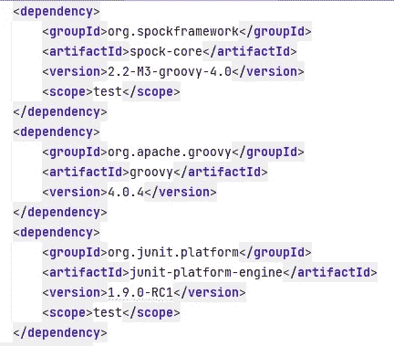
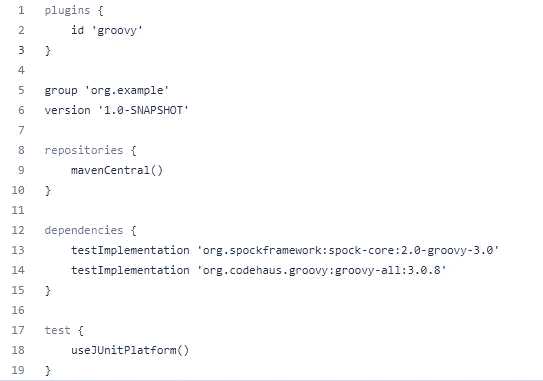
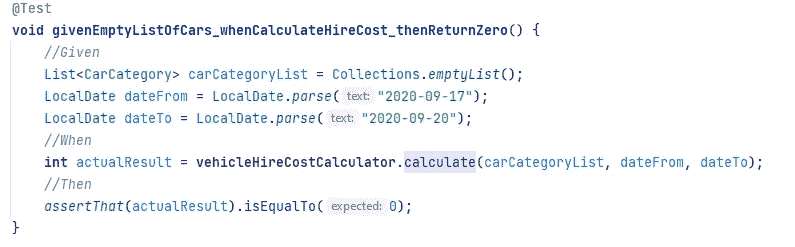
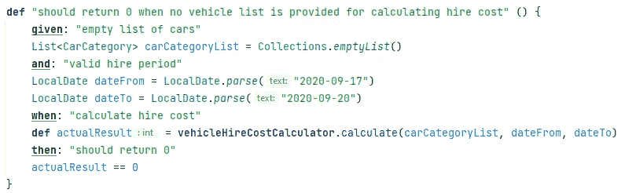
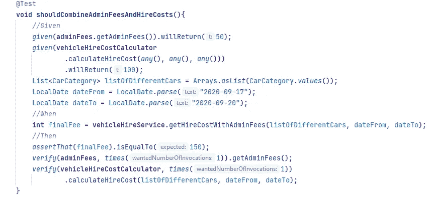
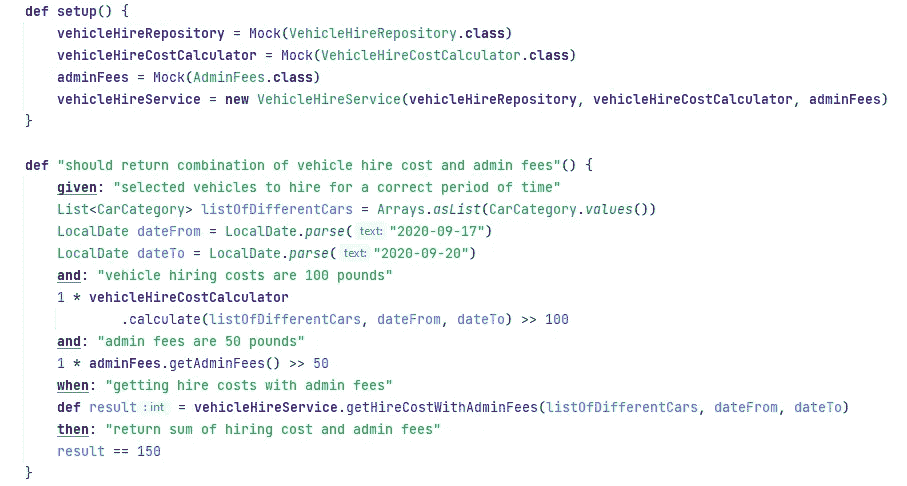
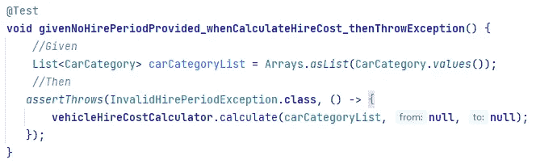
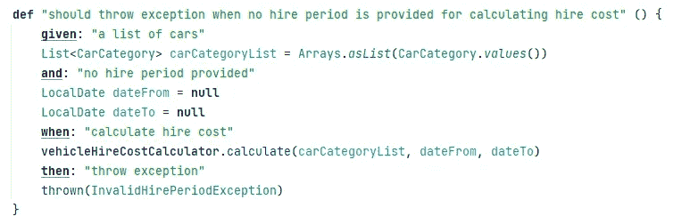
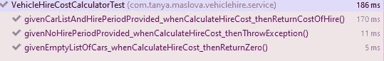
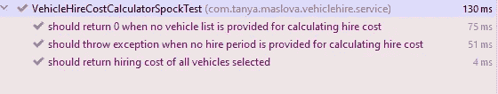

# 用 Java 进行 BDD 单元测试的 Spock

> 原文：<https://medium.com/version-1/spock-for-bdd-unit-testing-in-java-d67c2ddf25ad?source=collection_archive---------5----------------------->

好吧，好吧，我要说的不是史波克先生。但我不得不承认我两样都喜欢。用于单元测试的 Spock 测试框架非常符合 **Given-When-Then** 单元测试模式。但似乎并没有很多人知道这个框架，它也不能像 JUnit 一样拥有巨大的人气。

这个小博客简要描述了 Spock 框架，并将其与流行的工具 JUnit 进行了比较，以展示 Spock 的能力。这不是一个如何使用 Spock 的教程。这只是给你一个框架是什么的概念，以及你是否想在你的应用程序中使用 Spock。

# **谁，我是说，斯波克是什么？**

从介绍中可以看出，Spock 是一个测试框架，而不是星舰 USS Enterprise 的科学官。这个框架可以用于 Java 或 Groovy 应用程序的单元、组件和集成测试。对于参考和文档，你可以使用斯波克的官方网站【https://spockframework.org/ 。

斯波克是用 Groovy 写的。Groovy 是 Java 的超集，所以用 Java 应用程序运行我们的测试不成问题。如果您有一个同时用 Java 和 Groovy 编写的应用程序，这个框架特别有用，因为它允许您用一种语言一致地、结构化地为整个应用程序编写测试，而不是让测试部分用 Java 编写，部分用 Groovy 编写。

除了与著名的《星际迷航》角色明显相似之外，这个框架的突出之处在于它强制执行了行为驱动开发(BDD)和测试驱动开发(TDD)的约定。并且它使得**给定时间然后**单元测试模式易于实现。如果斯波克先生对单元测试感兴趣的话，他可能真的会这么做。如果你不知道， **Given-When-Then** 是由 Chris Matts 和 Daniel Terhorst-North 作为 BDD 的一部分引入的一种方法。这种方法更常用于集成测试。但也用于单元测试中，以促进 TDD，确保单元测试的结构化方法、可读性和可维护性，以及如何编写单元测试的一致性。在我们开始开发一个类之前，Spock 允许你以一种易读易懂的方式来识别这个类的行为。

Spock 框架受到 InteliJ 和 Eclipse 等不同 ide 的支持，可以很容易地集成到 Spring 或 SpringBoot 应用程序中。例如，下面是 maven pom.xml 的样子:

这里有一个 Gradle 的例子:

如果你不熟悉 Spock，有很多教程可以帮助你入门。但是支持社区不像 JUnit 那样广泛。

# **斯波克 vs 朱尼特**

对斯波克来说，这是一场艰难的战斗。而且我觉得不会有赢家。这实际上取决于应用程序和编写该应用程序的团队的偏好。

## 先给后给单元测试模式

想象一下，我们正在为一家乏味的、可能有点不靠谱的汽车租赁公司编写 API。API 检索所有可供租用的汽车，并根据汽车类型和租用期限给出客户想要租用的汽车的估计费用。我们决定用一个计算器来计算招聘成本。当没有选择汽车时，我们希望计算器返回 0。因此，单元测试场景将是:

> ***给出:*** 空车清单
> 
> ***和*** :有效租用期
> 
> ***何时:*** 计算租用成本
> 
> ***然后:*** 返回 0

下面是一个用 JUnit5 编写的测试这个场景的单元测试:

Unit test in JUnit5

这是一个用 Spock 编写的单元测试:

Unit test in Spock

如你所见，对于 Spock，我们有一个给出的**When Then**块和一个场景描述。我们不需要像在 JUnit 中那样在注释中定义这些块。当我们在开发计算方法之前编写这些规范和测试时，我们是用更“人性化”的语言来做的。这使得我们想要实现什么行为以及我们正在测试什么变得更加清楚。

如果你不喜欢为单元测试写文章，Spock 还允许定义没有描述的时给出的**。**

## 嘲笑和打击

我们可以在 JUnit 中使用很多模仿框架。为了便于比较，我们将使用 Mockito 作为 JUnit 的助手(或 minion)。

另一方面，斯波克有自己内置的嘲讽、存根和间谍。因此它不需要添加额外的库。斯波克假装对区分 stubbing 和嘲讽非常严格。事实上，在测试中，当我们说“模拟”时，我们的意思是我们模拟整个类，当我们说“存根”时，我们存根该类的某个行为。所以如果我们在斯波克身上留下了什么东西，它不会被嘲笑。然而，就像在《摩奇托》和《斯波克》中一样，在一个被模仿的类中发现一个行为，并验证我们和那个类有多少互动是可能的。唯一的区别是我们在哪里验证交互。

想象一下，我们那家有点不靠谱的汽车租赁公司想在结账时，在租赁费用的基础上额外收取一些管理费，让他们的客户大吃一惊。我们的服务将根据用户选择检索雇佣成本，检索管理费用，并返回综合结果。瞧，顾客将被收取更多的费用！

这是我们的 JUnit 测试对这种偷偷摸摸的行为可能看起来像:

Unit test in JUnit5

这是单元测试在斯波克身上的样子:

Unit test in Spock

在 Spock 中，我们定义了在 stub 行为中(在**给定的**块中)我们期望与被模仿的类进行多少次交互。在 Mockito 中，我们验证了在**然后**块中有多少交互。在这两种情况下，结果是一样的，意义也是一样的——我们只期望与 *AdminFees* 进行一次交互。如果有一个以上的交互或没有交互，两个测试都将失败。

## 异常测试

Spock 和 JUnit 都使我们能够测试某个行为是否抛出异常。Spock 使用 *thrown()* 来验证是否抛出了异常，并使用 *notThrown()* 来验证没有抛出异常。

回到我们的汽车租赁公司的 API，我们决定，如果提供了不正确的租赁期，我们的租赁成本计算器将会抱怨。例如，提供的时间段可能是过去的，或者结束日期和开始日期颠倒了，或者更糟的是，根本没有提供时间段。在这种情况下，我们希望我们的服务变得非常愤怒，并向违规者抛出一个异常。

我们在 JUnit 中的单元测试如下所示:

Unit test in JUnit5

在斯波克身上:

Unit test in Spock

## 文档和可读性

正如您在前面的例子中看到的，Spock 使我们能够记录我们期望我们的测试类如何以更人性化的语言表现。可读性允许更好地理解我们期望什么样的行为以及我们正在测试什么。这反过来提供了更好的可维护性和对系统行为、代码和测试的更好理解。

当我们运行测试时，我们希望看到测试了什么样的行为，以及在该行为中预期了什么。在 JUnit 中，清晰度取决于我们命名测试方法的方式。我们的例子中的行为不是很容易被人理解，但是我们仍然可以理解它(假设它是一个开发人员在查看测试执行):

JUnit test execution in InteliJ

这就是我们将在 Spock 测试中看到的:

Spock unit test execution in InteliJ

再一次，斯波克先生，我是说斯波克框架，使得执行文档更具可读性。几乎像一首诗。即使是一个没有多少 IT 知识或编程技能的人也能理解 *VehicleCostCalculator* 应该做什么。

# 摘要

在这篇博客中，我们只看了单元测试中的 Spock。Spock 使我们能够像测试 JUnit 一样测试 Java/Groovy 应用程序，包括模仿依赖关系。

与 JUnit 不同，Spock 不需要任何其他框架来嘲笑、监视和阻止。所以我们不需要添加额外的库。斯波克更喜欢单干。尽管 Spock 对模仿和反对非常严格，但我们可以模仿和测试与模仿者的交互，就像 Mockito/JUnit team 一样。

Spock 的一个主要优点是它允许我们以一致的、结构化的、可读性更强的方式编写单元测试。可读性使我们能够理解我们期望从被测试的类的行为中得到什么，以及我们正在测试什么。此外，它增强了我们的测试、代码和应用程序的可维护性。

Spock 得到了许多 ide 的支持，但是没有那么大的支持社区。

最后，由开发团队来考虑是使用 Spock 还是使用其他东西，比如 JUnit。

如果你想看看一个为一个虚构的有点狡猾和无聊的汽车租赁公司制作的 API，这里作为一个例子来演示单元测试中的 Spock，你可以从 [git hub repository](https://github.com/TMaslova-Howl/DodgyVehicleHireExample/tree/master) 获得它。

**关于作者:** 坦尼娅·玛丝洛娃是第一版的 Java 开发人员。