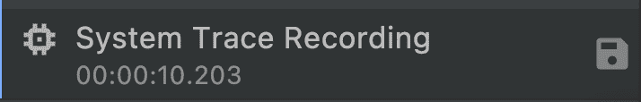

# 使用 Android Studio 中的 CPU profiler 发现您的 UI jank

> 原文：<https://medium.com/androiddevelopers/spot-your-ui-jank-using-cpu-profiler-in-android-studio-9a4c41a54dab?source=collection_archive---------1----------------------->

Android 通过从您的应用程序生成一个帧并将其显示在屏幕上来呈现用户界面(UI)。为了确保用户与你的应用程序的交互流畅，你的应用程序应该在由每个设备确定的刷新率下渲染每一帧——例如， [Pixel 6](https://store.google.com/product/pixel_6_specs) 允许每秒最多渲染 90 帧，这意味着每一帧需要在 11 毫秒内渲染。如果你的应用程序 UI 渲染速度慢，Android 框架会被迫跳帧。当这种情况发生时，用户会感觉到意外和令人分心的视觉故障，也称为 **jank** 。

jank 有几种来源，如应用程序引起的 jank 或 [SurfaceFlinger](https://perfetto.dev/docs/data-sources/frametimeline#janks-explained) 引起的 jank。本文主要关注由应用程序引起的 jank，以及 Android Studio 提供的用于发现和修复它们的工具，通过检查一个实时应用程序并打开记录的跟踪来解决应用程序中的性能问题。

*注:本文展示了从 Android Studio Chipmunk 开始更新的 jank 检测 UI，当与运行 Android 12 (API level 31)或更高版本的物理设备或 Android 仿真器一起使用时。*

# 记录现场互动的痕迹

下面的例子使用 GitHub 性能示例存储库中的`JankStatsSample`应用程序来展示如何使用 CPU profiler 发现 jank 的原因。

 [## 主 android 上的 performance-samples/jankstats sample/performance-samples

### 这个示例项目展示了如何使用 JankStats 库。它包括多个简单的示例活动…

github.com](https://github.com/android/performance-samples/tree/main/JankStatsSample) 

1.  打开`JankStatsSample`并运行应用程序

2.打开 Android Studio 底部的`Profiler`标签

3.单击 Profiler 左侧窗格中的`+`图标，启动一个新的性能分析会话，然后选择要运行性能分析的设备名称和应用程序进程。

*注意:虽然可以分析可调试的应用程序，但建议分析可分析的应用程序，因为分析可调试的应用程序会增加大量的性能开销。有关可评测应用的更多详细信息，请参见* [*文档*](https://developer.android.com/studio/profile#profileable-apps) *。*

4.点击`CPU`行

5.选择`System Trace Recording`并点击`Record`

6.与应用程序交互以收集一些数据，然后单击`Stop`按钮。

然后 Android Studio 将显示带有可见 janky 框架的`Display`部分

或者通过勾选`All Frames`复选框，您可以切换跟踪是否也显示非简基帧。

将鼠标指针悬停在每个帧上或单击它，可以看到详细的帧信息。如果勾选`All Frames`复选框，有三种类型的帧。

*   绿色框架
    不被视为 jank 的正常框架

*   红色帧
    被视为 jank 的帧，因为 app 进程运行时间长于预期，并且错过了该帧预期持续时间的截止日期。从 app 开发者的角度来看，**可操作帧通常是红色帧**。

*   黄色帧
    被认为是缓冲区填充的帧，这意味着应用程序在显示前一帧之前一直向系统发送帧。这通常是由于前一帧是 janky 造成的，应用程序开发人员对黄色帧无能为力。

通过勾选`Lifecycle`复选框，您可以切换显示/隐藏四个额外的轨道。

这四个轨道:

*   `Application`
*   `Wait for GPU`
*   `Composition`
*   `Frames on display`

从安卓工作室大黄蜂开始就有了。你可以在[文档](https://developer.android.com/studio/profile/jank-detection#jank-detection-android-11)中看到每个音轨的详细解释。

# 检查 janky 框架

现在，让我们看看如何诊断是什么导致了应用程序中的 janky 帧。

1.  在`Janky frames`轨迹中选择一个 janky 帧，相应的生命周期数据在`Display`部分高亮显示，相应的线程数据在`Threads`部分高亮显示。

虚线`Deadline`代表截止日期。当一个帧的持续时间超过该期限时，该帧被视为 janky。

也可以在 Android Studio 的右窗格看到详细的分析。

2.如果您在应用程序的主线程中查看相应的跟踪部分，您会发现大量时间都花在了“View#draw”上。

此外，如果您在详细分析窗格中查看主线程状态，可以看到大量线程状态处于休眠状态。

3.我们来看看调用`View#draw`的代码。
你可以发现`View#onDraw`被`JankyView`类中的[覆盖。](https://github.com/android/performance-samples/blob/main/JankStatsSample/app/src/main/java/com/example/jankstats/JankyView.kt#L36)

从`onDraw`调用的`simulateJank`方法是[，定义如下](https://github.com/android/performance-samples/blob/main/JankStatsSample/app/src/main/java/com/example/jankstats/tools/simulateJank.kt#L29)，

然后你可以发现`Thread.sleep`在`simulateJank`方法中被调用。这可能是显而易见的，因为`JankStatsSample`应用程序是为了故意模拟 janks 而创建的，但重要的是，通过查看 janky 框架的概述和更详细的分析，您能够发现实际的代码。

*注意:虽然在这个例子中调用* `*Thread.sleep*` *很明显是有问题的，但是在现实中，当优化您的实际应用程序代码时，您将需要做出更困难的决定。* [*微基准库*](https://developer.android.com/topic/performance/benchmarking/microbenchmark-overview) *可以帮助你衡量你所做的改变是否达到了预期的效果。*

*注意:系统跟踪显示了平台代码捕获的各个部分，以及作为应用一部分的库。通常它没有足够的信息。为了改善这一点，添加自定义跟踪，添加自定义跟踪的方法之一是通过使用* [*AndroidX 跟踪*](https://developer.android.com/reference/androidx/tracing/Trace) *库中的* `*trace(“MySection”) { /* this will be in the trace */ }*` *。
例如，本例中的* `*trace(“Jank Simulation”) { … }*` *显示在相应线程的 trace 部分。*

*有关读取跟踪和添加自定义跟踪的更多信息，请访问* [*系统跟踪概述*](https://developer.android.com/topic/performance/tracing) *。*

4.让我们将代码改为不调用`onDraw`中的`simulateJank`方法，然后看看是否仍然可以观察到 janky 帧。

这一次，当您重新运行系统跟踪记录时，您将不会在与应用程序交互后看到任何 janky 帧！

# 加载保存的跟踪

或者，您也可以通过下面的步骤保存跟踪并在以后加载它。保存和加载跟踪非常有用，因为您可以比较不同版本的跟踪，并与其他人共享。

*注意:也可以使用* [*宏基准库*](https://developer.android.com/topic/performance/benchmarking/macrobenchmark-overview) *来获取系统痕迹。*

1.  按照从 1 到 6 的相同步骤记录实时交互的轨迹。
2.  通过单击保存图标导出录像

3.然后，导航到`+`->-`Load from file…`，加载保存的系统跟踪记录，并选择上一步导出的保存文件

4.选择要分析的流程。显示流程列表下拉列表后，您可以开始键入流程名称的一部分，以便快速找到它。

然后，您可以加载保存的跟踪，并查看与实时交互记录相同的 janky 帧。

# 摘要

就是这样！从 Android Studio Chipmunk 开始，您可以看到更精确的分析数据，帮助您发现应用程序的漏洞。

要了解更多关于 CPU profiler 的用法，请务必查看[文档](https://developer.android.com/studio/profile/jank-detection#jank-detection-android-11)，并通过导航到 Android Studio 中的“帮助- >提交反馈”来帮助我们改进我们的工具。

您还可以在 Google I/O 上查看[应用性能讲座](https://www.youtube.com/watch?v=DYdHLqLVspY)中的新内容，该讲座涵盖了广泛的性能主题，包括避免 janky 帧。

如果您想了解我们的新库，以便在用户设备上运行的生产应用程序中检测和报告 jank，请前往 JankStats 的[文档](https://developer.android.com/studio/profile/jankstats)！