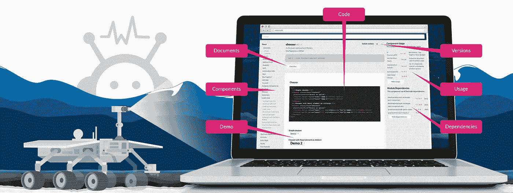
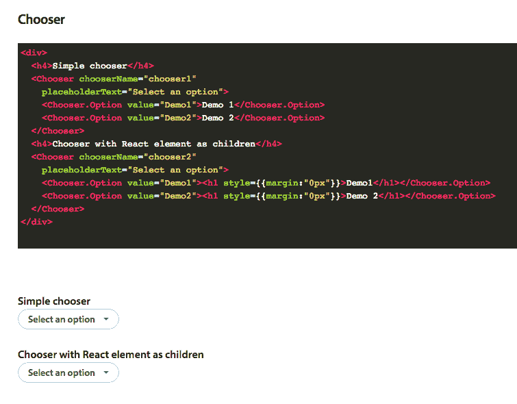
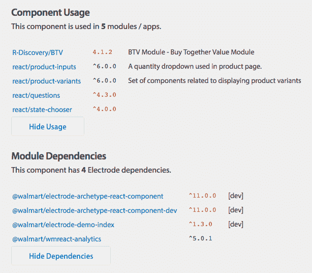

# 聚焦电极浏览器——轻松实现组件重复使用

> 原文：<https://medium.com/walmartglobaltech/spotlight-on-electrode-explorer-react-component-reuse-without-the-hassle-6447763365b2?source=collection_archive---------3----------------------->

脸书的 React 库最常被吹捧的好处之一是它的组件模型鼓励代码重用。在很大程度上，这意味着跨应用程序共享组件——例如，在独立的登录页面和结账页面上使用登录框。如果实现得好，这种代码重用可以缩短开发时间，减少 bug。但是，尽管 React 组件确实提供了重用 UI 代码的技术能力，但在实践中对可重用性有几个障碍。

例如，组件只有在可以被发现的情况下才能被重用。当一个组织有跨越几十个团队创建的数百个组件时，很难找到解决特定问题的组件。在某些情况下，可能有多个可能的解决方案，每个解决方案都需要通过 NPM 安装，以便在上下文中看到它并与之交互。这对于工程师来说非常耗时，对于产品经理和设计师来说，这很可能超出了一般的工作流程，尽管知道组件的样子和功能对他们来说很有用。

解决这些问题是我们构建[电极](/walmartlabs/introducing-electrode-an-open-source-release-from-walmartlabs-14b836135319#.psu1gon2a)的目标之一，这是为 Walmart.com 的[提供动力的 React/Node.js 应用平台。(我在之前的帖子](http://walmart.com/)[中提到了我们的另一个目标，性能，使用电极将 React 服务器端渲染性能提高了 70%](/walmartlabs/using-electrode-to-improve-react-server-side-render-performance-by-up-to-70-e43f9494eb8b#.h36vinxk3) 。) [@WalmartLabs](http://www.walmartlabs.com/) 有数百个组件分布在几十个 GitHub 存储库中。为了解决可发现性问题，我们创建了**电极浏览器**，这是一个独立的应用程序，可以使用 GitHub 组织中的所有 repos，并将其作为网站运行。没有必要在本地安装组件或通过 repos 搜索；该公司的所有组件都可以在 web 应用程序中看到，并且可以在一个地方进行搜索、查看和交互。

Explorer 自动运行“组件游乐场”中每个组件的演示，允许您查看组件的集成并更改其属性以实时修改它。如果该组件通过 NPM 有多个可用的主要版本，您可以在这些版本之间切换，以查看发生了什么变化。

Explorer 还显示每个组件的文档和依赖项，并且依赖项用颜色编码，让您知道它们是否过期。最后，还有到使用该组件的其他应用程序的链接，您可以将其用作参考实现。

还有其他影响组件可重用性的重要因素，比如跨组件和应用程序的一致结构和工具。电极也有助于缓解这些痛点——但这是另一篇文章的主题。

# **了解关于电极浏览器的更多信息:**

[电极探测器文档](http://www.electrode.io/docs/electrode_explorer.html)

[电极探测器演示](https://electrode-explorer.herokuapp.com/)

[电极探测器报告](https://github.com/electrode-io/electrode-explorer)

特别感谢[史](https://twitter.com/caoyangshi)和[戴夫斯蒂文斯](https://twitter.com/dstevensio)为焊条探索者做出的主要贡献。

还有，在推特上找我: [@lexgrigoryan](https://twitter.com/lexgrigoryan)