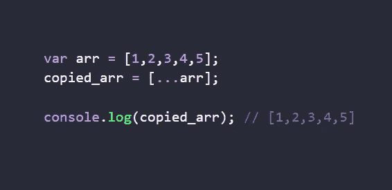
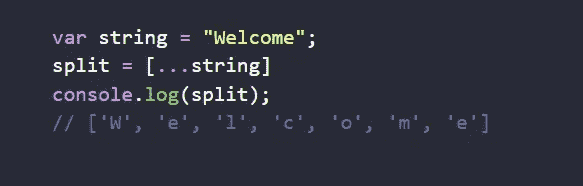
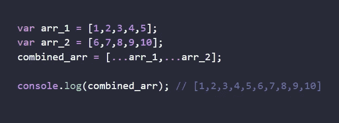
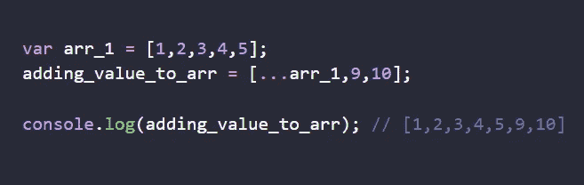
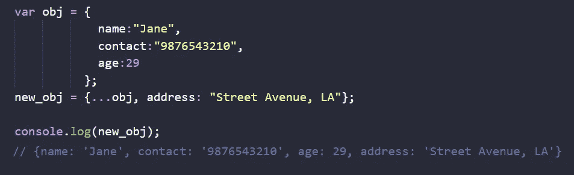
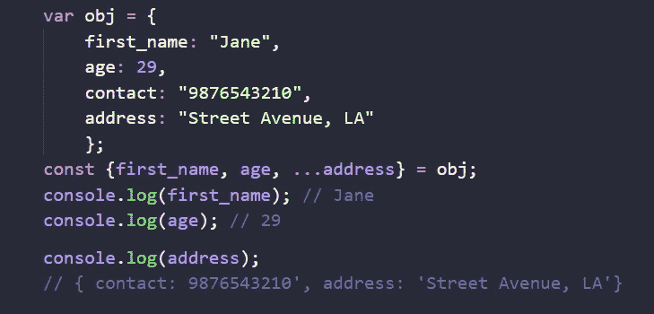
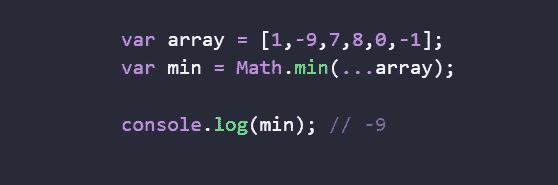
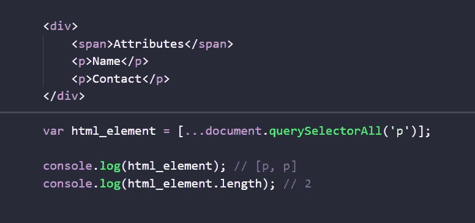
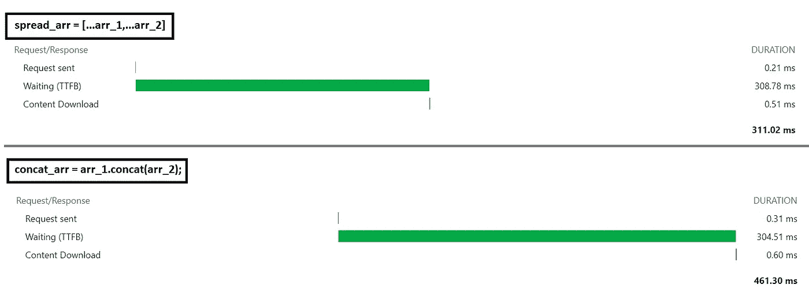

# 传播运算符用例

> 原文：<https://medium.com/globant/spread-operator-use-cases-69ea4b16fc02?source=collection_archive---------0----------------------->

在工作或理解 Javascript 时，他有三个著名的点(…)。嗯，这些点不过是扩展操作符，**接受对象，** **使其迭代，按需复制到另一个对象**。

对象可以是任何东西，数组[]或文字对象{}。spread 运算符的使用不限于数组或对象，还可以用于函数、节点列表和字符串。

# 现在你问我为什么我们需要它？

当我们以浅层复制的方式将数据从一个变量复制到另一个变量时，为了使代码简洁易读。

我们有多种方法来使用(…) spread 运算符。

1.  **阵列使用案例**

*   *浅抄*

Shallow Copy of an array

*   把单词分开

*   *2 个或更多数组的组合*

Combining 2 arrays

*   *添加附加值*

Adding additional value to an array

**2。对象用例**

*   向对象添加额外的属性

*   对象析构

3.**功能用例**

*   Math.min()

*   数组中的节点列表

# **执行的好处**

当我们使用 spread 操作符时，我们有执行代码的速度优势。它在早期版本(ES8 之前)中有很大的时间差，尽管现在它有些简洁，但我们仍然可以看到 concat 方法在组合 2 个数组时与 spread 运算符相比的滞后。

根据上面的网络选项卡数据，我们可以看到 spread 操作符花费了 311 毫秒，而 concat 函数花费了 461 毫秒。

这看起来是一个很小的差别，但是在大的应用中，如果我们倾向于避免在传统方法上扩展操作符，我们可能会增加这个差别。

# 不管是不是骗局。！

当我们传播一个变量时，它将一个对象引用到另一个对象中，这需要解释器查找变量引用的内容，然后查找作为新对象传播的对象的所有可枚举的自身属性(以及相关值)。这需要处理能力。

但是有了现代 Javascript 引擎和先进的计算机，我们可以在一秒钟内处理数百万条指令，所以传播一堆键值对所需的处理能力真的没什么好担心的。

# **传播算子的替代方案。**

我们有多种选择。让我们看看他们中的一些人

*   对象.分配()
*   arr.concat()