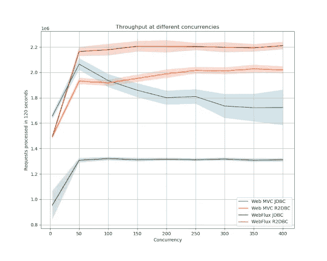

# Spring:阻塞 vs 非阻塞:R2DBC vs JDBC 和 WebFlux vs Web MVC

> 原文：<https://medium.com/oracledevs/spring-blocking-vs-non-blocking-r2dbc-vs-jdbc-and-webflux-vs-web-mvc-900d72ee19c1?source=collection_archive---------0----------------------->

2017 年 9 月发布的 Spring Framework 第 5 版引入了 Spring WebFlux。完全反应式堆栈。2019 年 12 月 Spring Data R2DBC 发布了反应式关系数据库驱动程序。在这篇博文中，我将展示在高并发时，WebFlux 和 R2DBC 的性能更好。它们有更好的响应时间和更高的吞吐量。作为额外的好处，它们在处理每个请求时使用更少的内存和 CPU，并且当在 R2DBC 的情况下省略 JPA 时，您的胖罐子会变得更小。在高并发情况下，使用 WebFlux 和 R2DBC 是一个好主意！

在这篇博文中，我研究了 4 个实现

*   Spring Web MVC + JDBC 数据库驱动
*   Spring Web MVC + R2DBC 数据库驱动
*   Spring WebFlux + JDBC 数据库驱动
*   Spring WebFlux + R2DBC 数据库驱动程序

我将正在处理的请求数量(并发性)从 4 个增加到 500 个，步长为 50 个，并为负载生成器和服务分配了 4 个内核(我的笔记本电脑有 12 个内核)。我已经将所有连接池配置为 100。为什么内核数量和连接池大小是固定的？在[之前对 JDBC vs R2DBC 数据的探索](https://technology.amis.nl/2020/03/27/performance-of-relational-database-drivers-r2dbc-vs-jdbc/)中，改变这些变量并没有提供更多的见解，所以我决定在这次测试中保持它们不变，通过几个因素减少我的测试运行时间。

我在服务上做了一个 GET 请求。该服务从数据库中获取 10 条记录，并以 JSON 的形式返回它们。首先，我在服务上加了很重的负载，让服务“启动”了 2 秒钟。接下来，我从 1 分钟基准开始。我将每个场景重复了 5 次(被其他测试分开，所以不是彼此重复 5 次)，然后计算结果的平均值。我只查看了没有导致错误的运行。当我将并发性增加到 1000 以上时，所有实现的额外并发请求都无一例外地失败了。结果似乎是可重复的。

作为后端数据库，我使用了 Postgres (12.2)。我使用 [wrk](https://github.com/wg/wrk) 对实现进行了基准测试(因为有几个建议)。我测量了

*   wrk 报道的响应时间

*   wrk 报告的吞吐量(请求数)

*   进程 CPU 使用率
    用户和内核时间(基于/proc/PID/stat)
*   内存使用
    私有和共享进程内存(基于/proc/PID/maps)

你可以在这里查看[使用的测试脚本。你可以在这里查看](https://github.com/MaartenSmeets/db_perftest/blob/r2dbc/test_scripts/run_test.py)[使用的实现](https://github.com/MaartenSmeets/db_perftest/tree/r2dbc/test_apps)。

你可以在这里查看我用于图表[的原始数据](https://github.com/MaartenSmeets/db_perftest/blob/r2dbc/test_scripts/restotal.txt)。

很明显，在更高的并发性下，Spring Web MVC + JDBC 的响应时间开始下降。R2DBC 显然在更高的并发性下提供了更好的响应时间。Spring WebFlux 也比使用 Spring Web MVC 的类似实现做得更好。

类似于响应时间，JDBC 的 Spring Web MVC 在更高的并发性上表现更差。R2DBC 显然做得最好。然而，从 Spring Web MVC 迁移到 Spring WebFlux 也有助于提高吞吐量，但不如从 JDBC 迁移到 R2DBC 那么多。在低并发的情况下，Spring Web MVC + JDBC 比 Spring WebFlux + JDBC 表现稍好。

**CPU**

JDBC 的 Spring WebFlux 使用的 CPU 最少。然而，正如您在上面看到的，它的吞吐量也是最低的。当您查看每个处理的请求所使用的 CPU 时，您会得到代码/JVM 利用 CPU 的效率的度量:

WebFlux 和 R2DBC 每个请求使用的 CPU 最少。R2DBC 每个请求使用的 CPU 显然比 JDBC 少。然而，在低并发时，Web MVC + JDBC 最有效地利用了可用内存。当任何组件是非阻塞的(使用 R2DBC 的 WebFlux)时，处理的每个请求的内存使用比完全阻塞的堆栈(Web MVC + R2DBC)更稳定。

**内存**

运行结束时，内存作为进程私有内存进行测量。内存使用取决于垃圾收集。G1GC 用于 JDK 11.0.6。Xms 为 0.5 Gb(默认为我的可用 32 Gb 的 1/64)。Xmx 是 8 Gb(默认为我的可用 32 Gb 的 1/4)。

Web MVC 在较高并发时开始占用更多内存，而 WebFlux 是稳定的。在低并发情况下，Web MVC + JDBC 做得最好，但是在高并发情况下，WebFlux + R2DBC 每个处理的请求使用的内存最少。

**脂肪罐大小**

下图显示 JPA 是一个大的。如果在 R2DBC 的情况下不能使用，你的胖罐子大小下降到 15Mb 的量级！

R2DBC 和 WebFlux，高并发的好主意！

在高并发时，使用 R2DBC 代替 JDBC，使用 WebFlux 代替 Web MVC 的好处是显而易见的。

*   处理一个请求需要更少的 CPU。
*   处理单个请求所需的内存更少。
*   高并发的响应时间更短。
*   高并发的吞吐量更好
*   fat JAR 尺寸较小(没有带 R2DBC 的 JPA)

使用 R2DBC 或 WebFlux 并不要求您拥有一个完全非阻塞的堆栈。然而，最好在高并发时同时使用这两者。WebFlux + JDBC 不是一个好主意，因为它在内存和 CPU 使用方面效率不高，并且与其他测试服务相比吞吐量较低。

在低并发性(低于 200 个并发请求)的情况下，使用 Web MVC 和 JDBC 可能会得到更好的结果。测试这个来确定你自己的盈亏平衡点！

**使用 R2DBC 时的一些挑战**

*   JPA 不能处理诸如 Spring Data R2DBC 提供的反应式存储库。这意味着在使用 R2DBC 时，您将不得不手动做更多的事情。
*   周围还有其他反应式驱动程序，例如 Quarkus 反应式 Postgres 客户端(使用 Vert.x)。这不使用 R2DBC，具有不同的性能特征(见[此处](https://technology.amis.nl/2020/03/27/performance-of-relational-database-drivers-r2dbc-vs-jdbc/))。
*   有限的可用性
    不是所有的关系数据库都有反应式驱动程序。比如甲骨文就没有(还没有？)有一个 R2DBC 实现。
*   应用服务器仍然依赖于 JDBC。
    在这个 Kubernetes 时代，人们还用那些做非遗吗？
*   当引入 Java 纤程时(Project Loom，可能是 Java 15)，驱动程序的前景可能会再次改变，R2DBC 可能根本不会成为 JDBCs 的继任者。

*原载于*[*https://javaoraclesoa.blogspot.com*](https://javaoraclesoa.blogspot.com/2020/04/blocking-vs-non-blocking-in-spring.html)*。*